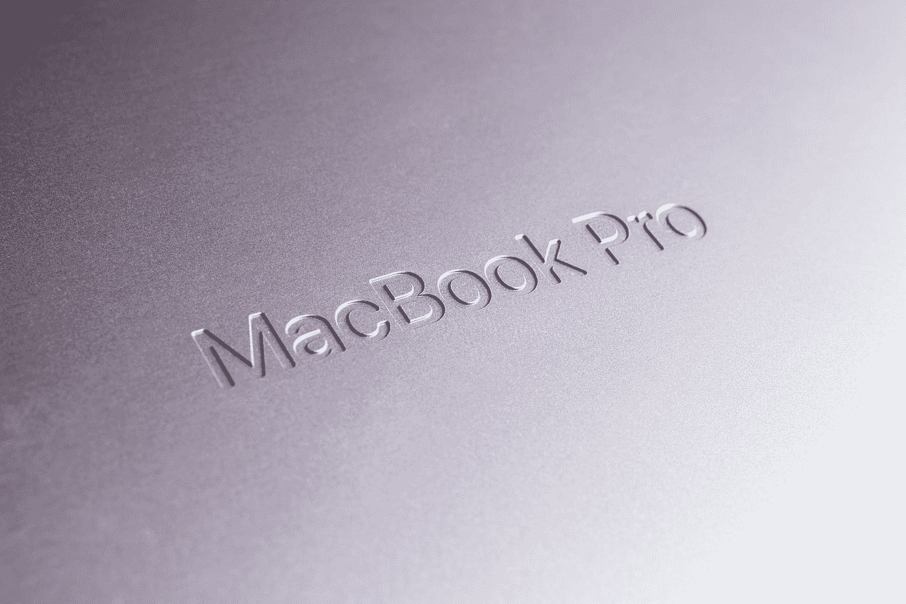

# 学会整理你的文章并做出反应。JS 应用程序在你的 Macbook Pro M1

> 原文：<https://blog.devgenius.io/learn-to-dockerize-your-laravel-and-react-js-application-in-your-macbook-pro-m1-b70a1b3cca55?source=collection_archive---------4----------------------->

采用 M1 Pro 芯片的新款 Macbook Pro。 [dlxmedia.hu](https://unsplash.com/@dlxmedia?utm_source=medium&utm_medium=referral) 在 [Unsplash](https://unsplash.com?utm_source=medium&utm_medium=referral) 上拍照。

苹果公司最近几年发布了一项新技术，让许多人感到惊讶。在我看来，被称为 M1 的新集成芯片成功地以最佳的成本效益比提供了惊人的性能。但是一项新技术要达到成熟还需要一段时间。事情很简单:在这种环境下，没有多少应用程序是本地运行的。耶！，这个好消息也伴随着坏消息。但是苹果并没有放过我们，他们给了我们一个叫做 [Rosetta](https://support.apple.com/en-us/HT211861) 的‘临时’解决方案。

# 用例架构

我们将有两个应用程序，[一个后端用 laravel，一个前端用 React。Js](https://medium.com/@uniqcode87/exploration-dashboard-application-using-metronic-react-highcharts-81c2bfdf5527) 。后端 laravel 应用程序将访问 MySQL 数据库，该数据库也运行在 Docker 容器中。

用例架构图。

# Docker 桌面安装

首先，让我们下载并安装苹果芯片 Docker dek stop[。安装完成后，你可以在菜单栏中看到 Docker 桌面的新图标。](https://docs.docker.com/desktop/mac/install)

菜单栏中的 Docker 桌面图标。

# 使用 Docker 设置您的 Laravel 应用程序

在项目中创建两个文件，即 Dockerfile 和 docker-compose.yml。

Dockerfile。

1.  我使用的图像是 php:7.2-apache。可以根据自己的要求进行调整。这里我使用 PHP 7.2 只是因为我想适应生产环境的配置。
2.  这个形象还是很基础的。我需要几个 PHP 扩展(库)，比如 MySQL 驱动。我需要的最后一件事是 Url 重写模块，以确保 Laravel 正常工作。

docker-compose.yml。

1.  使用的图像已经在 Dockerfile 文件中提到。我们只确保这一行存在于我们的配置中:`build: .`。
2.  我给容器命名为`web-dashboard-api` ，并用端口`82`发布 web。
3.  容器中的公共文件夹位于 html 文件夹中。所以我们需要将 public 文件夹映射到 html: `‘./public:/var/www/html’`。它还需要另一部分，即位于超级文件夹中的源代码和库。所以我们需要映射当前文件夹:`‘./:/var/www/’`。
4.  最后，因为 MySQL 数据库也在容器中运行，所以我们需要在容器之间建立一个网桥。请注意这个部分的名称:`ptpn-database_default`。

**安装依赖项并组合**

1.  运行项目文件夹中的命令`composer install`。
2.  运行 docker compose: `docker compose -f “docker-compose.yml” up -d --build`，然后在 docker 桌面的容器部分检查您的应用程序。

Docker 桌面的容器部分。

# 设置您的反应。使用 Docker 的 JS 应用程序

在项目中创建两个文件，即 Dockerfile 和 docker-compose.yml。

Dockerfile 文件

1.  我使用的图像是 node:16.5。我推荐你使用 LTS 版本的 node。我收到一堆最新版本的错误。
2.  如果发现与 python 相关的错误，用`apt-get`取消第二行和第三行的注释。
3.  接下来，我们需要将所有文件复制到容器中并运行应用程序。

docker-compose.yml。

1.  使用的图像已经在 Dockerfile 文件中提到。我们只确保这一行存在于我们的配置中:`build: .`。
2.  我给容器命名为`web-dashboard-reactjs` ，并用端口`3000`发布 web。

**安装依赖项并组合**

1.  我没有使用 Rosetta，也不打算使用它。我因此得到了很多错误，比如:`[Error: Node Sass does not yet support your current environment: OS X Unsupported architecture (arm64) with Unsupported runtime (88) For more information on which environments are supported please see.](https://github.com/sass/node-sass/issues/3033)`
2.  变通解决方法:(a)在本地，确保您使用的是 LTS 版本的 node(b)运行该命令`npm install node-sass@npm:sass`。
3.  在项目文件夹中运行这些命令`rm -R node_modules`和`composer install`。
4.  运行 docker compose: `docker compose -f “docker-compose.yml” up -d --build`，然后在 docker 桌面的 containers 部分检查您的应用程序。

Docker 桌面的容器部分。

# 结论

1.  使用 Docker 构建应用程序使许多事情变得简单，我们可以设置 Laravel 和 React。用 Docker 桌面轻松 JS。
2.  我们可以部署反应部队。JS 应用程序到 Macbook Pro M1 的一个容器中，而不使用 Rosetta。
3.  苹果的硅芯片速度很快，但也有一些缺点。作为一名程序员，确保我们在购买这台漂亮的电脑之前考虑一切。