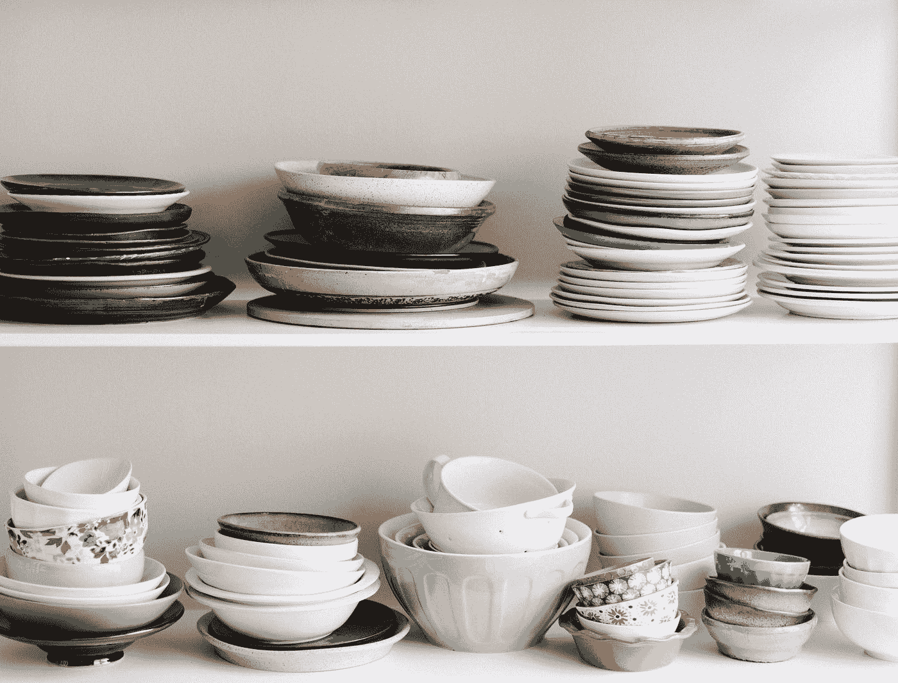

# 学习用 Go 系列建模对象和行为:洗碗的例子(第 2 部分)

> 原文：<https://blog.devgenius.io/learn-to-model-objects-and-behaviors-with-go-series-an-example-with-dish-washing-part-2-7b72060f6ad?source=collection_archive---------24----------------------->



由[布鲁克·拉克](https://unsplash.com/@brookelark?utm_source=medium&utm_medium=referral)在 [Unsplash](https://unsplash.com?utm_source=medium&utm_medium=referral) 拍摄的照片

*这是 Go 学习对象和行为建模系列的第 2 部分。将碗碟放入沥水器后，我们来讨论一下* [*第一部分*](https://medium.com/swlh/learn-to-model-object-and-behavior-with-go-series-an-example-with-dish-washing-part-1-8468b72404e8) *的洗碗模式。*

# **先决条件**

像第 1 部分一样，我们需要一些基础知识来完成第 2 部分:

*   导出的字段([https://tour.golang.org/basics/3](https://tour.golang.org/basics/3))
*   面向对象编程，或称**OOP**([https://en.wikipedia.org/wiki/Object-oriented_programming](https://en.wikipedia.org/wiki/Object-oriented_programming))

如果您阅读了本系列的第 1 部分，您应该知道导出的字段。对于 **OOP** ，我建议你在开始任何对象和行为建模学习轨道之前，仔细阅读这个概念。

# **OOP 评估**

首先，我们将从面向对象的角度评估我们的模型。

在围棋中，没有**公、私、保的概念。不幸的是，也没有父类和子类的概念。但这也意味着你不会有属性继承的麻烦。**

只有**出口和不出口。**

> 你唯一能做的就是**允许**或**拒绝**通过**导出或不导出**变量来访问它们。

让我们重温一下我们的**海绵**模型。

从 **OOP** 的角度来看，模型的**属性**应该用**私有**范围**封装**在模型内部，或者**保护**，如果它们可以被子类**继承**。

`Color`似乎是我们不想在洗涤时间被设定的属性(当然也是不真实的)。因此，我们可能需要将`Color`更改为**非导出的**形式。

所以我们会问自己一个问题，我们应该把一个结构(**海绵**)的所有字段(属性)作为非导出字段吗？我们是否应该保护它们免受我们无法预测或控制的外部访问？

事实上，Go 团队认为我们不应该。

这是我从[https://golang.org/pkg/net/http/](https://golang.org/pkg/net/http/)复制的代码，作为我们如何用传输对象声明 HTTP 客户端的例子。而且很明显，`Transport`是**导出字段**！

我不会假设为什么 Go 团队选择导出`Transport`字段，但是我会提出我的方法，允许或拒绝访问一个 struct 的字段。

**何时导出结构的字段(如果条件不满足，转到列表中的下一个条件)。**

*   如果该字段没有出现在该结构的任何方法中。
    所以我在这里公开了`Color`属性，因为直到现在它还没有出现在`Sponge` **的任何方法中。**
*   如果设置该字段不会影响 struct 的任何方法的**下一次计算**。
*   如果设置字段不需要任何数据约束或验证。
    当您需要验证您想要设置的值时，该字段**永远不适用于**公共访问

否则，该字段应**不导出。**

对于方法，要简单得多:

*   如果你需要调用包外的方法，让它**导出。**
*   否则保持**不出口。**

# **扩展模型**

你们有些人可能会问，为什么我只洗碗？你吃饭时会用到很多东西。

作为一个越南人，并且生活在亚洲社区，我吃饭更多的是用碗而不是盘子。我还用**煎锅、烹饪锅**做越南菜。


照片由[乌韦·康拉德](https://unsplash.com/@uconrad?utm_source=medium&utm_medium=referral)在 [Unsplash](https://unsplash.com?utm_source=medium&utm_medium=referral) 拍摄

因此，洗碗问题将延伸到碗、煎锅、烹饪锅和你吃饭需要的任何东西。

让我们实现模型吧！

*碗.去*

*pan.go*

*pot.go*

这些型号看起来一样。但是正如我之前提到的，我们没有父类和子类的概念。然而，Go 强大的另一个概念是，**接口类型！**而且你会很高兴地知道它类似于 **OOP** **接口**的概念。

```
An *interface type* is defined as a set of method signatures.A value of interface type can hold any value that implements those methods.
```

看围棋教程时，请不要混淆**接口类型**和**空接口。**

```
An empty interface interface{} may hold values of any type.(Every type implements at least zero methods.)
```

*wash . go*

现在我们可以生成一个**可洗列表**

*generate wasable . go*

并将主功能修改为使用**可洗**型

使用与第 1 部分相同的构建和运行命令，我们将得到以下结果

```
$ go build -o main
$./main
item at index 1 is type Dish
Before wash, is Dish clean? = false
After wash, is Dish clean? = true
item at index 2 is type Bowl
Before wash, is Bowl clean? = false
After wash, is Bowl clean? = true
item at index 3 is type Pan
Before wash, is Pan clean? = false
After wash, is Pan clean? = true
item at index 4 is type Pot
Before wash, is Pot clean? = false
After wash, is Pot clean? = true
item at index 5 is type Dish
Before wash, is Dish clean? = false
After wash, is Dish clean? = true
item at index 6 is type Bowl
Before wash, is Bowl clean? = false
After wash, is Bowl clean? = true
item at index 7 is type Pan
Before wash, is Pan clean? = false
After wash, is Pan clean? = true
item at index 8 is type Pot
Before wash, is Pot clean? = false
After wash, is Pot clean? = true
item at index 9 is type Dish
Before wash, is Dish clean? = false
After wash, is Dish clean? = true
item at index 10 is type Bowl
Before wash, is Bowl clean? = false
After wash, is Bowl clean? = true
```

如果您感兴趣，可以在以下网址找到代码`diswashing_part2`

[](https://github.com/Nhat002/dishwashing/tree/master/dishwashing_part2) [## nhat 002/洗碗

### 此时您不能执行该操作。您已使用另一个标签页或窗口登录。您已在另一个选项卡中注销，或者…

github.com](https://github.com/Nhat002/dishwashing/tree/master/dishwashing_part2) 

2 部分之后，你是否意识到我们总是生成 10 号要清洁的项目列表？也是一块海绵能拥有的最大可洗次数！

对于**海绵**和**液体分配器，我们从来不碰`Topup`的方法。**让我们使用**第 3 部分中的模型来研究洗碗算法的具体实现。**

感谢阅读！我希望你喜欢它。