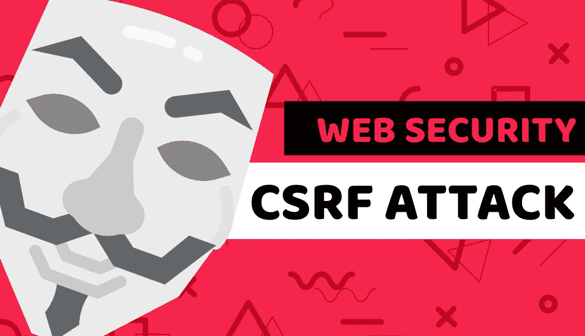

# 了解什么是 CSRF 黑客攻击网上赌场

> 原文：<https://blog.devgenius.io/learn-what-is-csrf-attack-by-hacking-an-online-casino-8bedbaf7b486?source=collection_archive---------15----------------------->



什么是 CSRF 攻击

本文最初发表于:[https://www . blog . duomly . com/what-is-csrf-attack-tutorial-for-初学者/](https://www.blog.duomly.com/what-is-csrf-attack-tutorial-for-beginners/)

# 介绍

今天我们将谈论什么是 CSRF 攻击。

你知道有人可以通过使用一个简单的图像来偷你的钱吗？

在本教程中，我将向您展示如何，我们将一起黑一个网上赌场！

在第一篇关于 web 安全的帖子中，我们谈到了通过 SQL 注入来入侵一个银行应用程序。

链接在这里:

[SQL 注入攻击初学者教程](https://www.blog.duomly.com/sql-injection-attack-tutorial-for-beginners/)

今天我们将关注一些其他的东西，但是仍然很危险，而且很容易做到。

这尤其危险，因为许多网站和应用程序都容易受到这种攻击。

你将了解什么是 CSRF 袭击，以及为什么 CSRF 袭击可能是危险的。

接下来，我们将讨论如何进行 CSRF 攻击以及如何保护应用程序。

开始吧！

如果你喜欢视频，这里有 youtube 版本:

什么是跨站点请求伪造攻击

# 什么是 CSRF 攻击

CSRF 是一种安全漏洞，允许攻击者在另一个应用程序上执行任何操作。

特别是在受害者被认证的情况下，我们想让他为我们做任何事情。

它更侧重于改变应用程序的内部状态，而不是将数据推送给攻击者。

# 为什么 CSRF 袭击是危险的

CSRF 的进攻可能会非常危险，尤其是当我们将它与 XSS 的配合时。

它的主要目的是在我们的认证帐户中进行操作，但没有我们的知识和许可。

例如，想象一下当我们是任何社区论坛的读者时的情况。我们在不同的浏览器窗口登录我们的电子邮件或银行账户。

攻击者可以向论坛上传恶意图片。

我们只要看到他的帖子就足够了，下一个来自图片的代码将调用我们的电子邮件帐户。

这个电话可以改变我们的电子邮件帐户的设置。

例如，所有将到达我们收件箱的电子邮件也可以被转发到攻击者的收件箱。

# 如何保护 app 免受 CSRF 攻击

在这一节中，我将向您展示一些(对我来说)可以防止您的应用程序遭受 CSRF 攻击的关键方法。

这不是你能做的全部，但在我看来，这些是至关重要的。

值得做更多的研究，因为在你的项目中可能需要更多的安全性。

我使用了一个指向列表来使它尽可能清晰。

**1。紧密 CORS 和只接受来自已知来源的呼叫**

**2。使用相同站点的 cookie**

**3。使用 CSRF 令牌**

**4。仅在此会话中使用 session id**

**5。在通话中使用您的自定义标题**

**6。不要使用 GET 来调用除了返回数据之外还应该做的事情**

**7。避免开发仅通过访问 URL** 来执行任何特殊操作的功能

# 我需要什么来对付 CSRF 的袭击

**VirtualBox 或 VMware:**

你可以找到 VirtualBox(它是免费的)，或者购买/使用 VMware 的试用版(它更好)。

**网络安全道场:**

Web Security Dojo 是一个操作系统，有很多有用的工具，如 burp、Nikto 或 sqlmap，您可以用它们来训练您的黑客技能。

第二个重要的事实是，Web Security Dojo 包含一些您可以合法使用的目标。

您可以从以下链接下载:

[https://sourceforge.net/projects/websecuritydojo/](https://sourceforge.net/projects/websecuritydojo/)

**SQL 注入使用知识:**

在本课中，我们将使用 SQL 注入来通过赌场的身份验证，这是必要的。

如果你还不知道怎么用，也不用担心！

在前一集，我已经创建了一个关于基本 SQL 注入的完整课程。

你可以在那里学习和训练。

下面是“什么是 SQL 注入攻击教程”的博文:

[SQL 注入攻击初学者教程](https://www.blog.duomly.com/sql-injection-attack-tutorial-for-beginners/)

这是 youtube 的版本:

SQL 注入攻击

**非常基础的 HTML:**

我们将使用 HTML 创建一些带有恶意代码的页面模板。

我们稍后将使用该模板来入侵赌场。

如果你还不知道如何使用 HTML，不要担心！

你可以按照我们今天的课程学习，也可以在这里学习完整的 html&css 课程:

[HTML 和 CSS 课程](https://www.duomly.com/course/html-and-css-basics-course/)

# 如何让 CSRF 进攻

**启动机器:**

我们需要做的第一步是运行整个环境。

通过 VMware 或 VirtualBox 运行 Web Security Dojo，并等待它加载。

**开赌场:**

当我们的 Web 安全 Dojo 加载后，我们需要运行赌场。

第一步是进入菜单(左上角的蓝色图标)。

接下来，您应该打开一个名为“目标”的选项卡。

最后一步，你应该点击“Hacme 赌场开始”。

**开赌场:**

你的服务器应该加载，现在你可以打开赌场。

进入浏览器，在地址栏中键入:

[http://casino . local:3000](http://casino.local:3000)

**黑掉认证:**

当您访问该 URL 时，您应该会看到赌场的网站和登录表单。

我们不知道 ace 帐户的登录名和密码。

所以我们可以通过 SQL 注入来破解。

你可以用一些你在上一课已经学过的方法来破解它，或者用下面的方法。

密码输入应该为空，在用户输入中，您应该键入:

```
**‘)** OR 1=1 — 
```

**准备恶意网站:**

恭喜你，你已经黑进了王牌飞行员的账户！

接下来，我们应该创建一些恶意网站，我们将把我们的图像与假网址，这将做一个呼叫赌场(我们的受害者登录)。

首先，您需要为此创建一个文件夹，接下来，您需要用代码创建 index.php 文件。

请看下面的例子:

```
<html>
<head></head>
<body>
  <h1>Greetings from Duomly</h1>
  
</body>
</html>
```

**运行恶意网站:**

下一步就是运行我们的 PHP 服务器，它将托管我们的恶意站点。

在包含我们的代码和类型的目录中打开终端:

```
php -S localhost:8000
```

**以博比 _ 21 点的身份登录:**

在这一步，我们需要做一段时间的受害者。

我们需要以受害者身份登录，并查看我们(受害者)的个人资料或余额。

这是我们可以使用的凭证。

```
login:bobby_blackjackpass:twenty_one
```

**当受害者登录时打开恶意网站(bobby_blackjack):**

现在好戏开始了！

我们需要将恶意网址发送给受害者，并期望他会打开它。

接下来，当页面加载时，恶意代码将呈现图像。

该图像有恶意链接，将被解雇，并将从受害者的帐户发送一些钱到“安迪 _ace”，这是我们的帐户在这种情况下。

```
[http://localhost:8000](http://localhost:8000)
```

**注销并以 andy_ace 的身份登录:**

在适当的攻击之后，我们可以再次使用 SQL 注入来登录 andy_ace 帐户。

你看到更多的钱了吗？

恭喜你！

你偷了博比 21 点的钱！

# 结论

恭喜你！

现在你知道 CSRF 是什么，为什么 CSRF 的攻击是危险的，以及如何使 CSRF 的攻击。

你也知道如何保护你的应用免受 CSRF 的攻击。

关注我们以获得更多流行的网络安全技能，并对您希望在接下来的课程中学习的内容发表评论！

请记住，你不能黑你不是所有者或没有所有者的许可的软件或应用程序。

这是非法的，可能会产生巨大的后果。


[编程课程在线](https://www.duomly.com)

感谢阅读，

Duomly 的 Radek