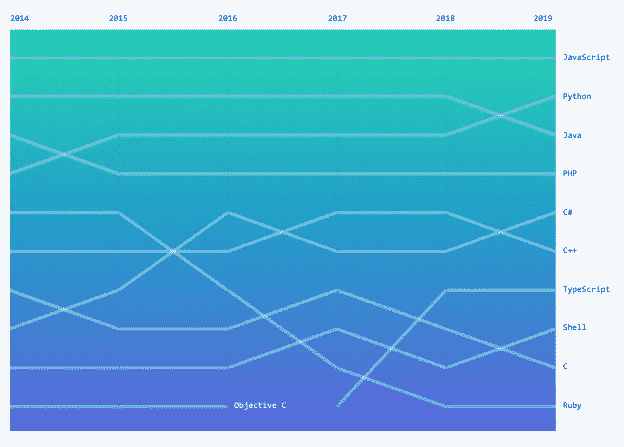

# 学习一门新的编程语言:大胆尝试！

> 原文：<https://blog.devgenius.io/learning-a-new-programming-language-take-the-plunge-97edf67f5e88?source=collection_archive---------16----------------------->

照片由[帕鲁·马莱巴](https://www.pexels.com/@palumalerba?utm_content=attributionCopyText&utm_medium=referral&utm_source=pexels)从[派克斯](https://www.pexels.com/photo/photo-of-a-woman-diving-into-body-of-water-2516403/?utm_content=attributionCopyText&utm_medium=referral&utm_source=pexels)拍摄

你学习的第一种语言自然会影响你的编码之旅，但是如果你在职业生涯的早期拒绝学习另一种语言，你的持续成功可能会受到限制。作为一名初学者，学习第二门语言可能听起来就像一头扎进冷水中一样令人胃口大开，但你最终会获得对 CS 基础知识更扎实的理解，掌握更全面的知识，以及更好的工作前景。

在完全过渡到软件工程之前的几年里，我通过涉足 JavaScript 开始了我的编码之旅。早期，我在当地的一所大学学习 Java 课程来补充我的学习。尽管在学习另一种语言时会遇到一些与学习怪癖和新语法有关的挫折，但两种语言之间的重叠和对比提供了一个有用的视角，突出了许多重要的计算机科学基础的重要性。

我旅程的下一部分把我带到了[哈克布莱特学院](https://hackbrightacademy.com/)，在那里我接受了学习第三种语言 Python 的挑战。我承认，对于在一个已经加速的项目中报名学习一门新语言，我感到紧张，但随着每门语言的发展，学习曲线无疑变得更加平缓，学习 Python 丰富了我在 Hackbright 的经历。

# 添加到您的工具箱

学习一门新语言的另一个好处是，有些语言更适合解决某些类型的问题。在你的武器库中拥有几种语言，当你试图解决难题时，你将有更多的工具准备好。当学习一种结构不同的语言时，尤其如此。如果您从 JavaScript 或 Python 开始，接下来选择一种较低级的语言来学习可能会有所帮助，例如 c。如果您的重点主要是前端，您可能会从学习一些 Java 中受益，反过来，您可能会发现它支持对其他强类型语言的理解(这可能会使学习 TypeScript 更容易)。

途径是多种多样的，但是学习任何一门新的语言都会巩固你当前对计算机科学基础的理解，并为将来探索其他语言铺平道路。成为一名终身学习者是所有成功的软件工程师的共同特征。

# 克服对语法的恐惧

你可能还记得，学习第一门语言需要多层次的学习:掌握语言的语法，适应算法思维，以及采用有利于编程的思维模式。当所有这些方面汇聚到一起，让你第一次进入一个*编程流程*时所体验到的甜蜜，对每个开发人员来说都是一种难忘的感觉。

当学习你的第二语言时，这些方面中的许多已经建立，这个现有的基础允许你缩小你的关注点，以适应新的语法元素。这在第二次可能会出乎意料的简单:用花括号代替冒号？没问题，你对语义的基本理解已经存在了！当你第一次用 JavaScript 编码时，你肯定会忘记一两个分号，但是学习语法将是一个缓坡，而不是你第一次学习全部编程语法时攀登的悬崖。🧗🏻‍♀️

# 拥抱全栈工程

接受学习第二种或第三种语言的挑战必然会使你成为一个更加自信和多才多艺的开发人员，而且有 500 多种编程语言可供选择。大多数公司现在都在他们的书库中包括多种语言，这些公司要求他们的工程师会多种语言是很正常的(除了少数例外)。

看看 GitHub 报道的过去五年中十大语言的趋势。

https://octoverse.github.com/#top-languages

一个会多种语言的申请人将会有更多的工作机会，并且比那些不太多才多艺的申请人要求更高的薪水。对于希望获得初级 SWE 职位的申请人来说尤其如此，因为竞争非常激烈，掌握多种语言的能力将证明你的学习能力和作为开发人员成长的能力。

不要让对未知的恐惧阻止你在职业生涯早期学习一门新语言。采取这一步骤的好处将是复合的，在这一过程中提供了明显的和一些不太明显的优势。