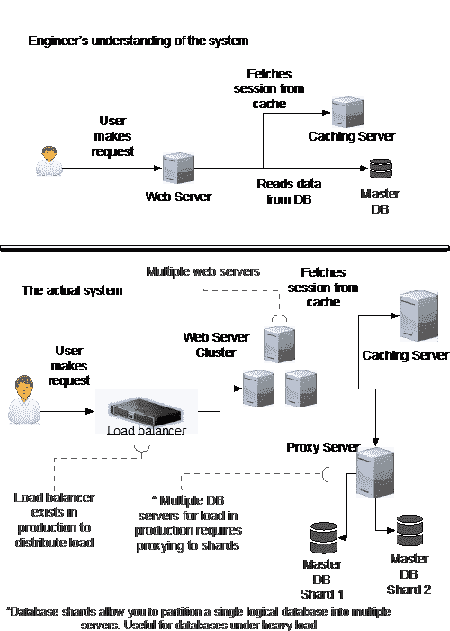

# 从事件中学习

> 原文：<https://blog.devgenius.io/learning-from-incidents-696a61eae9df?source=collection_archive---------10----------------------->

## 文章

## *出自* [*运营反模式，DevOps 解决方案*](https://www.manning.com/books/operations-anti-patterns-devops-solutions?utm_source=medium&utm_medium=organic&utm_campaign=book_smithje_operations_11_6_20) *出自 Jeffery D. Smith*

______________________________________________________

通过在[manning.com](https://www.manning.com/?utm_source=medium&utm_medium=organic&utm_campaign=book_smithje_operations_11_6_20)的结账处将 **fccsmithje** 输入折扣代码框，获得 [*运营反模式、DevOps 解决方案*](https://www.manning.com/books/operations-anti-patterns-devops-solutions?utm_source=medium&utm_medium=organic&utm_campaign=book_smithje_operations_11_6_20)37%的折扣。
_ _ _ _ _ _ _ _ _ _ _ _ _ _ _ _ _ _ _ _ _ _ _ _ _ _ _ _ _ _ _ _ _ _ _ _ _ _ _ _ _ _ _ _ _ _ _ _ _

当意外或未计划的事情发生，对系统产生负面影响时，我将该操作定义为事件。一些公司将事件这一术语保留用于大型灾难性事件，但有了这一更广泛的定义，当事件发生时，您可以增加团队的学习机会。如前所述，DevOps 的核心是持续改进的理念。增量变更是 DevOps 组织的胜利，但推动持续改进的燃料是持续学习。学习新技术、现有技术、团队如何运作、团队如何沟通以及所有这些东西如何相互关联以形成作为工程部门的人-技术系统。

学习的最佳来源之一不是事情顺利的时候，而是事情出错的时候。当事情运转时，你认为你对系统的了解和系统中的真实情况并不一定冲突。想象一下，你有一辆装有 15 加仑汽油的汽车。出于某种原因，你认为油箱有 30 加仑，但你有这样的习惯，在你消耗掉大约 10 加仑后再给油箱加油。如果你虔诚地这样做，你对油箱大小的理解永远不会与油箱只有 15 加仑的现实相冲突。你可能开着车跑了几百趟，却什么也没学到，但是当你决定长途驾驶的时候，你就遇到了十六加仑汽油的问题。不久你意识到你的方式是愚蠢的，现在你有了这个新发现的信息，你开始采取适当的预防措施。您可以利用这些信息做一些事情。你可以深入了解为什么你的车在 15 加仑时就没油了，或者你可以说“好吧，为了安全起见，我最好现在开始每 5 加仑加一次油。”你会惊讶有多少组织选择后者。

许多组织没有经历理解系统为什么以这种方式运行以及如何改进的心理练习。事件是证明你对系统的理解是否与现实相符的决定性方法。不做这个练习，你就浪费了事件中最精彩的部分。未能从这样的事件中吸取教训可能会对未来的努力不利。

从系统失败中获得的经验并不总是自然而然的。他们经常需要以一种有组织的、结构化的方式从系统和团队成员中被哄出来。这个过程有很多名称，行动报告、事件报告和回顾是少数几个术语，但我个人使用术语*事后分析。*

**定义:事后分析是团队评估导致事故的事件的过程。事后分析通常采用与所有相关利益相关方和事件处理参与者召开会议的形式。**

在本文中，我将讨论事后分析的过程和结构，以及如何通过提出更深入、更深入的问题来更深入地了解您的系统，这些问题涉及工程师为什么决定采取他们所做的行动。

## **验好的零件**

每当有足够大的事件发生，人们就开始玩指责游戏。人们试图让自己远离问题，树立信息壁垒，并普遍变得乐于助人，为自己开脱过错。如果你看到这种情况发生在你的组织中，那么很可能你生活在一种责备和惩罚的文化中。我的意思是，对事件的反应是找到那些对“错误”负责的人，并确保他们受到适当的惩罚、羞辱或排挤。之后，您将增加一点额外的流程，以确保有人必须批准造成事故的工作类型。每个人都带着一种满足感从事故中走出来，知道这个特殊的问题不会再发生，但它总是会发生。

指责游戏不起作用的原因是因为它攻击人民作为问题。如果人们受过更好的训练。如果更多的人意识到这种变化。如果有人遵守了协议。如果不是有人打错了那个命令。要清楚的是，这些都是事情可能出错的合理原因，但它们没有触及**为什么**那项活动(或缺乏)会造成如此灾难性的失败。我们以训练失败为例。如果工程师没有得到适当的培训而犯了错误，你应该问自己“为什么他没有得到培训？”他或她在哪里接受训练？培训是因为工程师没有足够的时间吗？如果他们没有受过训练，为什么他们可以进入系统去执行他们没有准备好执行的事情？另一种思路的模式是，你在讨论**系统**的问题，而不是**个人**的问题。如果你的培训计划很糟糕，那么责备这个工程师并不能解决问题，因为下一波招聘可能会遇到同样的问题。允许没有资格的人执行危险的操作可能会突出您的组织中缺乏系统和安全控制。如果不加以检查，你的系统会继续产生可能犯同样错误的员工。

为了摆脱指责游戏，你必须开始思考你的系统、过程、文档和对系统的理解是如何影响事故状态的。如果你的事后反思变成了报复，那么不仅没有人会参与，你还会失去一个继续学习和成长的机会。

责备文化的另一个副作用是缺乏透明度。没有人愿意自愿为自己犯下的错误接受惩罚。他们可能已经为此痛打自己，但现在你将这一点与公众羞辱相结合，公众羞辱往往伴随着可指责的尸检，你已经建立了激励人们隐瞒事件信息或事件的具体细节。想象一个操作员输入命令出错造成的事故。操作员知道，如果他承认这个错误，将会有一些惩罚等着他。如果他有能力对这些信息保持沉默，他更有可能这样做，因为团队花了大量时间试图解决发生的问题。

一种惩罚和责备的文化会刺激员工变得不诚实。缺乏坦诚会阻碍你从事件中学习的能力，也会混淆事件的事实。一个无可指责的文化，员工不受惩罚，创造了一个更有利于合作和学习的环境。在无可指责的文化中，注意力从每个试图转移指责的人转移到解决导致事故的问题和知识差距上。

无可指责的文化不是一夜之间形成的。组织中的同事和领导需要花费相当多的精力来创造一种环境，在这种环境中，人们会感到安全，不会遭到报复，并且可以开始就所犯的错误以及错误发生的环境进行公开和诚实的讨论。你，读者，可以通过变得脆弱并第一个与团队和组织分享他们自己的错误来促进这种转变。总会有人先走一步，因为你正在读这篇文章，那个人很可能就是你。

## **创建心智模型**

理解人们如何看待系统和过程是理解失败如何发生的关键。当你有了一个系统如何运作的想法，你就为你与之互动的每一个系统创建了一个*心智模型*。

**定义:心智模型是对某人关于一件事情如何运作的思维过程的解释。心智模型可能会详细描述某人对组件之间的关系和交互的感知，以及一个组件的行为如何影响其他组件。一个人的心智模型经常是不正确或不完整的。**

除非你完全是这个系统的专家，否则有理由假设你的模型有漏洞。一个例子是软件工程师和他们对生产环境的设想。工程师知道有一群 web 服务器、一个数据库服务器和一个缓存服务器。他们知道这些事情，因为这些是他们经常接触和交互的组件，无论是在代码中还是在他们的本地开发环境中。他们可能不知道的是，使该应用能够处理生产级流量的所有基础设施组件。数据库服务器可能会读取副本，web 服务器前面可能会有一个负载平衡器和一个防火墙。图 1 显示了工程师的模型与系统的实际情况。

图一。工程师的心理模型与现实

不仅在计算机系统中，而且在过程中，承认这种差异是很重要的。期望和现实之间的差距是事故和失败的试验场。将事后分析作为一个机会，更新每个人对故障中涉及的系统的心理模型。

## **24 小时规则**

24 小时规则很简单。如果您的环境中发生了事故，您应该在 24 小时内对事故进行事后分析。这有两个原因。首先，从事件发生到事件被记录的时间越长，情况的细节就开始消失。记忆褪色，细微差别消失。当涉及到事故时，细微的差别会带来很大的不同。您是在此错误发生之前还是之后重新启动该服务的？是桑德拉先实施了她的解决方案，还是布莱恩先实施了她的解决方案？你忘了弗兰克第一次启动时服务崩溃了吗？那是什么意思？当你试图找出是什么解决了这个问题时，所有这些小细节可能没有多大意义，但对于理解事件是如何发生的以及你能从中学到什么绝对很重要。

在 24 小时内做事后分析的另一个原因是确保你在利用失败背后的情绪和能量。如果你曾经有过一次险些发生的车祸，你会变得非常警觉。这种警觉性和紧张程度会持续一段时间，但迟早你会开始回到旧习惯。没过多久，紧迫感就消失了，你又回到了不用免提装置开车，在红灯时回复短信的状态。现在想象一下，如果你可以利用这短暂的高度警觉来控制你的车，从一开始就防止你做出那些糟糕或破坏性的行为。这就是你试图用 24 小时规则做的事情。抓住事件的势头，用它来做好事。

当你遇到一个事件时，通常会有很多被压抑的能量围绕着它，因为这是一个不寻常的事件，通常有人会面临压力和/或失败的后果。时间过得越久，紧迫感就越开始消退。在最初的 24 小时内，当你的团队成员还需要注意的时候，就开始跟进事件。

最后，在 24 小时内进行事后分析有助于确保创建事后分析文档。一旦文档被创建，它们不仅可以被广泛传播，让其他人了解故障，还可以作为未来工程师的教学工具。同样，事件中有大量的信息，能够足够详细地记录一次失败对将来培训工程师大有帮助。(或者把事件作为未来工程师有趣的面试问题)

## **剖验的规则**

像任何会议一样，为了召开一次成功的事后总结会议，需要制定一些指导方针。在任何事后总结会议之前，详细地浏览这些规则是很重要的。这些规则旨在创造一种合作和开放的氛围。参与者需要对承认他们的知识差距或他们对系统的理解感到放松和舒适。很多原因导致团队成员不愿意分享这种专业知识的缺乏。你可能有一家公司，其文化是避开那些表现出哪怕是最轻微的缺乏完整专业知识的人。你的公司文化可能会要求一定程度的完美，这是不现实的，会导致犯错误的团队成员或者在某个主题上不是完全的专家的团队成员感到不充分。出于自身的原因，团队成员有这种不充分的感觉也并不罕见。这些负面的情绪和经历阻碍了全面的学习和理解。你需要尽最大努力平息这些情绪。这是这些规则和准则的目标。

*   永远不要直接批评一个人。关注行动和行为。
*   假设每个人都利用当时可用的信息尽了最大努力。
*   要知道，事情现在可能看起来很明显，但在那一刻可能会变得模糊不清。
*   责怪系统，而不是人。
*   请记住，最终目标是了解事件的所有细节。

这些规则有助于将谈话集中在它应该在的地方，改善系统，并希望让你远离指责的游戏。会议主持人将负责确保这些规则始终得到遵守。如果有人违反了规则，即使只有一次，也可以向其他参与者发出信号，表明这就像任何其他会议一样，管理层正在寻找“窒息的喉咙”

本文到此为止。

如果你想了解这本书的更多信息，请在我们基于浏览器的 liveBook 平台上查看[这里](https://livebook.manning.com/book/operations-anti-patterns-devops-solutions?origin=product-look-inside&utm_source=medium&utm_medium=organic&utm_campaign=book_smithje_operations_11_6_20)。

【https://freecontent.manning.com/learning-from-incidents/】本文原载于此:[T5](https://freecontent.manning.com/learning-from-incidents/?utm_source=medium&utm_medium=organic&utm_campaign=book_smithje_operations_11_6_20)