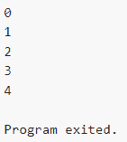

# 学习围棋之旅:第六频道

> 原文：<https://blog.devgenius.io/learning-go-a-journey-channel-6-939850c57fb1?source=collection_archive---------10----------------------->

大家好！很高兴再次见到你，我希望你过得很好。在这篇文章中，我想分享我在学习 Go 编程语言方面的进步。这一周，我了解了渠道。

# 什么是渠道？

Go 创建者将通道定义为“通道通过发送和接收指定元素类型的值来提供并发执行功能以进行通信的机制。未初始化通道的值为零。为了创建一个通道，我们使用内置函数“make”

从上图中，我们可以通过将通道类型(本例中为整数)定义为参数来创建通道。频道就像一场接力赛，参赛者必须同时传递和接受接力棒。例如

我们可以使用指向通道的箭头向通道发送一个值。要接收一个值，我们可以使用一个从通道指向外的箭头。但是请注意，我们必须发送来自另一个 goroutine 的值。这是因为如果我们在同一个 goroutine(在本例中是主 goroutine)中运行它，程序将返回一个致命错误。

输出

我们能够向通道发送尽可能多的值。那么，如何限制一个通道内的值的数量呢？我们可以使用缓冲通道。例如

请注意，我们不必在另一个 goroutine 中运行它。这是因为之前已经定义了通道的长度(即 2)。如果我们向通道发送 2 个以上的值，它将返回一个错误。

输出

# 定向信道

频道有 3 种类型:

## 双向通道

双向通道意味着我们可以接收或发送到通道。我上面讨论的例子是一个双向通道。

## 仅发送通道

只发送通道意味着我们只能向一个通道发送一个值。要创建它，我们必须放置一个指向通道的箭头。

如果我们试图从只发送的通道接收一个值，它将返回一个错误。

## 只收信道

只接收通道意味着我们只能从一个通道接收值。例如

如果我们试图向只接收的通道发送一个值，程序将返回一个错误

# 航道范围

我们可以通过使用“for range”子句来对一个通道进行测距。例如

输出

正如我们所看到的，我们可以在向通道发送值的同时覆盖通道。而当值达到 4 时，我们可以返回或退出程序。

# 挑选

> select 语句让 goroutine 等待多个通信操作。select 阻塞，直到它的一个事例可以运行，然后它执行那个事例。如果多个都准备好了，它会随机选择一个。— Go 文档

输出

正如我们所看到的，select 块将检查任何可以运行的案例。为了退出无限循环，我们可以创建一个新的 case 来检查插入是否已经结束。

## 逗号 ok 习语

另一种检查我们是否完成了向通道发送值的方法是使用逗号 ok 习语。例如

输出

# 扇入

扇入是指我们有两个不同的通道，并希望将它们合并为一个通道。例如

输出

# 扇出

扇出与扇入相反，扇入是指我们将一个通道中的值分成几个通道。例如

产出

# 节流

节流是当我们限制 goroutines 运行的数量时。通过使用这个，我们可以控制我们想要使用多少资源。例如

产出

正如我们所看到的，我们通过增加我们想要的 goro tine 的数量(在本例中为 10)来限制运行的 goro tine 的数量。

# 语境

上下文用于解决 goroutine 泄漏。例如，有一个进程部署了几个 goro tine，当该进程结束时，您也希望取消所有正在运行的 goro tine。所以我们用上下文来说明。

产出

我们可以看到，当我们用数字填充频道时，几个 goroutines 同时运行。完成后，我们可以取消上下文运行来清理 goroutines。

本文到此为止，不要忘记留下一个喜欢并与他人分享。如果你有任何反馈，我将很高兴，如果你在下面留下评论。感谢大家阅读这篇文章，祝大家过得愉快👋。

资源

*   [学习如何编程:谷歌的 Go (golang)编程语言](https://www.udemy.com/course/learn-how-to-code/)
*   [Go 编程语言规范](https://go.dev/ref/spec)
*   [格朗精选](https://go.dev/tour/concurrency/5)