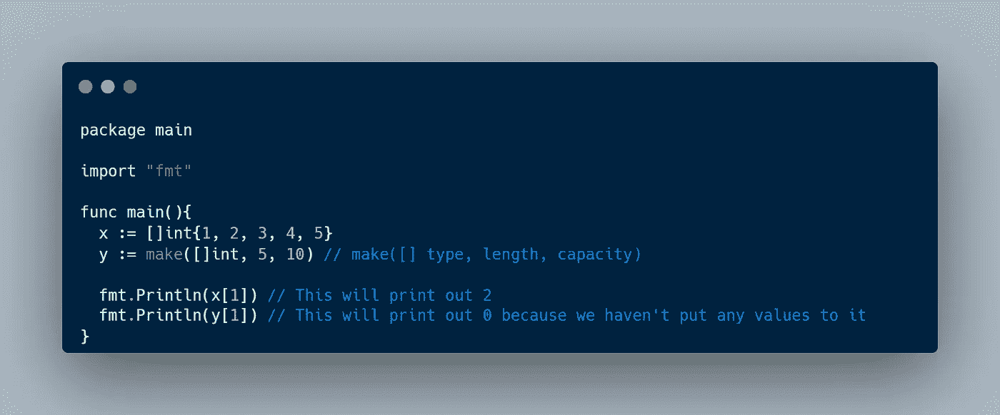

# 学习围棋，一段旅程:控制流和分组数据#3

> 原文：<https://blog.devgenius.io/learning-go-a-journey-control-flow-and-grouping-data-3-8dbf6abbbeb3?source=collection_archive---------16----------------------->

大家好！很高兴再次见到你，我希望你过得很好。在这篇文章中，我想分享我在学习 Go 编程语言方面的进步。上周，我学习了控制流和数据分组。

# 控制流

什么是控制流？在计算机科学中，控制流是执行或评估单个语句、指令、函数或调用的顺序。通常，你的计算机逐行读取你的程序行，但是我们可以使用循环或条件语句来控制执行流程。

## 环

循环允许我们重复执行一条语句。在 Go 中使用循环的唯一方法是使用 For 语句。迭代可能由单个条件、“for”子句或“range”子句控制。

**单一条件**

“for”语句最简单的形式是使用单个条件

只要条件评估为真(a 小于 b ),就将重复该块

**条款**

使用“for”语句的下一种方法是使用 for 子句。“for”子句的结构如下

我们可以定义 init 语句、condition 语句(只要其计算结果为 true，就会重复该块)和 post 语句(每次迭代后都会执行)。例如

正如我们所看到的，我们有一个 init 语句，它是值为 0 的“I ”,我们有一个“I”小于 10 的条件，然后我们有一个 post 语句，它将在每次迭代后递增“I”的值。这个“for”语句将重复 10 次。

**范围条款**

最后一个是“范围”条款。range 子句将根据数组的范围重复该块。比如说。

正如我们所见，我们有一个长度为 5 的切片(或其他编程语言中的数组),它将重复 5 次。每个索引的值都存储在 value 变量中。我们还可以通过在范围表达式之前定义索引变量来获得当前迭代的索引。

## 条件语句

在 Go 中，有两种方法可以使用条件语句，即“if”语句和“switch”语句。

**If 语句**

正如我们所看到的，我们可以使用“if”语句来计算一个条件，如果计算结果为 true，就执行内部块。我们也可以将“如果”与“否则如果”或“否则”链接起来。程序将从第一条语句开始检查，如果没有条件被评估为真，那么它将执行 else 块。例如，上面的代码将打印出“a 等于 3”，因为“if”和“else if”语句的计算结果不为真

**开关语句**

“switch”语句的工作方式类似于“if”语句，它将检查每一种情况(或条件)，如果结果为 true，它将执行该情况中的块。如果没有案例完成，将执行默认语句。

# 分组数据

## 排列

数组是单一类型元素的编号序列，称为元素类型。数组中元素的数量叫做长度，它永远不会是负数。我们可以在 Go 中使用一个数组，例如通过它的索引来访问值

注意，如果我们打印出第一个索引，它将返回“2”，因为数组总是从 0 开始(从零开始的索引)。

## 薄片

切片是底层数组的连续段的描述符，并提供对该数组中编号的元素序列的访问。我们可以用两种方式定义切片，例如

切片的行为与数组相同。唯一的区别是数组的长度不能改变。如果数组长度超过容量，将会调整容量大小。我们还可以使用“append”向数组中添加一个新值。

或者我们可以用它的索引覆盖其中一个值

例如，我们也可以从切片中删除一个值

**多维切片**

如果我们想在一个片上存储多个相同类型的数据呢？我们可以使用多维切片。

用双括号声明一个多维切片(也可以称之为切片的切片)。此外，我们可以向切片追加一个新值(它也必须是一个切片)。

## 地图

映射是一种类型(称为元素类型)的无序元素组，由另一种类型(称为键类型)的一组唯一键索引。或者在其他编程语言中我们可以称之为关联数组。例如

我们可以给地图添加一个新值

我们还可以从地图中删除一个值

## 结构

结构是一系列命名元素，称为字段，每个字段都有一个名称和一个类型。好吧，如果这让你感到困惑，基本上一个结构允许我们存储多种不同类型的数据。

首先，我们必须用 struct 的底层类型创建一个类型，然后我们定义字段名和字段名的类型。之后，我们可以使用该类型并将其保存到一个名为 jamesBond 的变量中。

本文到此为止，别忘了留下一个赞，分享给别人。如果您有任何反馈，请在下面留下您的评论。感谢你阅读这篇文章，祝你有美好的一天👋。

资源

*   [学习如何编码:谷歌的 Go (golang)编程语言](https://www.udemy.com/course/learn-how-to-code/)
*   [Go 编程语言规范](https://go.dev/ref/spec)