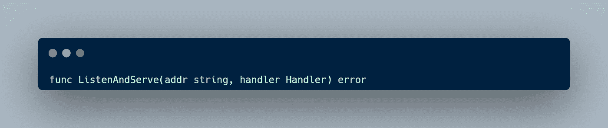
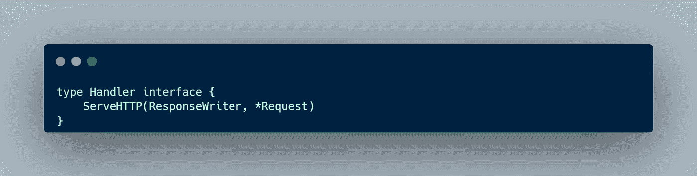
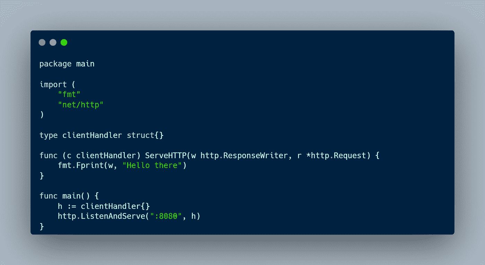
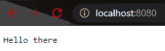
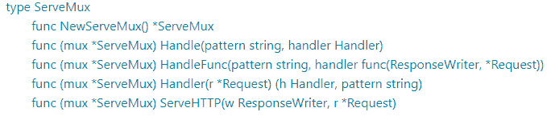
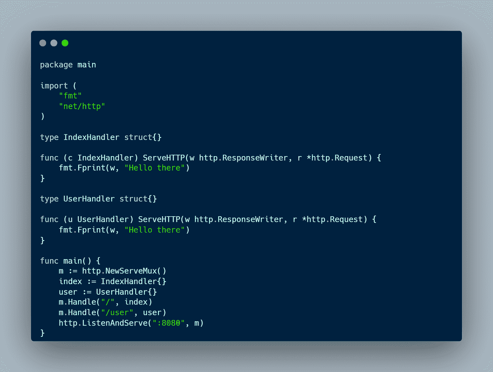
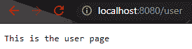
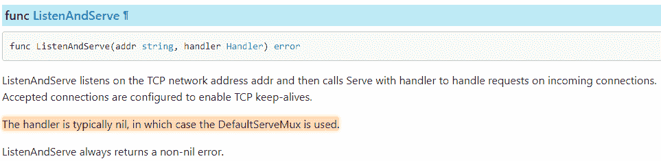
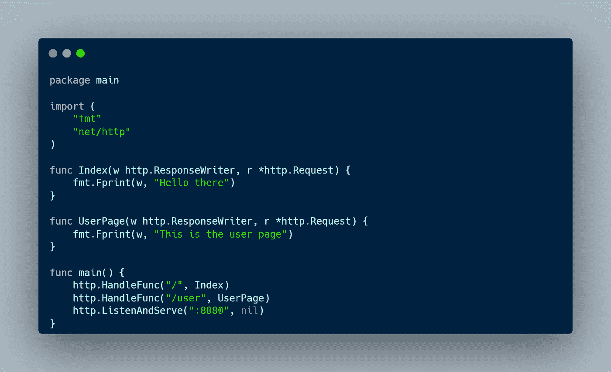

# 学习 Go，一个旅程:用 HTTP 包创建服务器#9

> 原文：<https://blog.devgenius.io/learning-go-a-journey-creating-server-with-http-package-9-18a00b7d47b?source=collection_archive---------21----------------------->

上周，我发表了一篇关于用 net 包创建服务器的文章。在本文中，我将介绍如何用 HTTP 包创建一个服务器。HTTP 包提供了一种更简单的创建服务器的方法，它是建立在 net 包之上的。

# ListenAndServe 和类型处理程序

要创建一个带有 HTTP 包的服务器，我们必须调用函数 ListenAndServe，它接收两个参数一个地址和一个类型处理程序。

ListenAndServe 监听 TCP 网络地址 addr，然后用一个处理程序调用 Serve 来处理传入连接上的请求( [Go doc](https://pkg.go.dev/net/http#ListenAndServe) )。类型处理程序是一个具有 ServeHTTP 方法的接口，这意味着任何具有 ServeHTTP 方法的类型都会实现处理程序接口。

正如我们从上图中看到的，我们有一个 clientHandler，它是一个具有 ServeHTTP 方法的结构。创建一个 clientHandler 类型的值，然后将该值传递给 ListenAndServe 函数。然后我们可以运行程序，在浏览器上打开地址。

# HTTP ServeMux

从前面的例子中，我们已经成功地创建了我们自己的带有一个处理程序的服务器。现在，如果我们有多条路线要处理呢？我们使用 ServeMux 来完成这项工作。

ServeMux 是一个 HTTP 请求复用器。它将每个传入请求的 URL 与注册模式列表进行匹配，并调用与 URL 最匹配的模式的处理程序( [Go doc](https://pkg.go.dev/net/http#ServeMux) )。ServeMux 有多种方法

要用 ServeMux 创建服务器，我们必须调用 NewServeMux()，然后用 handle 方法处理多个路由，该方法接收两个参数、一个模式和一个类型处理程序。

现在我们有多条路由，用不同的处理程序来处理请求。如果我们在浏览器上打开地址并访问路由，输出将是

# HTTP HandleFunc 和 DefaultServeMux

在前面的例子中，我们使用了一个 ServeMux 和一个 Handle 函数来处理我们的请求。但这似乎太复杂了，因为我们必须创建多个类型才能实现处理程序接口。这就是为什么我们要使用 HandleFunc，它接收两个参数，一个模式和一个带有 ResponseWriter 和指针请求参数的函数。

现在，我们如何在不向 ListenAndServe 函数传递任何处理程序的情况下创建服务器？我们可以传递一个 nil 值作为参数，这样它将使用 DefaultServeMux。

因此，现在我们可以创建我们的服务器并拥有多条路径。

运行程序并访问 URL，输出将是

本文到此为止，别忘了留下一个赞，分享给别人。如果您有任何反馈，请在下面留下您的评论。感谢你阅读这篇文章，祝你有美好的一天👋。

资源

*   [学习如何编码:谷歌的 Go (golang)编程语言](https://www.udemy.com/course/learn-how-to-code/)
*   [围棋编程语言规范](https://go.dev/ref/spec)
*   [HTTP 包](https://pkg.go.dev/net/http)