# 学习围棋之旅:用网络包#8 创建服务器

> 原文：<https://blog.devgenius.io/learning-go-a-journey-creating-server-with-net-package-8-528d97e20882?source=collection_archive---------7----------------------->

服务器向另一台计算机(也称为客户端)提供服务。在客户机/服务器模型中，服务器满足来自客户机的请求( [Brian Posey](https://www.techtarget.com/whatis/definition/server) )。Golang 提供了一个名为“net”的标准库包，我们可以在其中创建自己的服务器并为客户端请求提供服务。

# 什么是 TCP？

TCP 代表传输控制协议(Transmission Control Protocol ),这是一种通信标准，使应用程序和计算设备能够通过网络交换消息。它旨在通过互联网发送数据包，并确保数据和消息在网络上的成功传递( [Fortinet](https://www.fortinet.com/resources/cyberglossary/tcp-ip) )。在本文中，我将使用 TCP 连接来服务我们的服务器。

# 创建一个监听器

要创建一个监听器，我们必须使用“Net”包中的函数“Listen”。“Listen”函数接收两个参数，一个网络(tcp、tcp4、tcp6、unix 或 unixpacket)和一个地址。它返回一个侦听器和一个错误。侦听器有 accept、close 和 addr 方法。

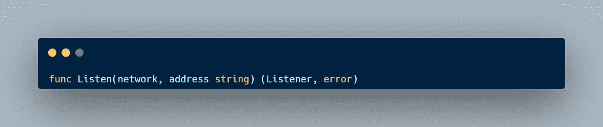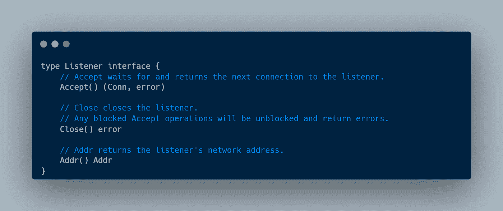

例如，我们从 net 包中调用 Listen 函数，然后检查错误。之后，我们推迟关闭函数，因为我们必须在程序结束时关闭连接。

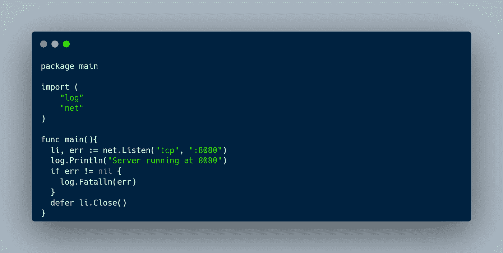

# 写入连接

在上一节中，我们已经创建了自己的服务器。现在，我们可以接受一个连接来读取客户端请求或向客户端写响应。我们已经从 Listen 函数接收了一种类型的侦听器，然后我们可以调用 Accept 函数来开始接受连接。Accept 函数返回 Conn 类型和一个错误。Conn 是一个接口，它有几个方法，如下图所示。Conn 接口也是一个读取器或写入器，这意味着我们可以读取或写入连接。

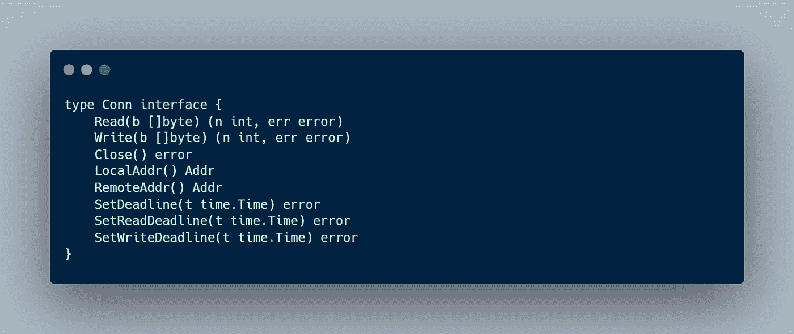

例如，在我们创建了一个服务器之后，我们创建了一个无限循环，它将在程序启动时接收一个连接。要写入连接，我们可以使用“io。WriteString()，“fmt。Fprintf()"，或任何接收编写器作为其参数的函数。之后，不要忘记在我们完成请求后关闭连接。

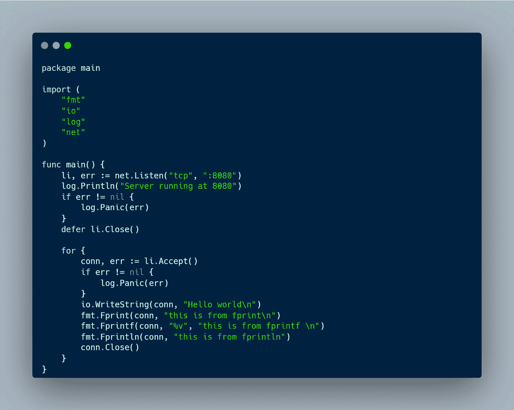

在 bash 中运行程序，然后打开我们的命令行，使用 telnet 连接我们的服务器。

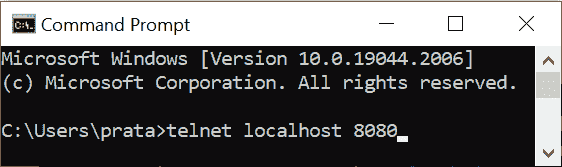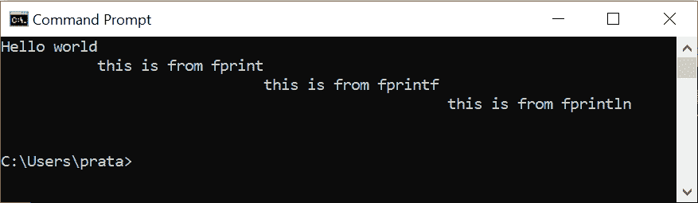

# 用 Bufio 扫描仪处理请求

Bufio 包中的 type Scanner 提供了一个方便的接口来读取数据，比如一个换行符分隔的文本文件(Go doc)。

## 阅读请求

要读取到来的请求，我们可以将 Conn 传递给接收读取器的 NewScanner 函数。然后，我们在每次扫描器扫描任何输入文本时创建一个循环，并将文本打印到 bash。最后，我们必须在完成请求后关闭连接。

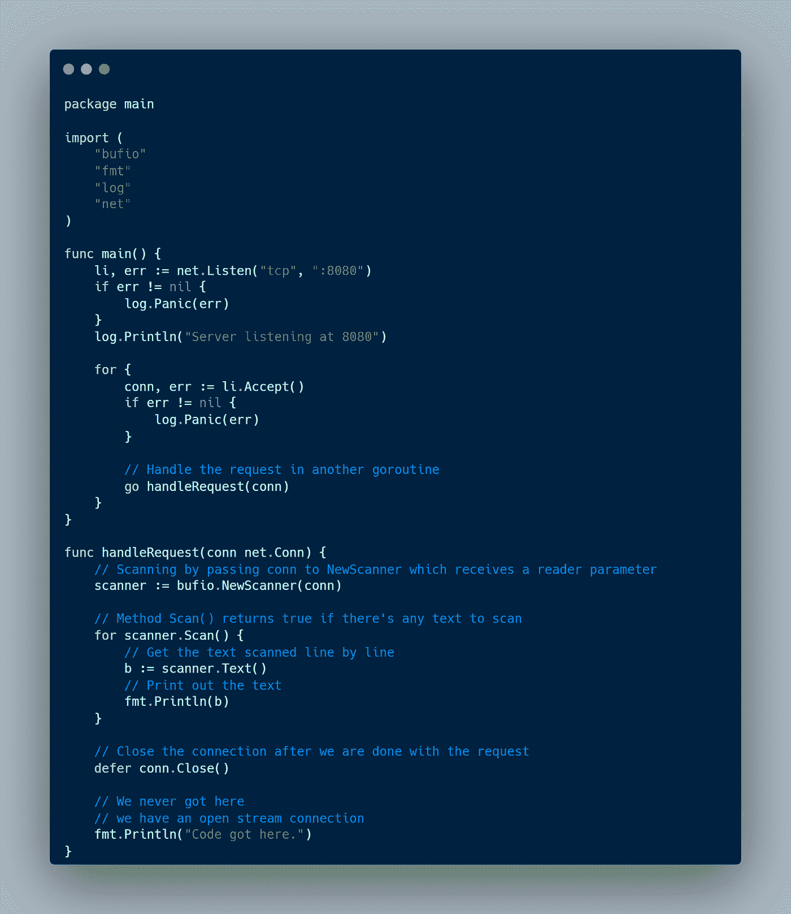

运行程序，然后在浏览器上打开地址。打开浏览器的地址后，我们将在 bash 上获得这些文本。这些文本表示来自客户端的请求，其中包含方法、URL、HTTP 版本、标题等。

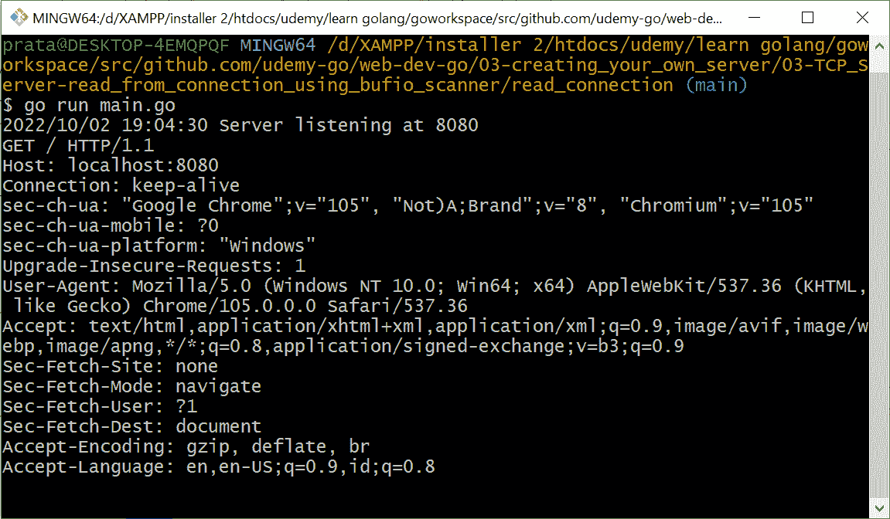

# 通过 URL 处理不同的请求

从上一节中，我们已经成功地用 bufio scanner 扫描了一个传入的请求。现在我们可以通过 URL 来处理请求。正如我们所看到的，传入的请求在第一行有 URL。例如，我们可以利用这些数据来处理不同的请求

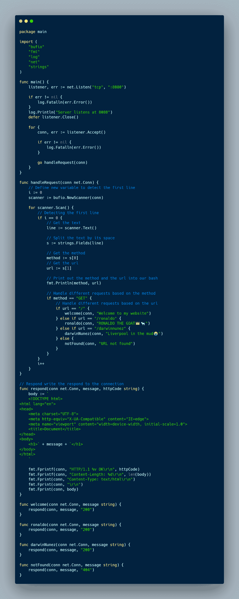

从上图中，我们利用请求数据来处理不同的请求。如果我们在 bash 中运行程序并打开 URL。

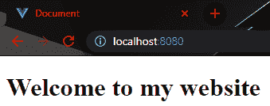

/

/罗纳尔多

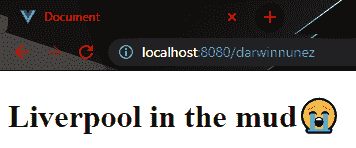

/达尔温努内斯

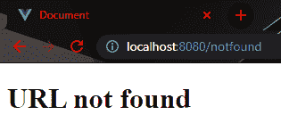

以前没有定义过的任何 URL

本文到此为止，别忘了留下一个赞，分享给别人。如果您有任何反馈，请在下面留下您的评论。感谢你阅读这篇文章，祝你有美好的一天👋。

资源

*   [学习如何编码:谷歌的 Go (golang)编程语言](https://www.udemy.com/course/learn-how-to-code/)
*   [围棋编程语言规范](https://go.dev/ref/spec)
*   [什么是服务器？](https://www.techtarget.com/whatis/definition/server)
*   [什么是 TCP？](https://www.fortinet.com/resources/cyberglossary/tcp-ip)
*   [网包](https://pkg.go.dev/net)
*   [Bufio 包](https://pkg.go.dev/bufio)