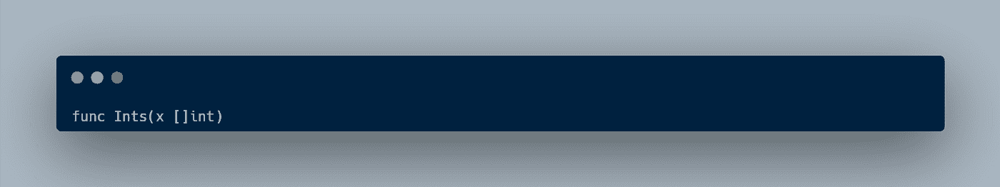
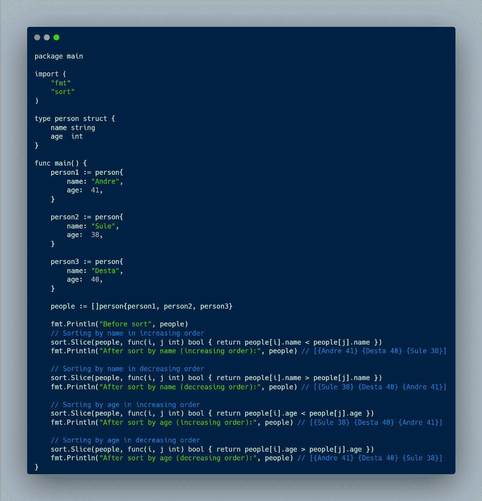
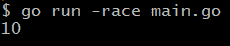

# 学习 Go，旅程:标准库包和并发性#5

> 原文：<https://blog.devgenius.io/learning-go-a-journey-standard-library-packages-and-concurrency-5-98e2547c03ec?source=collection_archive---------7----------------------->

大家好！很高兴再次见到你，我希望你过得很好。在这篇文章中，我想分享我在学习 Go 编程语言方面的进步。本周，我学习了标准库包和并发性。

# 标准库包

我们已经知道了基本的 Go 编程语言，现在我们要学习如何将我们的代码集成到标准库包中，比如 JSON、sort 和 bcrypt。

## JSON

JSON 或 Javascript Object Notation 是一种用于在 web 应用程序中传输数据的格式(例如，将数据发送到客户端，以便可以在网页上显示)。在 Go 中，我们可以使用**编码/json** 包从 json 转换到 struct，反之亦然。我们可以使用两种功能:

*   **JSON 元帅**

Marshal 返回一个字节片段中的值的 JSON 编码，如果有错误，就返回一个错误。

例如，我们有一个结构，想把它编码成 JSON，这样我们就可以把它发送给客户机(例如 web 应用程序)

从上图中，我们可以导入 JSON 包，并通过传递一个类型为 slice 的参数来调用函数 marshal。封送函数返回 2 个值、编码值和一个错误。所以我们必须检查是否有任何错误发生。如果没有错误，我们可以用 string 函数再转换一次，因为 marshal 函数返回的是一片字节。之后，我们可以将数据发送给客户端(例如 web 应用程序)

*   **JSON 解组**

解组是编组的反义词。Unmarshal 解析 JSON 编码的数据，并将结果存储在 v 指向的值中。Unmarshal 函数接收两个参数、一个类型为字节片的数据和一个值。注意，我强调了单词 pointed，因为 unmarshal 函数只接收指针类型的值。该函数只返回一个错误。

例如，我们有一个来自客户的 JSON 格式的请求。为了处理数据，我们必须首先将它解析成一个切片。

首先，我们接收一个字符串类型的请求。根据这个请求，我们需要知道数据结构。请求有键和值对，并且在每个字段中有不同的数据类型，所以我们必须基于请求创建一个结构。之后，我们将字符串转换成一片字节。然后，创建一个 secretAgent 类型的变量。然后，通过传递两个参数调用 unmarshal 函数，byteRequest 和我们要存储解析数据的变量(它必须是一个指针，所以我放了一个&运算符)。解组将返回一个错误，所以我们必须检查是否有错误。最后一件事，打印解析的数据。

## 分类

包排序提供了对切片和用户定义的集合进行排序的原语。

*   **对一片整数进行排序**

对于一个整数片的排序，我们可以使用一个 Ints(x []int)函数。它将按升序对一部分整数进行排序

*   **对一段字符串进行排序**

为了对一段字符串进行排序，我们可以使用 Strings(x []string)函数。它将按升序对字符串进行排序

*   **自定义排序**

之前，我们已经知道如何对一个整数或一个字符串进行升序排序。那么如果我们想按降序排序呢？我们可以使用一个接收两个参数、一个切片和一个自定义函数的切片函数来确定是升序还是降序。

使用 slice 函数，我们还可以基于任何键对 struct 的切片进行排序。例如

## Bcrypt

加密和哈希是有区别的。加密是一种包括加密和解密的双向功能，而哈希是一种单向功能，它将纯文本更改为不可逆的唯一摘要。Go 中的 bcrypt 包实现了 Provos 和 Mazières 的 bcrypt 自适应哈希算法。要在我们的项目中使用 bcrypt 包，我们必须首先在 bash 或 terminal 中使用以下语法安装它

之后，我们可以在我们的项目中使用它。我们需要了解两个函数

*   **生成来自密码**

该函数生成一个哈希密码。它以给定的代价和一个错误返回密码的 bcrypt 散列。成本基本上决定了哈希算法的复杂程度。

例如

由于函数返回一个字节片，我们必须用 string 函数把它转换成一个字符串。

*   **比较密码**

此函数将 bcrypt 哈希密码与其可能的等效明文进行比较。如果成功或出错，则返回零。

例如

如上图所示，我们比较了两个密码，一个是哈希密码 123，另一个是文本密码 1243。该函数返回一个错误，因为它是不同的。

# 并发

在计算机科学中，并发性是指程序、算法或问题的不同部分或单元不按顺序或部分顺序执行而不影响最终结果的能力。

## Go 中的并发性

2006 年，英特尔向世界推出了第一款多核处理器。2007 年，Google 开始开发 Go 编程语言，所以默认情况下，Go 编程语言是适应并发模式的。Go 有一个名为 goroutines 的内置函数，它能够拆分任务并运行并发程序。要调用 goroutines，我们使用“go”关键字。

正如我们所看到的，我们有两个打印单词“Hello”和“World”的函数。我们在另一个 goroutine 中启动了 foo 功能。所以理论上我们有 2 个 goroutines 同时运行(一个运行 main 函数，另一个运行 foo 函数)。但是输出只显示“Hello”二字，这是怎么回事？基本上，程序在运行 foo 函数之前会退出(main goroutine)。如果我们再次尝试运行它，有时它会显示 foo 函数运行的不同结果。例如

上图显示了 foo 函数在主 goroutine 退出之前运行。

## 等待组

从上面的讨论中，我们发现了一个问题，即我们的代码在完成所有任务之前就已经完成了。为了解决这个问题，我们可以使用包同步中的 WaitGroup。WaitGroup 等待不同 goroutines 的集合完成它们的任务。例如

从上图来看，WaitGroup Add(delta int)、Done()和 Wait()有 3 个函数。Add(delta int)的意思是我们在等待列表中增加 1 个 goroutine 来等待，我们可以放入任何我们想要的数字(如果是负数，就会抛出一个 panic)。Done()意味着当 goroutine 完成它的任务时，它将在 Add 函数中增加等待列表。Wait()意味着它将等待所有 goroutines 完成它们的任务。

## 竞态条件

竞态条件是程序覆盖相同变量的条件。例如

从上图可以看出，我们推出了一个新的 goroutine，每次循环迭代增加 1 个值。理论上，当我们打印出计数器变量时，它应该是 10。但是我们有一个竞争条件，为了检查我们是否有任何竞争条件，我们可以使用这个命令。

## 互斥（体）…

那么如何解决一个竞争条件呢？我们可以使用互斥。互斥锁是一种互斥锁。例如

从上图来看，当函数给计数器变量加 1 时，我们锁定。这意味着另一个 goroutine 不能使用它们之间共享的变量，直到使用它的那个完成它的任务。如果我们检查任何竞争条件，结果显示没有

## 原子的

另一种避免任何竞争情况的方法是使用原子。例如

如果我们检查任何竞争条件，结果显示没有

本文到此为止，别忘了留下一个赞，分享给别人。如果您有任何反馈，请在下面留下您的评论。感谢你阅读这篇文章，祝你有美好的一天👋。

资源

*   [学习如何编码:谷歌的 Go (golang)编程语言](https://www.udemy.com/course/learn-how-to-code/)
*   [围棋编程语言规范](https://go.dev/ref/spec)
*   [JSON 包](https://pkg.go.dev/encoding/json)
*   [分拣包装](https://pkg.go.dev/sort)
*   [Bcrypt 包](https://pkg.go.dev/golang.org/x/crypto/bcrypt)
*   [并发和并行的区别](https://stackoverflow.com/questions/1050222/what-is-the-difference-between-concurrency-and-parallelism)
*   [同步包](https://pkg.go.dev/sync)