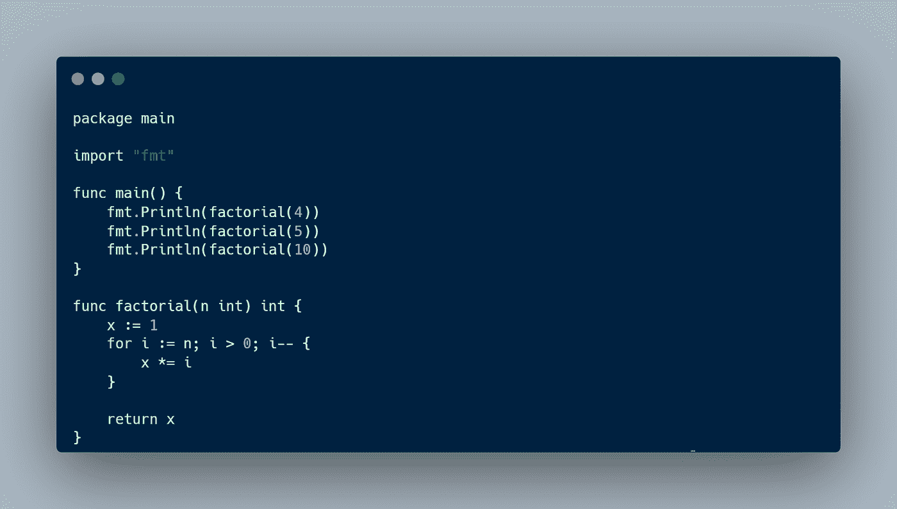
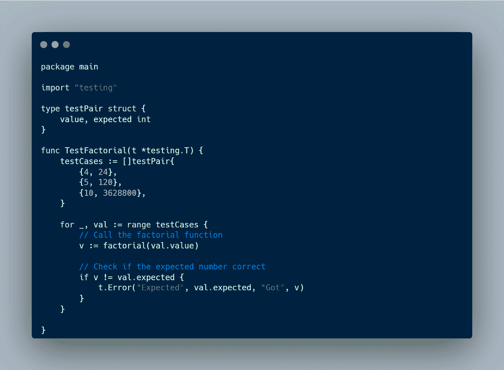
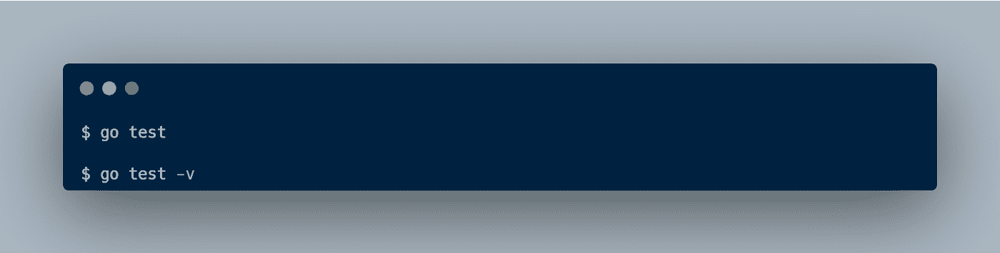
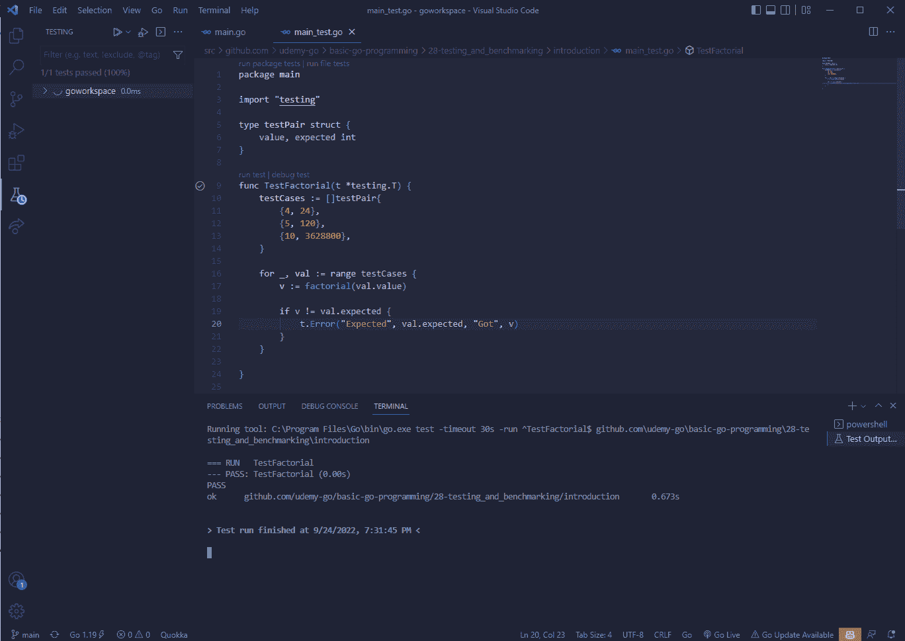
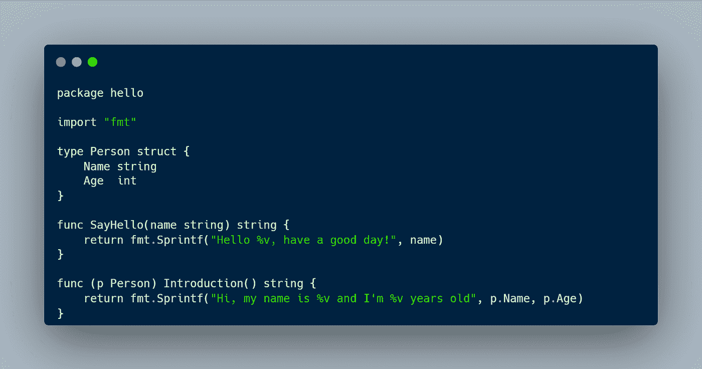
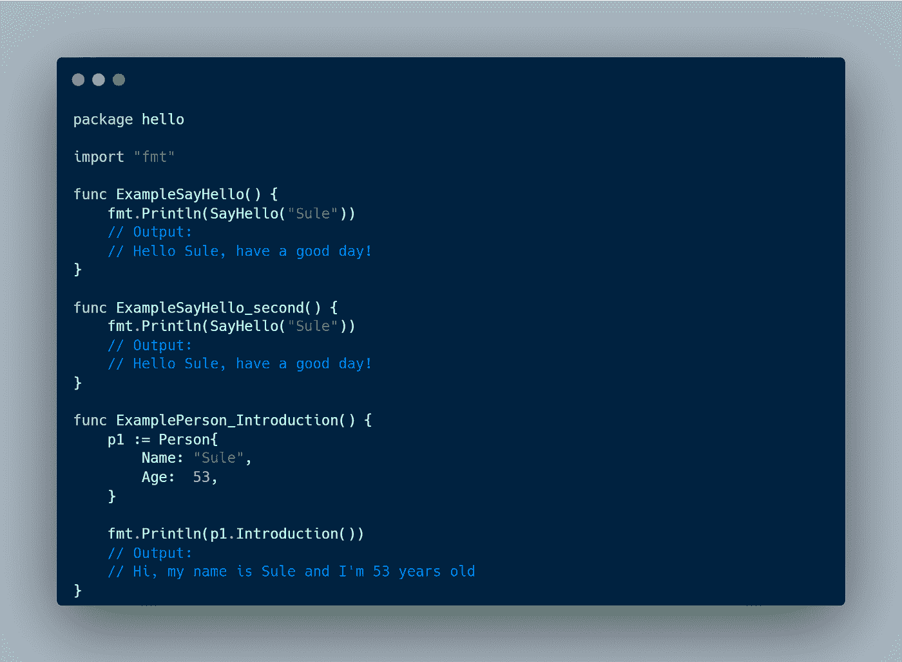
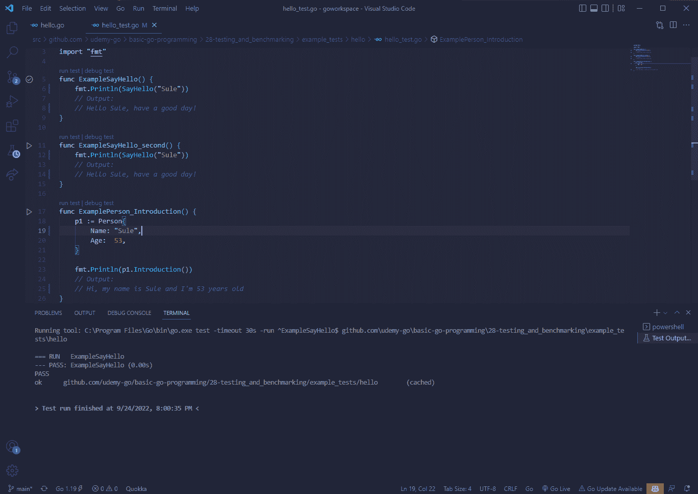
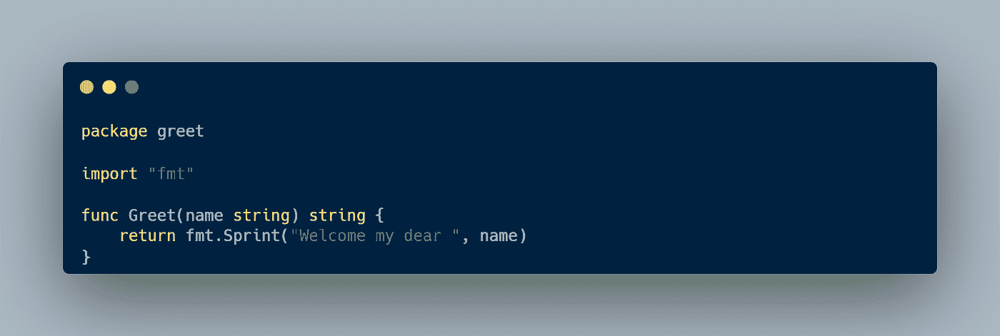
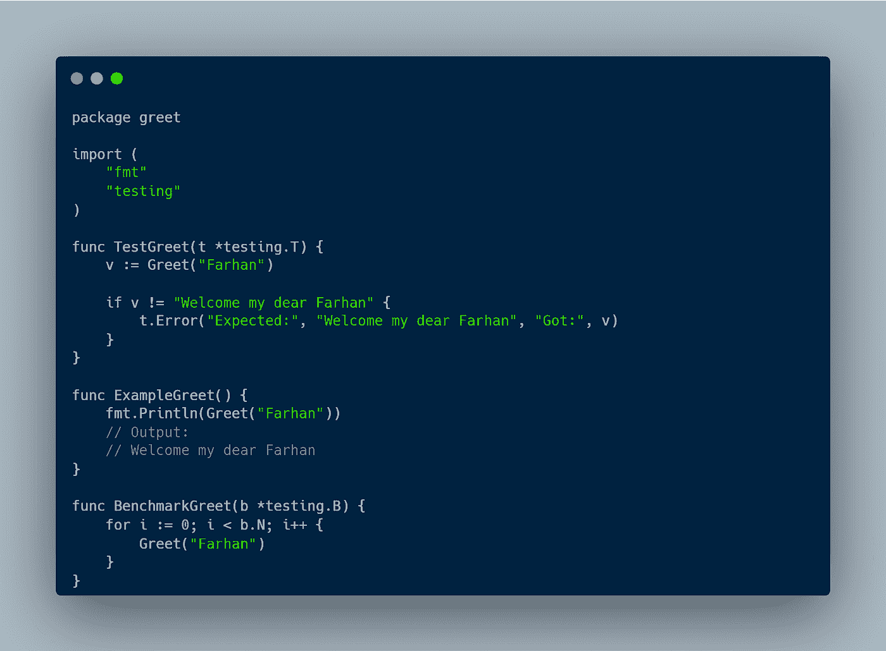
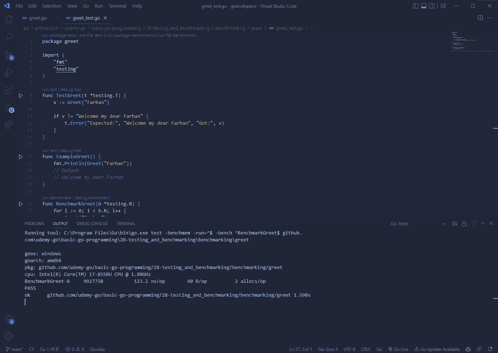

# 学习围棋之旅:测试和基准测试#7

> 原文：<https://blog.devgenius.io/learning-go-a-journey-testing-and-benchmarking-6-70058827ed81?source=collection_archive---------12----------------------->

测试是评估和验证我们的程序的过程，以确保它做它应该做的事情。在我们的产品上市并被用户使用之前，需要进行测试。Golang 有一个很好的测试和基准测试方法，由标准库 testing 提供。

# 测试

让我们来看一个可以测试的示例代码

main.go

正如我们所看到的，在主包中我们有一个阶乘函数，它接收一个数字并返回该数字的阶乘。我们可以通过在包含所有测试函数的同一个名为“main_test.go”的包中创建新文件来测试阶乘函数。

主 _ 测试. go

为了测试我们的一个函数，我们必须创建一个名为“TestXxx”的函数。“Xxx”代表函数的名称。该函数接收一个参数，该参数是来自包测试的指针类型“t”。在函数内部，我们可以用一个值和一个预期的结果创建多个测试用例。之后，我们在切片上测试每种情况，如果期望值不匹配，我们抛出一个错误。要运行我们的测试，如果您使用 Visual Studio 代码，您可以单击测试函数上方的“运行测试”,或者您可以运行“go test”或“go test -v”。

正如我们所看到的，我们已经运行了我们的测试，结果是“PASS ”,这意味着我们的程序正在按预期工作。

# 提供示例

包测试还运行并验证示例代码。

你好，去吧

例如，我们有一个包“hello ”,它具有函数“SayHello”和附加到类型“Person”的“Introduction”方法。我们可以通过在同一个包中创建一个名为“hello_test.go”的新文件来为这些函数创建一个示例。

hello_test.go

要创建一个示例，我们必须将函数命名为“ExampleXxx”。“Xxx”是函数的名称。我们可以调用“Println”来写输出。在输出下面，我们要写一个注释“output:”然后是输出的结果。然后我们可以像运行测试一样运行这个例子。

正如我们所看到的，我们已经成功地运行了我们的示例。

# 标杆管理

基准测试是一种用性能指标测试代码性能的方法。标杆管理有助于保持我们的项目达到标准质量。

打招呼去吧

例如，我们有一个名为“greet”的包来问候人们。为了对包中的一个函数进行基准测试，我们可以创建一个名为“greet_test.go”的文件，并创建一个基准函数。

greet_test.go

基准函数必须命名为“BenchmarkXxx”。“Xxx”是我们想要测试的函数的名称。基准函数接收一个 testing.B 类型的指针，在函数内部，我们要创建一个 for 循环，从“b”开始循环“N”次。循环次数由包装决定。在循环函数内部，我们调用“Greet”函数。要运行基准测试，如果您使用 Visual Studio 代码，请单击基准测试函数上方的“运行基准测试”或运行命令“运行测试工作台”在 bash(“.”意味着我们运行所有基准测试)。

结果显示了每次操作花费的时间。在这种情况下，要运行“greet”函数，程序需要 123.2 纳秒。在那之后，我们可以根据度量标准决定是改变还是保留代码。

本文到此为止，别忘了留下一个赞，分享给别人。如果您有任何反馈，请在下面留下您的评论。感谢你阅读这篇文章，祝你有美好的一天👋。