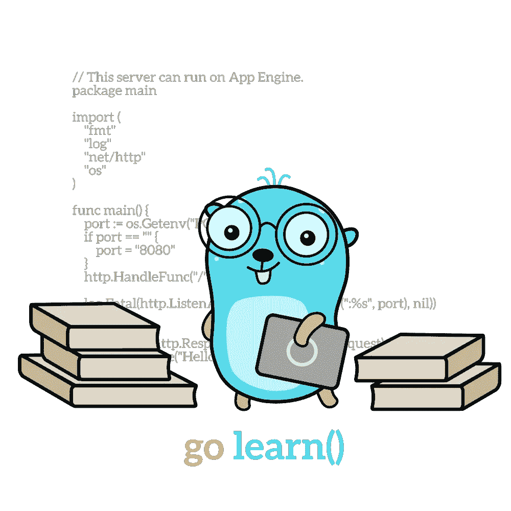

# 学习 go —加速您的旅程(第 1 部分)

> 原文：<https://blog.devgenius.io/learning-go-in-2022-boost-your-journey-6edc606ed030?source=collection_archive---------2----------------------->

我成为 Node.js 开发人员已经有 5 年了，但是在我的开发生涯中，我一直热衷于学习新事物和新技术。我不会在这里解释为什么学习围棋，因为我认为有很多文章已经做得很好了。相反，我会努力帮助你踏上这一旅程，让你的生活变得更轻松:)

每次我试图**学习一门新的编程语言**，事实上，我问自己的问题总是相同的:**我可以从哪里开始获得提升？**

[https://github.com/MariaLetta/free-gophers-pack](https://github.com/MariaLetta/free-gophers-pack)

# 开始—先从基础做起

首先，我需要**学习一些语法**，以便能够开始读写一些 Go 代码。谷歌了一下，我找到了我要找的东西:[举例](https://gobyexample.com/)。这个网站真的很简单，但是它有你需要的一切让你快速开始。以下是我的一些建议，可以帮助你快速入门:

*   使用`var`声明**变量**，使用`const`声明**常量**。你总是可以用快捷键`a := 42`将声明为一个变量**并同时给**赋值
*   Go 支持`for`作为**唯一的循环构造**，但是它非常灵活和强大。它实际上支持以下符号:
    –经典:`for i := 0; i < 3; i++ { ... }`
    –单一条件:`for i < 3 { ... i += 1 }` –无条件(无限循环):`for { ... }`
    在单一条件的情况下，你必须记住递增计数器。
*   `range`构造可以用于**迭代数据结构**。例如，给定一个数组`nums`，我们可以做类似`for index, num := range nums { ... }`的事情。范围运算符对于迭代地图也很有帮助。例如，给定一个地图`myMap`，我们可以这样做:`for key, value := range myMap { ... }`
*   **三进制**不支持**，但是我们仍然可以利用经典的`if ... else`**
*   **围棋中主要的**原语类型有:`bool`、`string`、`int`、&、`uint` (16 - 32 - 64)、`float` (32 - 64)、`complex` (64 -128)****
*   ****当一些东西没有在 Go 中初始化时，它被赋予零值(例如，int，float-> 0，string -> " "，bool -> false****
*   ****正如所料，Go 支持将**数组**(例如`var a [5]int`)作为具有**特定长度**的编号元素序列。
    当处理可能需要扩展或收缩的数据集合时，可以使用 [**切片**](https://gobyexample.com/slices) 。为了创建切片，您可以简单地做:`s := make([]string, 3)`****
*   ****如果你需要一个**映射**，你可以简单地做`m := make(map[key] value)`，这里 key 是键类型，value 是你的值类型****
*   ****Go 支持 [**一级函数**](https://gobyexample.com/closures) ，为此你可以创建匿名函数，从函数中返回一个函数，传递一个函数作为回调函数等等…****

# ****结构体****

****现在，从一个 typescript 上下文中，我开始思考，**我怎样才能创建一个类**来使我的代码更加结构化？****

****Go 不是面向对象的语言(更多细节见这里的[和这个**没有类**，但是你可以利用**结构**。在 Go 中，struct 是一个**类型化的字段集合。**](https://go.dev/doc/faq#Is_Go_an_object-oriented_language)****

****让我们看看如何在 Go 中用一个简单的 getArea 方法创建一个矩形:****

****Go 结构示例****

****在上面的例子中，我们有:****

1.  ****`Rectangle`是一种新型****
2.  ****`getArea`是将`Rectangle`设置为**接收器**的功能。从现在开始，每一个`Rectangle`都可以在自身上调用`getArea`方法。
    对于来自 python 或 javascript 等其他语言的人来说，接收者`r`可以被视为与`self`或`this`关键字相同。****

# ****接口****

****现在，**界面呢？** Go 支持接口，为了实现一个接口，没有**实现关键字**可以使用。谁想实现它就够了，**简单定义了所有需要的方法。******

****让我们看看如何创建一个简单的几何图形界面，以及如何“实现”它。****

****Go 接口示例****

****既然我们已经有了基本的概念，并且知道如何使我们的代码更加结构化，让我们跳到语言的一些重要概念:****

1.  ****Defer 关键字****
2.  ****两颗北极指极星****
3.  ****错误与恐慌****
4.  ****基本 JSON 处理****

# ****Defer 关键字****

****`defer`关键字是**通常**用于**清理目的。**一般来说，defer 语句**推迟函数的执行，直到周围的函数返回。**立即计算延迟调用的参数，但是直到周围的函数返回，才执行函数调用。****

****延期关键字示例****

# ****两颗北极指极星****

****Go 支持指针，允许你在程序中传递对你的值的引用。指针是一个广泛的话题，应该单独写一篇文章，但是为了开始，我尝试了一些我认为重要的事情。****

****指针**保存一个值的存储地址。**其 Go 中的零值为`nil`****

****语法非常简单:****

1.  ****使用`*`取消对指针值的引用****
2.  ****使用`&`获取特定变量的地址****

****让我们看一个基本的例子:****

****现在，让我们澄清一个常见的误解。**支持指针不代表 Go 支持通过引用传递参数。******

****事实上，在 Go 中一切都是通过值传递的，没有所谓的通过引用传递。这意味着，每次我们传递一个参数给一个函数，这个参数就会被复制。你只能控制你是否想要**传递一个值的副本** **或者** **一个值的引用的副本。******

****一般来说，在 Go 中，每个函数参数都是通过值来传递的，通过改变函数体中的参数值，原始值不会受到影响。此规则的唯一例外是**切片**和**贴图**。它们仍然通过值传递，但是因为它们是**引用类型**，任何改变都会改变底层变量。****

****什么时候使用指针，什么时候不使用似乎是围棋界的热门话题，为此我建议你看看这个。****

# ****错误与恐慌****

****在 go by example 中我们了解到，在 go 中，通过一个**显式的、单独的返回值来传达错误是惯用的。**按照惯例，**错误是最后一个返回值**，有**类型错误**，内置接口。****

****例如:`return -1, errors.New("Something went wrong")`****

****错误位置的`nil`值表示**没有错误。******

****也可以通过在定制类型上实现 Error()方法，将定制类型用作 Error。****

****那么，什么时候应该用恐慌来代替呢？`panic`通常指事情发生了**意想不到的错误**。大多数情况下，它用于快速失败在正常操作期间不应该发生的错误。例如:`panic("Something really bad happened")`****

******总的来说，**从我的理解来说，你应该**总是** **尽可能喜欢错误。******

# ****JSON 处理****

****迟早我们都要处理一些 JSON。来自 Node.js 环境的我习惯了经典的`JSON.stringify`和`JSON.parse`方法。Go 还为 JSON 编码和解码提供了**内置支持，包括使用`encoding/json`包与内置和自定义数据类型之间的相互转换。让我们深入一个例子，因为它值得百万字:******

****有一些重要的事情要记住:****

1.  ****编码/解码时，**仅考虑大写字段**，因此它们被称为**导出字段。**在响应结构中写入`Message`或`message`则完全不同，因为在编码/解码中不会考虑最新的一个。****
2.  ****当**编码**时，如果你使用了**自定义标签**(参见上面代码中的注释)，Go 将在编码到 JSON 时使用那些标签。****
3.  ****当**解码时，**如果使用了**自定义标签，** Go 将在 JSON 中搜索那些用于解码的标签。****

****请记住，也可以将 JSON 编码直接流式传输到 HTTP 响应体:)****

# ****结论****

****这仅仅是旅程的开始，显然还有很多内容要讲。Go 的设计考虑到了并发性，因此我的**下一步探索**将集中在 **Go 例程**和**通道上。**如果你渴望阅读它，你可以在这里找到它:)****

****如果你喜欢这篇文章，并且想让我知道，请给我一些掌声👏如果您不想错过我的下一篇文章，请关注我；)****

****下次探索再见:)****