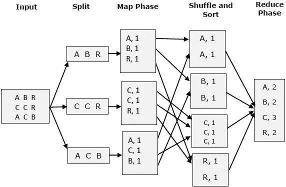

# 用一个例子学习 gRPC

> 原文：<https://blog.devgenius.io/learning-grpc-with-an-example-8b4931bd90c8?source=collection_archive---------2----------------------->

## 使用 python 理解 gRPC

> 如果您不熟悉 gRPC(远程过程调用)和协议缓冲区，那么这篇文章非常适合您！这是对 gRPC 和协议缓冲器以及 gRPC 如何用于微服务通信的介绍。

构建软件应用程序的传统技术就像建造一块巨大的石头。随着最近微服务架构的进步，它们成为开发软件应用程序的流行选择。在这样的架构中，微服务经常需要相互通信。与 RESTful API 相比，基于 gRPC 的 RPC 框架为微服务通信提供了更好的选择。

Github 资源库的链接:[https://Github . com/divija 16/Map-Reduce-word count-in-Python-using-gRPC](https://github.com/divija-swetha/Map-Reduce-Wordcount-in-Python-using-gRPC)

**概述**

gRPC 应用程序主要用于分布式应用程序和服务。客户端应用程序可以直接调用不同机器上的服务器应用程序上的方法，就像它是本地对象一样。服务定义的方法可以用它们的参数和返回类型远程调用。服务器实现这个接口，并运行一个 gRPC 服务器来处理客户端调用。客户机有一个存根，它提供与服务器相同的方法。

gRPC 中的客户机/服务器交互

gRPC 可以使用协议缓冲区作为它的接口定义语言，也可以作为它的底层消息交换格式。

# 为什么选择 gRPC？

GRPC 服务是一个现代的进程间通信系统，它比 RESTful 服务和开源 RPC 框架更具可伸缩性和效率。

gRPC 框架基于二进制编码格式[协议缓冲区](https://developers.google.com/protocol-buffers)，并在 [HTTP/2](https://developers.google.com/web/fundamentals/performance/http2) 之上实现。它的一个有希望的优势是它提供了客户端和服务器端的流。因此，在 gRPC 中，客户端应用程序可以直接调用不同机器上的分布式服务器应用程序上的方法，就像它是本地方法一样。

> gRPC 支持多种语言。Python、Java、Go 和 Ruby 等等。

在我们开始学习 gRPC 的例子之前，让我们先来看看它所提供的优势。

# gRPC 的优势

> 被**、Square、CoreOS、蟑螂实验室、思科*[*Dropbox*](https://dropbox.tech/infrastructure/courier-dropbox-migration-to-grpc)*等公司广泛采用。**

*先来了解一下其中的一些优势。*

## *gRPC 比 RESTful APIs 更快*

*gRPC 基于二进制协议缓冲格式，与 JSON 等基于文本的格式相比，它是轻量级的。因此，gRPC 比传统的基于 JSON 的 RESTful APIs 要快得多。*

## *定义良好的接口和强类型*

*gRPC 引入了定义良好的服务接口和强类型，帮助我们避免运行时错误。如前所述，对于客户端应用程序，就像调用本地方法一样。*

## *懂得多种语言的*

*gRPC 支持许多编程语言，如*

*   *[C++](https://grpc.io/docs/languages/cpp/)*
*   *[镖](https://grpc.io/docs/languages/dart/)*
*   *[开始](https://grpc.io/docs/languages/go/)*
*   *[Java](https://grpc.io/docs/languages/java/)*
*   *[科特林](https://grpc.io/docs/languages/kotlin/)*
*   *[节点](https://grpc.io/docs/languages/node/)*
*   *[目标-C](https://grpc.io/docs/languages/objective-c/)*
*   *PHP*
*   *[Python](https://grpc.io/docs/languages/python/)*
*   *[红宝石](https://grpc.io/docs/languages/ruby/)*

*您可以选择用适合您的编程语言编写微服务，而不会有任何互操作性问题。*

## *流支持*

*gRPC 支持客户端和服务器端流。要启用流支持，只需更改服务定义，这非常简单。例如，只需用关键字`stream`声明一个响应就可以启用服务器端流。*

# *代码示例*

*既然我们已经理解了为什么我们需要 gRPC 及其优点，那么让我们浏览一个代码示例并理解如何使用 gRPC 服务。*

*在 Python 中实现 gRPC 的依赖性:*

**

*我正在考虑的代码示例是 Map Reduce 中的[字数。我知道这个例子对于初学者来说可能有些难以理解，但它非常容易理解。所以，继续读！](https://programmer.ink/think/wordcount-of-mapreduce-implemented-by-python.html)*

> *Map Reduce 有两个主要操作，称为 Map 阶段和 Reduce 阶段。*

*给定一个输入文本文件，任务是计算给定文本文件中重复出现的单词数。*

*映射包括并行处理数据集以生成<key>对。这些<key>对被传递给 reduce 操作，该操作将数据元组组合成一个更小的集合。从一个大的数据集中，我们可以计算出单词的频率。对于单词计数示例，每个单词是“键”,“值”是 1。然后使用哈希函数将 Reduce 任务分组在一起。Reduce 任务将累加一个键的值。一旦简化的任务被并行执行，我们就将结果组合起来，得到包含字数的输出文件。</key></key>*

**

*计算字母 A、B、C 和 r 出现频率的 map reduce 操作示例。*

# *实现 gRPC 客户端和服务器*

*让我们试着理解 gRPC 最重要的概念:*

*   ***协议缓冲区**:定义由服务器应用定义的消息和服务。gRPC 服务以*协议缓冲消息的形式发送和接收数据。**
*   ****服务器*** *:* 服务器应用实现并定义 RPC 服务。*
*   ***客户端**:客户端应用程序使用服务器定义的 RPC 服务。*

# *什么是协议缓冲区？*

*在进入代码之前，还有一个概念！*

*协议缓冲区是 Google 的语言中立、平台中立、可扩展的机制，用于序列化结构化数据。如果您只需定义一次数据的结构化方式，那么就可以使用专门生成的源代码轻松地将结构化数据写入各种数据流或从各种数据流中读取结构化数据，还可以使用各种语言。*

*Protocol buffers 是一种接口定义语言用于定义 gRPC 中的 API 契约。在 gRPC 中，API 契约是写在`.proto`文件中的。在 gRPC 中，API 通过声明消息和服务来定义。*

*消息:消息是一种二进制数据结构，在客户机和服务器之间交换。消息和服务在`.proto`文件中声明。如果需要，您可以为信息和服务创建单独的文件。*

***服务:**服务是由服务器公开的远程方法。客户端可以使用生成的*存根*来调用服务器上的远程方法。*

# *代码生成*

*你可以使用`[protoc](https://github.com/protocolbuffers/protobuf/releases/)`编译器来生成客户端和服务器端代码。`protoc`编译器支持许多不同语言的代码生成。*

# *代码结构*

*有三个主要文件，称为客户端、工作器和驱动程序。客户端给出输入文件和输出文件的数量以及工作端口(例如 127.0.0.1:8081)。工作节点通过其端口启动，负责 map 和 reduce 操作。驱动程序从客户端获取输入，并将工作分配给所有工作节点。*

## *原型文件*

*代码实现从为驱动程序和工人编写原型文件开始。*

***驱动原型文件***

*驱动文件启动数据处理操作，该操作在` rpc launchDriver (launchData)返回(status)时执行；在代码中执行。*

**

*一旦编写了 proto 文件，就在终端中执行下面的命令。*

**

*这将在名为 driver_pb2_grpc.py 和 driver_pb2.py 的目录中生成两个文件。*

***工人原型文件***

*worker 文件设置驱动程序端口，执行 map 和 reduce 操作。提供了另一种方法 die 来终止该过程。工作方法如下:*

**

*worker.proto 文件如下所示。*

**

*与驱动程序类似，下面的命令在终端中执行。*

**

*这将在名为 worker_pb2_grpc.py 和 worker_pb2.py 的目录中生成两个文件。*

# *Python 文件*

*一旦原型文件准备好了，就可以为客户机、驱动程序和工作者编写 python 文件了。*

## *worker.py*

*worker_pb2_grpc.py 和 worker_pb2.py 文件随 python 库一起导入。map 和 reduce 的代码在 worker 类中定义，并连接到驱动程序端口。*

# *地图阶段*

*Mapper 函数将输入键/值对映射到一组中间键/值对。映射是将输入记录转换为中间记录的单个任务。转换后的中间记录不需要与输入记录的类型相同。给定的输入对可以映射到零个或多个输出对。映射的数量通常由输入的总大小决定，即输入文件的总块数。*

*输入文本文件以读取模式打开。对一个给定的输入文件执行的操作是将它转换成小写字母，删除特殊字符(而不是单词)并将文档转换成单词。然后，每个单词被发送到一个桶中，这些存储在文件中。*

# *减少阶段*

*Reducer 将一组共享一个键的中间值缩减为一组更小的值。在 reduce 函数中，glob library (python)用于提取基于相似 id 的所有文件。然后使用 counter 函数(从库集合中导入)生成一个包含单词频率的字典。*

## *driver.py*

*worker.py 文件，所有从 proto 文件和 python 库生成的文件都被导入。驱动程序类有几个功能。加载文件并将工作端口保存在 launchDriver 中，然后与所有工作端口建立连接。对于每个工作者，映射操作与参数一起发送。这个循环一直持续到所有的输入文件都被映射。则执行与映射操作类似的归约操作。驱动程序向客户端发送了任务完成更新。*

## *client.py*

*内置的 python 库与从 proto 文件生成的文件一起导入。与驱动程序建立连接通道。客户机启动时，输入和 reduce 操作数以及工作端口被初始化。一旦执行了字数统计操作，它将通过一条消息退出。*

**

*所有连接都通过 gRPC 进行通信，并且每个连接都是定时的。如果工人或驱动程序连接在 10 秒内没有响应，连接将超时。驱动程序根据工人的状态信息分配工作，并将工作分配给空闲的工人。如果没有可用的工人，驱动程序将等待并再次尝试。一旦它接收到工人的输出，它就聚集结果。*

***对探索更多概念感兴趣？***

*如果您想更深入地了解概念，了解使用 gRPC 的挑战和其他方法，这里有一些想法供您开始。*

*1.Bloom RPC 可用于可视化 gRPC 服务器客户端通信。Bloom RPC 类似于邮递员。
2。掉队者可以通过各种方法处理，如复制等。*

# *参考*

1.  *GRPC P ython 基础知识*

*2.[使用 Hadoop 的 Map Reduce 示例](https://hadoop.apache.org/docs/stable/hadoop-mapreduce-client/hadoop-mapreduce-client-core/MapReduceTutorial.html)*

*3.[使用 Python 的地图缩小教程](https://riptutorial.com/hadoop/example/13413/word-count-program-in-java---python-)*

*4.[布鲁姆 RPC](https://github.com/bloomrpc/bloomrpc/releases)*

*5. [GRPC](https://grpc.io/docs/what-is-grpc/introduction/)*

*6.Github 资源库的链接:[https://Github . com/divi ja-swet ha/Map-Reduce-word count-in-Python-using-gRPC](https://github.com/divija-swetha/Map-Reduce-Wordcount-in-Python-using-gRPC)*