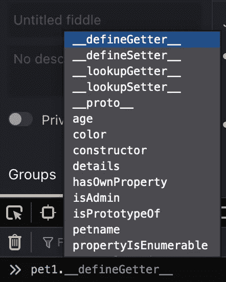
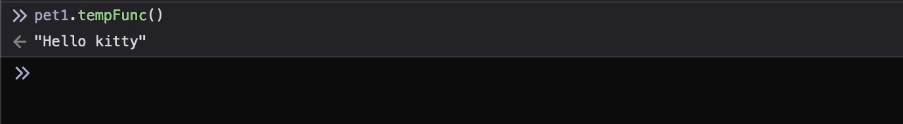

# 了解原型污染的更多信息

> 原文：<https://blog.devgenius.io/learning-more-about-prototype-pollution-8ba42638f22d?source=collection_archive---------3----------------------->


米卡·鲍梅斯特在 [Unsplash](https://unsplash.com?utm_source=medium&utm_medium=referral) 上的照片

# **简介**

现在几乎所有的 web 应用程序都使用 JavaScript，无论是在前端还是后端，尤其是在 NodeJS 和 Express、VueJS 等框架开发之后。

从安全的角度来看，我们在导入可能导致远程代码执行或任何其他漏洞的恶意库、依赖项或有害函数时应该小心。讨论所有这些功能以及如何利用它们，这本身就可以写成一本书，网上也有很多资料。为了这篇博文，我们将讨论一个不太为人知的漏洞，它可以导致权限提升，绕过安全控制，在极端情况下，甚至可以远程执行代码。这种脆弱性被称为原型污染。

# **对象**

JavaScript 是一种基于原型的面向对象编程(OOP)语言。所以 JavaScript 里的一切**都是对象。**但也有例外。以下**六个**的东西不算物体。它们是空、未定义、字符串、数字、布尔和符号。

也就是说，你定义的每个对象都有特定的属性和方法。有些是预定义的，有些是我们为用例创建的。

```
function pet(petname, age, color) {this.age = age;this.petname = petname;this.color = color;}var pet1 = new pet (“magic”, 3,” white”);
```

我为对象 pet1 创建了 3 个属性。分别是**年龄，宠物名，颜色**。所以，我们可以说 pet1 是一个对象，这三个都是它的属性。

# **原型**

如果我输入我的对象的名字 pet1，后面跟一个点作为 **pet1。**在我的控制台(浏览器开发工具)中，会显示各种属性。



原型

```
**For example**,__defineGetter____defineSetter____lookupGetter____lookupSetter____proto__
```

这些是每个对象都有的内置 JavaScript 属性。

这些内置属性被称为原型。这个原型本身就是一个物体，所以这个原型会有自己的原型，使得所谓的 ***原型链*** *。当我们到达一个它自己的原型为 null 的原型时，这个链就结束了。— Mozilla*

如果在对象本身中找不到属性会怎么样？在对象的原型中查找属性。同样，如果在原型中找不到，那么在对象原型的原型中寻找。这种情况一直持续到找到属性或者返回未定义的属性。

要访问特定对象的结构，我们可以通过以下方式来完成:

```
pet.__proto__.__proto__pet1.__proto__.__proto__
```

注意:原型属性可以被添加、修改甚至删除。比如以我们的宠物函数/类为例。如果我们希望添加一个返回“Hello kitty”的函数 **tempFunc** ，可以这样实现:

```
pet.prototype.tempFunc = function() { return “Hello kitty”}
```

正如您所看到的，我们不需要像在其他 OOP 编程语言中那样再次声明 pet 函数。这就是事情开始变得可怕的地方。

既然我们已经将 pet1 声明为 pet 类型的对象，那么通过继承，tempFunc 在默认情况下也将是 pet1 的函数/属性。

**调用 pet1.tempFunc 将返回“Hello kitty”**



被污染的物体

我们也可以修改默认的内置函数。例如，让我们考虑一下 **toString()** 函数。这用于转换提供给类型字符串的值。但是我们可以改变它的行为。

```
For example,pet.prototype.toString = function() { return “I’ve changed the default function”}```Now if you call, pet1.toString(), it would return 
**I’ve changed the default function**
```

# **原型污染**

您声明或实例化的每个对象都属于 Object 类型。这也意味着如果你污染了对象类型(本身),默认情况下每个声明的对象都会被污染。简而言之，这就是原型污染。

我们看到了如何改变一个特定的函数，如果我们改变了原始的函数/类(pet ),那么该类型的任何实例化的对象都将被修改(pet1)。

但是如果我们改变对象类型本身，默认情况下每个对象都会改变。

举个例子，

```
Object.prototype.sayHello= function(){ return “hello!”} 
```

如果我们调用， **pet1.sayHello()** ，尽管我们没有在 pet 或 pet1 上定义任何这类函数，我们仍然会得到一个输出" **hello** ！"。**这是因为我们修改了原始对象类型。**

*让我们借助一个例子来理解恶意。这个例子摘自*[*Synk*](https://snyk.io/)*。*

考虑一个域 api.startup.io。它们是:

1.  api.startup.io/users/:UserID
2.  api.startup.io/users/:UserID/role

UserID 是用户在网站上注册时提供给每个用户的唯一用户 ID。第一个端点接受一个 POST 请求，该请求包含一个名为 about 的字段。在该字段中，用户可以输入最能描述他的任何内容。

第二个端点是/role。在这里，用户可以打印他的用户角色。默认情况下，提供的用户角色是来宾角色。

让我们在 curl 请求的帮助下看看这些是如何工作的。用户是 1337，它接受内容类型的 JSON。

```
curl -H **"Content-Type: application/json"** -X **POST** -d '{"about": "Database sanitization expert"}' [https://api.startup.io/users/1337](https://api.startup.io/users/1337)
```

生成的输出是:

```
**{name: “Robert”, surname: “Tables”, about: “Database sanitization expert”}**
```

如果该 API 没有针对攻击进行适当的保护，用户可能会提升他的权限。

获取用户角色。

```
curl -X **GET** [https://api.startup.io/users/1337/role](https://api.startup.io/users/1337/role)**{“role”: “user”}**
```

现在我们知道了属性的名称，我们可以沿着对象层次结构向上爬，并更改用户角色，前提是没有设置适当的安全控制。

```
curl -H "Content-Type: application/json" -X POST -d '{"about": {"__proto__": {"role": "admin"}}}' [https://api.startup.io/users/1337](https://api.startup.io/users/1337)
```

**注意** : *正如我们之前讨论过的，我们可以使用 Object_name 沿着对象层次向上爬。****_ _ proto _ _****，Object_name。****_ _ proto _ _****。****_ _ proto _ _***

*现在，如果我们向 https://api.startup.io/users/1337/role 的[](https://api.startup.io/users/1337/role)****发出 GET 请求，我们将得到 admin 作为响应。*****

# *****结论*****

***在这篇博文中，我们讨论了为什么 JS 是一种 OOP 语言，原型如何被修改和利用，以及什么是原型污染。***

***这只是如何利用它的一个方面。原型污染还会导致对远程代码执行的 DoS 攻击。***

***在 CVE-2019–7609([基巴纳](https://research.securitum.com/prototype-pollution-rce-kibana-cve-2019-7609/))可以找到一个这样的例子原型对 RCE 的污染。***

***旧版本的 Lodash 也容易受到原型污染。***