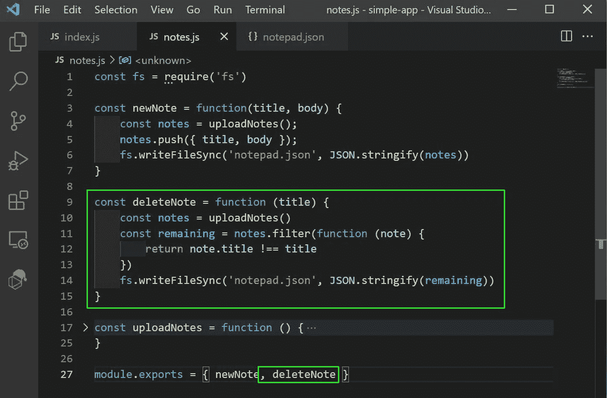
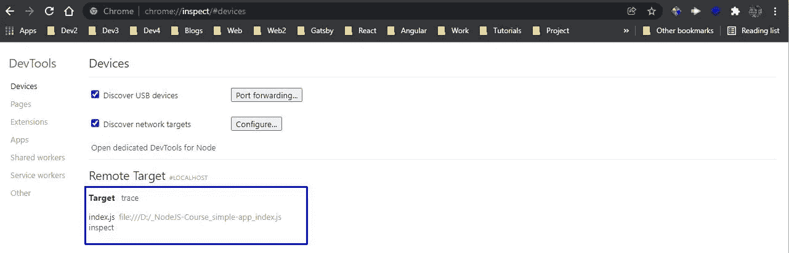

# 通过创建 Notes 应用程序学习节点

> 原文：<https://blog.devgenius.io/learning-nodejs-by-creating-a-notes-app-9eafc4223306?source=collection_archive---------6----------------------->


照片由[i̇smail·埃尼斯·艾汉](https://unsplash.com/@ismailenesayhan?utm_source=unsplash&utm_medium=referral&utm_content=creditCopyText)在 [Unsplash](https://unsplash.com/s/photos/server?utm_source=unsplash&utm_medium=referral&utm_content=creditCopyText) 上拍摄

我们将从本系列的开头开始学习 NodeJS，并直接进入编码部分。什么和为什么使用 NodeJS 我们很多人都知道，并在这里跳过这些细节。

你可以在我的 YouTube 频道上找到这个视频。

我们将首先了解 Node.js 模块系统。首先，创建一个文件夹 **simple-app** ，用 VS 代码打开。在其中创建一个文件 **server.js** ，并在其中添加以下内容。

这里，我们首先导入内置的 fs 模块，然后使用它和 writeFileSync()创建一个 notepad.txt 文件，并在其中添加给定的文本。


server.js

现在，我们将使用 **node server.js** 命令从终端运行该文件


node server.js

它将在我们的内容所在的目录下创建一个 **notepad.txt** 文件。


notepad.txt

但是如果我们在 **server.js** 文件中使用如下所示的更新值运行相同的命令，它将替换 notepad.txt 文件中的内容。


server.js

现在，如果我们想要将数据追加到一个文件中，并且不更新现有的数据，我们使用 appendFileSync()方法。


server.js

现在，在运行 **node server.js** 后，我们将获得 notepad.txt 中添加的更新内容。


node server.js

接下来，我们将学习在另一个文件中使用一个文件的细节。创建一个 **app.js** 文件，并将以下内容添加到其中。

这里，我们导入 server.js 文件并在 writeAndappend 变量中使用它。接下来，我们调用 writeAndappend()。


app.js

现在，我们将更新 or **server.js** 文件以拥有一个函数 writeAndappend()，该函数调用 writeFileSync 和 appendFileSync 函数。我们也出口它。


server.js

接下来，从命令行运行 app.js，我们将获得控制台输出。


安慰

我们还将在 **notepad.txt** 文件中添加适当的文本。


notepad.txt

现在，我们在节点应用程序中使用了许多第三方 npm 包。为了使用这些包，我们需要 package.json 文件。为此，请使用以下命令。

```
npm init -y
```

它将采用所有默认值并创建一个 **package.json** 文件。


package.json

现在，我们将添加第一个包 validator，它用于验证字符串。我们必须用下面的命令安装它，在这个命令中我们也提到了版本。

```
npm i validator@10
```

现在，在我们的应用程序中，我们可以看到一个 node_modules 文件夹被创建，validator 的依赖项被添加到 **package.json** 文件中。


package.json

我们现在可以在我们的 **app.js** 文件中使用它。这里，我们首先导入验证器，然后使用验证器方法 isEmail，检查传递的字符串是否是电子邮件。


app.js

现在，当我们从命令行运行**节点 app.js** 时，我们将看到第一个命令为 true，第二个命令为 false。


node app.js

接下来，我们将在项目中添加一个非常流行的 nodemon 包。这个包持续地运行一个过程，这个过程检查我们项目中的任何变化，并且它自动地得到反映。因此，通过下面的命令添加它。

```
npm i nodemon
```

另外，更新 **package.json** 文件来更改启动命令。


package.json

现在，在终端中运行命令 **npm start** ，它将检查 app.js 文件中的任何更改。


npm 开始

现在，如果我们想通过终端从用户那里获得价值。我们通过 process.argv 函数得到它。在 **app.js** 文件中添加下面一行。


app.js

现在，在从终端运行 **node app.js Nabendu** 时，我们得到一个数组，其中第三项是 Nabendu。


node app.js Nabendu

现在，我们将创建一个小笔记应用程序，因此创建一个新文件 **index.js** 并在其中添加以下内容。在这里，我们检查数组的第二项，并在其中显示不同的控制台。


索引. js

现在，如果我们使用 new 或 delete 作为第二个参数运行 **index.js** 文件，我们将得到相应的输出。


索引. js

现在，我们将更新我们的 **index.js** 文件，以获取标题和主体参数。现在，它们将成为第三和第四个项目。我们还在 notes.js 文件中一个名为 newNote()的新函数中传递这两个函数的数据。


索引. js

现在，创建一个新文件 **notes.js** 并在其中添加以下内容。我们只是从这里接收标题和正文，并在控制台登录。


notes.js

现在，当我们运行带有参数的 node index.js 命令时，我们将获得适当的控制台日志。


节点索引. js

现在，我们将在 **notes.js** 中添加功能，在 notepad.json 文件中添加标题和正文。

这里，我们从 newNote function 调用一个函数 uploadNotes()。在 uploadNotes 函数中，我们首先读取一个文件 notepad.json，然后转换成一个字符串并返回它。如果文件不可用，则返回一个空数组。

回到 newNote，我们在 notes 数组中添加了标题和正文。之后，我们使用 writeFileSync()写入 notepad.json，并在 stringifying 后传递 object 的数组。


notes.js

现在，从命令行运行带有两个不同标题和正文的 **node index.js** 命令。


节点索引. js

现在，一个新的 **notepad.json** 文件将被创建，我们的两个对象在一个数组中。


notepad.json

现在，我们将通过从命令行传递标题来添加删除注释的功能。

在 **index.js** 中添加代码以获取第三个参数，然后调用函数 deleteNote。


索引. js

现在，在 **notes.js** 文件中我们将添加 deleteNote 函数。这个函数只是过滤出匹配的标题并写回 notepad.json 文件。



notes.js

现在，从终端给出下面的命令，并提到要删除的标题。


节点索引. js

现在，在 **notepad.json** 中标题将被移除。


notepad.json

现在，我们将添加简单的功能来列出所有笔记标题。这里，在 **index.js** 中，我们将首先创建一个新的命令列表。之后我们将调用一个函数 allNotes()。


索引. js

接下来，在我们的 **notes.js** 文件中，我们将创建 allNotes 函数。在这里，我们得到的是 notes 中的数组。在那之后，我们通过笔记和控制台日志记录每个标题。注意，我们在这里使用了箭头函数，这是完全有效的。


notes.js

现在，在终端中如果我们给出命令 **node index.js list** ，我们将得到所有笔记的标题。


node index.js 列表

最后，我们将创建查找注释的逻辑，如果找到了注释，就显示它的内容。所以，在 **index.js** 中添加一个新的 else if 语句。


索引. js

现在，我们将在 **notes.js** 文件中编写 findNote 函数。这样做的逻辑也很简单，我们只是从标题中找到注释并显示它。


notes.js

现在，从命令行我们可以找到一个有标题或没有标题的注释。


发现注释

我们现在将学习在代码中添加调试器，并使用 chrome 中可用的调试工具。首先在您想要调试 **notes.js** 文件中代码的地方添加调试器。


notes.js

然后运行节点命令，但在其中添加了**检查**。


检查

接下来，在 chrome 浏览器中打开 **chrome://inspec** t，调试我们的节点应用。如果一切正常，你会看到目标。点击**检查**链接。



检查

这将打开开发工具，你需要点击**+添加文件夹到工作区**按钮。


添加文件夹

现在，我们需要选择包含我们的应用程序的文件夹。它还会要求我们允许，我们会这样做。


添加文件夹

现在，我们将看到调试器已经暂停，可以单击 Run 按钮。


奔跑

在运行时，我们将在调试器点看到各种格式的数据，也可以在控制台看到它。打开该控制台的一个快捷方式是按 **Esc** 键。


数据

再次按下 run 按钮，我们将退出调试器并打印控制台日志。


安慰

我们可以通过运行命令 restart 从控制台再次启动调试器，并且可以通过按 Ctrl+C 两次来退出调试器。


调试器

这就完成了我们的带有 Node.js 的小 notes 应用程序，在其中我们还学习了调试。相同的代码在[这个](https://github.com/nabendu82/note-app-nodejs) github repo 中。