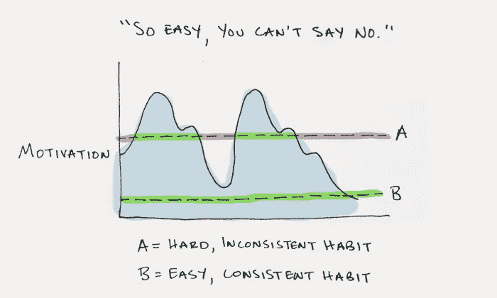

# 学习学习如何编程

> 原文：<https://blog.devgenius.io/learning-to-learn-how-to-program-d138c2caf7cf?source=collection_archive---------39----------------------->

马库斯·斯皮斯克在 [Unsplash](https://unsplash.com?utm_source=medium&utm_medium=referral) 上的照片

开始学习一门新语言可能会很困难，但如果你遵循以下五个步骤，这是有可能的

1.  **保持一致**

为了保持一致性，试着一次只专注于一个目标，并使它可以实现。与其看五堂课的代码，甚至整个课程，不如试着每天看一部分，确保你完全理解了材料。试着每天都这样做。就我个人而言，我曾经一天花几个小时培养一个习惯，第二天我却没有朝这个目标前进……加班加点，我没有进步，我想知道为什么。从那以后，我意识到与其把所有事情都塞到一天里，不如在更长的时间里保持一致，这将有助于你成功。这就引出了下一个话题……睡眠。

詹姆斯清晰，一致性图表

**2。睡一觉吧**

睡眠对我来说是最重要的成功领域之一。我确保 8 小时的睡眠，以便在第二天精力充沛地工作。我计划我的睡眠时间表，以便我醒来时有足够的时间锻炼和祈祷。这样，在我到达电脑前，我在身体上和精神上都很满足，让我一整天都保持清醒的头脑。但更重要的是，我发现睡眠是学习新材料最有效的方式。以至于如果我在睡觉前看讲座，我的大脑整晚都在处理它，早上我就理解了，即使我前一天晚上没有理解！

**3。确定自己的学习风格**

起初，我被课程中的大量材料淹没了，事情没有进展。当长时间盯着电脑屏幕时，我的眼睛很疼，我无法再关注文本，这是如此可怕的痛苦。我一直在责备自己…肯定有一部分的我需要更好地专注于阅读，但是让我们把它留到以后吧。我知道我现在能做的就是找到其他的学习方法。我意识到课堂上的讲座很吸引人，对我来说是一个很好的学习方式——讲座复习了所有的课程项目材料，这是一个很大的好处。然而，这些讲座有时太深奥了，我跟不上。所以我需要找到解决办法。我喜欢看讲座——但有时节奏是要面对的。啊哈，知道我需要做什么了。重新观看张贴的讲座(即使开始这个过程可能会很痛苦),并跟着它们一起编码！到目前为止，这对于我作为学生在熨斗的成功非常有益。有时我甚至会跟着现场讲座一起编码。编码真的帮助我处理信息。

**休息一下**

我在熨斗学校取得成功的最重要因素之一，也提到了我也参加了 UX 课程，因为我需要在一天中有一个大的休息时间，那就是午餐时间。在这个休息时间，我非常紧张地练习钢琴，学习新的歌曲、音阶和信息，以提高我作为音乐家的技能。我相信这是我与其他学生不同的独特之处，其他学生可能没有能力增加他们的工作量。然而，对我来说，改变方式并把你的大脑完全集中在不同的活动上的能力会让你感觉神清气爽，并让你的大脑为编码而运动。所以我强烈推荐它，即使它不是一种工具，即使你没有在编码的同时发展新的第二技能，也不要只是休息一下，坐在沙发上。保持你的大脑运转，保持你的思维。摄影可以解决问题…或许做些运动？当你成为一名程序员时，任何可以让你不去想编码的事情都会帮助你长寿。

**最后，保持乐观**

有很多理由不积极。当前的事态。事实上，在“繁荣”的经济中，我们仍然是学生。以及学习编程的挣扎。但是你需要记住未来的愿景。对自己和自己能成为什么样的人有一个积极的想法。确保那个想法是你每天头脑中最清晰的东西，睡觉前说出来。让它驱动你。如果你把你的志向记在心里，你就永远不会气馁。此外，重要的是要注意，除了你自己，不要和任何人讨论你的抱负，尽管你可能会削弱内在的力量，这可能会令人兴奋。保持你的梦想，尽情发挥你的创造力，享受奋斗的每一分钟，因为所有的痛苦都伴随着巨大的责任。改变我们周围的文化和我们体验世界的方式的责任。

希望这篇博客里的东西能帮助你快乐地度过每一天！

谢谢，安迪