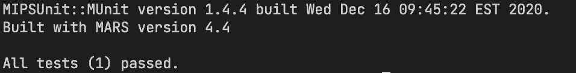
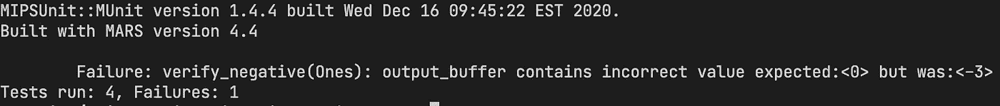
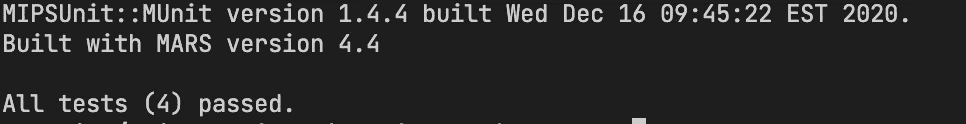

# 学习测试 MIPS 中的缓冲器

> 原文：<https://blog.devgenius.io/learning-to-test-buffers-in-mips-a43f10393f86?source=collection_archive---------12----------------------->

有时你的 MIPS 程序会将缓冲区作为输入，但是我们如何利用 MUnit 来测试这些功能呢？

[](https://github.com/daminals/Unit_Testing_with_MUnit)

查看该项目的 GitHub！

# 介绍

在上一篇文章中，我向您展示了如何开始用 MUnit 测试 MIPS 代码。如果你还没看过，看看[这里](https://medium.com/dev-genius/introduction-to-unit-testing-in-munit-4ce7e24ff3f4)！

在本文中，我将向您展示如何测试接受缓冲区的函数，以及如何在单元测试中使用缓冲区。没有别的告别了，让我们开始吧！

# 问题说明

我们需要一个函数，它接收正数的缓冲区，接受正数的恭维，并将它们存储到输出缓冲区。$v0 将存储有多少数字被写入缓冲区。如果 input_buffer 内部的任何数字是负数，那么将输出缓冲区中的所有内容都设置为 0，$v0 将包含-1。

## 约束条件:

我们的输出缓冲区包含 20 个字，我们的输入缓冲区永远不会超过 20 个数字

正如你所看到的，这是一个相当复杂的函数，需要几个测试用例。现在，我将向您展示一个包含一个 bug 的解决方案。

```
.data
buffer:
  .word 1
  .word 2
  .word 3 4 5 6 7 8 9 0

output_buffer:
  .word 0 0 0 0 0 0 0 0 0 0 0 0 0 0 0 0 0 0 0

.text

la $a0, buffer
la $a1, output_buffer

# while testing our code, everything before this function 
# (.data, defining a0,a1) will be ignored

.globl onescompl
onescompl:
  # inputs: a0=input_buffer, a1=output_buffer
  # Save the null-terminated buffer to the stack
  addi $sp, $sp, -8
  sw $s1, 0($sp)
  sw $a1, 4($sp)
  li $v0, 0

  # Iterate over the buffer
  loop:
  lw $s1, 0($a0)

  # If we have reached the end of the buffer, exit the loop
  beqz $s1, end

  # if number not positive, wipe output buffer
  bltz $s1, wipe_buffer

  # Convert the number to one's compliment form
  neg $s1, $s1
  # note that MIPS stores numbers in twos compliment form already, 
  # so we will need to subtract one to go from 1's to 2's
  addi $s1, $s1, -1

  # Save the number to the output_buffer
  sw $s1, 0($a1)
  addi $v0,$v0,1

  # next element in output_buffer
  addi $a1, $a1, 4 

  # Move to the next element in the buffer
  addi $a0, $a0, 4
  j loop

  # wipe output buffer
  wipe_buffer:
    lw $a1, 4($sp)
    # 20 numbers * 4 bytes per word
    li $s1, 80
    li $v0, -1
    wipe_buffer_loop:
      beqz $s1, end
      addi $s1, $s1, -4
      sw $0, 0($a1)
      addi $a1,$a1,4

  # end program
  end:
    lw $s1, 0($sp)
    addi $sp, $sp, 8
    jr $ra
```

那么让我们跳到本文的重点。我们如何为这个函数编写单元测试并找出错误呢？

# 单元测试

首先，让我们确定我们需要测试的案例

*   数字 1-20 的缓冲区
*   包含一个负数的缓冲区

虽然只有两种情况，但是在这些情况中有几件事我们必须测试。

例如，在案例 1 中，我们必须确保$v0=输入缓冲区中的数字量，并且一个人的称赞形式是正确的。

对于第二种情况，我们必须测试 output_buffer 包含所有的 0，并且$v0 包含-1。

因此，让我们使用前一篇文章中的模板，并向其中添加我们的新测试用例。

```
 @Test
  public void verify_positive() {
    Label input_buffer = wordData(1,2,3,4,5,6,7,8,9,10, 0); // null terminated = 0 at end
    Label output_buffer = wordData(0,0,0,0,0, // 20 num buffer
                                   0,0,0,0,0,
                                   0,0,0,0,0,
                                   0,0,0,0,0); 

    run("onescompl", input_buffer,output_buffer);
    Assert.assertEquals("$v0 contains incorrect count",10, get(v0)); // 10 nums written
    for (int i=0;i<10;i++) {
      Assert.assertEquals("output_buffer contains incorrect value",
                            -1*(i+2), getWord(output_buffer,i*4)); 
    }
  }
```

好吧，让我们来解释一下这是怎么回事。首先，我们使用从 MUnit 导入的函数来进行测试。这包括 Label 对象，它表示单元测试中的一个. data 部分，以及 wordData 函数，它允许我们以$a0 和$a1 的形式输入缓冲区

*这与在中定义缓冲区的效果相同。数据和运行 la $a0，缓冲区*

之后，我们运行我们的函数，验证 v0 包含一个正确的计数(这个测试是 10)。然后我们验证两人的恭维形式是正确的。在我的循环示例中，我们应该测试 1–10，但是循环从 0–9 开始(因为它用于跟踪地址位置)。这意味着我们应该采取(i+1)的赞美形式，它等于-1*(i+2)。

让我们进行测试！



测试用例通过！

成功！我们通过了第一个测试案例。为了确保这不是侥幸，我将再写 2 个测试用例 1。把这当作你自己的一个练习，试着写一个测试用例。

这是我想到的:

```
@Test
  public void verify_positive_1() {
    Label input_buffer = wordData(2,3,4,5,6,7,8,9,10,11, 0); // null terminated = 0 at end
    Label output_buffer = wordData(0,0,0,0,0, // 20 num buffer
                                   0,0,0,0,0,
                                   0,0,0,0,0,
                                   0,0,0,0,0); 

    run("onescompl", input_buffer,output_buffer);
    Assert.assertEquals("$v0 contains incorrect count",10, get(v0)); // 10 nums written
    for (int i=0;i<10;i++) {
      Assert.assertEquals("output_buffer contains incorrect value",
            -1*(i+3), getWord(output_buffer,i*4)); 
    }
  }

  @Test
  public void verify_positive_2() {
    Label input_buffer = wordData(47,99, 0); // null terminated = 0 at end
    Label output_buffer = wordData(0,0,0,0,0, // 20 num buffer
                                   0,0,0,0,0,
                                   0,0,0,0,0,
                                   0,0,0,0,0); 

    run("onescompl", input_buffer,output_buffer);
    Assert.assertEquals("$v0 contains incorrect count",2, get(v0)); // 2 nums written
    Assert.assertEquals("output_buffer contains incorrect value", -48, getWord(output_buffer,0)); 
    Assert.assertEquals("output_buffer contains incorrect value", -100, getWord(output_buffer,4)); 
  }
```

您可以根据需要编写尽可能多的代码来验证您的代码是否正常工作。替代测试用例的一些好主意是将非常大的数字和非常小的数字放在同一个输入缓冲区中，以验证它们被正确存储。

好吧，让我们开始第二种情况。对于这个测试用例，我的想法是将我们编写的第一个测试用例添加到输入缓冲区中。我们试试吧！

```
 @Test
  public void verify_negative() {
    Label input_buffer = wordData(1,2,3,4,5,6,7,8,9,10,-1, 0); // null terminated = 0 at end
    Label output_buffer = wordData(0,0,0,0,0, // 20 num buffer
                                   0,0,0,0,0,
                                   0,0,0,0,0,
                                   0,0,0,0,0); 

    run("onescompl", input_buffer,output_buffer);
    Assert.assertEquals("$v0 contains incorrect count",-1, get(v0)); 
    for (int i=0;i<20;i++) {
      Assert.assertEquals("output_buffer contains incorrect value",
            0, getWord(output_buffer,i*4)); 
    }
  }
```

在这里，我们最大的变化是在断言。缓冲区加-1 后，我们知道$v0 应该是-1，输出缓冲区应该全零。

运行它的时间:



验证否定测试用例失败

嗯，看来我们的函数在清除缓冲区时失败了。让我们来看看这段代码:

```
 # ....................
  # wipe output buffer
  wipe_buffer:
    lw $a1, 4($sp)
    # 20 numbers * 4 bytes per word
    li $s1, 80
    li $v0, -1
    wipe_buffer_loop:
      beqz $s1, end
      addi $s1, $s1, -4
      sw $0, 0($a1)
      addi $a1,$a1,4
       # ................
```

嗯，经过进一步的调查，我想我找到了问题所在。我们不会循环回 wipe_buffer_loop。难怪我们的输出缓冲区没有被清空。让我们添加行`j wipe_buffer_loop`并再次测试我们的代码。



所有测试用例都通过了

太棒了。我们的代码现在按预期运行。

# 结论

这篇文章的目标是帮助您提高在 MUnit 和在 MIPS 中用缓冲区测试代码方面的知识。这绝对是一个令人困惑的话题，当我第一次开始寻找合适的资源来编写这些测试用例时，我很挣扎。

如果你想了解如何编写 MUnit 测试用例，请点击这里查看我的文章:

[](/introduction-to-unit-testing-in-munit-4ce7e24ff3f4) [## MUnit 中的单元测试介绍

### 低级代码不一定是未经测试的代码

blog.devgenius.io](/introduction-to-unit-testing-in-munit-4ce7e24ff3f4) 

您也可以查看这个项目的 github 页面，其中有 MUnit 的其他例子！你可以在这里找到它的链接:

[](https://github.com/daminals/Unit_Testing_with_MUnit) [## GitHub-da minals/Unit _ Testing _ with _ MUnit

### 学习使用基于 JUnit 的单元测试框架 MUnit

github.com](https://github.com/daminals/Unit_Testing_with_MUnit)