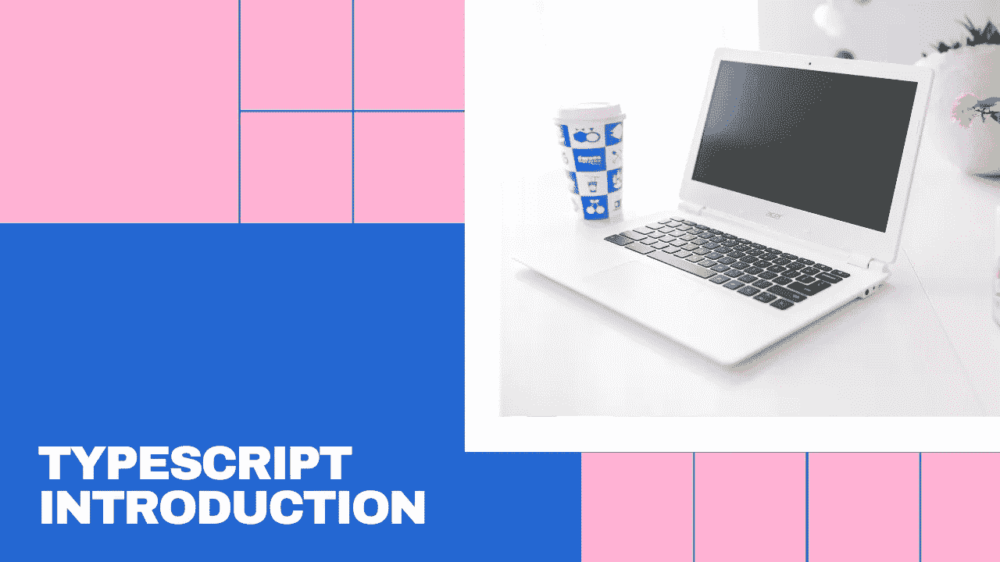
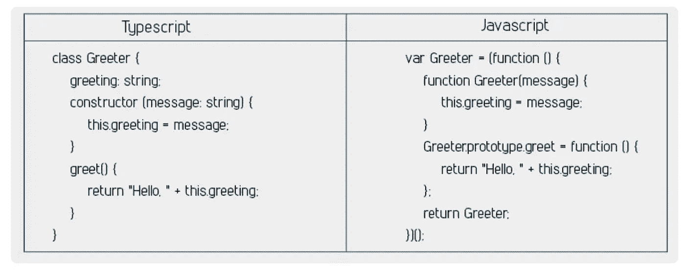
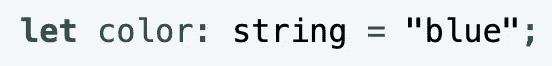
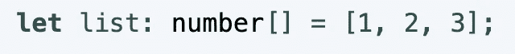
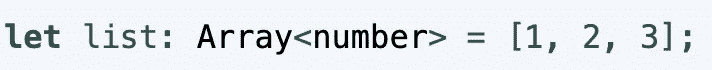
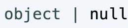
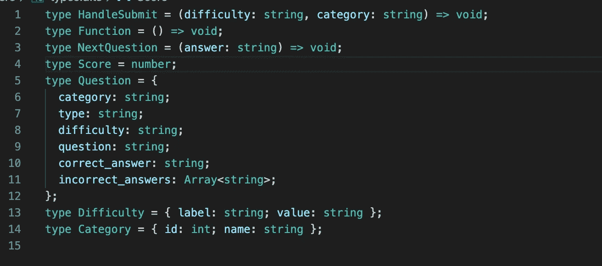
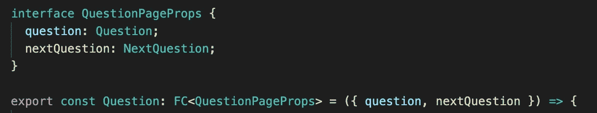

# 一天之内学会打字

> 原文：<https://blog.devgenius.io/learning-typescript-in-a-day-dbadf47e600c?source=collection_archive---------12----------------------->

6 月 4 日星期四，我开始了学习打字稿的任务。我花了一个上午的时间阅读了一个[惊人的 Typescript 资源](https://basarat.gitbook.io/typescript/)，然后是下午和晚上的构建程序。

# 什么是 Typescript？

Typescript 是 Javascript 的超集，也就是说 Typescript 是 Javascript 的扩展。Typescript 允许动态类型语言 Javascript 向程序添加强类型声明性结构，这意味着您必须指定诸如 const 是字符串之类的内容，它还允许 Typescript 中的类。当您运行一个类型脚本文件时，它会编译成 Javascript。

[https://www . dune book . com/typescript-vs-JavaScript-why-typescript-is-next-to-big-thing/](https://www.dunebook.com/typescript-vs-javascript-why-typescript-is-next-to-big-thing/)

# 为什么打字稿？

我遇到的使用 typescript 的两个主要原因是，由于 Typescript 中引入了类，您现在可以在 Javascript 中进行 oop(您可以在普通 JS 中进行 oop，但这要困难得多),并且由于 Typescript 中的声明性类型特性，阅读和预测代码要容易得多。

以下是 [DZone](https://dzone.com/articles/what-is-typescript-and-why-use-it) 的其他特性和优势列表:

**为什么要用 TypeScript？**

*   TypeScript 简化了 JavaScript 代码，使其更易于阅读和调试。
*   TypeScript 是开源的。
*   TypeScript 为 JavaScript IDEs 和实践提供了高效的开发工具，比如静态检查。
*   TypeScript 使代码更容易阅读和理解。
*   有了 TypeScript，我们可以对普通的 JavaScript 进行巨大的改进。
*   TypeScript 为我们提供了 ES6 (ECMAScript 6)的所有优点，以及更高的生产率。
*   通过对代码进行类型检查，TypeScript 可以帮助我们避免开发人员在编写 JavaScript 时经常遇到的令人痛苦的错误。
*   强大的类型系统，包括泛型。
*   TypeScript 只不过是带有一些附加特性的 JavaScript。
*   结构性的，而不是名义上的。
*   TypeScript 代码可以按照 ES5 和 ES6 标准编译，以支持最新的浏览器。
*   为了兼容性，与 ECMAScript 保持一致。
*   以 JavaScript 开始和结束。
*   支持静态类型。
*   TypeScript 将节省开发人员的时间。
*   TypeScript 是 ES3、ES5 和 ES6 的超集。

**TypeScript 的附加特性**

*   带可选参数的函数。
*   带 REST 参数的函数。
*   泛型支持。
*   模块支持。

# 类型脚本类型

Typescript 的基本类型有**整型**、**字符串**、**布尔型**、**数组**等。但也有一些其他类型，我从来没有听说过，也许你也没有喜欢**从来**和**枚举**。 **Any** 也是一个类型，这基本上允许类型是任何东西。我强烈建议通读这个关于 typescript 中[基本类型的文档。](https://www.typescriptlang.org/docs/handbook/basic-types.html#type-assertions)

指定类型的方式如下:

当你得到更复杂的类型，比如数组，有两种不同的方法。这两个例子都指定了相同的东西。

您也可以使用或符号来指定它可以是两种不同的类型。这是指定类型可以是对象或 null。

最后，查看我在上面建议的文档中关于[断言的部分。](https://www.typescriptlang.org/docs/handbook/basic-types.html#assertions)

# 文件结构

对于 typescript，据我所知，你有三种不同类型的文件。你的。ts 文件是通常的类型脚本文件。tsx 文件是您插入 JSX 的文件，主要用于 React typescript 文件，最后是. d.ts 文件，这是您的全局文件，这是您保存自定义类型等内容的地方，这些内容可以在整个程序中使用。

查看我的类型文件，我写了一个测验程序，作为自定义类型的例子。

如果你使用 react。tsx 文件，您应该只在演示文件上使用这些，而在其他文件上使用 ts。

您还可以获得用于编译的 tsconfig.json 文件。查看 [tsconfig](https://basarat.gitbook.io/typescript/project/compilation-context/tsconfig) 上的文档，可以很好地了解该文件的内容。

# 接口

根据[导师观点](https://medium.com/u/66386624af96?source=post_page-----dbadf47e600c--------------------------------):

“接口是实体应该遵守的语法契约。换句话说，接口定义了任何实体都必须遵守的语法。

接口定义属性、方法和事件，它们是接口的成员。接口只包含成员的声明。定义成员是派生类的责任。它通常有助于提供派生类将遵循的标准结构。"

在我写的程序中，我肯定没有 100%利用接口。因为我使用接口来声明传递给组件的道具类型。我当然想学习更多关于接口的知识，但是到目前为止，这就是我使用接口的方式。

注意，当在多个地方使用 Question 和 NextQuestion 类型时，它们是如何在类型文件中声明的。你也可以查看由[马特·弗德勒](https://medium.com/u/cd2698088b19?source=post_page-----dbadf47e600c--------------------------------)撰写的[构建 React 组件](https://www.pluralsight.com/guides/typescript-building-react-components)中的解释，以获得对 FC 和其他 React 组件类型的良好解释。

使用这些不同的概念和一个简短的待办事项 youtube 教程【https://www.youtube.com/watch?v=ODvirqIC09A ，我能够使用 typescript 从零开始构建一个测验应用程序，这是我真正感到自豪的。所有这些研究，还有我在一天之内完成的两个程序，除了造型。所以，如果你想学点什么，学习基础知识真的不需要很长时间。我将会做更多的打字稿博客和程序，特别是 oop 博客和一个更高级的打字稿博客。

这是我用 typescript 写的前两个程序:

[https://Amy-Franz-quizapp . netlify . app](https://amy-franz-quizapp.netlify.app/)

[https://Amy-Franz-todolist . net lify . app](https://amy-franz-todolist.netlify.app/)