# LeetCode 100:相同的树(带图像的解决方案)

> 原文：<https://blog.devgenius.io/leetcode-100-same-tree-solution-with-images-b35f78487fda?source=collection_archive---------5----------------------->

链接:→【https://leetcode.com/problems/same-tree/ 

# 问题:→

给定两个二叉树`p`和`q`的根，写一个函数检查它们是否相同。

如果两个二叉树在结构上相同，并且节点具有相同的值，则认为它们是相同的。

**例 1:**

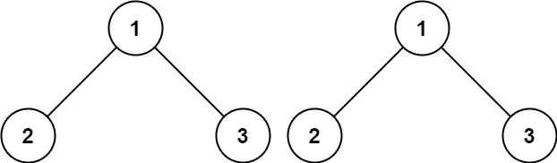

```
**Input:** p = [1,2,3], q = [1,2,3]
**Output:** true
```

**例 2:**

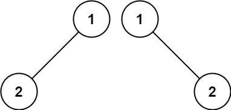

```
**Input:** p = [1,2], q = [1,null,2]
**Output:** false
```

**例 3:**

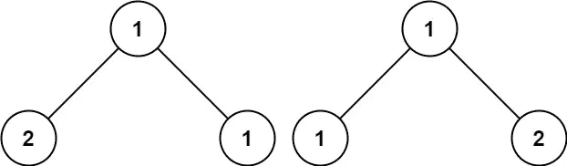

```
**Input:** p = [1,2,1], q = [1,1,2]
**Output:** false
```

**约束:**

*   两棵树中的节点数量都在`[0, 100]`范围内。
*   `-104 <= Node.val <= 104`

# 解决方案:→

这里，我们将比较一棵树的每个节点的值与另一棵树的节点的值。

如下图所示，

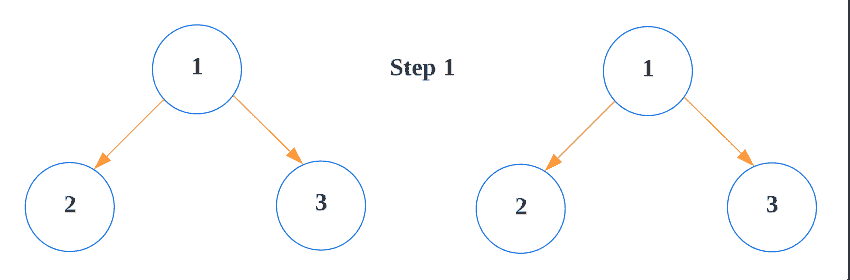

这里，通过使用 **while 循环**，我们将遍历一棵树的所有节点，并将它的值与另一棵树的值进行比较，

首先，我们将把两棵树的根节点添加到堆栈中。

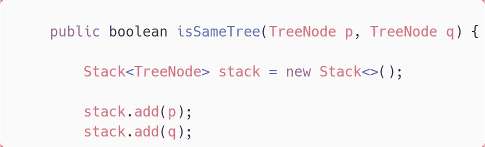

所以，结果会是，

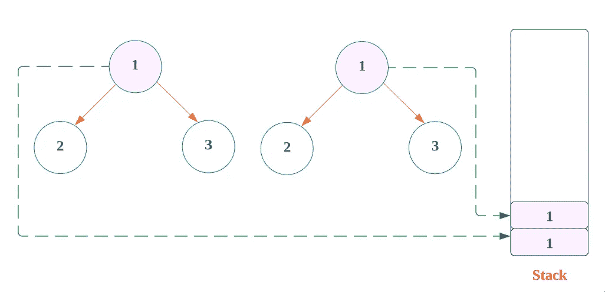

现在，我们将使用 while 循环遍历所有剩余的节点并比较其值，

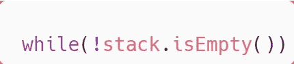

1.  从堆栈中，我们将取出前两个节点，并比较这两个节点的值。

这里，没有条件满足，因为两个值都匹配。

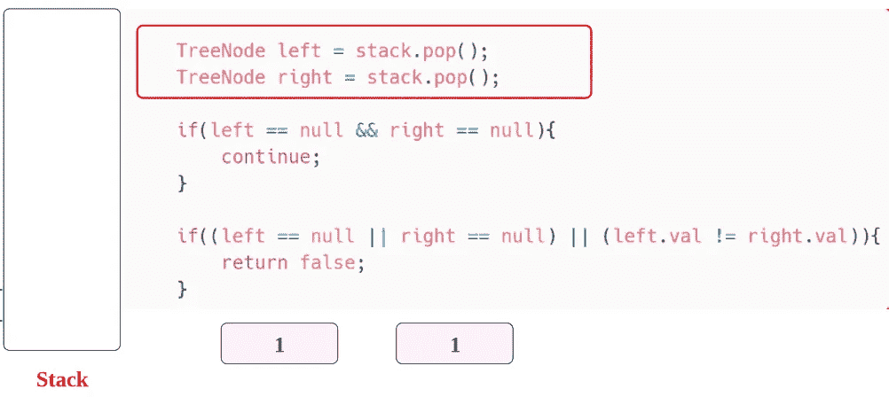

2.我们将转到**下一个节点**，并将这些**节点添加到堆栈**。

左侧节点，

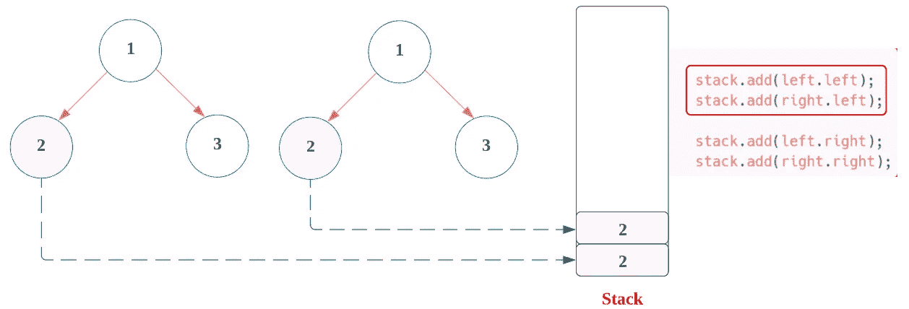

右节点，

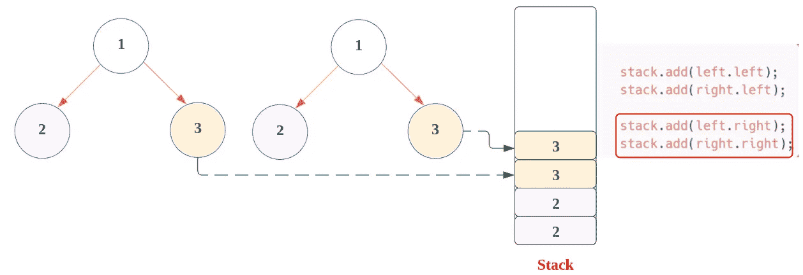

现在，**在循环**的第二次迭代时，我们将遵循**的步骤 1。**

这里也不满足任何条件，因为**两个节点的值都匹配**。

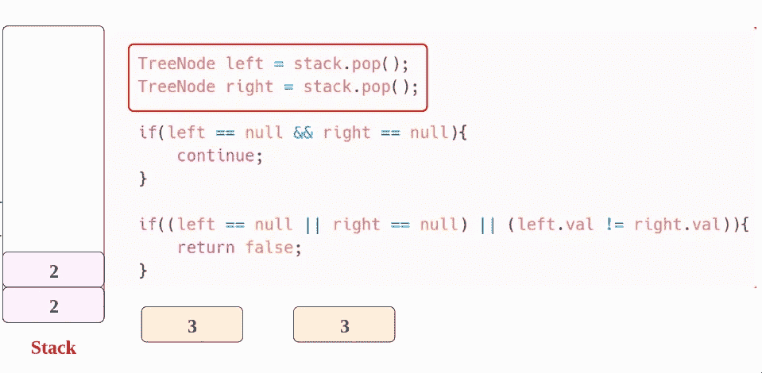

如**步骤 2，**可以看到**左侧**、**右侧**、**左侧**和**右侧**上没有**节点**，所以所有的**空节点**都会被**追加**到堆栈中。

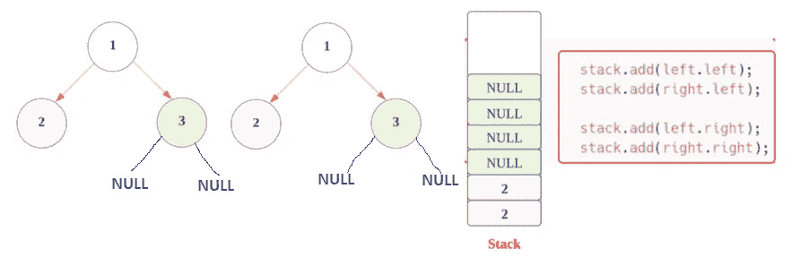

现在，**在循环**的第三次迭代时，我们将遵循**步骤 1。**

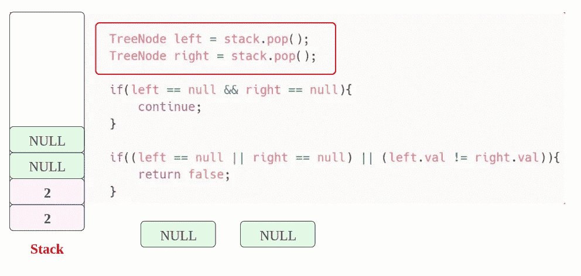

这里，**两个节点都是空的**，

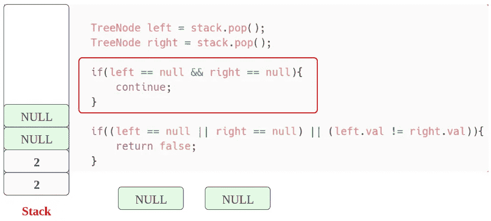

我们将跳过并继续**下一次迭代**。

现在，**在循环**的第四次迭代时，我们将遵循**步骤 1。**

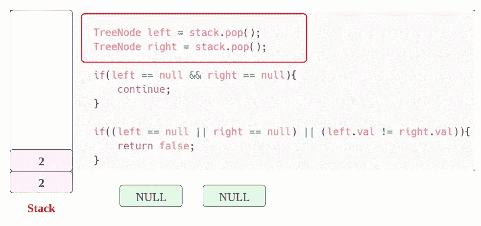

这里，同样**两个节点都是空的**，

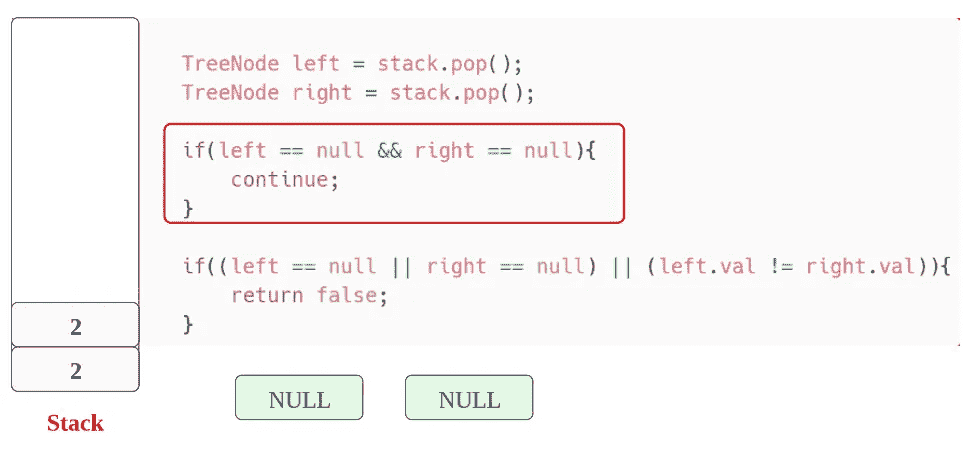

我们将跳过并继续**下一次迭代**。

现在， **while 循环**的第五次迭代，我们将遵循**步骤 1。**

这里也不满足任何条件，因为两个**节点的值都与**匹配。

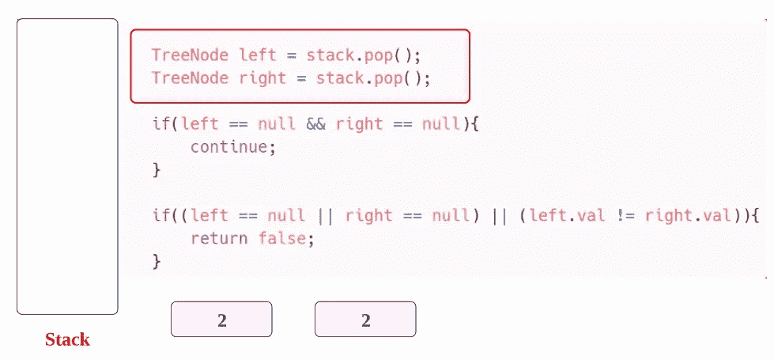

在**步骤 2，**可以看到**左**、**右**、**左**和**右**上没有**节点**，所以所有的**空节点**都会被**追加**到堆栈中。

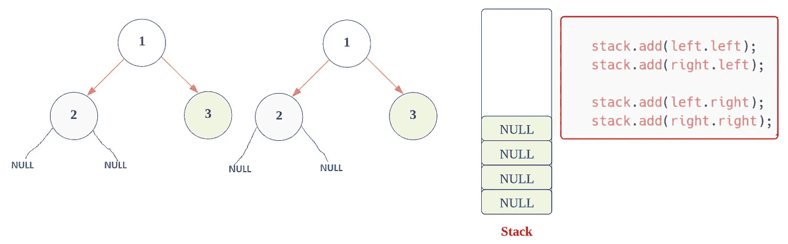

现在，**在循环**的第六次迭代时，我们将遵循**步骤 1。**

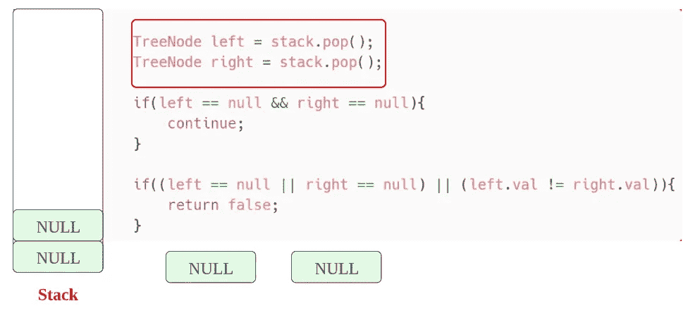

但是，**两个节点都是空的**，

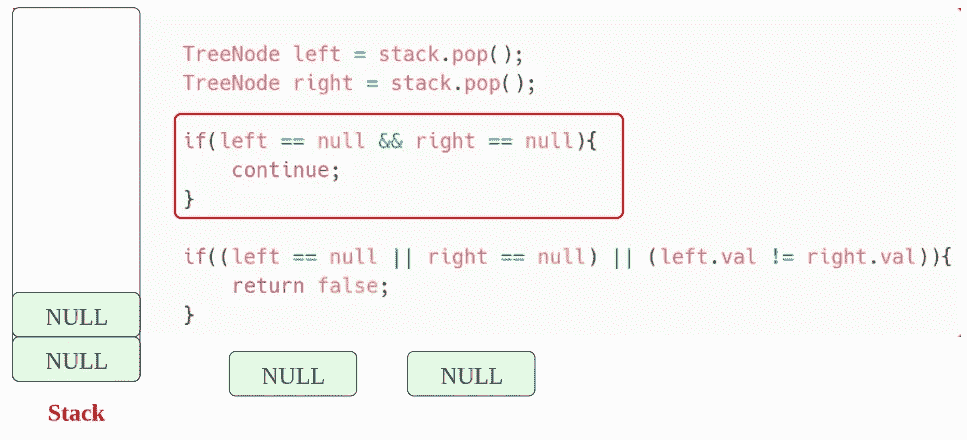

我们将跳过并继续**下一次迭代**。

现在，**在循环**的第七次迭代时，我们将遵循**的步骤 1。**


但是，在这里，**两个节点都是空的**，

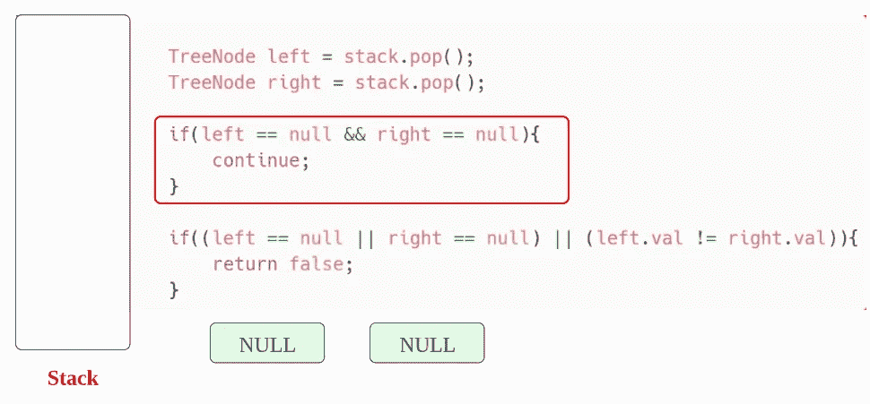

我们将跳过并继续**下一次迭代**。

现在， **while 循环**的第八次迭代，而这里， **while 循环的条件不满足，**作为**栈**为**空**。


现在，在 while 循环结束时，我们可以确定所有的**值都是相同的**，否则，它已经返回了 **false** 。

现在，让我们看看完整的源代码。

# 代码(Java): →

# 代码(Java)递归方式:→

# 代码(Python): →

# 代码(Python)递归方式:→

# 时间复杂度

这里，我们遍历树的所有节点一次，所以总时间复杂度是 **O(n)** 。

# 空间复杂性

既然我们使用了一个额外的堆栈，那么，空间复杂度将是 O(n)***。***

感谢你阅读这篇文章，❤

如果我做错了什么？让我在评论中。我很想进步。

拍手声👏如果这篇文章对你有帮助。