# LeetCode 101:对称树(图像解决方案)

> 原文：<https://blog.devgenius.io/leetcode-101-symmetric-tree-87383ec51401?source=collection_archive---------2----------------------->

链接:→[https://leetcode.com/problems/symmetric-tree/](https://leetcode.com/problems/symmetric-tree/)

# 问题:→

给定一棵二叉树的`root`，*检查它是否是自身的镜像*(即围绕其中心对称)。

**例 1:**


```
**Input:** root = [1,2,2,3,4,4,3]
**Output:** true
```

**例 2:**


```
**Input:** root = [1,2,2,null,3,null,3]
**Output:** false
```

**约束:**

*   树中的节点数量在范围`[1, 1000]`内。
*   `-100 <= Node.val <= 100`

**跟进:**你能递归和迭代地解决它吗？

# 解决方案:→

这里，我们需要双向求解，**递归**以及**迭代**。

我们将树分成两部分，检查右边部分是否是左边部分的镜像？。

下图显示了我们如何比较每个节点的值。

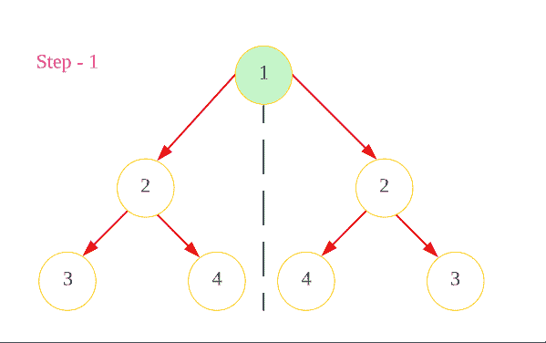

首先，我们将检查**根节点**，如果它是 **null** 那么我们不需要遍历任何东西，我们可以简单地返回 **true** 。

假设我们有下面这棵树，

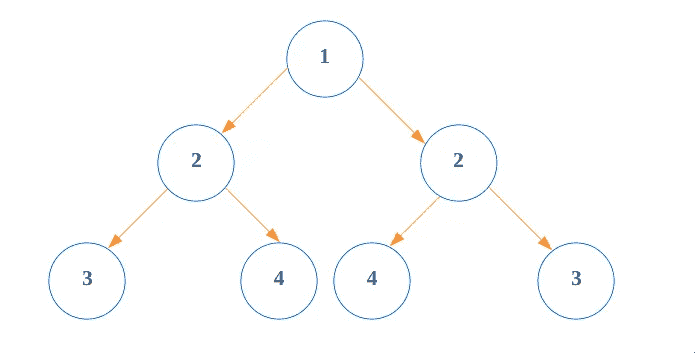

假设，这棵树被分成两部分(左部和右部)

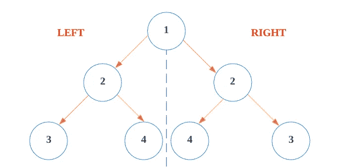

我们需要检查**右侧部分**是否是**左侧部分**的**镜像**或者相反。

因此，我们将**比较**，每个**左侧节点的值**与**右侧节点的值**，首先我们将**取一个堆栈**并尝试将这些**值**相加，首先从**左侧**开始，第二个从**右侧**开始。

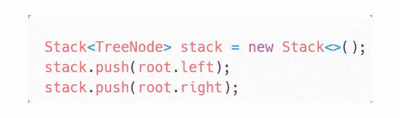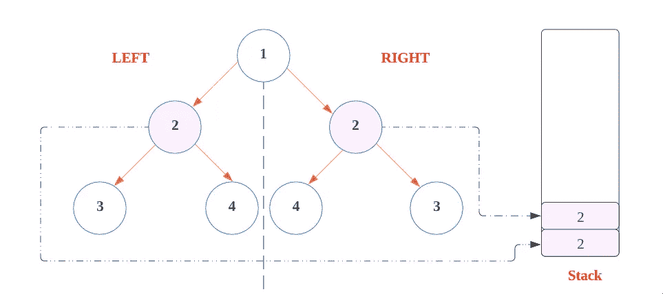

现在，在 **while 循环**中，我们将遍历直到**堆栈不为空**。

在 while 循环中，首先我们将从堆栈中取出前两个值，

1.  检查一下，如果**和**都是空的，那就意味着我们在那一边是树的末端，所以简单地我们将移动到**另一个节点。**
2.  如果任一侧的**为空**而另一侧的**不为空**、**或**则两侧的**值不相同**，这意味着**镜侧不相同**，所以我们将返回**假**。


3.如果上述**两个条件都不满足**，则意味着两侧的**值相同**，因此，我们需要检查**的其他值**，为此我们将转到**的下一个节点**的左侧和**的右侧**。

→ **左侧的左节点**值**比较**和**右侧的右节点** **值**。

→ **左侧的右节点**值**比较**和**右侧的左节点** **值**。

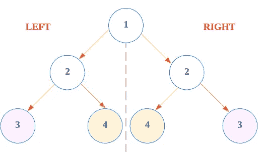

为了实现这一目标，我们首先添加

**左侧的左节点**和**右侧的右节点**然后

**左侧的右节点**和**右侧的左节点**

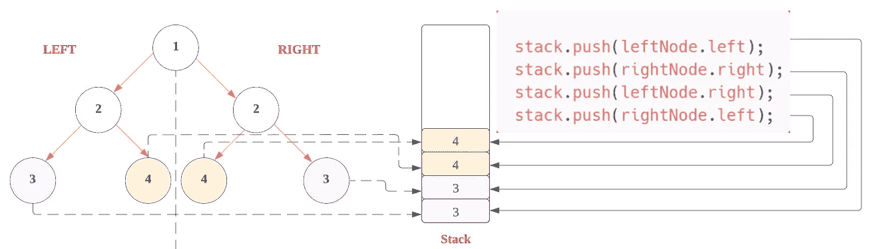

现在，在下一个 while 循环的**迭代**中，我们将移动到**步骤 2。**

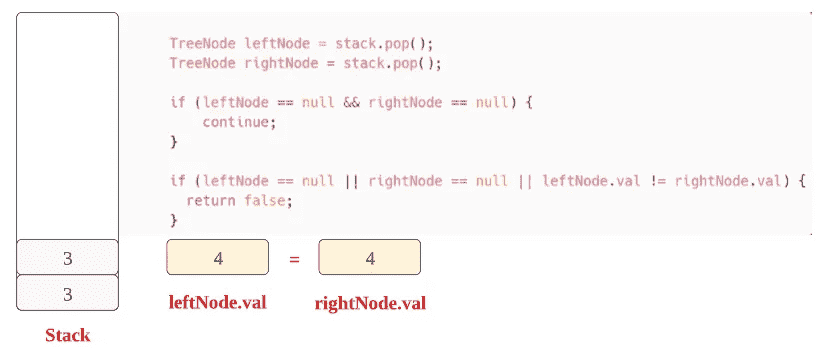

现在，与步骤 3 相同，**两个条件都不满足**，这意味着**值在两侧都相同**，因此，我们需要检查**的其他值**，为此我们将转到**下一个节点**的左侧和**右侧**。

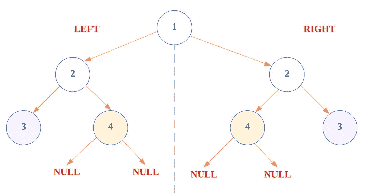

现在，在堆栈中，我们将添加:

**左侧的左节点**和**右侧的右节点**然后之后

**左侧的右节点**和**右侧的左节点**

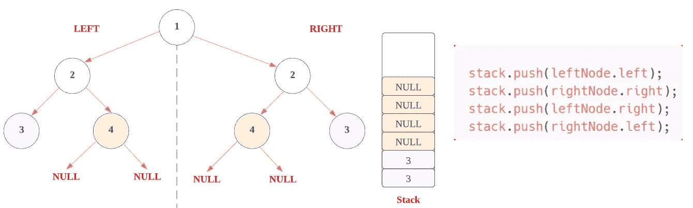

现在，在下一个 while 循环的**迭代**中，我们将移动到**步骤 2。**

这里，因为**两者都是空的**，我们移动到**下一次迭代**。

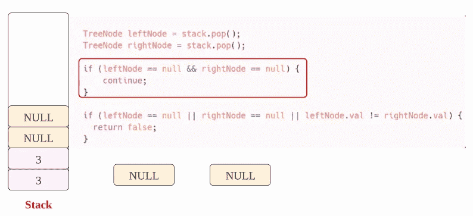

现在，同样像**上一个**，**都是空的**，我们移动到**下一次迭代**

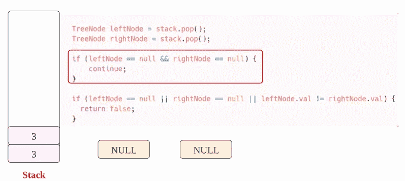

在下一次迭代中，我们从堆栈**中找到了**非空值**。**

这里两个值相同，所以条件不满足。

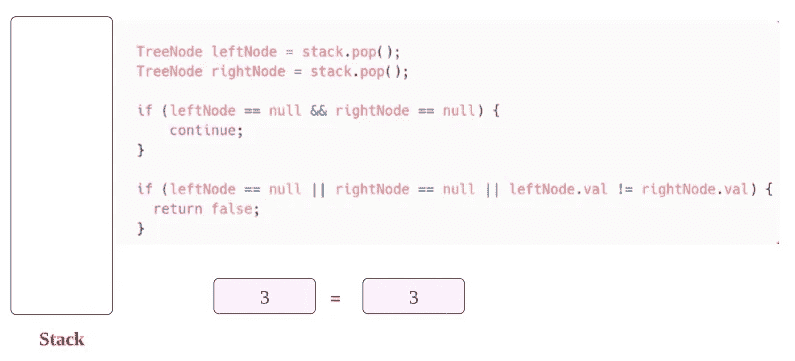

所以，我们正在移动到**的下一个节点**，但是我们发现全部为空。

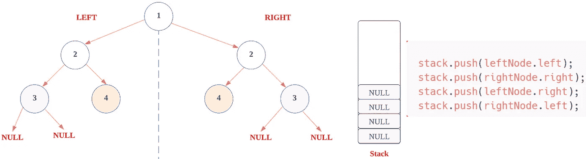

现在，在下一个 while 循环的**迭代**中，

在这里，由于**和**都是空的，我们转移到**的下一次迭代**。

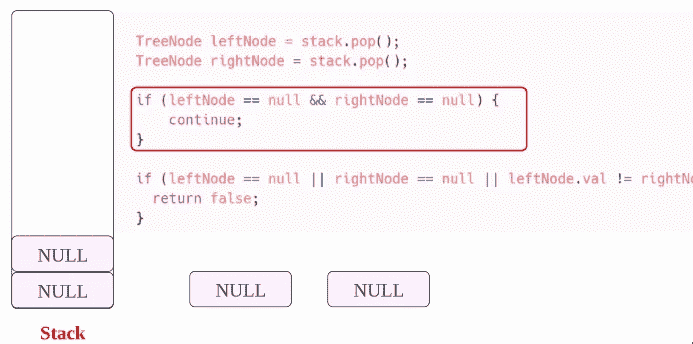

现在，在下一个 while 循环的**迭代**中，

在这里，由于**和**都是空的，我们转移到**的下一次迭代**。

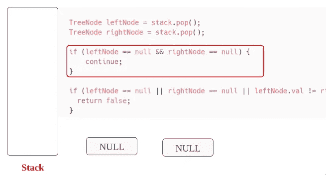

在这里，随着**栈变空**。因此**而**条件变为**假**。

代码结束时，我们简单地返回 **true** ，因为**的所有值都是相同的**。

如果我们发现任何**不同的值**，那么它将返回 **false** 。

现在，让我们看看**迭代**的完整源代码。

# 代码(Java): →

# 代码(Python): →

# 时间复杂度

在这里，我们遍历树的所有节点一次，所以总时间复杂度是 **O(n)** 。

# 空间复杂性

由于我们使用了一个额外的堆栈，所以，空间复杂度将是 O(n) 。

# 递归代码(Java): →

# 递归代码(Python): →

# 时间复杂度

这里，我们遍历树的所有节点一次，所以总时间复杂度是 **O(n)** 。

# 空间复杂性

同样在递归调用中，栈是托管的，栈的大小是基于输入的大小( **n)** ，所以空间复杂度会是 ***O(n)*** 。

感谢你阅读这篇文章，❤

如果我做错了什么？让我在评论中。我很想进步。

拍手声👏如果这篇文章对你有帮助。