# LeetCode 104:二叉树的最大深度(带图片的解决方案)

> 原文：<https://blog.devgenius.io/leetcode-104-maximum-depth-of-binary-tree-solution-with-images-6c43c03af382?source=collection_archive---------5----------------------->

# 问题:→

给定二叉树的`root`，返回*其最大深度*。

二叉树的**最大深度**是从根节点到最远叶节点的最长路径上的节点数。

**例 1:**

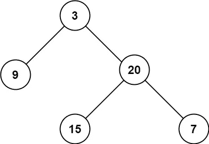

```
**Input:** root = [3,9,20,null,null,15,7]
**Output:** 3
```

**例 2:**

```
**Input:** root = [1,null,2]
**Output:** 2
```

**约束:**

*   树中的节点数量在范围`[0, 104]`内。
*   `-100 <= Node.val <= 100`

# 解决方案:→

一般来说，我们可以通过以下方式检查深度。

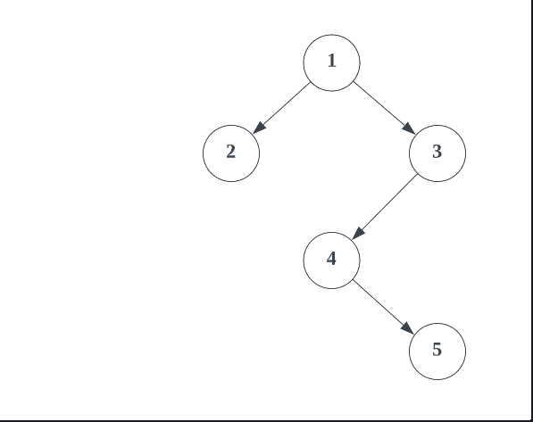

现在，让我们用代码来理解，

首先，我们将检查，如果根节点为空，那么我们不需要做任何树的遍历，我们可以简单地返回 **0** 。

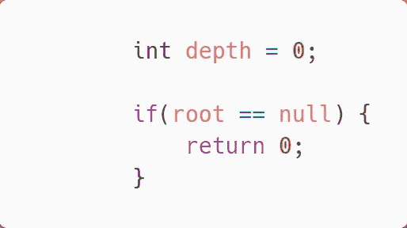

之后，如果**根**为**不为空**，那么我们将把这个添加到**队列中。**

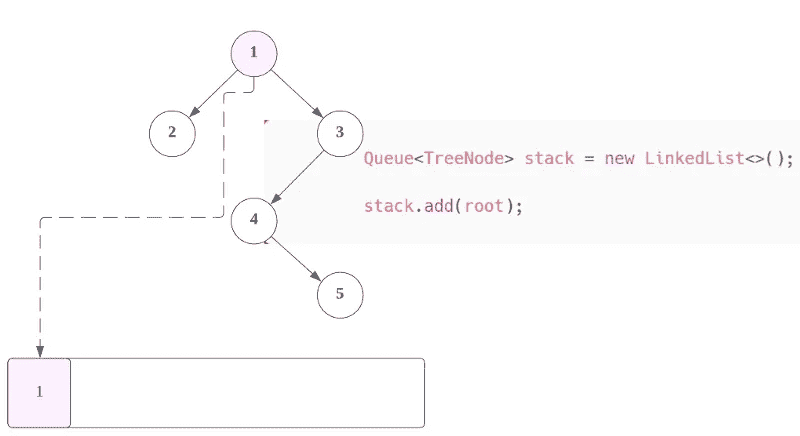

现在，**将遍历**整棵树，验证下一个节点的**左右节点**。

首先，我们将找出**堆栈大小**(这将帮助我们找出一次迭代中的节点数)，在这里，我们得到 **1** 。

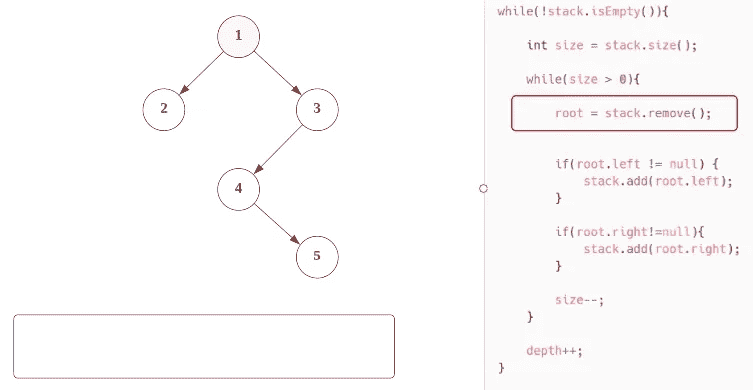

首先，**左节点**，如果是**非空**，那么我们将**加入队列**。

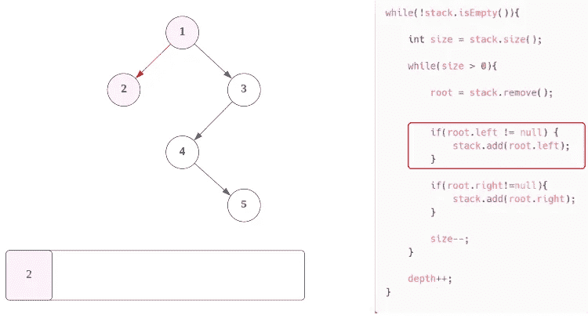

现在，**右节点**，如果是**非空**，那么我们也将**加入队列**。

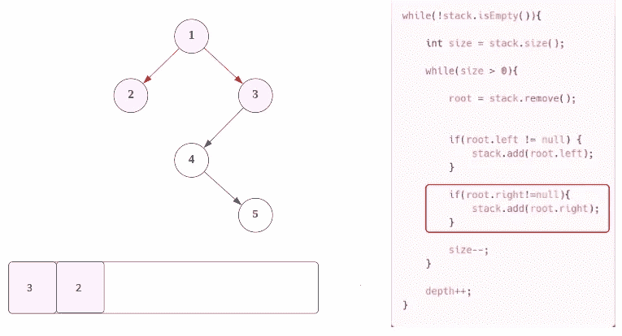

现在，尺寸将变成 **0** ，但是这里**深度**将**增加**1。

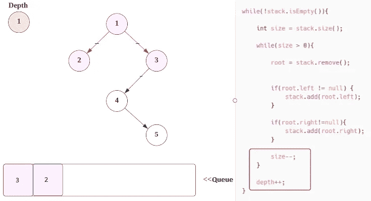

对于**第二次迭代**，我们将首先获得**队列的总大小。**

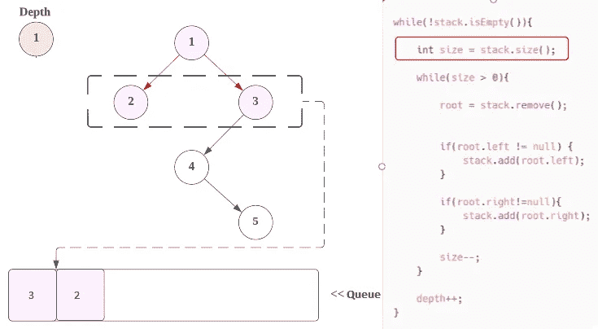

现在，我们将**从**队列**中移除节点**即 **2** ，并检查其是否为**左节点**和**右节点**。

但是对于 **2 节点的**来说**左节点**和**右节点**都是 **NULL，**所以我们不会添加到堆栈中。

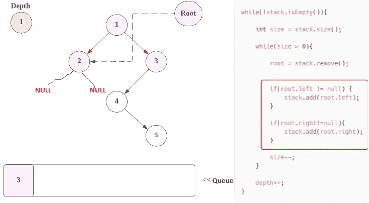

现在，我们将转移到另一个迭代，我们将从**队列**中取出节点

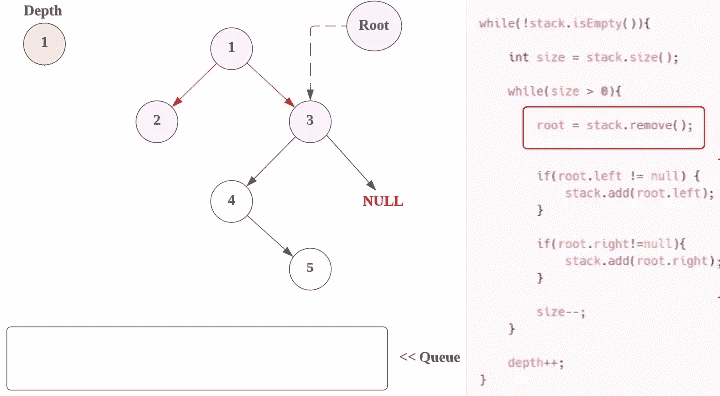

接下来，我们将检查它的**左**和**右节点**，这里**左**是 **4** 而**右**是**空**

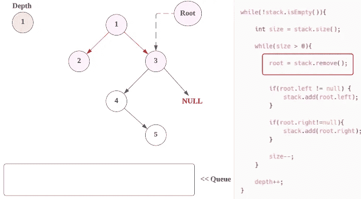

这里对于，**根节点 3** ，只有**左节点**为**非空**，所以我们再补充一下。

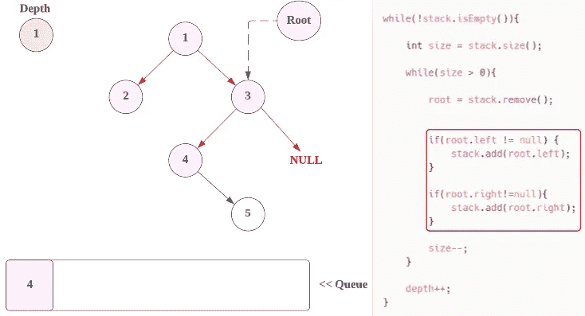

现在，迭代结束，我们将**增加深度的大小**

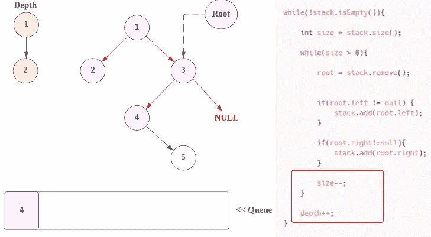

下一次迭代，我们将从队列中取值。

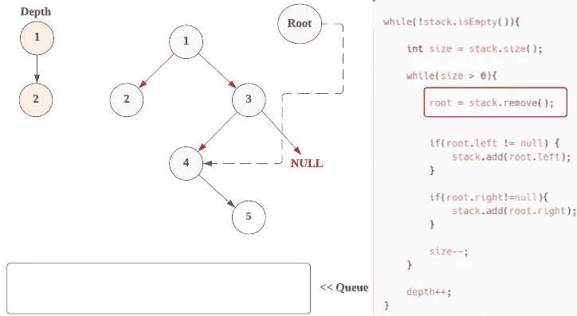

现在，**根节点**将是 **4** ，我们将检查它的**左**和**右节点**。

这里**左节点**为**空**，所以我们不加，但是**右节点**为 **5** ，所以我们加到**队列**。

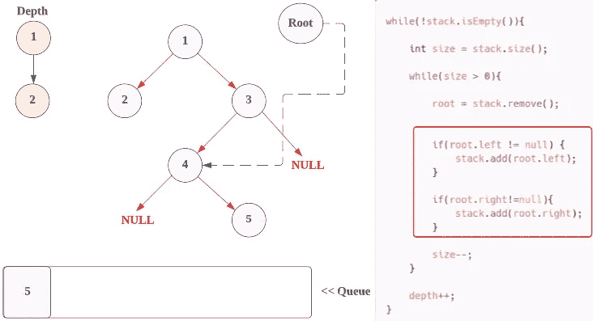

现在，迭代结束，我们将**增加深度的大小。**

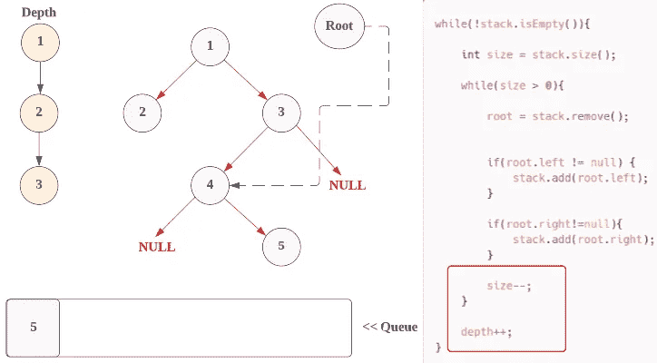

下一次迭代，我们将从**队列**中取值。

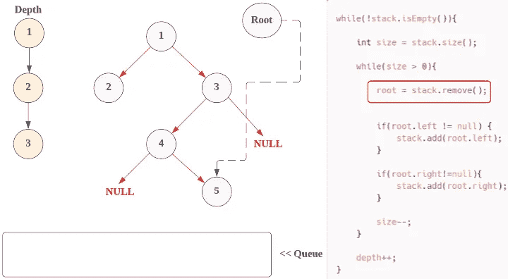

现在，我们将**从**队列**中移除 **2** 的节点**，并检查它是**左节点**和**右节点**。

但是对于 5 个**节点的**，左**节点**和右**节点**都是 **NULL，**所以我们不会添加到堆栈中。

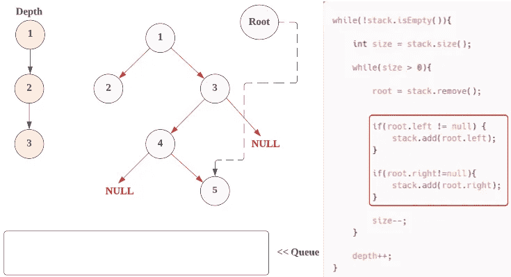

现在，迭代结束，我们将**增加深度的大小。**

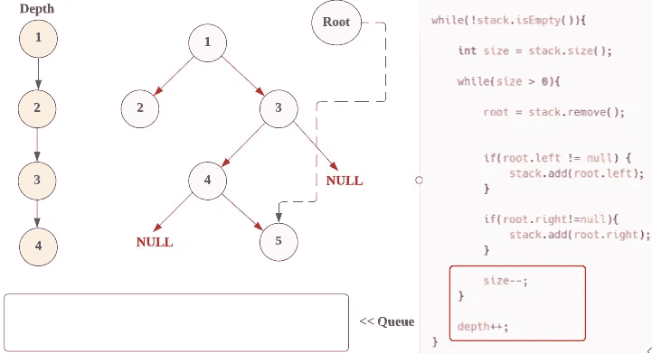

现在，**队列**变为**空**因此**外 while 循环的** **条件**也将变为**假**。

函数结束，我们简单的返回**深度**，这将是我们的**答案**。

现在，让我们看看完整的源代码。

# 代码(Java): →

# 代码(Python): →

# 时间复杂度

这里，我们遍历两次，所以总时间复杂度是 **O(n )** 。

# 空间复杂性

既然我们使用了一个额外的队列，那么，空间复杂度将是 O(n)***。***

如果您想以其他方式(递归方式)检查解决方案，则[点击此处。](https://medium.com/@alexmurphyas8/leetcode-104-maximum-depth-of-binary-tree-using-recursive-way-solution-with-images-91c427de9c6c)

感谢你阅读这篇文章，❤

如果这篇文章对你有帮助，请鼓掌👏这篇文章。

请在[媒体](https://medium.com/@alexmurphyas8)上关注我，我会像上面一样发布有用的信息。

insta gram→[https://www.instagram.com/alexmurphyas8/](https://www.instagram.com/alexmurphyas8/)

推特→[https://twitter.com/AlexMurphyas8](https://twitter.com/AlexMurphyas8)

如果我做错了什么？让我在评论中。我很想进步。