# LeetCode 104:使用递归方式的二叉树的最大深度(带图像的解决方案)

> 原文：<https://blog.devgenius.io/leetcode-104-maximum-depth-of-binary-tree-using-recursive-way-solution-with-images-91c427de9c6c?source=collection_archive---------14----------------------->

# 问题:→

给定二叉树的`root`，返回*其最大深度*。

二叉树的**最大深度**是从根节点到最远叶节点的最长路径上的节点数。

**例 1:**

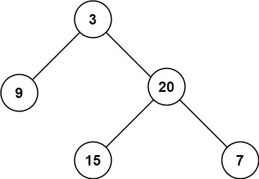

```
**Input:** root = [3,9,20,null,null,15,7]
**Output:** 3
```

**例 2:**

```
**Input:** root = [1,null,2]
**Output:** 2
```

**约束:**

*   树中的节点数量在范围`[0, 104]`内。
*   `-100 <= Node.val <= 100`

# 解决方案:→

一般来说，我们可以通过以下方式检查深度。

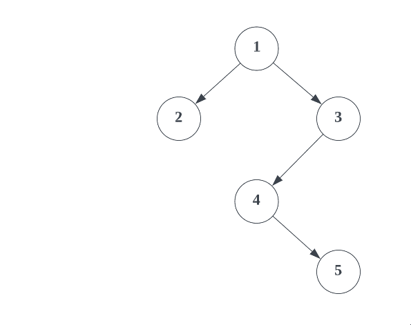

现在，让我们用代码来理解，

首先我们会检查，如果**根节点**为 **null** ，那么我们不需要做任何树的遍历，我们可以简单的返回 **0** 。

这里，节点是**非空**，

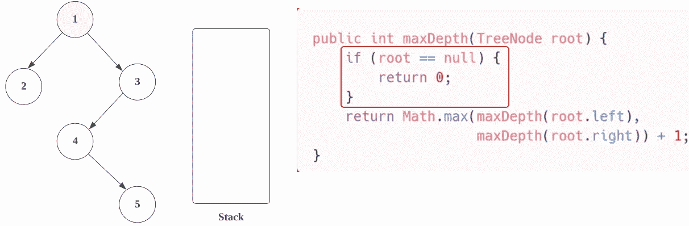

**节点(1)** 将被添加到**堆栈**中，现在我们正在用 **root.left.** 通过 **maxDepth** 进行**递归**调用

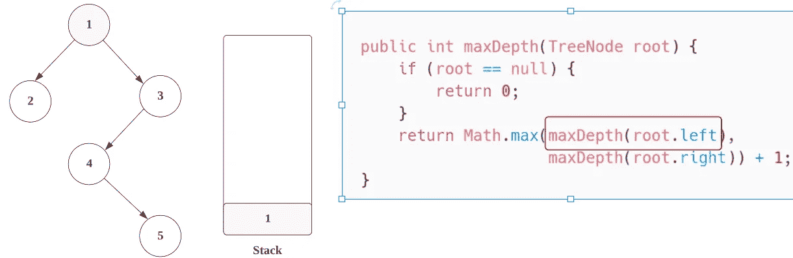

现在，在递归调用中，我们用 **node.left** 调用 **maxDepth** ，我们将检查**根节点**是否为 **null** 或**不是**。

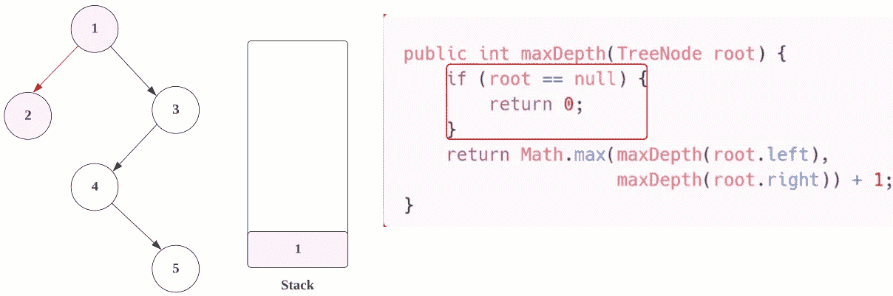

节点(2)不为空。

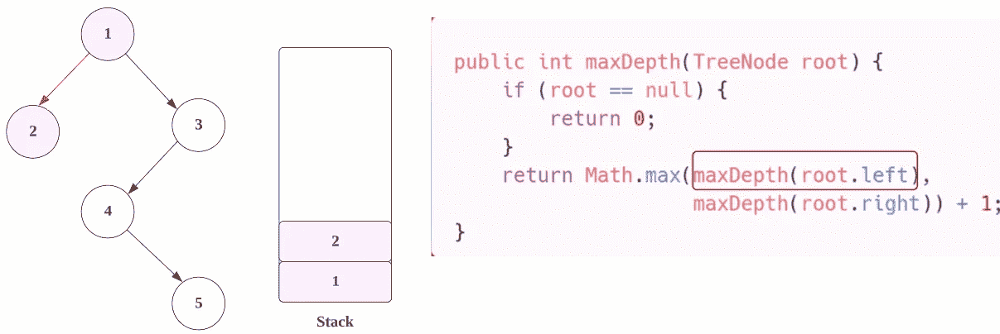

现在，在递归调用中，我们用 **root.left** 调用 **maxDepth** ，我们将检查**根节点**是否为空**或**不是**。**

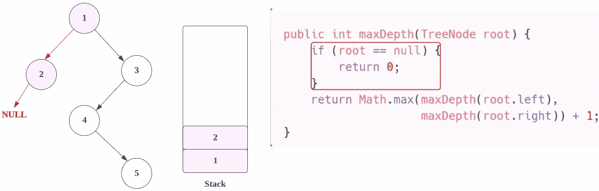

在这里，我们发现**为空**，所以我们将返回 **0** ，这里**逆向过程**将被启动，我们将从**堆栈**中取出**最后一个节点**(也就是 **2** )并用 root.right 调用 **maxDepth。**

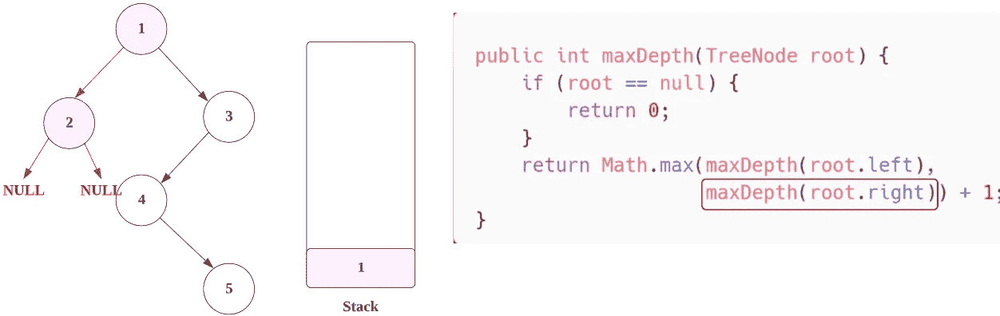

同样，节点**为空**，因此返回 **0** 。

这里，**节点 2 的**左**右**和**都为空，所以都返回 0，**

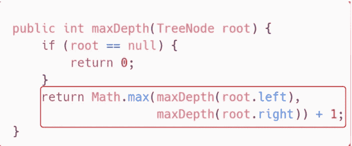

> 所以，**节点(2)****=>****math . max(0，0) + 1 = > 0 + 1 = > 1** 。

与上述过程相同，将会重复，我们将从**堆栈**中取出**最后一个节点**(也就是 **1** )并用 **root.right.** 调用 **maxDepth**

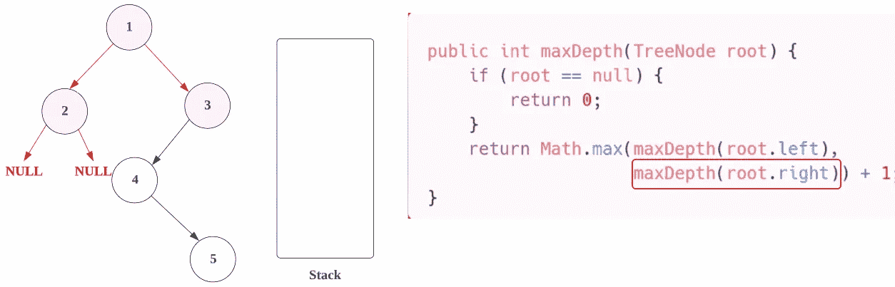

现在， **3** 的根节点**不为空**，因此，它将被添加到**堆栈中。**

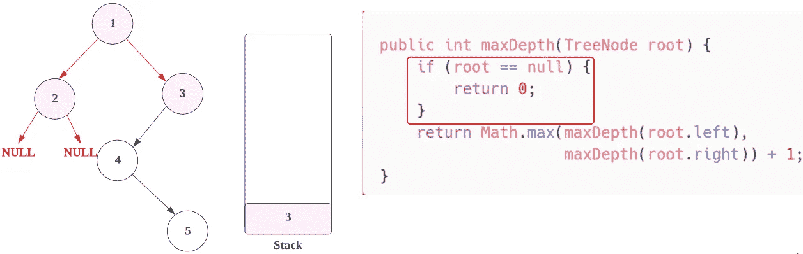

现在**递归**调用 **maxDepth** 与 **root.left** 将被调用。

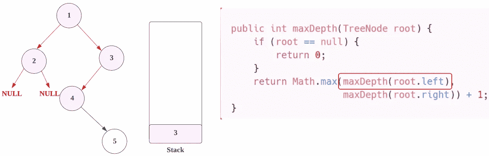

这里，成为 **4、**的根节点是**而不是空**，因此，它将被添加到**堆栈中。**

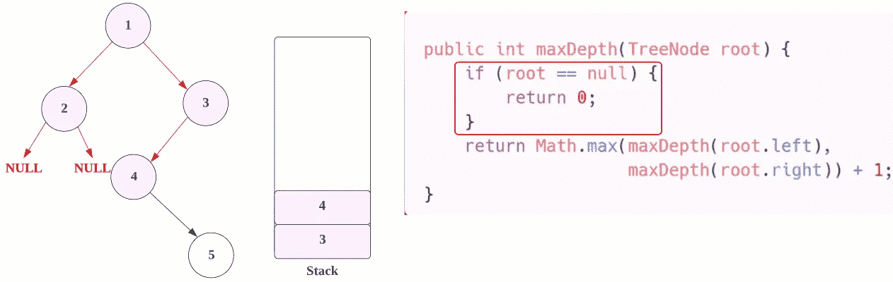

现在**递归**调用 **maxDepth** 与 **root.left** 将被调用。

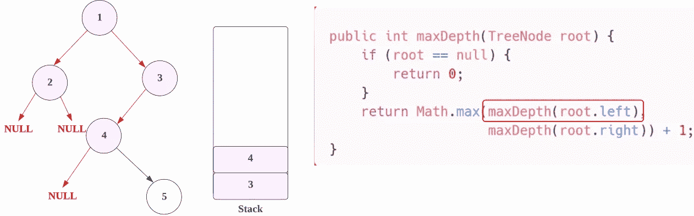

这里节点**为空**，所以返回 **0** 。

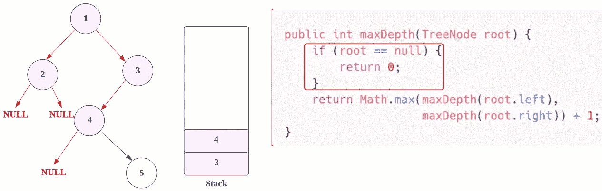

现在我们将从**堆栈**中取出**最后一个节点**(也就是 **4** )并用 **root.right.** 调用 **maxDepth**

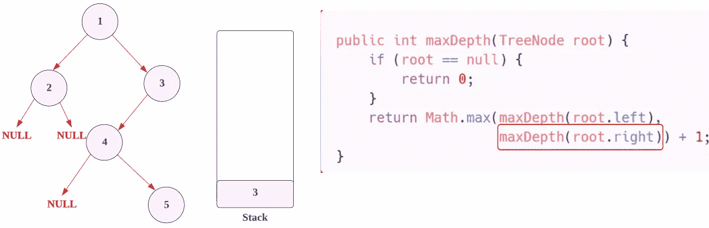

这里，成为 **5、**的根节点是**非空**，因此，它将被添加到**堆栈中。**

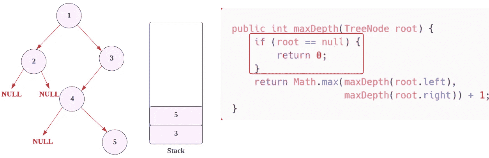

现在，在下一步中，对于**节点 5** ，我们将检查它是**左节点**，也就是**空**，所以返回值将是 **0** ，然后在我们将**从堆栈中移除**节点(也就是**节点 5** )并检查它是**右节点**，也是**空，**所以**..**

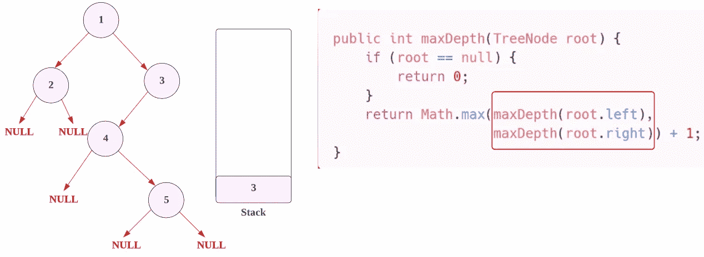

这里，**节点 5 的**左**和右**都为空，所以都返回 0，****

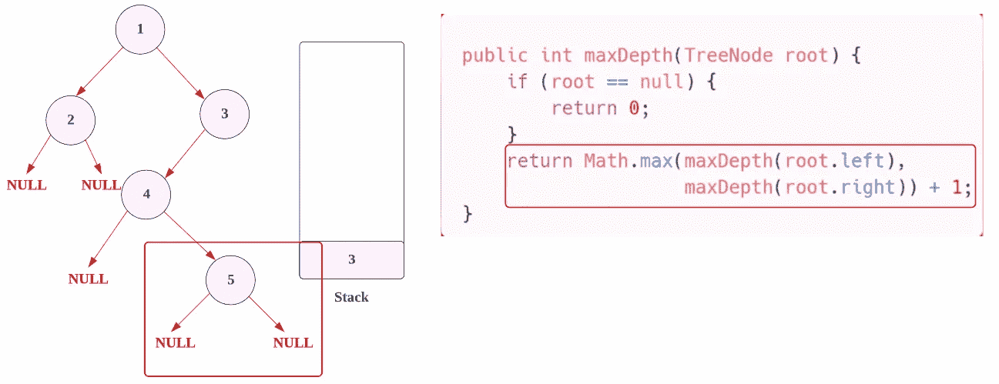

> 所以，**节点(5)****=>****math . max(0，0) + 1 = > 0 + 1 = > 1** 。

但是现在 N **ode 4 的**都 **left (0 为空)**和 **right (1 = > Node (5)为 1)** 也被求值，

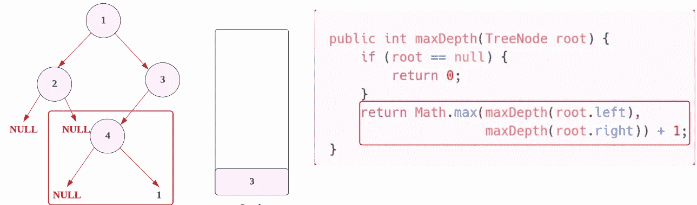

> 所以，**节点(4)**
> 
> **= > Math.max(NULL，Node(5)) + 1**
> 
> **= > Math.max(0，1) + 1**
> 
> **= > 1 + 1**
> 
> **= > 2**

现在我们将从**栈**中取出**最后一个节点**(也就是 **3** )，用 **root.right、**调用 **maxDepth** ，也是 NULL，所以会返回 0 **。**

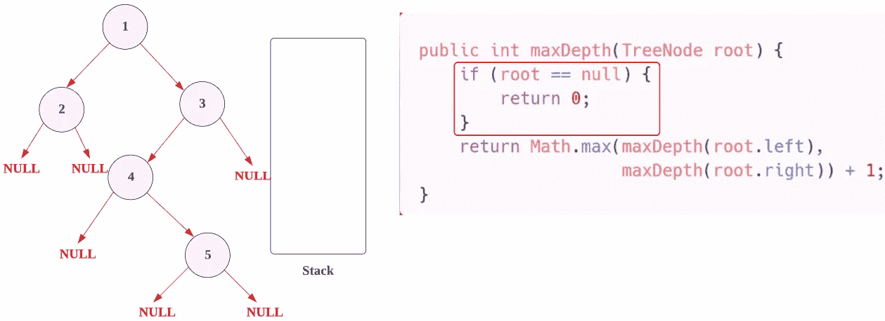

这里，**节点 3 左边是节点(4)** 右边是**NULL，**

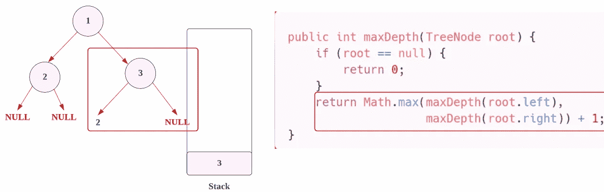

> 所以，**节点(3)**
> 
> **= > Math.max(Node(4)，NULL) + 1**
> 
> **= > Math.max(2，1) + 1**
> 
> **= > 2 + 1**
> 
> **= > 3**

现在，在最后，**节点(1) = >** 既**左(节点(2))** 又**右(节点(3))**

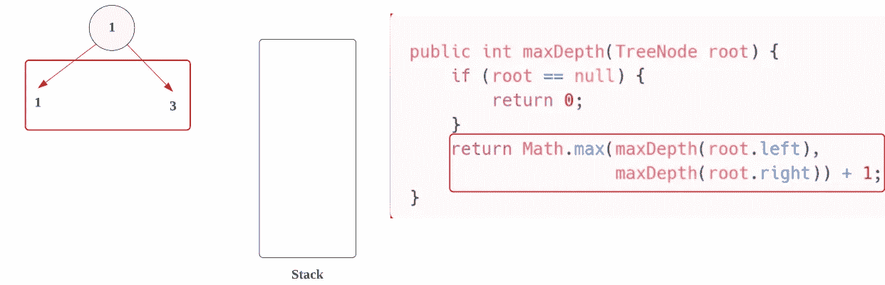

> 所以，**节点(1)**
> 
> **=>****math . max(Node(2)，Node(3)) + 1**
> 
> **= > Math.max(1，3) + 1**
> 
> **= > 3 + 1**
> 
> **= > 4**

因此，最后 **4** 将被**返回**，这将是总**深度**。

# 代码(Java)递归方式:→

# 代码(Python)递归方式:→

# 时间复杂度

在这里，我们遍历所有节点，所以总时间复杂度是 **O(n)** 。

# 空间复杂性

由于我们使用了递归，在内部创建了一个栈，所以空间复杂度将是 ***O(n)*** 。

如果你想用**迭代的方式**得到解，你可以[点击这里](https://medium.com/dev-genius/leetcode-104-maximum-depth-of-binary-tree-solution-with-images-6c43c03af382)。

感谢你阅读这篇文章，❤

如果这篇文章对你有帮助，请鼓掌👏这篇文章。

请在[媒体](https://medium.com/@alexmurphyas8)上关注我，我会像上面一样发布有用的信息。

insta gram→[https://www.instagram.com/alexmurphyas8/](https://www.instagram.com/alexmurphyas8/)

推特→【https://twitter.com/AlexMurphyas8 

如果我做错了什么？让我在评论中。我很想进步。