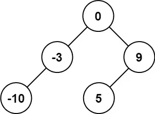

# LeetCode 108。将排序后的数组转换为二叉查找树(带图像的解决方案)

> 原文：<https://blog.devgenius.io/leetcode-108-convert-sorted-array-to-binary-search-tree-solution-with-images-f34354fe6299?source=collection_archive---------5----------------------->

# 问题:→

给定一个整数数组`nums`，其中的元素按**升序**排序，将*转换成一个* ***高度平衡的*** *二叉查找树*。

高度平衡的二叉树是这样一种二叉树，其中每个节点的两个子树的深度相差不超过 1。

**例 1:**



```
**Input:** nums = [-10,-3,0,5,9]
**Output:** [0,-3,9,-10,null,5]
**Explanation:** [0,-10,5,null,-3,null,9] is also accepted:
```


**例 2:**


```
**Input:** nums = [1,3]
**Output:** [3,1]
**Explanation:** [1,null,3] and [3,1] are both height-balanced BSTs.
```

**约束:**

*   `1 <= nums.length <= 104`
*   `-104 <= nums[i] <= 104`
*   `nums`按照**严格递增**的顺序排序。

# 解决方案:→

让我们先了解一下什么是**身高平衡二叉查找树？**

→没有**叶的树**比其他任何**叶**离**根**远得多。

下图显示了两棵树，一棵是高度平衡的，另一棵不是。


**第一棵树**被认为是**高度平衡树**，因为左子树只比**右子树的**高度**多 **1。****

**第二棵树**没有**高度平衡**因为左子树 **2** 的高度比**右子树**的**高。**

在理解了高度平衡树之后，让我们来理解如何将数组转换成高度平衡树。

# 解决方案:→

一般来说，我们可以通过以下方式将给定的排序后的整数数组转换成高度平衡的**二叉查找树*。*

**

*现在，让我们用代码来理解，*

*我们将继续用**二分搜索法**中的**递归方式**，就在这里，排序后的数组被给出。*

*首先，我们需要找到**根节点**，根节点将是**中间元素**，其中作为其值的**左节点**将比中间节点低**，而**右节点**的值将比根节点**大**。***

*为了找到中间值，我们将使用下面公式:*

**

*如果你想明白为什么我们**不应该**使用 **mid = (start+ end)/2** ，你应该[点击这里](/avoid-this-thing-while-calculating-mid-value-in-data-structures-73d834ed5fb8)。*

**

*现在，我们将创建新的 **TreeNode** ，在这里我们将为一个**节点赋值 5** 。*

**

*现在，我们用数组的左边部分调用 **createBST** 。*

*这里 **start = 0，end =(mid—1)=(3–1)= 2***

**

*这里，对于每个递归调用，将为下面的**右节点**创建堆栈，它存储值，如下所示。*

****

*同样，我们将计算中间值并创建新的 **TreeNode** ，*

*这里**mid =(start+(end-start)/2)=(0+(2–0)/2)=(0+1)= 1。***

**

*新创建的节点将被分配到树的左侧节点。*

****

*现在，对于第二次递归调用，再次将值追加到堆栈中。*

****

*同样，我们用数组的左边部分做递归调用，*

*这里 **start = 0** ，**end =(mid—1)=(2–1)= 1***

**

*同样，我们将计算中间值并创建新的 **TreeNode** ，*

*这里**mid =(start+(end-start)/2)=(0+(1–0)/2)=(0+0)= 0。***

**

*新创建的**节点**，将被分配到树的**左侧节点**。*

****

*对于第三次递归调用，该值也被追加到堆栈中。*

****

*这里 **start = 0** 但是现在， **end = > mid -1 = > -1。***

**

*因此，最后，**左节点**将为**空，**因此**递归堆栈**将不会被**追加**。*

**

*现在，**反向过程**将开始，并且**值**将从**递归堆栈中**移除**。***

****

*这里， **start = (mid + 1) = (0+1) = 1。**和 **end = 0。***

*再次低于条件将返回 **null。***

**

*所以，最后，**右节点**将为**空**。*

**

*在下一个**右侧**的反向过程**中，**再次**值**将从**递归堆栈中**移除**。***

****

*现在，再次递归调用右侧的**。***

*这里， **start = (1+ 1) = (1+1) = 2。**和 **end = 2。***

*所以，下面的条件将变成**假**。*

**

*但是，在下一行，*

***mid =(2+(2–2))/2 = 2/2 = 1***

**

*在一个**栈**中，它被追加，*

**

*而对于下一行，对于 **TreeNode (1)，**它的**右节点**的值将是，*

***mid = start+(end-start)/2 =>2+(2–2)/2 =>2***

**

*并且结果 **Treenode** 将是，*

**

*现在，再次调用函数 **createBST** ，该值将被添加到堆栈中。*

***开始= (mid + 1) = (2+1) = 3，结束= 2***

**

*现在，对于相反的过程，*

**

*这里， **start = 3。**和 **end = 2。**以下条件将返回**空值。***

**

*所以，对于 **TreeNode (1)** 右节点将为 **NULL***

**

*同样，对于相反的过程，*

**

*现在，对于 **TreeNode (1)** 左节点将为 **NULL***

**

*现在，左边部分完成了，我们可以用右边部分理解同样的事情。*

**

*现在，让我们看看完整的源代码。*

# *代码(Java): →*

# *代码(Python): →*

# *时间复杂度*

*这里，递归发生了两次，但是一次是针对左半部分的，另一次是针对右半部分的，所以总时间复杂度是 **O(n)** 。*

# *空间复杂性*

*既然我们使用了一个额外的队列，那么，空间复杂度将是 O(n)**。***

*感谢你阅读这篇文章，❤*

*如果这篇文章对你有帮助，请鼓掌👏这篇文章。*

*请在[媒体](https://medium.com/@alexmurphyas8)上关注我，我会像上面一样发布有用的信息。*

*如果我做错了什么？让我在评论中。我很想进步。*