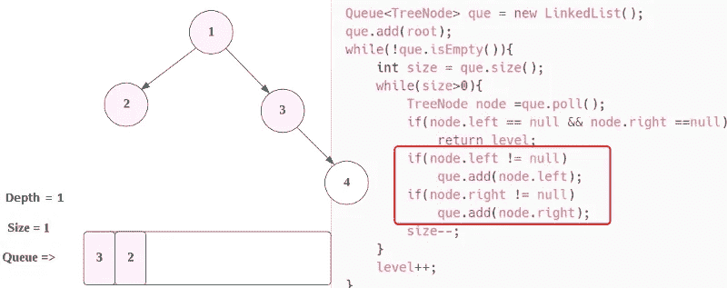
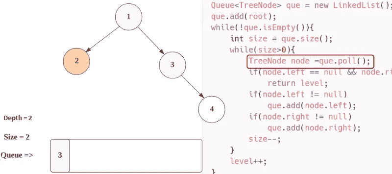

# LeetCode 111。二叉树的最小深度(用图像求解)

> 原文：<https://blog.devgenius.io/leetcode-111-minimum-depth-of-binary-tree-50b775ec4a1d?source=collection_archive---------6----------------------->

# 问题:→

给定一棵二叉树，求其最小深度。

最小深度是从根节点到最近的叶节点的最短路径上的节点数。

**注意:**叶子是没有子节点的节点。

**例一:**


```
**Input:** root = [3,9,20,null,null,15,7]
**Output:** 2
```

**例 2:**

```
**Input:** root = [2,null,3,null,4,null,5,null,6]
**Output:** 5
```

**约束:**

*   树中的节点数在范围`[0, 105]`内。
*   `-1000 <= Node.val <= 1000`

# 解决方案:→

一般来说，我们可以通过以下方式检查深度。

这里，我们将遍历树并找到**的第一个节点**，它的**左侧**和**右侧**为**空**，我们从**返回那个节点**并检查**的深度，**这将是我们的答案。


现在，让我们用代码来理解，

首先，我们将检查，如果根节点为空，那么我们不需要对树进行任何遍历，我们可以简单地返回 **0** 。


之后，如果**根**为**不为空**，那么我们会将此添加到**队列中。**


现在，队列不为空，所以它将在**而**循环中，现在我们检查**队列的**大小为 1。

之后，我们将进入**内部 while 循环**，其中条件满足，因此接下来，我们将从**队列中取出节点**，这是**节点(1)** 。


现在，首先我们检查**根节点(1)** 的左**和右**是否都为空**？如果没有，那么我们继续前进，尝试将那些**节点**添加到**队列**。**



现在，大小变成了 **0** ，所以**内 while 循环**的条件将为**假**，


现在，**深度值**将增加 **1** ，然后和前面的步骤一样，我们将移动到**外 while 循环**，在那里我们计算**大小**并进入**内 while 循环。**


现在， **que.poll()** 将被调用，因此**第一个节点**即**节点(2)**被从**队列**中移除，并将其分配给**节点**。



现在对于节点(2)，左节点和右节点都变成 null，所以如果条件将满足，并返回当前深度，


因此，两个循环都将退出，返回的结果将是 **2** 。

函数结束，我们简单的返回**深度**，这将是我们的**答案**。

现在，让我们看看完整的源代码。

# 代码(Java): →

# 代码(Python): →

# 时间复杂度

这里，我们采用了两个 while 循环。第一个 while 循环仅用于深度计算，第二个 while 循环用于**迭代所有节点**，因此时间复杂度为 O( **n** )。

# 空间复杂性

由于我们使用了一个额外的队列，所以，空间复杂度将是 O(n)**。**

感谢你阅读这篇文章，❤

如果这篇文章对你有帮助，请鼓掌👏这篇文章。

请在[媒体](https://medium.com/@alexmurphyas8)上关注我，我会像上面一样发布有用的信息。

insta gram→[https://www.instagram.com/alexmurphyas8/](https://www.instagram.com/alexmurphyas8/)

推特→[https://twitter.com/AlexMurphyas8](https://twitter.com/AlexMurphyas8)

如果我做错了什么？让我在评论中。我很想进步。