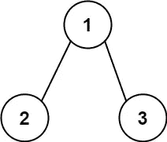
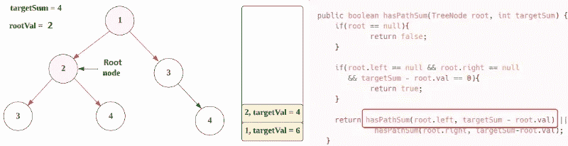

# LeetCode 112。路径和(带图像的解决方案)

> 原文：<https://blog.devgenius.io/leetcode-112-path-sum-solution-with-images-59005efd1c2e?source=collection_archive---------5----------------------->

# 问题:→

给定一棵二叉树的`root`和一个整数`targetSum`，如果该树有一条**根到叶的**路径，使得沿着该路径的所有值相加等于`targetSum`，则返回`true`。

一个**叶**是一个没有子节点的节点。

**例 1:**


```
**Input:** root = [5,4,8,11,null,13,4,7,2,null,null,null,1], targetSum = 22
**Output:** true
**Explanation:** The root-to-leaf path with the target sum is shown.
```

**例 2:**



```
**Input:** root = [1,2,3], targetSum = 5
**Output:** false
**Explanation:** There two root-to-leaf paths in the tree:
(1 --> 2): The sum is 3.
(1 --> 3): The sum is 4.
There is no root-to-leaf path with sum = 5.
```

**例 3:**

```
**Input:** root = [], targetSum = 0
**Output:** false
**Explanation:** Since the tree is empty, there are no root-to-leaf paths.
```

**约束:**

*   树中的节点数量在`[0, 5000]`范围内。
*   `-1000 <= Node.val <= 1000`
*   `-1000 <= targetSum <= 1000`

# 解决方案:→

一般来说，我们可以通过下面的图像来理解


让我们通过代码来理解这一点，

→首先，我们将检查**根节点是否为空**，然后我们将返回 **false** (如问题的第三个示例**所示，您可以看到)**


→现在，我们将检查**根节点**的**右节点**和**左节点**是否为**空**？哪个是**假的**。


→现在，我们将进行递归调用，移动到**根节点的左侧**，用**根节点的值**减去**目标总和**。

因为是递归调用，该值将在内部被追加到**堆栈**中。


→现在，**根节点是→节点(2)，**我们将再次检查**根节点是否为空**？而且是**左右侧节点都是空的**？

这里两个条件**都不满足**。


→与上一步一样，我们将进行递归调用，并移动到**根节点的左侧**，用**当前节点的值**减去**目标总和**。

> targetSum —根节点的值= > 6–2 = > 4。

→由于是递归调用，该值将在内部追加到**堆栈**中。



→现在，**根节点是节点(3)，**我们将再次检查**根节点是否为空**？

答案是假的。


→现在检查是不是**左右侧节点为空？**

这变成了事实，


→但是这里我们也在检查第三个条件，如果

> targetSum — root.val = 0？
> 
> 4–3 = 1 = >不等于 0。

所以第三个条件**不满足**，


→与上一步一样，我们将进行递归调用，并移动到**根节点的左侧**，用**根节点的值**减去**目标总和**。


→这里，**根**会变成**空**所以会返回**假**。


→现在反过来，从**栈中弹出**节点(此处**节点(3)的右节点**为**空**)我们会检查，**根节点**的**右节点**。


→这里，**根**会变成**空**所以会返回**假**。


→现在反过来，从**栈中弹出**节点，**节点(2)** 的**右节点** **节点(4)** 成为**根节点**。


→现在，**根节点是节点(4) →** 我们来检查**根节点是否为空**？答案是假的。


→现在检查**根节点(节点(4))** 的**左右侧节点是否为空？**哪个变成真的，


但是这里我们也在检查第三个条件，如果

> targetSum — root.val = 0？
> 
> 4–4 = 0 = >真。

现在，对于这个根节点，返回值变成了**真**。

因为在最后我们使用了**或条件**，所以从这两个条件中任何一个**真值**就变成了**真值**。


递归仍然会工作，直到堆栈变空，但是我们得到了**真**所以，在**结束时，OR** 条件将总是返回**真**。

现在，让我们看看完整的源代码。

# 代码(Java): →

# 代码(Python): →

# 时间复杂度

在这里，我们遍历所有节点，所以总时间复杂度将是 **O(n)** 。

# 空间复杂性

由于我们使用了递归，在内部创建了一个栈，所以空间复杂度将是 ***O(n)*** 。

感谢你阅读这篇文章，❤

如果这篇文章对你有帮助，请鼓掌👏这篇文章。

请在[媒体](https://medium.com/@alexmurphyas8)上关注我，我会像上面一样发布有用的信息。

insta gram→[https://www.instagram.com/alexmurphyas8/](https://www.instagram.com/alexmurphyas8/)

推特→[https://twitter.com/AlexMurphyas8](https://twitter.com/AlexMurphyas8)

如果我做错了什么？让我在评论中。我很想进步。