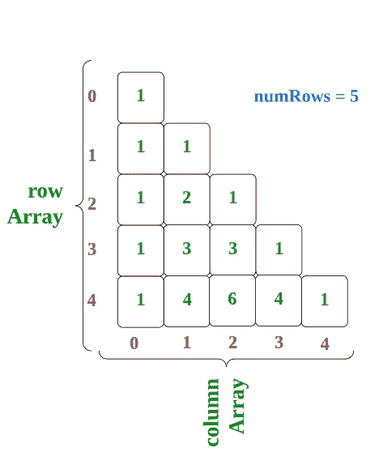
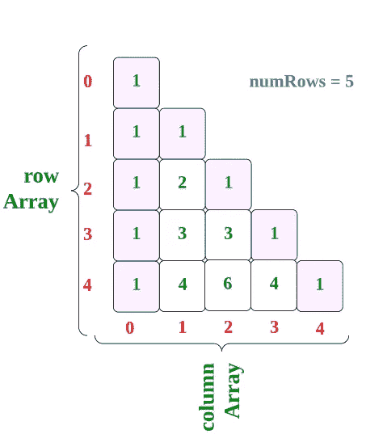
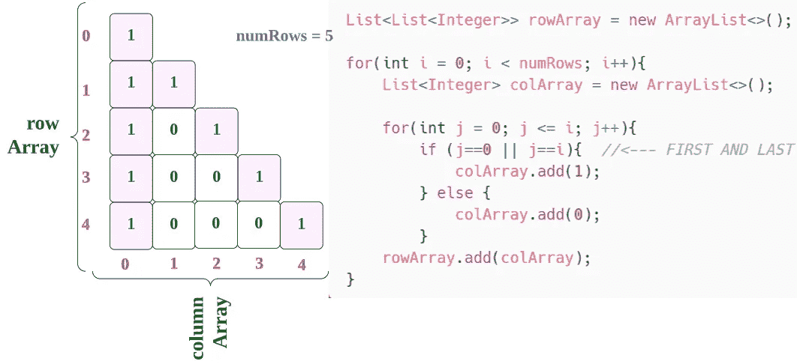
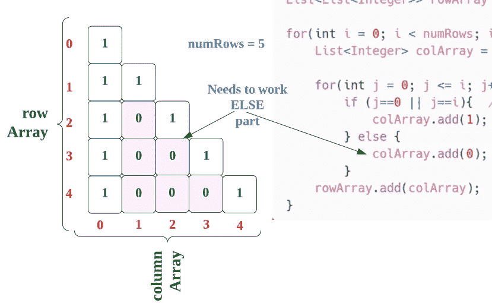
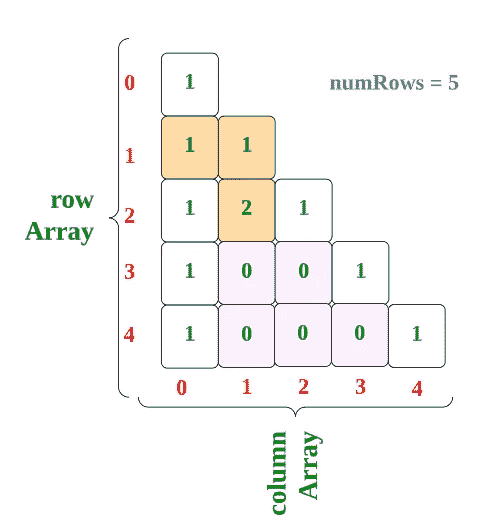
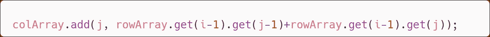
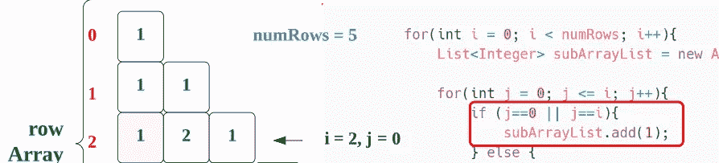
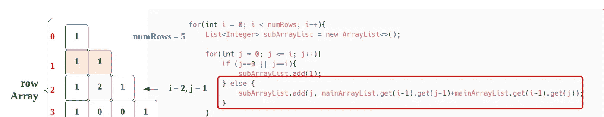
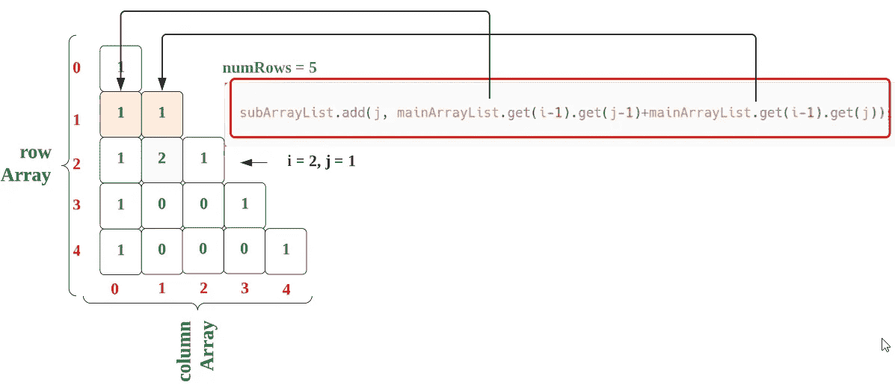
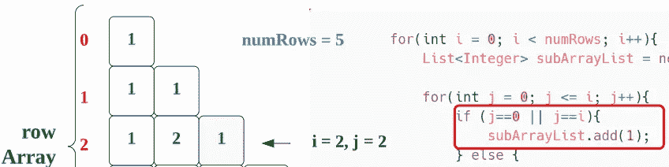

# LeetCode 118。帕斯卡三角形(带图像的解)

> 原文：<https://blog.devgenius.io/leetcode-118-pascals-triangle-b2b1d600de49?source=collection_archive---------5----------------------->

# 问题:>

给定一个整数`numRows`，返回**帕斯卡三角形**的第一个数字。

在**帕斯卡三角形**中，每个数字都是其正上方两个数字的和，如图所示:


**实施例 1:**

```
**Input:** numRows = 5
**Output:** [[1],[1,1],[1,2,1],[1,3,3,1],[1,4,6,4,1]]
```

**实施例 2:**

```
**Input:** numRows = 1
**Output:** [[1]]
```

**约束:**

*   `1 <= numRows <= 30`

# 解决方案:>

让我们通过下面的图像来理解解决方案，



在这里，我们可以清楚的看到，每行的**第一个和最后一个**元素是**“1”**



我们可以通过以下方式实现这个目标，



现在只需要改变**其他条件**，就可以将**的“0”**改为**合适的值**。



这里，从**第 3 行**(第 2 索引)可以看出，是前一行的前两个值的**相加。**



我们，可以通过以下方式在**其他部分**实现



在这里，我向你展示，我们将如何添加**第三行。**

> 第三行以开始， **i = 2，j = 0**

*注:→这是我在图像上的错误(将子阵列列表视为* ***阵列*** *)*



> 然后， **i = 2，j = 1**

这里，如果条件只针对**的第一个和最后一个元素**，那么它将不满足，我们将转到其他条件。

*注:→这是我在图像上的错误(将子数组列表视为* ***数组*** *和主数组列表视为* ***行数组*** *)*



在此，将通过以下方式进行计算:

*注:→这是我在图像上的错误(将子数组列表视为* ***数组*** *和 mainArrayList 视为* ***行数组*** *)*



最后，

> 最后， **i = 2，j = 2**

*注:→这是我在形象上的错误(把 subArrayList 当成****colArray****)*



同样，我们也可以通过,**第 4 行**、**第 5 行**和**等等** …

现在，让我们看看完整的源代码。

# 代码(Java):>

# 代码(Python):>

# 时间复杂性

这里，我们使用了两个循环，因此总时间复杂度将是 **O(n )** 。

# 空间复杂性

这里，我们使用了二维列表，所以总空间复杂度也将是 **O(n )** 。

— — — — — — — — — — — — — — — — — — — — — — — — — — — — — —

谢谢你阅读这篇文章，❤

如果这篇文章对你有帮助，请鼓掌👏这篇文章。

请在[媒体](https://medium.com/@alexmurphyas8)上关注我，我会像上面一样发布有用的信息。

insta gram→【https://www.instagram.com/alexmurphyas8/ 

推特→【https://twitter.com/AlexMurphyas8 

如果我做错了什么？让我在评论中。我很想进步。