# LeetCode 121。买卖股票的最佳时间(带图片的解决方案)

> 原文：<https://blog.devgenius.io/leetcode-121-best-time-to-buy-and-sell-stock-solution-with-images-3a0bc4145f8?source=collection_archive---------3----------------------->

链接:→[https://leet code . com/problems/best-time-to-buy-and-sell-stock/](https://leetcode.com/problems/best-time-to-buy-and-sell-stock/)


照片由[万策·帕莱里](https://unsplash.com/es/@wance0003000?utm_source=medium&utm_medium=referral)在 [Unsplash](https://unsplash.com?utm_source=medium&utm_medium=referral) 上拍摄

# 问题:→

给你一个数组`prices`，其中`prices[i]`是在`ith`日给定股票的价格。

你想通过选择一个**单日**买入一只股票，并选择未来**不同的一天**卖出这只股票来最大化你的利润。

返回*你从这笔交易中可以获得的最大利润*。如果你不能获得任何利润，返回`0`。

**例 1:**

```
**Input:** prices = [7,1,5,3,6,4]
**Output:** 5
**Explanation:** Buy on day 2 (price = 1) and sell on day 5 (price = 6), profit = 6-1 = 5.
Note that buying on day 2 and selling on day 1 is not allowed because you must buy before you sell.
```

**例二:**

```
**Input:** prices = [7,6,4,3,1]
**Output:** 0
**Explanation:** In this case, no transactions are done and the max profit = 0.
```

**约束:**

*   `1 <= prices.length <= 10^5`
*   `0 <= prices[i] <= 10^4`

# 解决方案:→

在这里，我们将尝试找出**最小值**和**最大差值**。

让我们一步步了解，

假设，我们给出了下面例子:

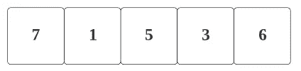

这里，我们将把**两个变量**、

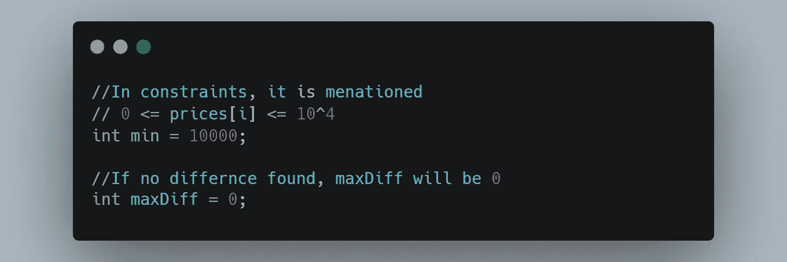

> 第一步。对于第一个值 **prices[0]** 即 7，

对于**分钟**，我们将比较**的较小值**并取该值，

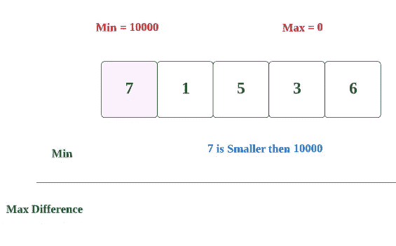

这里我们发现 **7 小于 10000** 。所以更小的是 **7** 。

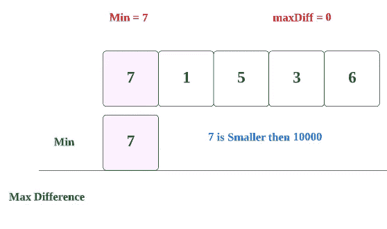

现在为，**maxDiff**=>prices【0】-min =>7–7 =>**0，**

0 与当前 **maxDiff** 的**相似**，所以是 0。

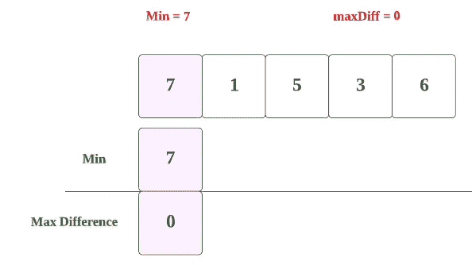

> 第二步。现在，对于第二个价格[1] => 1。

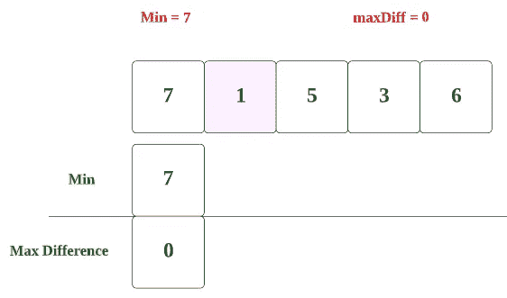

对于 min:- **1 小于 7。**所以 min 会是 1 **。**

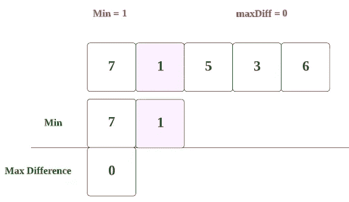

现在为， **maxDiff**

价格[1]-min = > 1–1 = >**0，**

0 与当前 **maxDiff** 的**相似**，所以是 0。

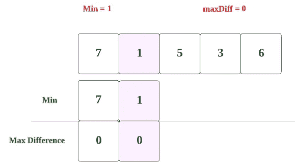

> 第三步。现在，对于第三种价格[2] => 5。

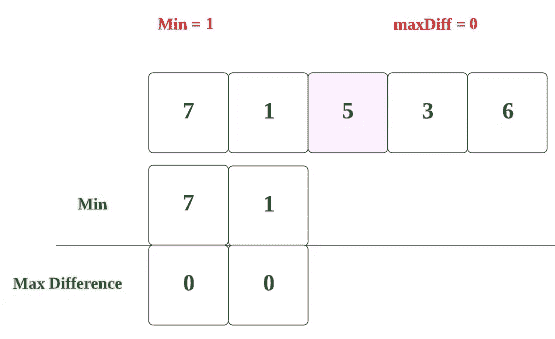

对于 Min: **- 1 不小于 5。**所以，我们将只取**的最小值**所以**，**将是 **1。**

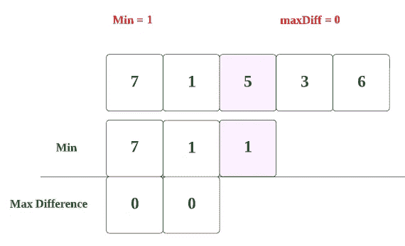

现在为， **maxDiff，
prices[2]-min**=>5–1 =>4**，**

我们得到 **4** ，并且**将**与 **maxDiff** 进行比较，即 **0**

大一点的是 **4，**所以 **maxDiff** 会是 **4** 。

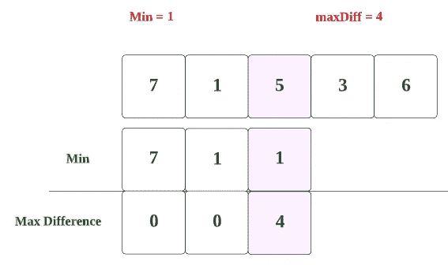

> 第四步。现在，对于第三种价格[3] => 3。

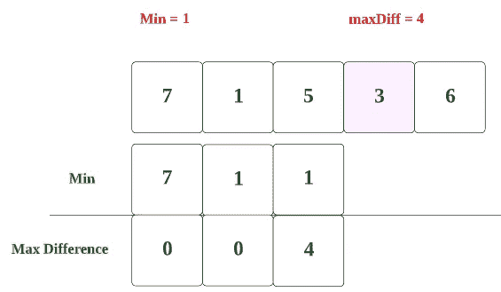

对于最小值 **:- 3 不小于**小于 **1。**所以我们会保留它 **1。**

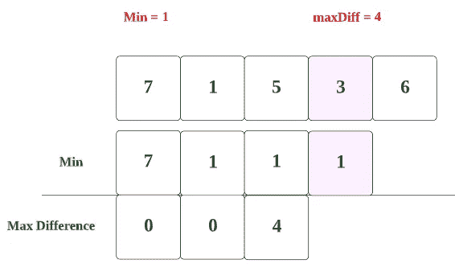

现在为， **maxDiff，**

**价格【3】-最小值**=>4–1 =>3**，**

我们得到 **3** ，并且**将**与 **maxDiff** 进行比较，也就是 **4，**

我们将取最大值 4。

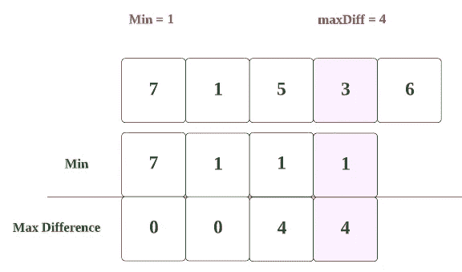

> 第五步。现在，对于第三种价格[4] => 6。

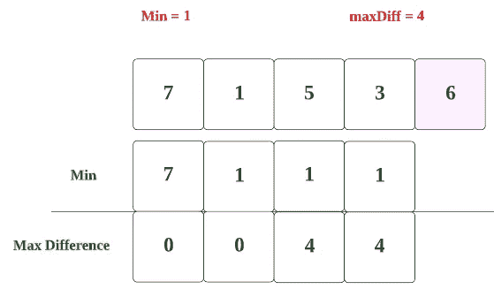

对于最小值 **:- 6 不小于**小于 **1。所以我们会保留它。**

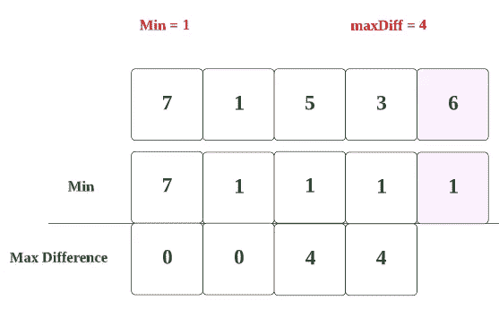

现在为， **maxDiff，**

**价格【4】-最小值**=>6–1 =>5**，**

我们得到 **5** ，并且**将**与 **maxDiff** 进行比较，后者是 **4、**

我们将取最大值 **5** 。

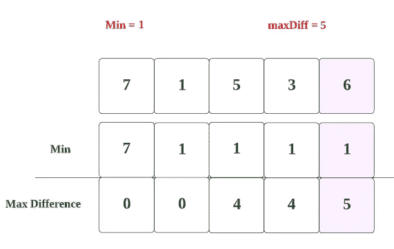

所以，在一个数组结束后，我们将得到一个 5 的 maxDiff。

我们将**返回 maxDiff，**这将是我们的答案。

现在，让我们看看完整的源代码。

# 代码(Java): →

# 代码(Python): →

# 时间复杂度

这里，我们遍历整个数组，所以总的时间复杂度将是 **O(n)** 。

# 空间复杂性

这里，我们只使用了两个变量，所以总的空间复杂度也将是 **O(1)** 。

— — — — — — — — — — — — — — — — — — — — — — — — — — — —

感谢你阅读这篇文章，❤

如果这篇文章对你有帮助，请鼓掌👏这篇文章。

请在[媒体](https://medium.com/@alexmurphyas8)上关注我，我会像上面一样发布有用的信息。

insta gram→[https://www.instagram.com/alexmurphyas8/](https://www.instagram.com/alexmurphyas8/)

推特→[https://twitter.com/AlexMurphyas8](https://twitter.com/AlexMurphyas8)

如果我做错了什么？让我在评论中。我很想进步。