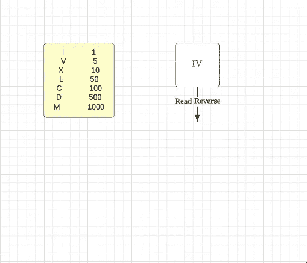
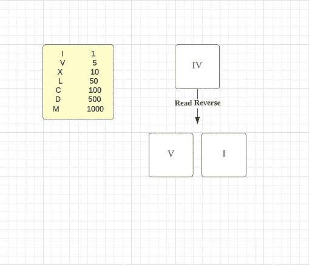
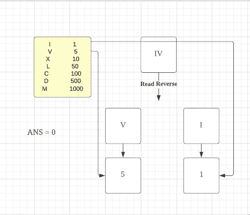
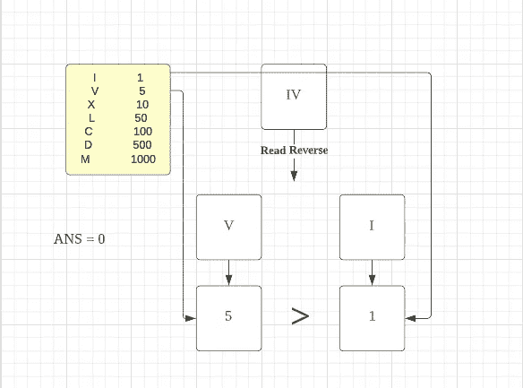
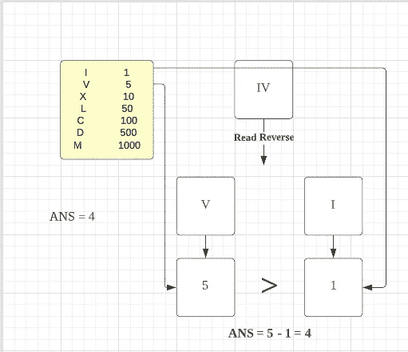
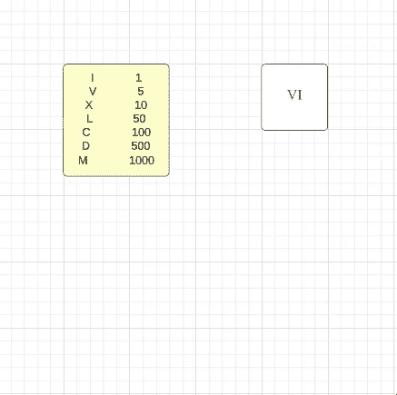
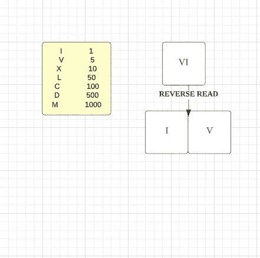
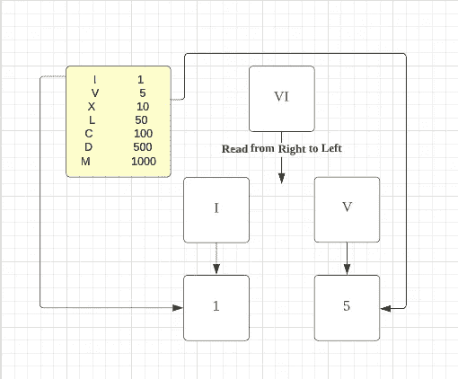
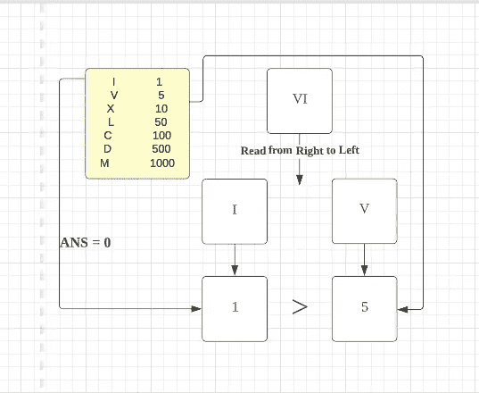
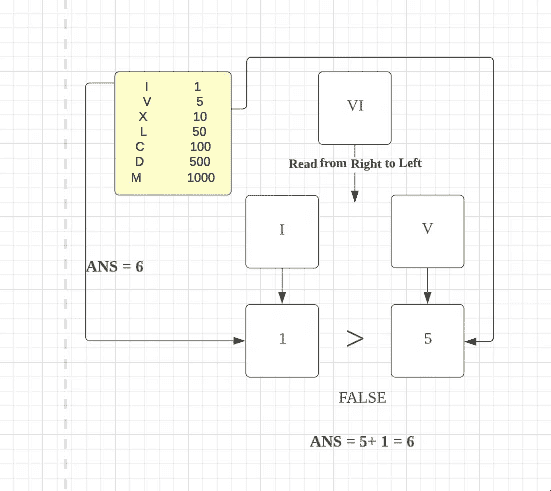

# Leetcode — 13。罗马到整数(带图像的解决方案)

> 原文：<https://blog.devgenius.io/leetcode-13-roman-to-integer-32b5b50cd2fb?source=collection_archive---------1----------------------->

链接:→[https://leetcode.com/problems/roman-to-integer/](https://leetcode.com/problems/roman-to-integer/)


詹姆斯·哈里森在 [Unsplash](https://unsplash.com?utm_source=medium&utm_medium=referral) 上拍摄的照片

# **问题:→**

罗马数字由七种不同的符号表示:`I`、`V`、`X`、`L`、`C`、`D`和`M`。

```
**Symbol**       **Value**
I             1
V             5
X             10
L             50
C             100
D             500
M             1000
```

比如`2`用罗马数字写成`II`，只是两个 1 加在一起。`12`写成`XII`，简单来说就是`X + II`。数字`27`写成`XXVII`，就是`XX + V + II`。

罗马数字通常从左到右由大到小书写。但是，四的数字不是`IIII`。而是把数字四写成`IV`。因为 1 在 5 之前，我们减去它，得到 4。同样的道理也适用于数字九，写为`IX`。有六种使用减法的情况:

*   `I`可以放在`V` (5)和`X` (10)之前，做成 4 和 9。
*   `X`可以放在`L` (50)和`C` (100)之前，做成 40 和 90。
*   `C`可以放在`D` (500)和`M` (1000)之前做成 400 和 900。

给定一个罗马数字，将其转换为整数。

**例 1:**

```
**Input:** s = "III"
**Output:** 3
**Explanation:** III = 3.
```

**例二:**

```
**Input:** s = "LVIII"
**Output:** 58
**Explanation:** L = 50, V= 5, III = 3.
```

**例 3:**

```
**Input:** s = "MCMXCIV"
**Output:** 1994
**Explanation:** M = 1000, CM = 900, XC = 90 and IV = 4.
```

**约束:**

*   `1 <= s.length <= 15`
*   `s`只包含字符`('I', 'V', 'X', 'L', 'C', 'D', 'M')`。
*   **保证**在`[1, 3999]`范围内`s`是有效的罗马数字。

# **解决方案:→**

在这里，通过检查例子和图片，你可以得到一些想法:

*   我们需要从**右到左**开始阅读。为了前任。IV → V 然后是 I
*   这里我们可以看到我们有以下值

```
I             1
V             5
X             10
L             50
C             100
D             500
M             1000
```

**IV = 4** 但 **VI = 6**

所以我们可以这样想

**第一个 Ex:**

**四**



我们从右往左读 **V** & **I**



V = 5，I = 1



这里 V 先出现，然后是 I，所以我们可以检查

如果 V >我喜欢 5 > 1



做**减法**，我的意思是 5-1 = 4，



**第二个 Ex:**

**六**



我们从右到左阅读静脉注射。



V = 5，I = 1



这里先有 I，再有 V，所以我们可以检查



如果 I > V like 1 > 5，该条件变为**假**



做**加法**，我的意思是 5 + 1 = 6。

如果条件**为真**则**减法**如果条件**为假**则**加法。**

让我们看看代码:

**代码(Java):**

**时间复杂度:**

在约束`1 <= s.length <= 15`中可以看到，字符串的最大长度可以是 15，因此，最坏情况下的时间复杂度可以是 *O(15)* 或 *O(1)* 。

**空间复杂度:**

我们使用地图/字典来存储罗马符号及其相应的整数值，但是只有 7 个符号，因此最坏情况下的空间复杂度可以是 *O{7}* ，这相当于 *O(1)* 。

感谢你阅读这篇文章，❤

如果我做错了什么？让我在评论中。我很想进步。

拍手声👏如果这篇文章对你有帮助。