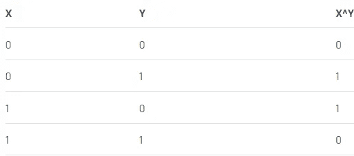
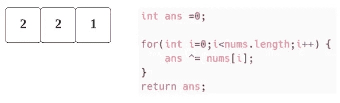
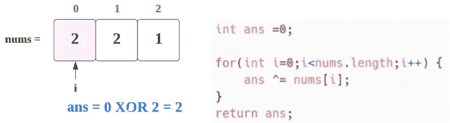
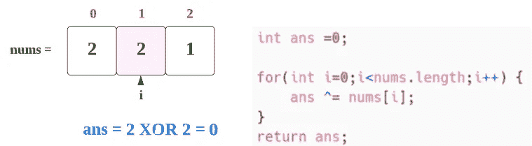
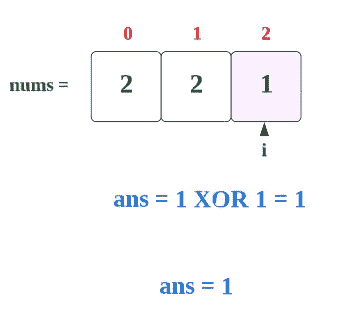

# LeetCode 136。单一编号(带图像的解决方案)

> 原文：<https://blog.devgenius.io/leetcode-136-single-number-solution-with-images-1039c88b9649?source=collection_archive---------2----------------------->


苏珊·霍尔特·辛普森在 [Unsplash](https://unsplash.com?utm_source=medium&utm_medium=referral) 拍摄的照片

# 问题:→

给定一个**非空的**整数数组`nums`，除了一个元素外，每个元素都出现*两次*。找到那个单身的。

您必须实现一个具有线性运行时复杂性的解决方案，并且只使用恒定的额外空间。

**例 1:**

```
**Input:** nums = [2,2,1]
**Output:** 1
```

**例 2:**

```
**Input:** nums = [4,1,2,1,2]
**Output:** 4
```

**例 3:**

```
**Input:** nums = [1]
**Output:** 1
```

**约束:**

*   `1 <= nums.length <= 3 * 104`
*   `-3 * 104 <= nums[i] <= 3 * 104`
*   数组中的每个元素都出现两次，只有一个元素只出现一次。

# 解决方案:→

要解决这个问题，首先我们需要了解**异或**运算是如何工作的。

XOR 是一个按位运算符，它代表“**异或**”

执行**逻辑**操作。

如果输入位相同，则输出为假(0)，否则为真(1)。



比如关于桌子，

**4 异或 4 = 0**

**0 异或 4 = 4**

现在，让我们从代码开始理解，

首先，我们将迭代整个数组，



现在，对于**第一次迭代**，

> **i = 0，ans = 0，nums[0] = 1
> 输出:- > ans = ans ^nums[i] = > 0 异或 2 = > 2**



现在，对于**的第二次迭代**，

> **i = 1，ans = 2，nums[1] = 2
> 输出:->ans = ans ^nums[i]=>2 xor 2 =>0**



现在，对于**第三次迭代**，

> **i = 2，ans = 0，nums[1] = 1
> 输出:->ans = ans ^nums[i]=>0 xor 1 =>1**



现在，**整个迭代完成**，我们从 for 循环中退出，最后我们将返回 **ans** 变量。

现在，让我们看看完整的源代码，

# 代码(Java): →

# 代码(Python): →

# 时间复杂度

这里，我们遍历整个数组，所以总的时间复杂度将是 O(n) 。

# 空间复杂性

这里，我们只使用了一个变量，所以总的空间复杂度也将是 **O(1)** 。

— — — — — — — — — — — — — — — — — — — — — — — — —

感谢你阅读这篇文章，❤

如果这篇文章对你有帮助，请鼓掌👏这篇文章。

请在[媒体](https://medium.com/@alexmurphyas8)上关注我，我会像上面一样发布有用的信息。

insta gram→[https://www.instagram.com/alexmurphyas8/](https://www.instagram.com/alexmurphyas8/)

推特→[https://twitter.com/AlexMurphyas8](https://twitter.com/AlexMurphyas8)

如果我做错了什么？让我在评论中。我很想进步。