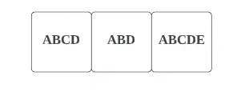
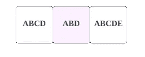
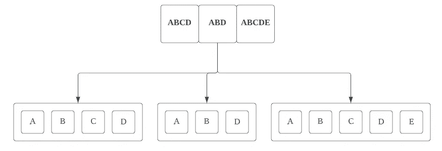
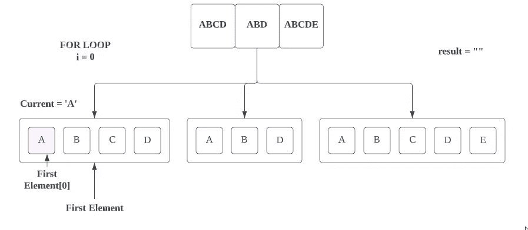
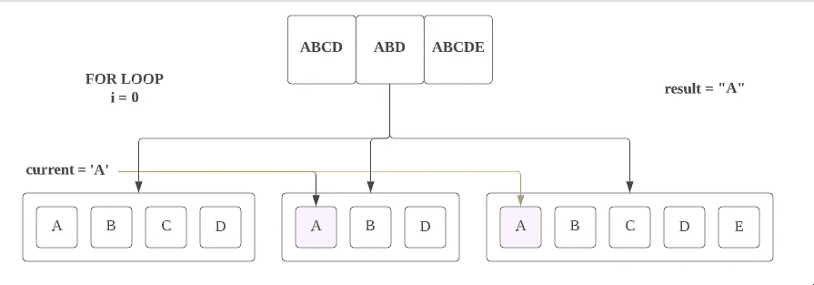
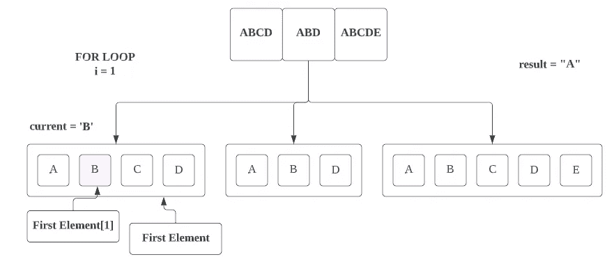
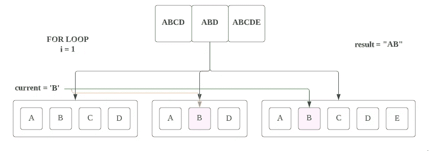
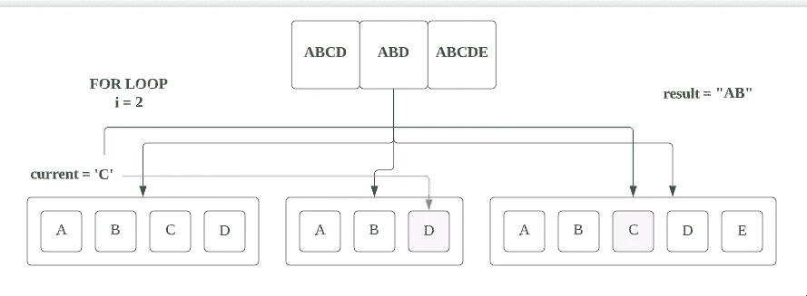
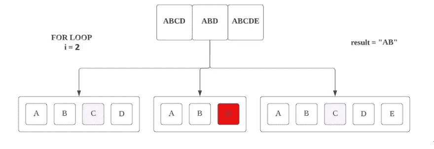
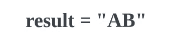

# LeetCode — 14:最长的公共前缀(带图像的解决方案)

> 原文：<https://blog.devgenius.io/leetcode-14-longest-common-prefix-solution-with-images-97cbf7ad2c20?source=collection_archive---------4----------------------->

链接:→【https://leetcode.com/problems/longest-common-prefix/ 


照片由 [Unsplash](https://unsplash.com?utm_source=medium&utm_medium=referral) 上的 [AltumCode](https://unsplash.com/@altumcode?utm_source=medium&utm_medium=referral) 拍摄

# **问题:**

写一个函数在字符串数组中寻找最长的公共前缀字符串。

如果没有公共前缀，则返回空字符串`""`。

**例 1:**

```
**Input:** strs = ["flower","flow","flight"]
**Output:** "fl"
```

**例 2:**

```
**Input:** strs = ["dog","racecar","car"]
**Output:** ""
**Explanation:** There is no common prefix among the input strings.
```

**约束:**

*   `1 <= strs.length <= 200`
*   `0 <= strs[i].length <= 200`
*   `strs[i]`仅由小写英文字母组成。

# **解决方案:**

在这里，我们可以采用简单的解决方案:

1.  首先，我们将找到最短的字符串及其长度。
2.  其次，我们将采取最短的字符串，并将其每个字符与所有其他字符串一一匹配。
3.  一旦我们遇到一个不匹配的字符，我们就会跳出循环。

让我们通过图像来理解它:

假设我们给了一个如下的数组



现在我们将应用我们的第一个条件:在这个给定的数组中找到最短的字符串。



我们会得到**和**。现在检查它的长度:它是 3，所以我们将创建一个长度为 3 的 for 循环，并逐个比较字符。



现在按照每秒的条件，我们正在尝试一个一个地匹配字符。所以对于第一次迭代。



首先我们将取第一个元素的第一个索引值，即**“A”**，并将其存储在**当前**变量中，



根据第三个条件，我们正在检查当前**变量的值与所有其他元素的第一个索引的值，如果都匹配，那么我们将进入下一个循环，否则我们将终止这个循环。**

这里**当前**字符是**‘A’**与其他元素的第一个索引值相匹配。所以首先我们将把匹配字符存储到' **result'** 变量中。



现在我们取第一个元素的第二个索引(first_element[1])值，即**‘B’**



在上面的例子中，**‘B’**在数组的每一个其他元素中也是匹配的，所以我们将把 **B** 也添加到**结果’**变量中，**结果’**将是**【AB】**。

现在我们取第一个元素的第三个索引(first_element[2])值，它是**‘C’**



这里，**‘C’**在字符串的每个元素中都不可用，所以我们不会将“C”追加到' **result'** 变量中。



因此，根据第三个条件，我们在这里终止 for 循环，并返回变量 **"result"** ，即" AB "，这将是我们的答案。



# **代码(Java):**

# 代码(Python):

# 时间复杂度:

如果`n`是数组的长度，`m`是最短字符串的长度，那么最坏情况下的时间复杂度将是 *O(m × n)* 。

# 空间复杂性:

因为我们没有使用任何内部数据结构来进行中间计算，所以空间复杂度将是 *O(1)* 。

感谢你阅读这篇文章，❤

如果我做错了什么？让我在评论中。我很想进步。

拍手声👏如果这篇文章对你有帮助。