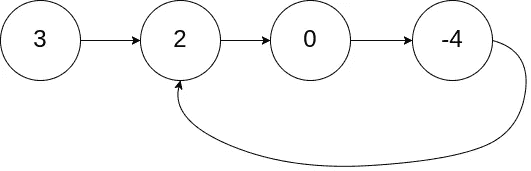
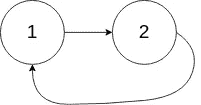
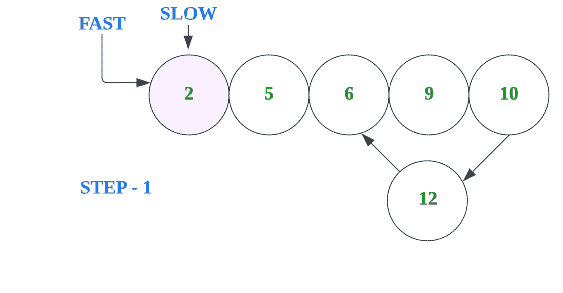
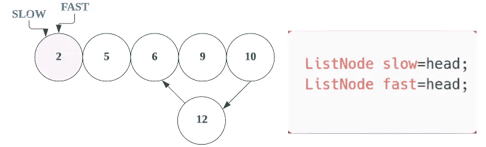
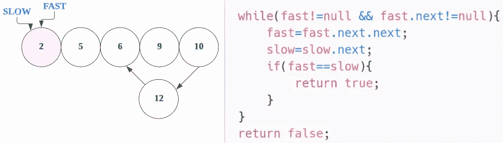
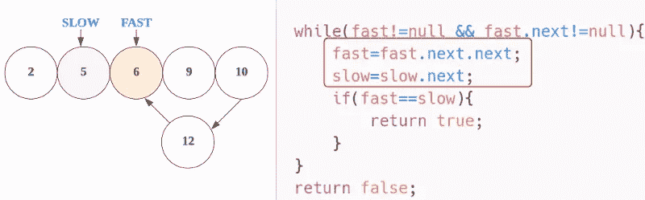
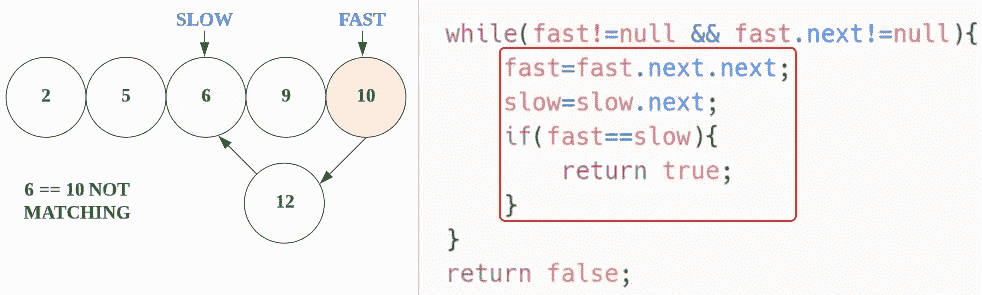
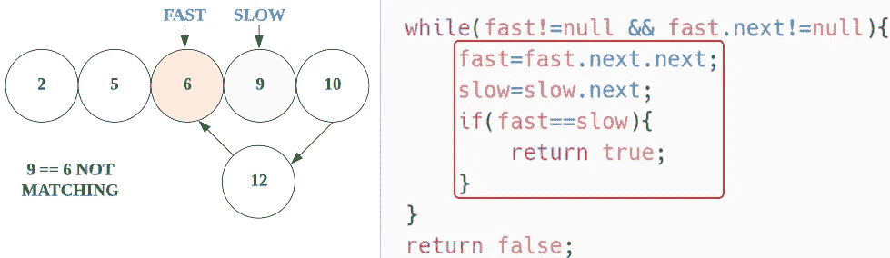
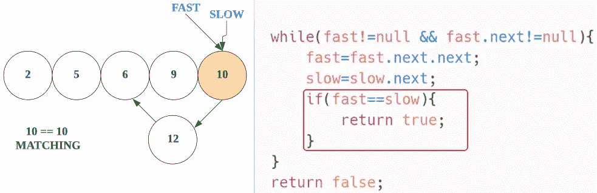

# LeetCode 141。链表循环(带图像的解决方案)

> 原文：<https://blog.devgenius.io/leetcode-141-linked-list-cycle-solution-with-images-85da5369a0da?source=collection_archive---------6----------------------->

# 问题:→

给定一个链表的头`head`，判断该链表中是否有循环。

如果链表中有某个节点可以通过继续跟随`next`指针再次到达，那么链表中就存在循环。在内部，`pos`用来表示 tail 的`next`指针所连接的节点的索引。**注意** `**pos**` **没有作为参数**传递。

如果链表中有循环，则返回`true` *。否则，返回`false`。*

**例 1:**



```
**Input:** head = [3,2,0,-4], pos = 1
**Output:** true
**Explanation:** There is a cycle in the linked list, where the tail connects to the 1st node (0-indexed).
```

**例二:**



```
**Input:** head = [1,2], pos = 0
**Output:** true
**Explanation:** There is a cycle in the linked list, where the tail connects to the 0th node.
```

**例 3:**


```
**Input:** head = [1], pos = -1
**Output:** false
**Explanation:** There is no cycle in the linked list.
```

**约束:**

*   列表中的节点数量在范围`[0, 104]`内。
*   `-105 <= Node.val <= 105`
*   `pos`是链表中的`-1`或**有效索引**。

**跟进:**能否用`O(1)`(即常数)内存解决？

# 解决方案:→

我们可以使用双指针方法来解决这个问题。

对于这个问题，我们来看看如果有一个圈会发生什么。
如果有点难，那么让我们想象一下我们在一个圆形的轨道上跑步。

如果跑道长 100 米，你的速度是 10 米/秒，你朋友的速度是 5 米/秒。

20 秒后，你跑了 200 米，你的朋友跑了 100 米。但是因为轨道是圆形的，所以你会和你的朋友在同一个地方，因为你们之间的距离差正好是 100 米。



让我们用代码来理解，

首先，我们采用**慢速**和**快速**变量，它们指向给定链表的头部。



**— —第一次迭代— —**

现在，我们将进入 while 循环，慢速和快速移动，



现在，快会移动两步，而慢会移动一步，



现在，在 if 条件下，我们将检查两个节点，看它们是否相同。

这里它是不匹配的，所以 if 条件会变成 false。


**— —第二次迭代— —**

现在，对于下一次迭代，

现在，快会移动两步，而慢会移动一步，

然后在 if 条件下，我们将检查两个节点，看它们是否相同。

这里它是不匹配的，所以 if 条件会变成 false。



**— —第三次迭代— —**

现在，对于下一次迭代，

现在，快会移动两步，而慢会移动一步，

然后在 if 条件下，我们将检查两个节点，看它们是否相同。

这里它是不匹配的，所以 if 条件会变成 false。



**— —第四次迭代— —**

现在，对于下一次迭代，

现在，快会移动两步，而慢会移动一步，

然后在 if 条件下，我们将检查两个节点，看它们是否相同。

这里是匹配，所以如果条件为真，它将返回真。



在这里，**真**就是我们的答案。

现在，让我们看看完整的源代码，

# 代码(Java): →

# 代码(Python): →

# 时间复杂度

这里，我们遍历一个完整的链表，所以总的时间复杂度将是 **O(n)** 。

# 空间复杂性

这里，我们只使用了两个变量，所以总的空间复杂度也将是 **O(1)** 。

— — — — — — — — — — — — — — — — — — — — — — — — —

## —>检查下面的问题，同上，难度稍大

[](https://medium.com/@alexmurphyas8/leetcode-142-linked-list-cycle-ii-7cc3e587b6a0) [## LeetCode 142。链表循环 II

### 链接:→https://leetcode.com/problems/linked-list-cycle-ii/

medium.com](https://medium.com/@alexmurphyas8/leetcode-142-linked-list-cycle-ii-7cc3e587b6a0) 

感谢你阅读这篇文章，❤

如果这篇文章对你有帮助，请鼓掌👏这篇文章。

请在[媒体](https://medium.com/@alexmurphyas8)上关注我，我会像上面一样发布有用的信息。

insta gram→[https://www.instagram.com/alexmurphyas8/](https://www.instagram.com/alexmurphyas8/)

推特→[https://twitter.com/AlexMurphyas8](https://twitter.com/AlexMurphyas8)

如果我做错了什么？让我在评论中。我很想进步。