# LeetCode 142。链表循环 II(带图像的解决方案)

> 原文：<https://blog.devgenius.io/leetcode-142-linked-list-cycle-ii-7cc3e587b6a0?source=collection_archive---------3----------------------->

# 问题:→

给定一个链表的`head`，返回*循环开始的节点。如果没有循环，返回* `null`。

如果链表中有某个节点可以通过继续跟随`next`指针再次到达，那么链表中就存在循环。在内部，`pos`用来表示 tail 的`next`指针所连接的节点的索引(**0-索引**)。如果没有循环，则为`-1`。**注意** `pos` **没有作为参数**传递。

**不要修改**链表。

**例 1:**


```
**Input:** head = [3,2,0,-4], pos = 1
**Output:** tail connects to node index 1
**Explanation:** There is a cycle in the linked list, where tail connects to the second node.
```

**例二:**


```
**Input:** head = [1,2], pos = 0
**Output:** tail connects to node index 0
**Explanation:** There is a cycle in the linked list, where tail connects to the first node.
```

**例 3:**

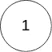

```
**Input:** head = [1], pos = -1
**Output:** no cycle
**Explanation:** There is no cycle in the linked list.
```

**约束:**

*   列表中的节点数量在范围`[0, 104]`内。
*   `-105 <= Node.val <= 105`
*   `pos`是链表中的`-1`或**有效索引**。

**跟进:**能否用`O(1)`(即常数)内存解决？

# 解决方案:→

在继续之前，我只是建议您先了解以下解决方案，

[](https://medium.com/@alexmurphyas8/leetcode-141-linked-list-cycle-solution-with-images-85da5369a0da) [## LeetCode 141。链表循环(带图像的解决方案)

### 链接:→https://leetcode.com/problems/linked-list-cycle/

medium.com](https://medium.com/@alexmurphyas8/leetcode-141-linked-list-cycle-solution-with-images-85da5369a0da) 

我们可以使用双指针方法来解决这个问题。

下图是从总体上理解它，

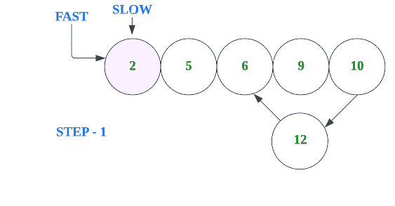

让我们用代码来理解，

首先，我们采用**慢速**和**快速**变量，它们指向给定链表的头部。


**— —第一次迭代— —**

现在，我们将进入 while 循环，慢速和快速移动，

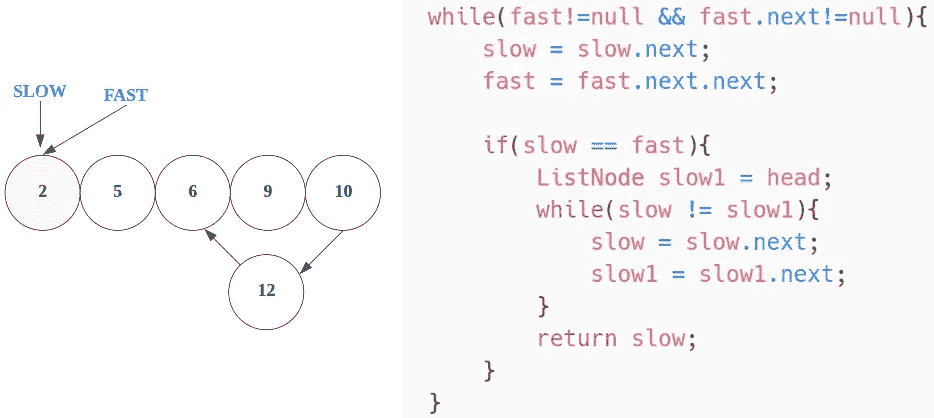

在这里，它将重复直到，**慢和快不会变成相同的**，

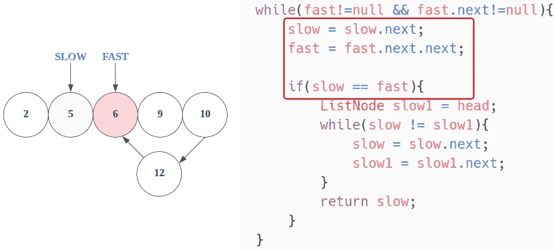

**— —第二次迭代— —**

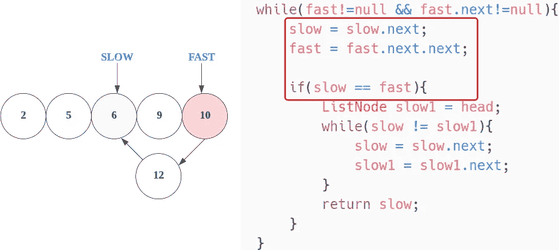

**— —第三次迭代— —**

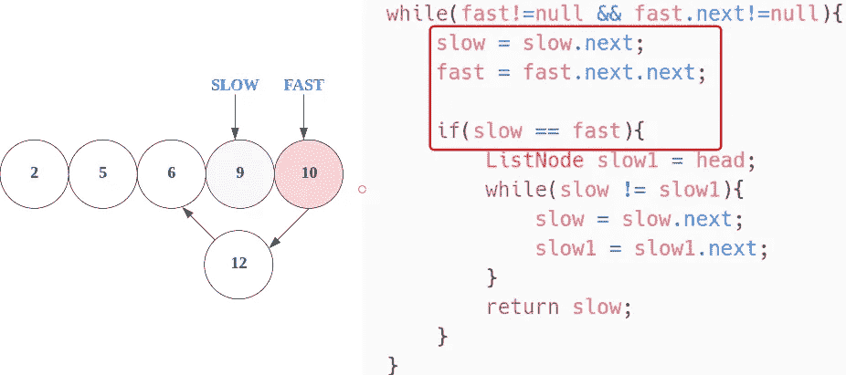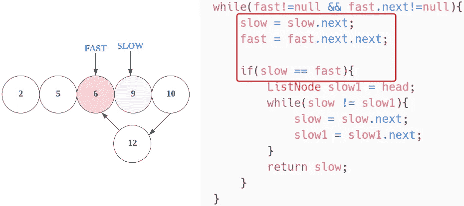

**— —第四次迭代— —**

这里，**慢和快**会变成**一样的**，所以我们会进入内 while 循环，

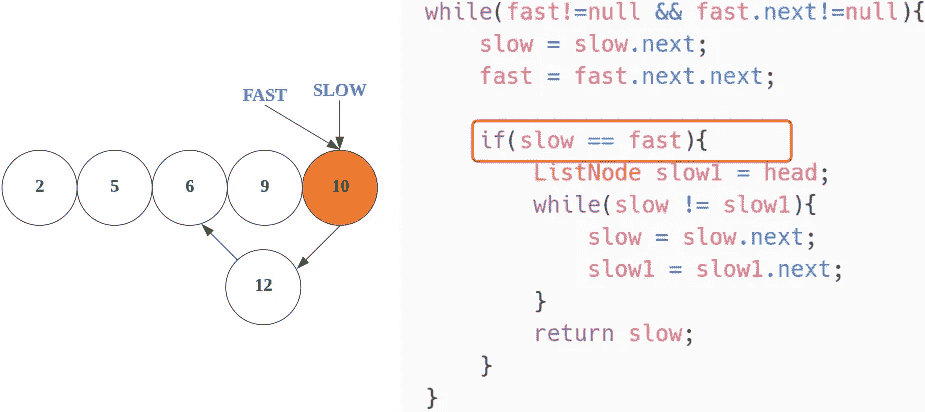

在这里，如果条件为真，

这里你可以看到，慢速指针指向的交叉节点是 L1+L2。

指向交叉节点的快速指针是 2(L1+L2 ),因为快速指针总是移动慢速指针步长的 2 倍。

当`slow`与`fast`相遇时，

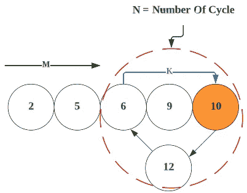

快速指针移动的距离= 2 *(慢速指针移动的距离)

```
(m + n*x + k) = 2*(m + n*y + k)x -->  Number of complete cyclic rounds made by 
       fast pointer before they meet first time

y -->  Number of complete cyclic rounds made by 
       slow pointer before they meet first time
```

现在，

```
(m + n*x + k) = 2*(m + n*y + k)--> m + nx + k = 2m + 2ny + 2k--> m + k = 2m + 2ny + 2k - nx--> 2m - m + 2k - k + 2ny - nx = 0--> m + k + n(2y -x) = 0--> **m + k = n(x - 2y)**Which means **m+k is a multiple of n**.
```

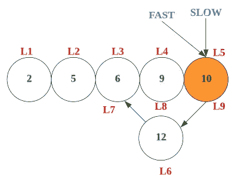

因此，如果我们以**相同的速度**再次移动两个指针，使得一个指针(例如 **slow1** )从链表的**头节点**开始，而其他指针(例如 **fast** )从会合点开始。

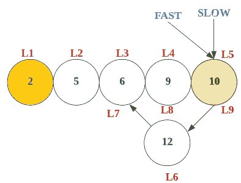

当 **slow1** 指针到达循环的起点(已经移动了 m 步)时， **fast** 也会移动 **m** 步，因为它们现在移动的速度相同。

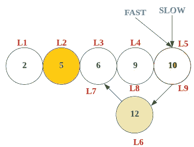

最后，他们在圆圈的起点相遇，

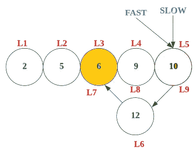

让我们再次用代码来理解，

现在，我们正在讨论另一个变量 Slow1，它指向 Head，

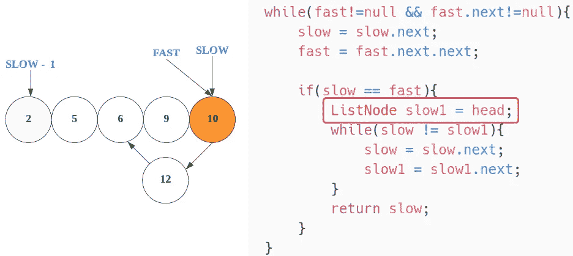

在内部 while 循环中，我们将迭代直到 slow1 和 slow 不相同，

**———内部 while 循环迭代 1————**

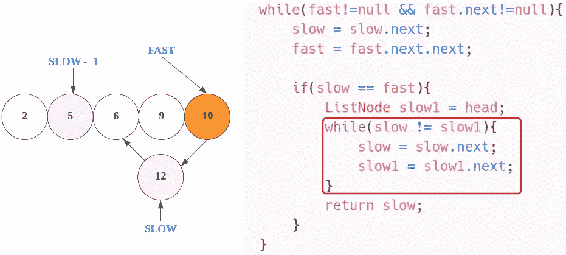

**———内部 while 循环迭代 2————**

这里，slow == slow1，

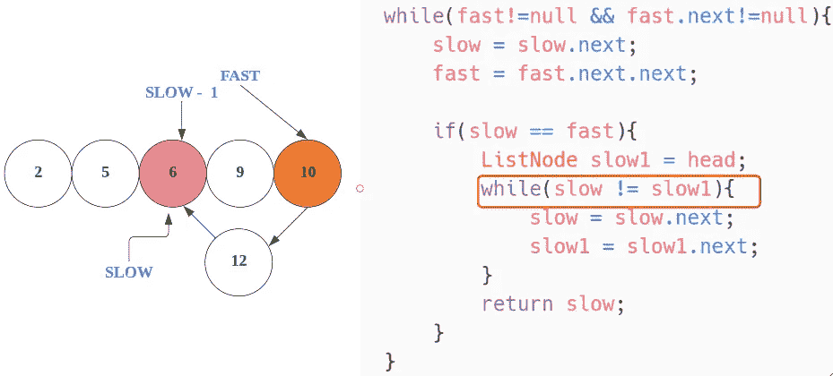

所以，**内 while 循环**被**终止**，将返回 slow，这将是我们的答案。

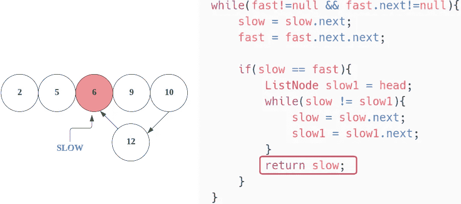

最后，**慢**是我们的答案。

现在，让我们看看完整的源代码，

# 代码(Java): →

# 代码(Python): →

# 时间复杂度

这里，我们遍历的是一个完整的链表，所以总的时间复杂度是 **O(n)** 。

# 空间复杂性

这里，我们只使用了三个变量，所以总的空间复杂度也将是 **O(1)** 。


感谢你阅读这篇文章，❤

如果这篇文章对你有帮助，请鼓掌👏这篇文章。

请在[媒体](https://medium.com/@alexmurphyas8)上关注我，我会像上面一样发布有用的信息。

insta gram→[https://www.instagram.com/alexmurphyas8/](https://www.instagram.com/alexmurphyas8/)

推特→[https://twitter.com/AlexMurphyas8](https://twitter.com/AlexMurphyas8)

如果我做错了什么？让我在评论中。我很想进步。