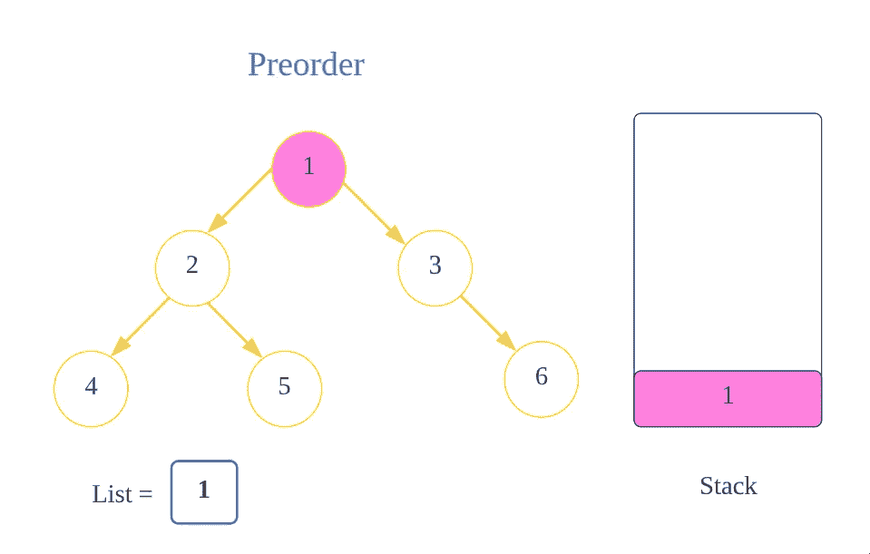
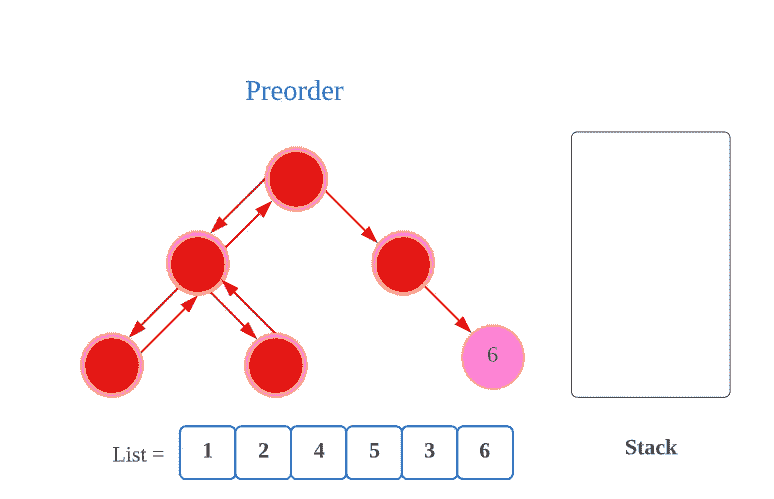

# LeetCode 144:二叉树前序遍历(带图像的解决方案)

> 原文：<https://blog.devgenius.io/leetcode-144-binary-tree-preorder-traversal-solution-with-images-4db702e5b722?source=collection_archive---------7----------------------->

链接:→[https://leet code . com/problems/二叉树-前序-遍历/](https://leetcode.com/problems/binary-tree-preorder-traversal/)

# 问题:→

给定二叉树的`root`，返回*其节点值*的前序遍历。

**例 1:**


```
**Input:** root = [1,null,2,3]
**Output:** [1,2,3]
```

**例 2:**

```
**Input:** root = []
**Output:** []
```

**例 3:**

```
**Input:** root = [1]
**Output:** [1]
```

**约束:**

*   树中的节点数量在范围`[0, 100]`内。
*   `-100 <= Node.val <= 100`

# 解决方案:→

不像线性数据结构(数组、链表、队列、堆栈等)只有一种逻辑方式来遍历它们，树可以用不同的方式来遍历。

> *遍历有:
> (a)* [*Inorder(左，根，右):4 2 5 1 3*](/leetcode-94-binary-tree-inorder-traversal-69ae4aa46547) *(b)前序(根，左，右):1 2 4 5 3
> (C)后序(左，右，根):4 5 2 3 1*


在问题中，很清楚地提到了我们必须通过 ***前置*** 的方式来做遍历。

我们先来了解一下什么是 ***预约*** 。

1.  访根。
2.  遍历左边的子树。
3.  遍历右边的子树。

→比如输入是**【1，2，3，4，5，6】**(如下图)
输出应该是**【1，2，4，5，3，6】**如下图，


让我们了解它将如何计算。

→首先，我们将尝试遍历树的左侧节点，并将这些值添加到**堆栈&列表**中，直到变空(NULL)。



下一步，


最后一步是，


现在，在这里的 **4，**如果我们去它的**左侧**，我们将得到**节点(空)**，因为在 **4 的左侧没有节点。**


由于我们已经找到了**空节点，**所以我们必须在这里停下来，我们将转到它的**前一个节点**，我们可以从**堆栈**中获取它。

用 **stack.pop()** 我们可以得到**顶节点**，也就是 **4** 。它将从**堆栈**中移除并且我们可以得到那个**节点**。


从**堆栈中获取**节点**后，**将遍历其右侧**。**

**当前节点**的**右侧**也是**空**，我们就此打住。


同样，我们需要后退，这可以通过使用**堆栈来实现。**

用 **stack.pop()** 我们可以得到**顶节点**，也就是 **2** 。它将从**堆栈**中移除**并且我们可以得到那个**节点**。**


从**栈(**即 **2)中获取**节点**后，**将遍历它的**右侧**。


现在，对于新的**节点**即 **5** ，我们将添加到**堆栈**和**列表**，然后我们将尝试先遍历它的**左侧**，但我们发现它为 **null** 。


现在，我们的**当前节点**变成了**空节点**，所以我们将尝试使用**堆栈来向后移动。**

用 **stack.pop()** 我们可以得到**顶部节点**(也就是 **5)** 。将**从**堆栈**中移除**，我们可以得到那个**节点**。


从**堆栈**中获取**节点**后，即 **5，**我们将遍历它的**右侧**。


现在，我们的**当前节点**变成了**空值**，所以我们将尝试使用**堆栈向后移动。**

用 **stack.pop()** 我们可以得到**顶节点**，也就是 **1** 。它将从**堆栈**中移除并且我们可以得到那个**节点**。


从**堆栈**中获取**节点**后，即 **1，**我们将遍历它的右侧**。**

****

**现在，对于新的**节点**，即 **3** ，我们将添加到**堆栈**和**列表**，然后我们将尝试先遍历它的**左侧**，但我们发现它是空的**。****

********

****现在，我们的**当前节点**变成了**空节点**，所以我们将尝试使用**堆栈向后移动。******

****用 **stack.pop()** 我们可以得到**顶节点(**也就是 **3)** 。它将从**堆栈**中移除**，我们可以获得那个**节点**。******

****

**在从**堆栈(**即 **3)** 中获取节点后，我们将遍历它的右侧。**

****

**现在，对于新的**节点**，也就是 **6** ，我们将添加到**堆栈**和**列表**，然后我们将尝试先遍历它的**左侧**，但是我们发现它是 **null** 。**

****

**现在，我们的**当前节点**变成了**空值**，所以我们将尝试使用**堆栈向后移动。****

**用 **stack.pop()** 我们可以得到**顶节点(**也就是 **6)** 。将**从**堆栈**中移除**，我们可以得到那个**节点**。**

****

**从**堆栈**中获取节点 **6、**后，我们将遍历其右侧**的**。**

****

**现在，**栈变成空的**，我们已经**遍历了所有节点**，所以我们将**停在**这里，我们可以**返回列表**，这是我们的**答案**。**

**现在，让我们看看完整的源代码。**

# **代码(Java): →**

# **代码(Python): →**

**感谢你阅读这篇文章，❤**

**如果我做错了什么？让我在评论中。我很想进步。**

**拍手声👏如果这篇文章对你有帮助。**