# LeetCode 160。两个链表的交集(带图像的解决方案)

> 原文：<https://blog.devgenius.io/leetcode-160-intersection-of-two-linked-lists-solution-with-images-e7e2508f358e?source=collection_archive---------4----------------------->

# 问题:→

给定两个单链表`headA`和`headB`的头，返回*两个链表相交的节点*。如果两个链表没有交集，返回`null`。

例如，下面两个链表在节点`c1`开始相交:

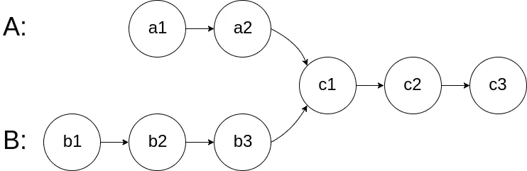

测试用例的生成使得整个链接结构中的任何地方都没有循环。

**注意**在函数返回后，链表必须**保持它们原来的结构**。

**自定义判断:**

给**判断**的输入如下(给定这些输入，你的程序是**而不是**):

*   `intersectVal` -交点所在节点的值。如果没有相交节点，这就是`0`。
*   `listA` -第一个链表。
*   `listB` -第二个链表。
*   `skipA` -在`listA`(从头开始)中向前跳过的节点数，以到达相交的节点。
*   `skipB` -在`listB`中向前跳过的节点数(从头开始)以到达相交的节点。

然后，法官将基于这些输入创建链接结构，并将两个头`headA`和`headB`传递给你的程序。如果你正确地返回了相交的节点，那么你的解将被**接受**。

**例 1:**


```
**Input:** intersectVal = 8, listA = [4,1,8,4,5], listB = [5,6,1,8,4,5], skipA = 2, skipB = 3
**Output:** Intersected at '8'
**Explanation:** The intersected node's value is 8 (note that this must not be 0 if the two lists intersect).
From the head of A, it reads as [4,1,8,4,5]. From the head of B, it reads as [5,6,1,8,4,5]. There are 2 nodes before the intersected node in A; There are 3 nodes before the intersected node in B.
- Note that the intersected node's value is not 1 because the nodes with value 1 in A and B (2nd node in A and 3rd node in B) are different node references. In other words, they point to two different locations in memory, while the nodes with value 8 in A and B (3rd node in A and 4th node in B) point to the same location in memory.
```

**例 2:**

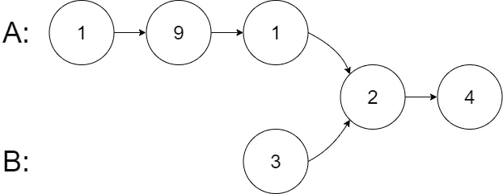

```
**Input:** intersectVal = 2, listA = [1,9,1,2,4], listB = [3,2,4], skipA = 3, skipB = 1
**Output:** Intersected at '2'
**Explanation:** The intersected node's value is 2 (note that this must not be 0 if the two lists intersect).
From the head of A, it reads as [1,9,1,2,4]. From the head of B, it reads as [3,2,4]. There are 3 nodes before the intersected node in A; There are 1 node before the intersected node in B.
```

**例 3:**

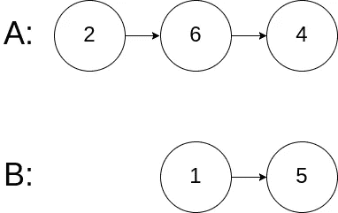

```
**Input:** intersectVal = 0, listA = [2,6,4], listB = [1,5], skipA = 3, skipB = 2
**Output:** No intersection
**Explanation:** From the head of A, it reads as [2,6,4]. From the head of B, it reads as [1,5]. Since the two lists do not intersect, intersectVal must be 0, while skipA and skipB can be arbitrary values.
Explanation: The two lists do not intersect, so return null.
```

**约束:**

*   `listA`的节点数在`m`中。
*   `listB`的节点数在`n`中。
*   `1 <= m, n <= 3 * 104`
*   `1 <= Node.val <= 105`
*   `0 <= skipA < m`
*   `0 <= skipB < n`
*   若`listA`与`listB`不相交，则`intersectVal`为`0`。
*   `intersectVal == listA[skipA] == listB[skipB]`如果`listA`和`listB`相交。

**跟进:**你能写一个在`O(m + n)`时间内运行并且只使用`O(1)`内存的解决方案吗？

# 解决方案:→

让我们看看下图的解决方案，我们可以得到一个想法，如何解决我们可以得到的，

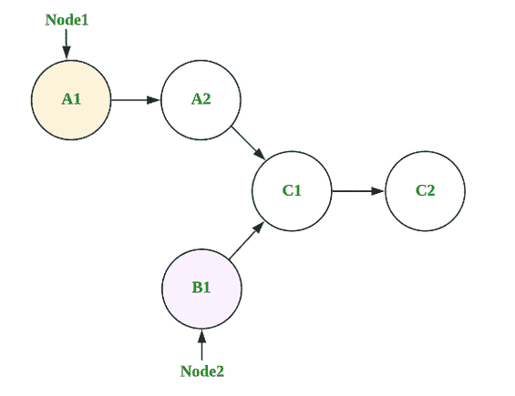

让我们用代码来理解，

在代码中，他们给出了两个链表 **head1** 和 **head2，**我们需要首先检查它们中的任何一个或者两个是否为空，如果是，那么我们将简单地返回 null。

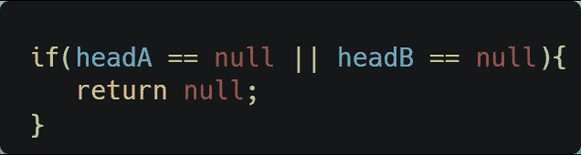

现在，下一步，在 head1 和 head2 初始化两个指针 node1 和 node2。

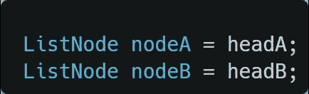

现在，我们需要遍历两个链表以获得**交集**，我们将执行 while 循环，并在 **nodeA** 和 **nodeB** 变得相同时停止它。

将**节点 1 视为节点 A** ，将**节点 2 视为节点 B**

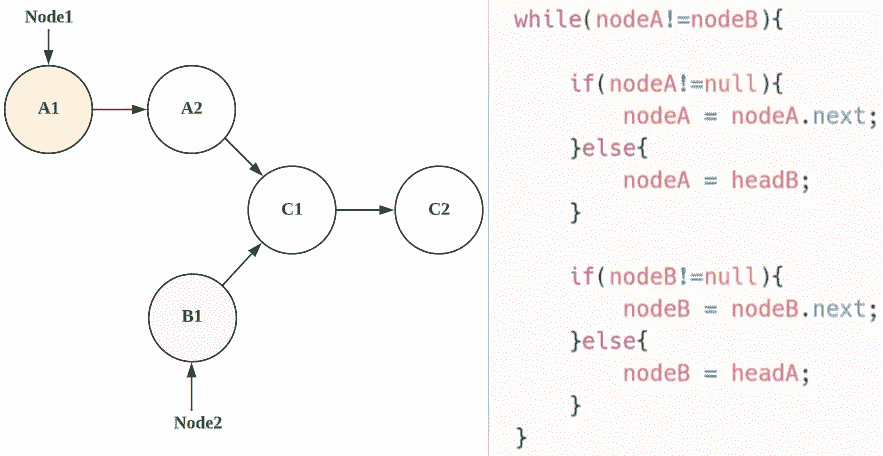

## 第一次迭代，

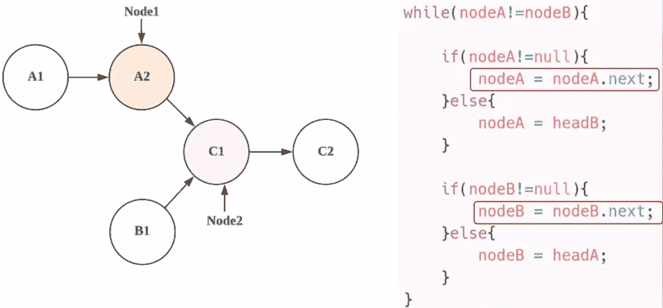

## 第二次迭代，

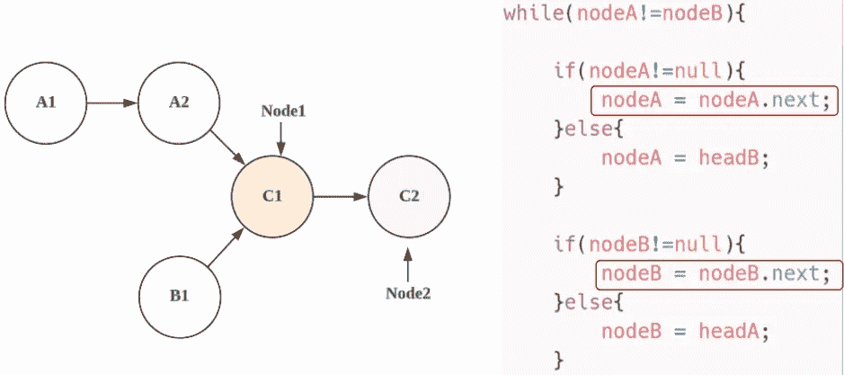

## 第三次迭代，

这里，nodeB 的 next 为空，所以我们将 nodeB 指向 headA，

> 注意:→这里我们可以用 **headB** 指向 **nodeB** ，但是在这种情况下，迭代会更多，所以为了快速得到结果，我们用 **headA** 指向 **nodeB** ，用 **headB** 指向 **nodeA** 。

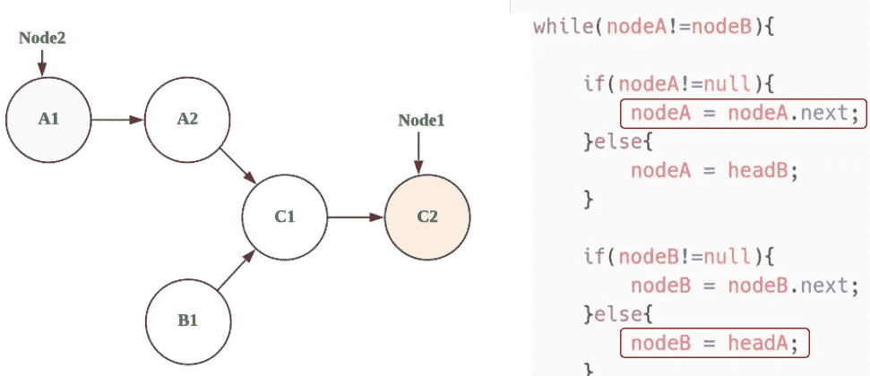

## 第四次迭代，

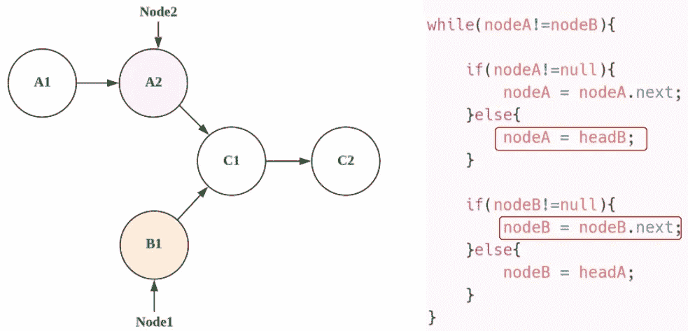

## 第五次迭代，

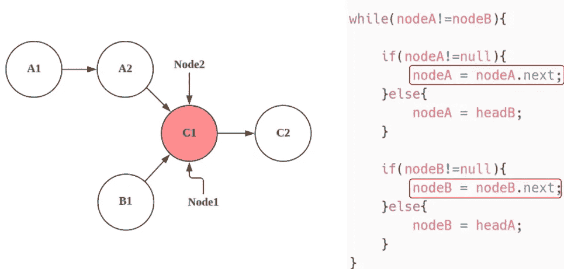

## 第六次迭代，

这里，虽然条件将变成**假，**

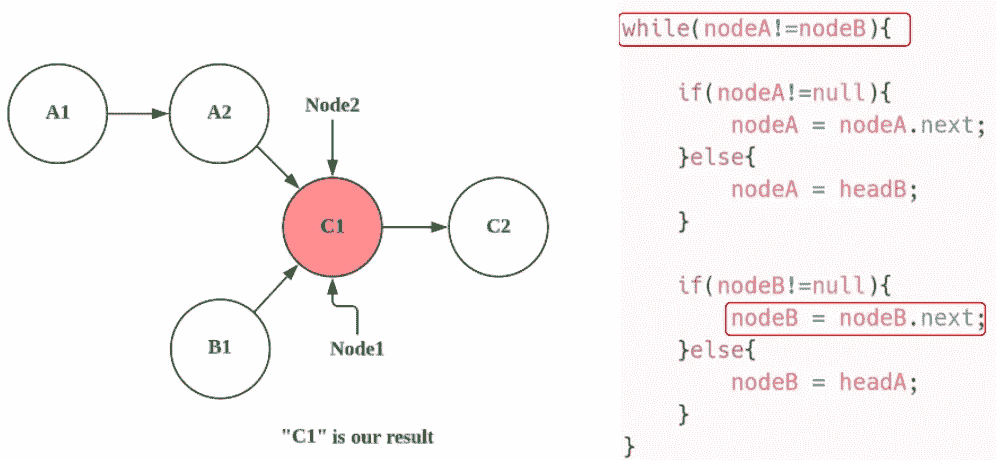

最后，我们可以返回任何节点，因为两个节点包含相同的值，

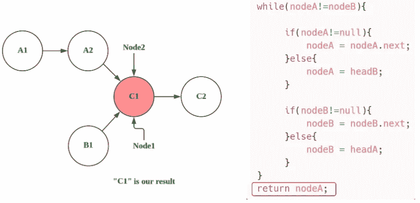

最后， **nodeA** 是我们的答案。

现在，让我们看看完整的源代码，

# 代码(Java): →

# 代码(Python): →

# 时间复杂度

在这里，我们遍历一个两链表，所以总的时间复杂度是 **O(m+n)** 。

# 空间复杂性

这里，我们只使用了两个变量，所以总的空间复杂度也将是 **O(1)** 。


感谢你阅读这篇文章，❤

如果这篇文章对你有帮助，请鼓掌👏这篇文章。

请在[媒体](https://medium.com/@alexmurphyas8)上关注我，我会像上面一样发布有用的信息。

insta gram→[https://www.instagram.com/alexmurphyas8/](https://www.instagram.com/alexmurphyas8/)

推特→【https://twitter.com/AlexMurphyas8 

如果我做错了什么？让我在评论中。我很想进步。