# LeetCode 169。多数元素(带图像的解决方案)

> 原文：<https://blog.devgenius.io/leetcode-169-majority-element-solution-with-images-7abab996e95e?source=collection_archive---------5----------------------->

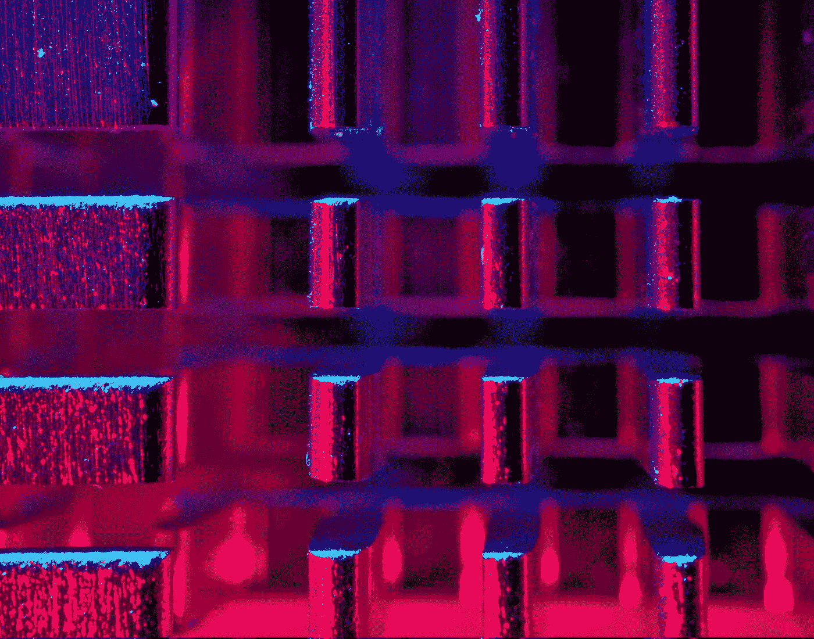

迈克尔·泽兹奇在 [Unsplash](https://unsplash.com?utm_source=medium&utm_medium=referral) 上拍摄的照片

# 问题:→

给定大小为`n`的数组`nums`，返回*多数元素*。

多数元素是出现超过`⌊n / 2⌋`次的元素。您可以假设多数元素总是存在于数组中。

**例 1:**

```
**Input:** nums = [3,2,3]
**Output:** 3
```

**例 2:**

```
**Input:** nums = [2,2,1,1,1,2,2]
**Output:** 2
```

**约束:**

*   `n == nums.length`
*   `1 <= n <= 5 * 104`
*   `-109 <= nums[i] <= 109`

**追问:**你能在线性时间和`O(1)`空间中解决这个问题吗？

# 解决方案:→

让我们看看下图的解决方案，我们可以得到一个想法，如何解决我们可以得到的，

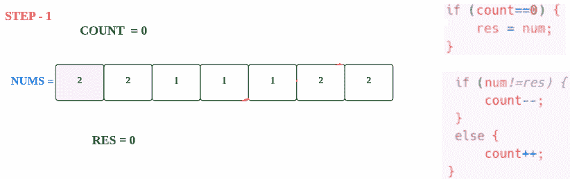

让我们用代码来理解，

这里，提供了一个大小为`n`的数组`nums`，我们需要返回*多数元素*。

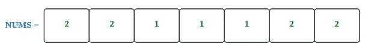

这里，我们首先取两个变量，

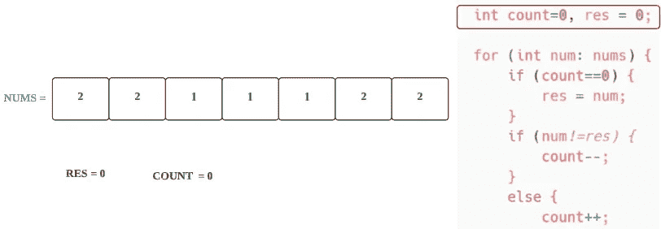

为了获得*多数重复元素* **，我们需要遍历所有元素** *。*

> 对于第一个元素，

**步骤 1.1**

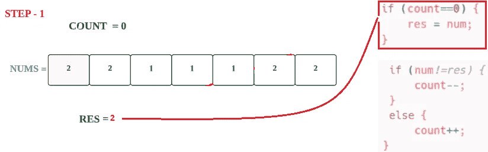

**步骤 1.2**

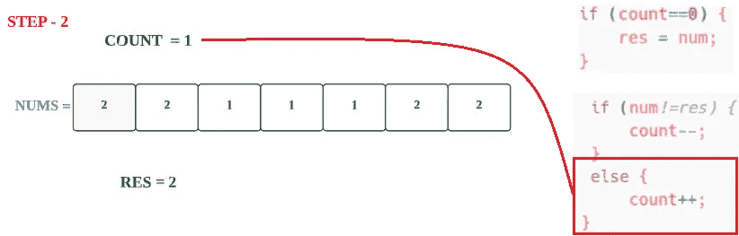

> 对于第二个元素

**步骤 2.1**

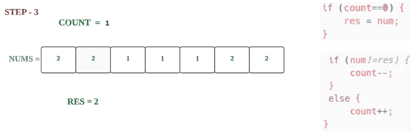

**步骤 2.2**

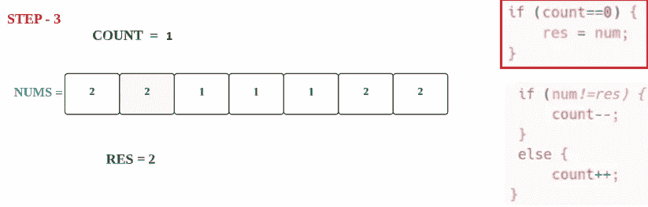

**步骤 2.3**

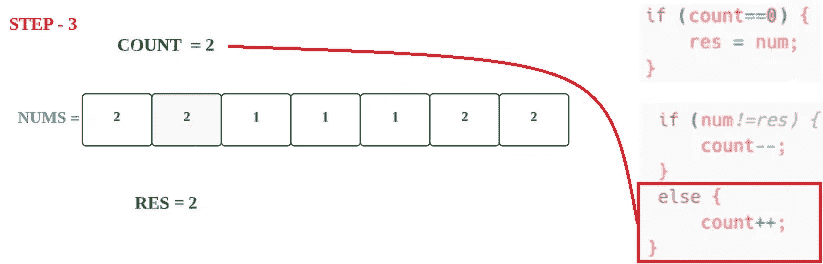

> 对于第三个元素

**步骤 3.1**

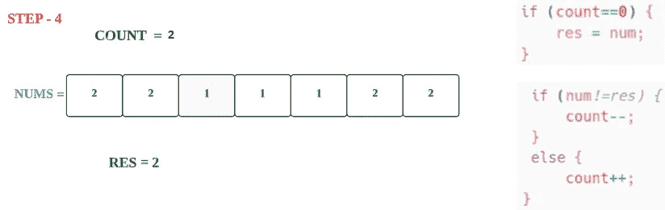

**步骤 3.2**

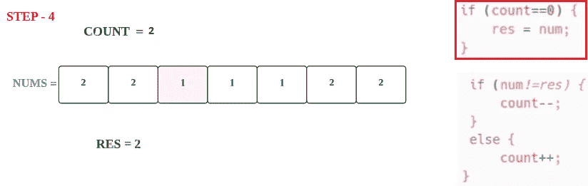

**步骤 3.3**

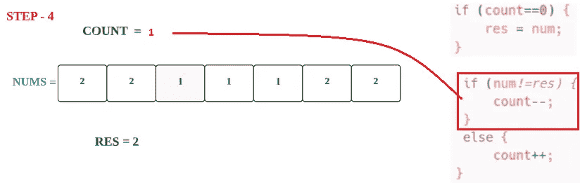

> 对于第四个元素

**步骤 4.1**

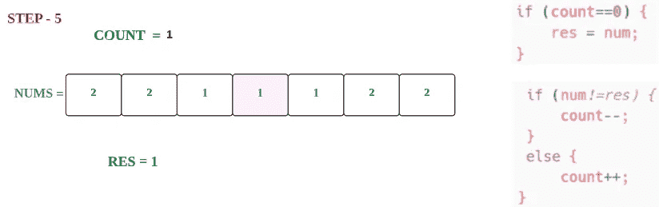

**步骤 4.2**

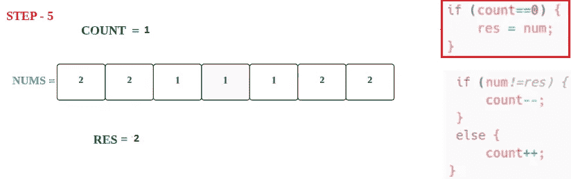

**步骤 4.3**

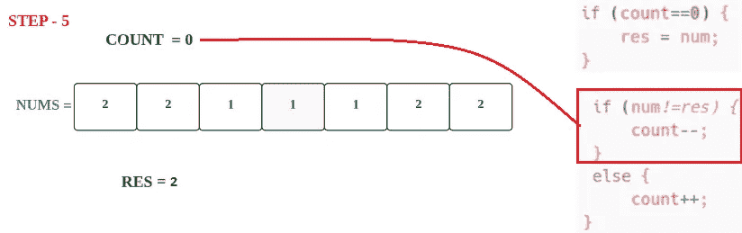

> 对于第五元素

**步骤 5.1**


**第 5.2 步**

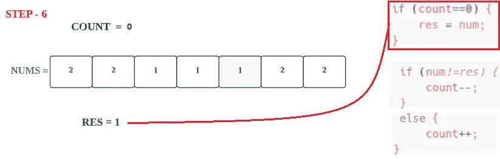

**第 5.3 步**

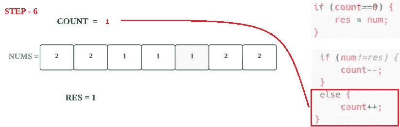

> 对于第六个元素

**步骤 6.1**


**步骤 6.2**

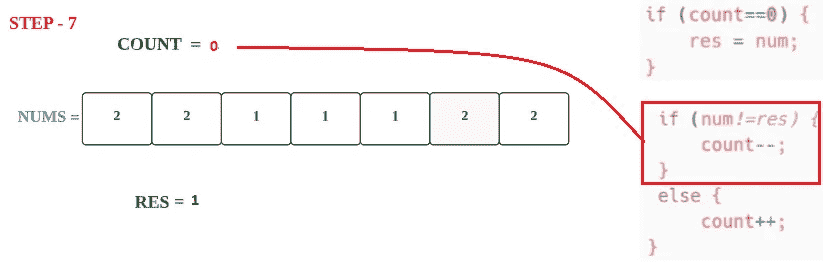

> 对于第七个元素

**步骤 7.1**

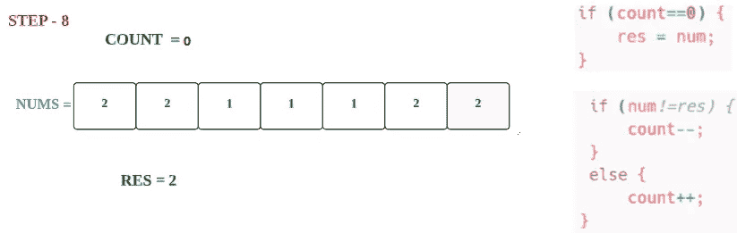

**步骤 7.2**

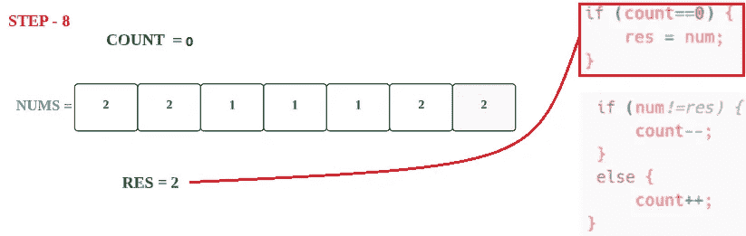

**步骤 7.3**

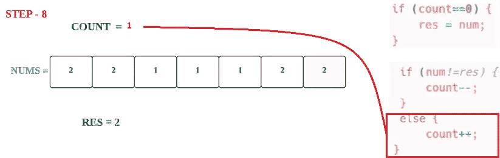

最后，我们迭代了所有元素，所以结果是 **RES → 2。**

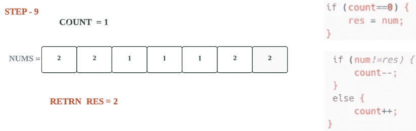

最后， **2** 是我们的答案。

现在，让我们看看完整的源代码，

# 代码(Java): →

# 代码(Python): →

# 时间复杂度

这里，我们遍历整个数组，所以总的时间复杂度将是 O(n) 。

# 空间复杂性

这里，我们只使用了两个变量，所以总的空间复杂度也将是 **O(1)** 。


感谢你阅读这篇文章，❤

如果这篇文章对你有帮助，请鼓掌👏这篇文章。

请在[媒体](https://medium.com/@alexmurphyas8)上关注我，我会像上面一样发布有用的信息。

insta gram→【https://www.instagram.com/alexmurphyas8/ 

推特→[https://twitter.com/AlexMurphyas8](https://twitter.com/AlexMurphyas8)

如果我做错了什么？让我在评论中。我很想进步。