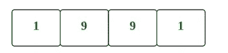
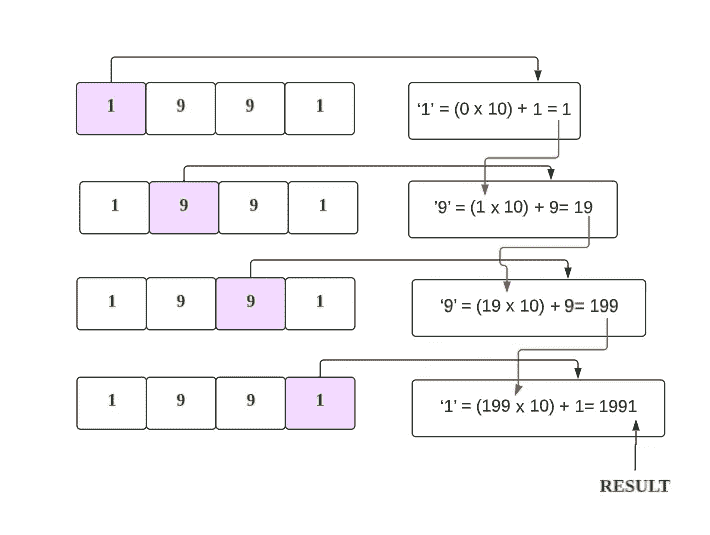
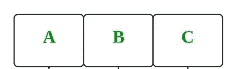
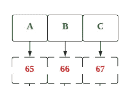
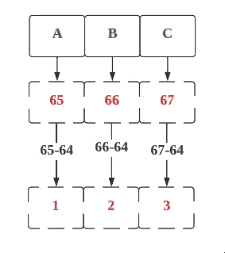

# LeetCode 171。Excel 表格列号(带图像的解决方案)

> 原文：<https://blog.devgenius.io/leetcode-171-excel-sheet-column-number-solution-with-images-f32efb5b75dc?source=collection_archive---------6----------------------->


照片由[卢卡斯·布拉塞克](https://unsplash.com/es/@goumbik?utm_source=medium&utm_medium=referral)在 [Unsplash](https://unsplash.com?utm_source=medium&utm_medium=referral) 上拍摄

# 问题:→

给定一个表示 Excel 表中出现的列标题的字符串`columnTitle`，返回*其对应的列号*。

例如:

```
A -> 1
B -> 2
C -> 3
...
Z -> 26
AA -> 27
AB -> 28 
...
```

**例 1:**

```
**Input:** columnTitle = "A"
**Output:** 1
```

**例 2:**

```
**Input:** columnTitle = "AB"
**Output:** 28
```

**例 3:**

```
**Input:** columnTitle = "ZY"
**Output:** 701
```

**约束:**

*   `1 <= columnTitle.length <= 7`
*   `columnTitle`只由大写英文字母组成。
*   `columnTitle`在`["A", "FXSHRXW"]`范围内。

# 解决方案:→

首先我们将得到字符串输入，这些是字符，所以我们需要一个接一个地得到字符，并把它转换成十进制数，

如下图所示，


为了容易理解，让我们举一个例子，

如果我们想找到字符串“1991”的十进制值，



我们可以通过从左到右遍历字符串来迭代地找到数字，如下所示:



理解了上面的例子后，让我们以 ABC 为例



转换成 ASCII 码，



为了简化，



所以，

> A → 1…..Z → 26


现在，让我们看看完整的源代码，

# 代码(Java): →

# 代码(Python): →

# 时间复杂度

这里，我们遍历整个字符串，所以总的时间复杂度将是 **O(n)** 。

# 空间复杂性

这里，我们只使用了一个变量，所以总的空间复杂度也将是 **O(1)** 。


感谢你阅读这篇文章，❤

如果这篇文章对你有帮助，请鼓掌👏这篇文章。

请在[媒体](https://medium.com/@alexmurphyas8)上关注我，我会像上面一样发布有用的信息。

insta gram→[https://www.instagram.com/alexmurphyas8/](https://www.instagram.com/alexmurphyas8/)

推特→[https://twitter.com/AlexMurphyas8](https://twitter.com/AlexMurphyas8)

如果我做错了什么？让我在评论中。我很想进步。