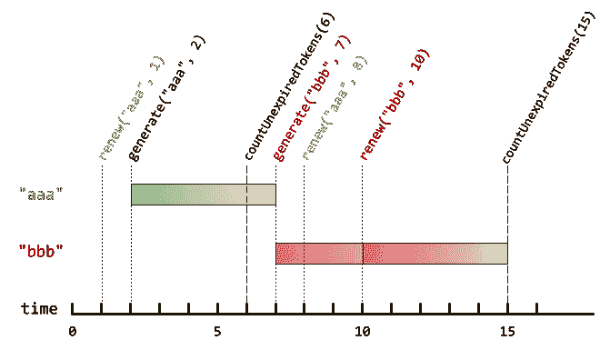

# Leetcode 1797。设计认证经理—双周竞赛 48

> 原文：<https://blog.devgenius.io/leetcode-1797-design-authentication-manager-biweekly-contest-48-8ef4d82a220d?source=collection_archive---------4----------------------->

今天，我们将解决名为认证管理器的问题。


# 问题陈述

有一个使用身份验证令牌的身份验证系统。对于每个会话，用户将收到一个新的身份验证令牌，该令牌将在`currentTime`后的`timeToLive`秒到期。如果令牌被更新，则到期时间将**延长**到(可能不同)`currentTime`后`timeToLive`秒到期。

实现`AuthenticationManager`类:

*   `AuthenticationManager(int timeToLive)`构造`AuthenticationManager`并设置`timeToLive`。
*   `generate(string tokenId, int currentTime)`在给定的`currentTime`秒内用给定的`tokenId`生成新令牌。
*   `renew(string tokenId, int currentTime)`在给定的`currentTime`以秒为单位用给定的`tokenId`更新**未到期的**令牌。如果给定的`tokenId`没有未到期的令牌，则请求被忽略，并且什么也不发生。
*   `countUnexpiredTokens(int currentTime)`返回给定当前时间未到期的**令牌的数量。**

注意，如果令牌在时间`t`到期，并且另一个动作在时间`t` ( `renew`或`countUnexpiredTokens`)发生，则到期发生在其他动作的之前的**。**

**例 1:**



```
**Input**
["AuthenticationManager", "renew", "generate", "countUnexpiredTokens", "generate", "renew", "renew", "countUnexpiredTokens"]
[[5], ["aaa", 1], ["aaa", 2], [6], ["bbb", 7], ["aaa", 8], ["bbb", 10], [15]]
**Output**
[null, null, null, 1, null, null, null, 0]**Explanation**
AuthenticationManager authenticationManager = new AuthenticationManager(5); // Constructs the AuthenticationManager with timeToLive = 5 seconds.
authenticationManager.renew("aaa", 1); // No token exists with tokenId "aaa" at time 1, so nothing happens.
authenticationManager.generate("aaa", 2); // Generates a new token with tokenId "aaa" at time 2.
authenticationManager.countUnexpiredTokens(6); // The token with tokenId "aaa" is the only unexpired one at time 6, so return 1.
authenticationManager.generate("bbb", 7); // Generates a new token with tokenId "bbb" at time 7.
authenticationManager.renew("aaa", 8); // The token with tokenId "aaa" expired at time 7, and 8 >= 7, so at time 8 the renew request is ignored, and nothing happens.
authenticationManager.renew("bbb", 10); // The token with tokenId "bbb" is unexpired at time 10, so the renew request is fulfilled and now the token will expire at time 15.
authenticationManager.countUnexpiredTokens(15); // The token with tokenId "bbb" expires at time 15, and the token with tokenId "aaa" expired at time 7, so currently no token is unexpired, so return 0.
```

**约束:**

*   `1 <= timeToLive <= 108`
*   `1 <= currentTime <= 108`
*   `1 <= tokenId.length <= 5`
*   `tokenId`只由小写字母组成。
*   所有对`generate`的调用将包含`tokenId`的唯一值。
*   所有函数调用中的`currentTime`值将为**严格递增**。
*   最多`2000`调用所有函数的组合。

# 解决办法

这是设计问题。我们需要创建一个 AuthenticationManager。上面的问题陈述中给出了要求。一旦我们阅读了需求，我们就可以着手解决方案。我们将讨论解决这个问题的整个想法，然后，我们将研究所有的方法。

为了跟踪每个`tokenId`的`tokenId` 和`expirationTime` ，我们将使用一个`HashMap`。我们将把`tokenId` 存储为键，把`expirationTime` 存储为值。

*   `AuthenticationManager` —我们初始化`HashMap` 和`timeToLive`(到期时间)。
*   `generate` —生成新令牌。到期时间应该是`currentTime+timeToLive`。
*   `renew` —如果令牌未过期，它会续订令牌。如果没有过期，那么我们可以将`expirationTime` 更新为`currentTime+timeToLive`。
*   `countUnexpiredTokens` —我们必须计算未到期的令牌。因此，为了方便起见，我们还将删除过期的令牌(所有函数调用中的`currentTime`的值将是**严格递增的**)并返回有效令牌的大小(未过期)。

下面给出了 java 代码。

**复杂性分析(时间复杂性)**

*   `AuthenticationManager` — O(1)
*   `generate` — O(1)
*   `renew` —O(1)
*   `countUnexpiredTokens` — O(n)

**复杂性分析(空间复杂性)**

O(n)因为我们用的是`HashMap`。

代码可以在下面的存储库中找到。

[](https://github.com/sksaikia/LeetCode/blob/main/src/LC1701_1800/LC1797.java) [## sksaikia/LeetCode

### 在 GitHub 上创建一个帐户，为 sksaikia/LeetCode 开发做贡献。

github.com](https://github.com/sksaikia/LeetCode/blob/main/src/LC1701_1800/LC1797.java)