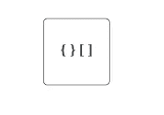
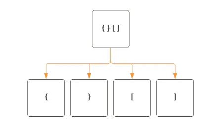
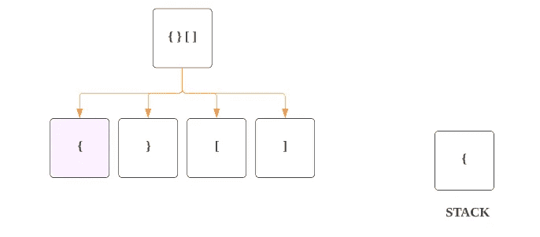
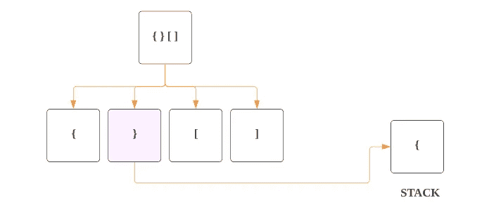
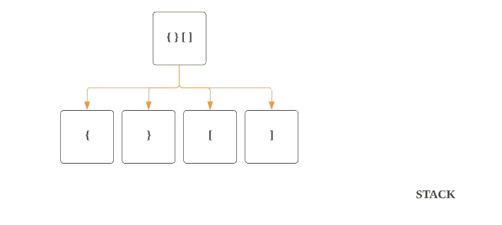
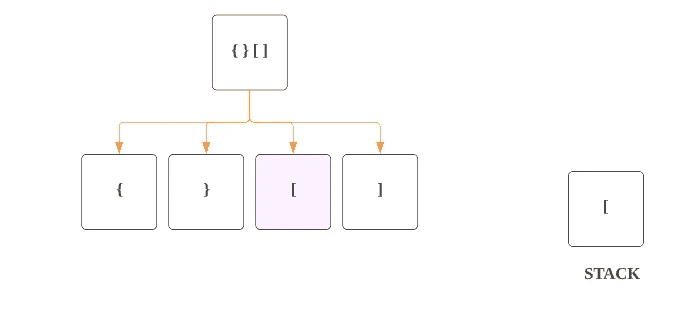
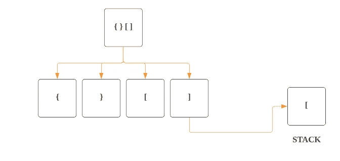
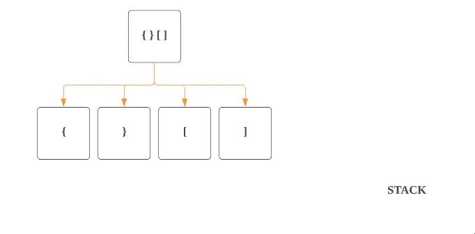

# LeetCode — 20:有效括号(用图像获取解决方案)

> 原文：<https://blog.devgenius.io/leetcode-20-valid-parentheses-c63972c6f50b?source=collection_archive---------1----------------------->

链接:→[https://leetcode.com/problems/valid-parentheses/](https://leetcode.com/problems/valid-parentheses/)

# **问题:→**

给定一个仅包含字符`'('`、`')'`、`'{'`、`'['`和`']'`的字符串`s`，确定输入的字符串是否有效。

在以下情况下，输入字符串有效:

1.  左括号必须用相同类型的括号括起来。
2.  左括号必须以正确的顺序结束。

**例 1:**

```
**Input:** s = "()"
**Output:** true
```

**例二:**

```
**Input:** s = "()[]{}"
**Output:** true
```

**例 3:**

```
**Input:** s = "(]"
**Output:** false
```

**约束:**

*   `1 <= s.length <= 104`
*   `s`仅由括号组成`'()[]{}'`。

# **回答:→**

我们将从左到右遍历字符串`s`,看看左右括号是否与它们对应的部分匹配。

1.  我们将从左到右遍历字符串。
2.  如果我们遇到左/左括号，那么我们将把它推到 ***栈*** ，因为它有`Last In First Out (LIFO)`属性。
3.  如果我们遇到任何右括号，我们将使用堆栈的`top`来检查它。如果它是正确的相应左/左括号，我们将进一步移动，否则我们将返回 false。
4.  最后，对于有效的字符串，堆栈应该是空的，因为所有的左括号都应该与右括号匹配。

让我们通过例子来理解:

假设您有字符串“ **{ } [ ]** ”



作为第一步，我们将从左到右遍历字符串。



作为第二步，如果我们遇到左/左括号，那么我们将把它推到 ***栈***



第三步，如果我们遇到任何右/右括号，我们将用堆栈的`top`检查它。如果它是正确的相应左/左括号，我们将进一步移动，否则我们将返回 false。



在上图中你可以看到，现在我们得到了右括号 **"}"** ，在我们的堆栈中已经有了相对的括号 **"{ "，**，所以我们将**从堆栈中弹出**。由于堆栈只有一个条目，它将是空的，如下图所示。



现在我们的第三个值是 **"["** ，它是左/左括号，然后我们将把它推到 ***堆栈中。*** *如下图所示。*



如下图所示，现在我们得到了右括号 **"]"** ，在堆栈中我们已经有了相对的括号 **"["，**，所以我们将**从堆栈中弹出**。



由于堆栈只有一个条目，它将是空的，如下图所示。



最后，对于有效的字符串，**堆栈**应该为**空**，因为所有的左括号都应该与右括号匹配。

对于我们的例子“ **{ } [ ]** ”，我们的栈是空的，所以它是有效的括号。

**代码(Python):**

**代码(Java):**

# 时间复杂度

我们遍历整个字符串一次，所以如果字符串有 **n** 个字符，那么时间复杂度将是 ***O(n)*** 。

# 空间复杂性

我们使用堆栈来存储字符串中的字符，所以对于 **n 个**数字或字符的空间复杂度将是**O(n)**。

感谢你阅读这篇文章，❤

如果我做错了什么？让我在评论中。我很想进步。

拍手声👏如果这篇文章对你有帮助。