# LeetCode — 21。合并两个排序列表(用图像获得解决方案)

> 原文：<https://blog.devgenius.io/leetcode-21-merge-two-sorted-lists-f290ef5d21e9?source=collection_archive---------0----------------------->

链接:→[https://leetcode.com/problems/merge-two-sorted-lists/](https://leetcode.com/problems/merge-two-sorted-lists/)

# 问题:→

给你两个排序链表的头`list1`和`list2`。

将两个列表合并成一个**排序的**列表。应该通过将前两个列表的节点拼接在一起来制作列表。

返回*合并链表*的头。

**例 1:**


```
**Input:** list1 = [1,2,4], list2 = [1,3,4]
**Output:** [1,1,2,3,4,4]
```

**例 2:**

```
**Input:** list1 = [], list2 = []
**Output:** []
```

**例 3:**

```
**Input:** list1 = [], list2 = [0]
**Output:** [0]
```

**约束:**

*   两个列表中的节点数量都在`[0, 50]`范围内。
*   `-100 <= Node.val <= 100`
*   `list1`和`list2`都按照**非递减**的顺序排序。

**解决方案:→**

在这里，我们需要遵循以下步骤，让我用图片展示给你。

1.  检查任何链接列表是否为空。如果是，那么返回另一个。

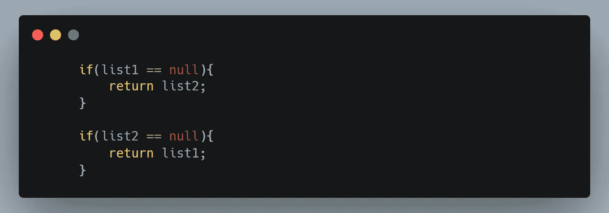

2.现在这里我们将带另外两个链表，第一个是 **head** 另一个是 **temp** ，这里 **temp** 将用于填充结果链表， **head** 将是 **temp** 链表的第一个节点(head)。

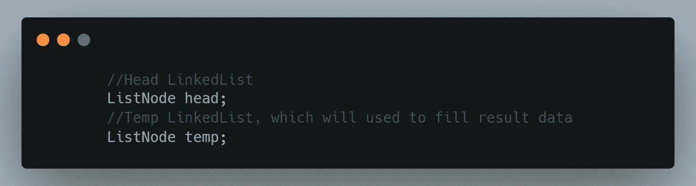

3.我们已经存在两个链表(list1，list2)，假设它们填充了下面的值。

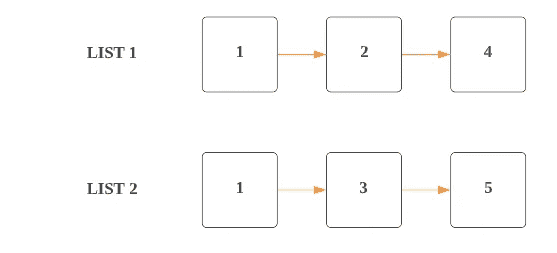

4.因为我们需要得到升序排列的链表，我们将用最低值填充链表，所以我们将检查两个链表中哪个链表在第一个节点上具有最低值。

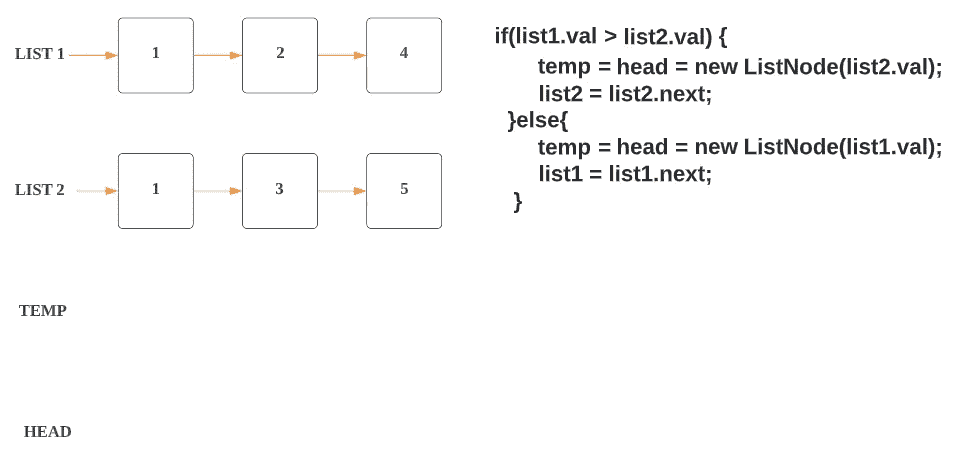

5.这里 **list1.val** 和 **list2.val** 都有 **1。**

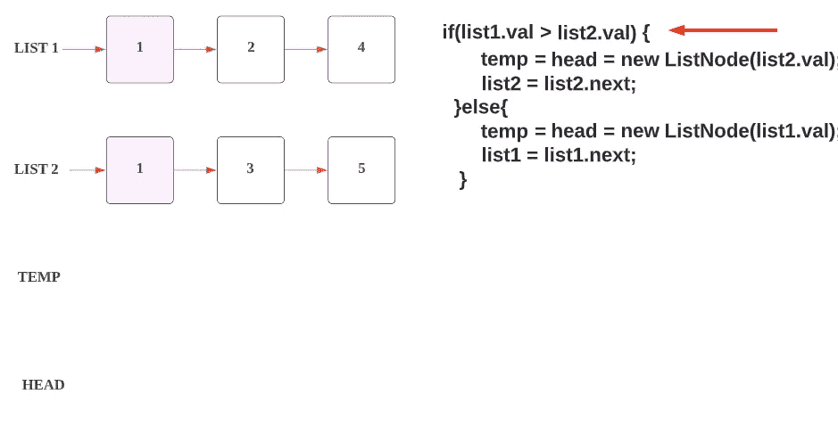

6.所以我们将把 **list1.val** 附加到 **head** 和 **temp** 链表中。

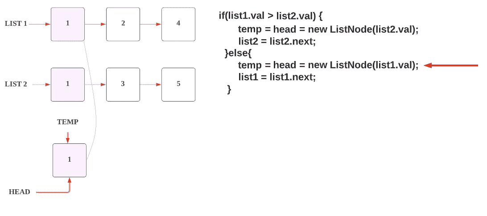

7.在从 **list1** 到 **temp** 以及 **head** 链表中填充数据后，我们将移动到 list1 的下一个节点。

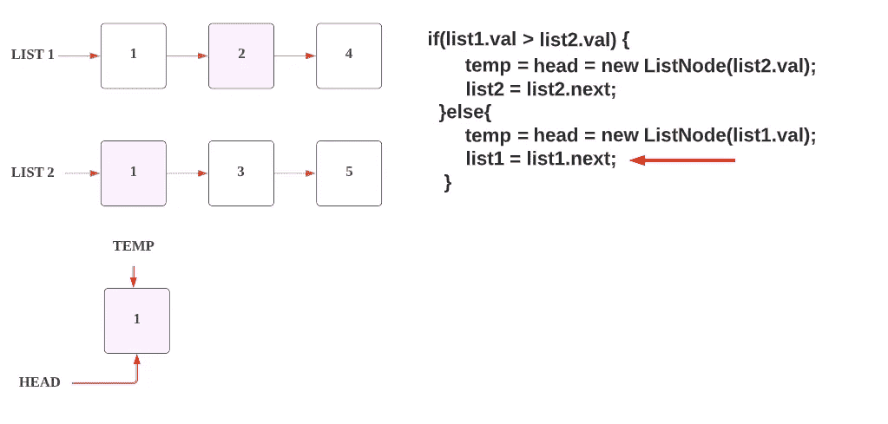

8.现在我们转移到另一个条件，即**而**循环，在这里我们将遍历，直到两个链表都到达尾部(结束)。

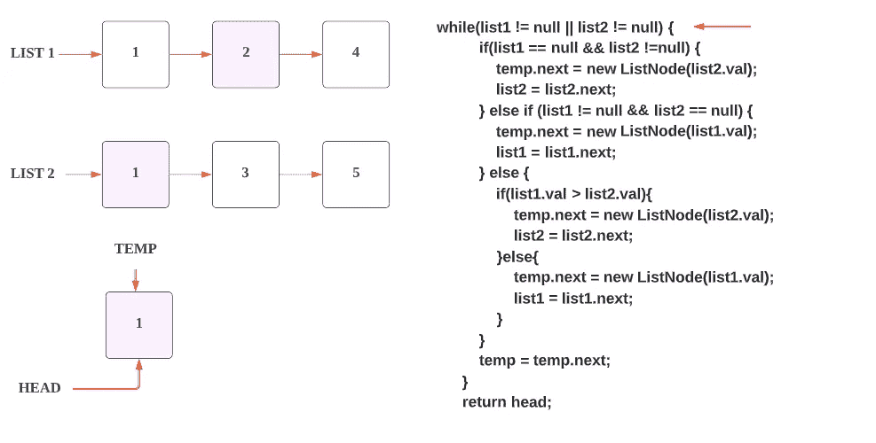

9.现在如上步骤 5，我们正在检查哪个链表有较小的值，我们将首先填充它。这里**列表 2** 的值 **1** 小于**列表 1** 的值 **2** 。

我们将把那个值附加到 **temp** 链表的下一个节点**。**

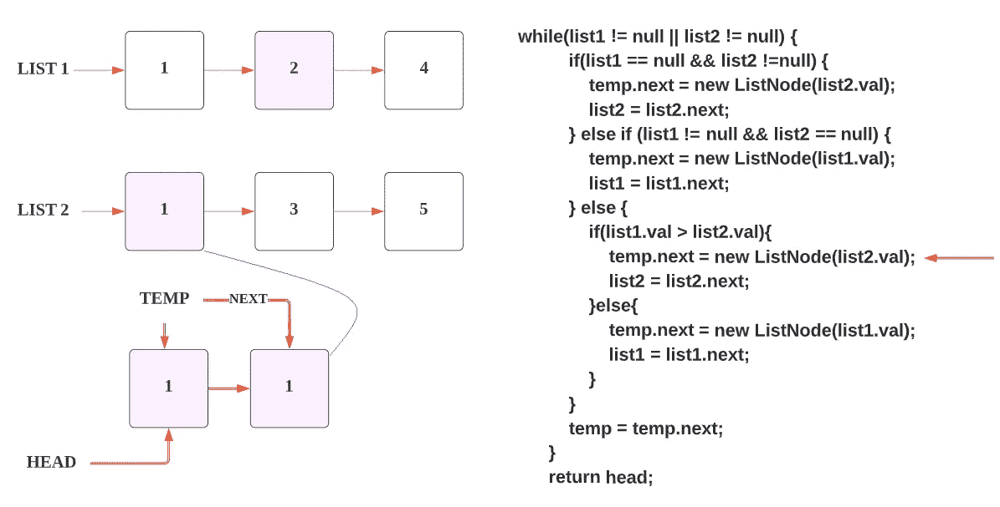

10.由于我们从**列表 2** 中获得了值，现在我们在链接的**列表 2** 中向前移动，或者你可以说，我们指向**列表 2 的下一个节点。**

11.之后，我们指向 temp 的下一个节点。


12.现在，我们再次重复这些步骤，哪个节点具有较小的值，我们将把它附加到**临时**链表的下一个节点，如下图所示。

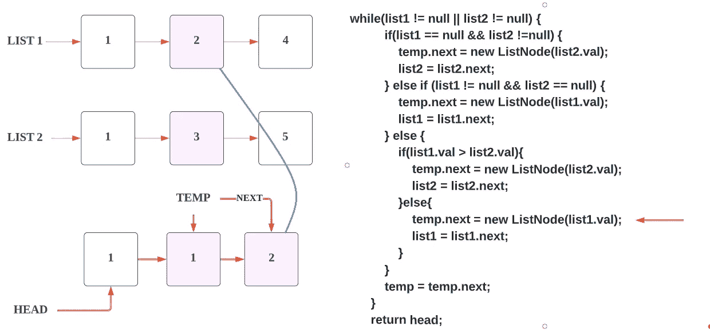

13.如上图所示， **list1** 的值较小，为 **2** ，所以我们追加到 **temp** 链表中。

14.现在我们在链表 1 的下一个节点 **4** 中前进。

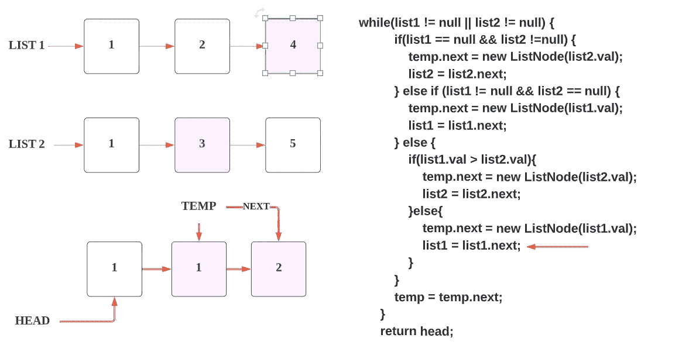

15.现在，我们在**临时**链表中前进。

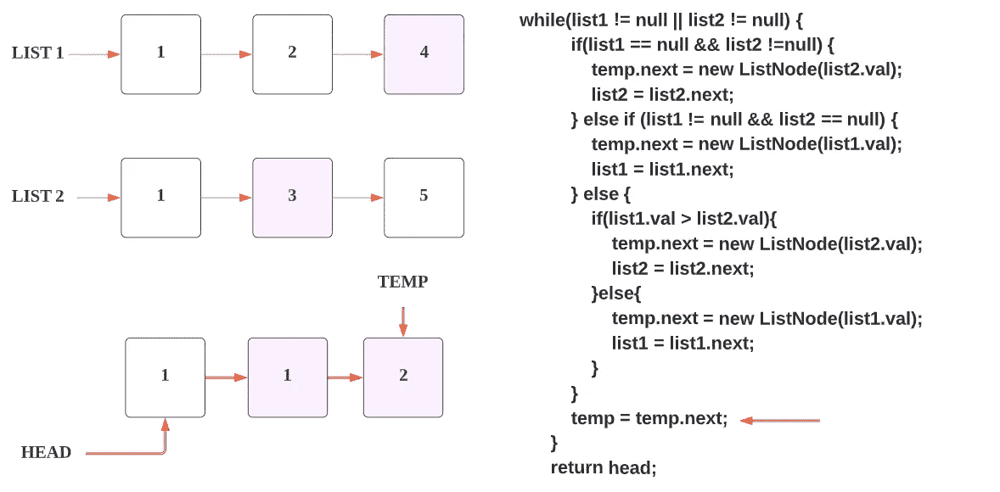

16.如上图所示， **list2** 的值较小，为 **3** ，所以我们追加到 **temp** 链表的下一个节点。

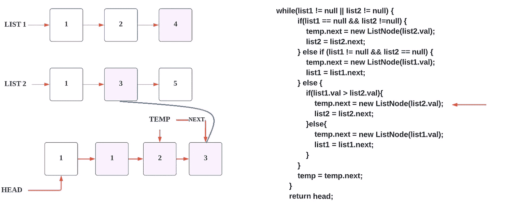

17.现在我们在链接的**列表 2** 的下一个节点 **5** 中前进。


18.现在，我们在**临时**链表中前进。

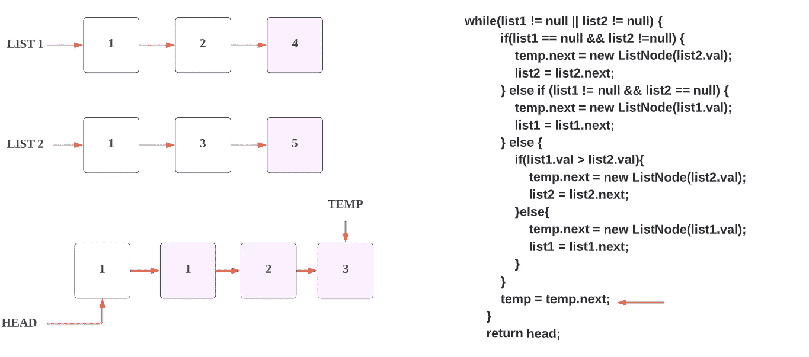

19.如上图所示， **list1** 的值较小，为 **4** ，所以我们追加到 **temp** 链表的下一个节点。

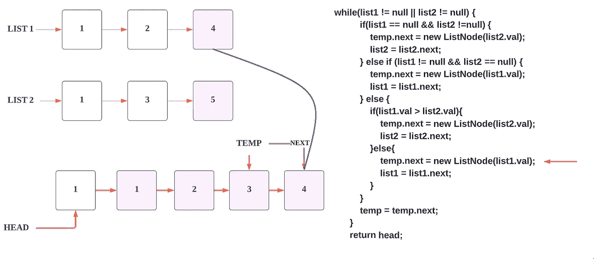

20.现在，我们在链接的**列表 1** 的下一个节点 **NULL 中前进。**

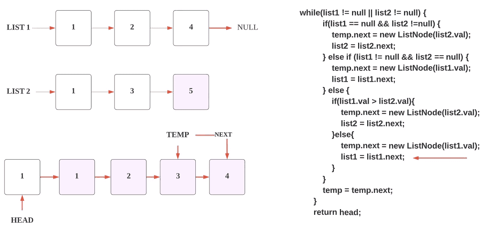

21.现在，我们在**临时**链表中前进。

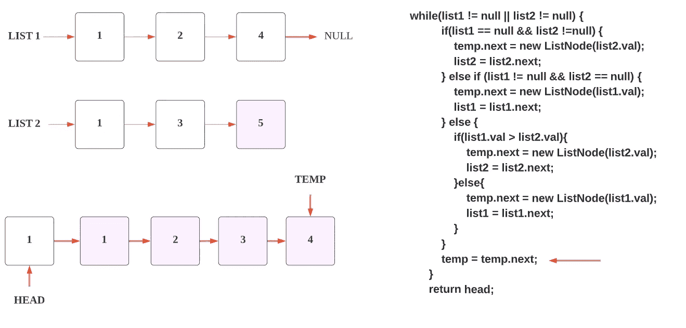

22.现在，list1 指向 **NULL** ，list2 指向某个值。所以根据 else if 条件，我们将把 **list2** 的值 5 附加到 **temp** 链表的下一个节点。

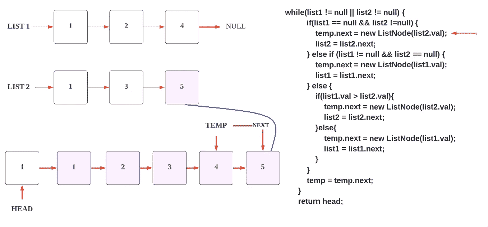

23.现在我们在链接的 **list2** 的下一个节点 **NULL 中前进。**

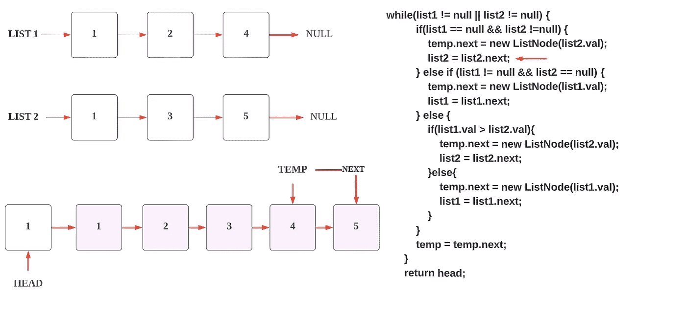

24.现在，我们在 **temp** 链表中前进。

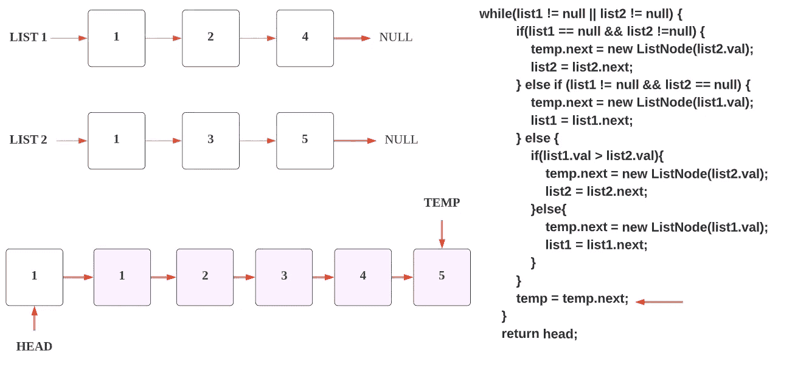

25.现在 **list1** 指向 **NULL** 和 **list2** 指向 **NULL，**两个链表都到达了末尾，所以这里 **while** 循环将变成 **false** 并被终止。

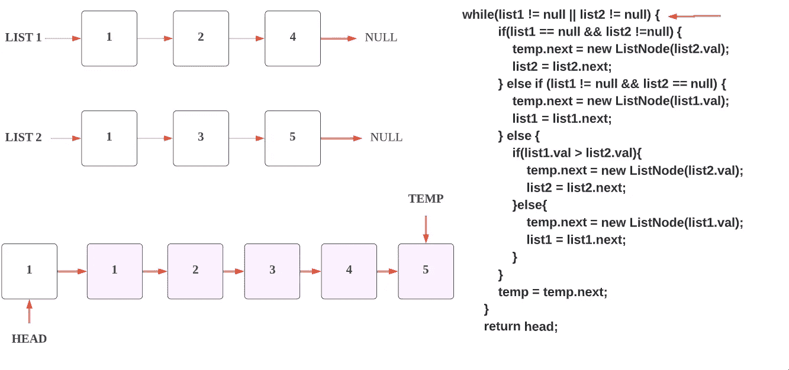

26.这是**单链表，**我们无法返回，所以我们需要返回 HEAD(指向临时链表的第一个节点)，作为回答。

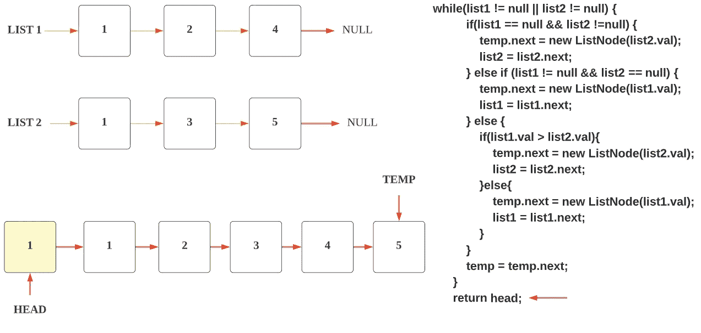

所以，这就是解决方案。现在，我们正在前进到整个代码部分。

**代码(Java): →**

**代码(Python): →**

# 时间复杂度

如果两个列表中的节点数都是`m`和`n`，那么总的时间复杂度将是 ***O(m + n)*** ，因为我们要遍历两个列表中的所有节点。

# 空间复杂性

我们正在创建一个链表来存储我们的结果，因此根据 me 的空间复杂度将是 ***O(m + n)*** 。

感谢你阅读这篇文章，❤

如果我做错了什么？让我在评论中。我很想进步。

拍手声👏如果这篇文章对你有帮助。