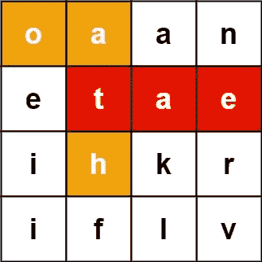
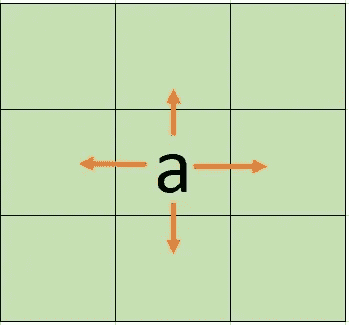
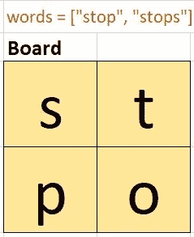
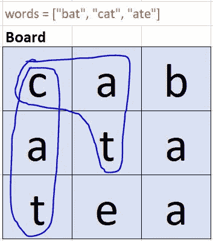

# Leetcode 212:单词搜索 II | Golang

> 原文：<https://blog.devgenius.io/leetcode-212-word-search-ii-golang-a509ad9f3316?source=collection_archive---------6----------------------->

给定一个由字符组成的 **m x n** **棋盘**和一列字符串**单词**，返回棋盘上的所有单词。

每个单词必须由顺序相邻单元的字母构成，其中相邻单元水平或垂直相邻。同一个字母单元格在一个单词中不能使用多次。

**例 1:**



```
**Input:** board = [["o","a","a","n"],["e","t","a","e"],["i","h","k","r"],["i","f","l","v"]], words = ["oath","pea","eat","rain"]
**Output:** ["eat","oath"]
```

这是一个测试你的 DFS 技能和应用 Trie 数据结构概念的好问题。我将在 Go 中展示解决方案，但是通过通读本文，同样的内容可以很容易地用其他编程语言编写。

**思维过程**

*   我得到了一个单词列表，如果需要的话，可以很容易地将它转换成一个数据结构，比如 hash map 或 set。通过使用哈希映射，我可以快速测试特定的单词是否存在于给定的单词输入列表中。Golang 有一个内置的类型来处理哈希映射，但是没有现成的。所以，我将继续使用术语“散列映射/映射”来代替集合。
*   我可以使用 DFS 来探索电路板。基于问题中提到的约束，我可以找到与给定单元格水平或垂直相邻的相邻单元格。这意味着从当前单元最多有 4 种可能性可以探索。我已经在下图中展示了这一点。当前单元格包含字母“a”。从这里开始，4 个箭头表示可以到达的相邻小区。对于在边界上的单元，相邻单元的数量小于 4。



*   一般来说，从初始单元启动 DFS 可能无法浏览整个电路板。因此，从之前的 DFS 遍历中未涉及的单元再次启动 DFS 是一种常见的技术
*   但是在这个具体的问题中，我想从每个单元开始 DFS。为什么？原因是从特定单元(即，从该单元中提到的特定初始字符)开始 DFS 将提供以该初始字符开始的所有可能的单词。为了找到以第二个单元格中提到的字符开头的所有可能的单词，我从这个单元格开始再次运行 DFS。类似的论点适用于在板中的所有单元启动 DFS。
*   问题中提到的另一个约束是，在查找一个单词时，每个单元(即与每个单元相关联的字符)不能使用多次。考虑下面的板和显示的输入单词列表。由于这种限制,“停止”不应该是输出的一部分。在代码中，这可以直接转化为维护某个概念，即该单元已经被访问过，这是 DFS/BFS 类问题中的标准技术。



*   在浏览白板时，可能会多次找到同一个单词，但是我们不应该在输出中提供重复的答案。考虑下面的板和输入单词列表。你可以看到“猫”这个词可以从不同的路径生成。为了在输出中避免这些重复，我可以将 DFS 期间获得的结果收集到一个哈希映射中，并在返回最终输出之前将这个映射转换成一个列表



*   在这一点上，我有所有的信息和清晰度来解决这个问题。然而，由于一个原因，它是低效的——如果在 DFS 遍历期间的部分路径对于扩展是无用的，那么通过挑选相邻的邻居来继续 DFS 是没有意义的。没有根据输入单词列表验证部分单词的检查将导致许多不必要的 DFS 调用，并可能导致 Leetcode 上的 TLE(超过时间限制)。
*   如何检查到目前为止构造的部分单词是否有效？我可以检查输入单词列表，看看是否有以这个部分单词开头的单词。如果没有这样的话，我可以在这个单元格中脱离 DFS(从而避免许多不必要的 DFS 调用)。这提出了一个新问题。如何有效地检查是否有以给定前缀开头的单词？
*   哈希表还是一个好的选择吗？我最初选择它是因为我希望能够快速检查给定单词的存在。但现在我发现我需要的不止这些。我还希望能够快速测试是否有任何以给定前缀开头的单词。这就是 Trie 数据结构有用的地方
*   我将使用至少有 4 种方法的 Trie 数据结构来解决这个问题——创建一个新的 Trie，将新单词插入 Trie，在 Trie 中搜索完整的单词，并检查是否有以前缀开头的单词

**代码片段**

1.  将一段文字转换成地图或者将地图转换成一段文字很容易。这个可以快速编码。

2.从每个单元启动 DFS 非常简单。编码时间:< 1 分钟

3.确定 DFS 的参数。这可以在 2 到 3 分钟内完成。

4.决定如何维护“已访问”的信息。可以保持一个单独的 2d 阵列来跟踪是否已经访问了一个单元。但是我可以在这个问题上利用一个小技巧，避免使用单独的 2d 阵列/切片。假设棋盘只包含小写字母，我可以用一个特殊字符更新单元格的内容，以表明它已经被访问过了。在此单元的 DFS 完成后，我将对此进行恢复。编码时间:< 1 分钟

5.对于一个给定的单元格，最多有 4 个相邻的单元格—左、右、上、下。对于边界上的单元，相邻单元的数量小于 4。因此，在启动 DFS 之前，我需要检查相邻单元是否有效。我可以将这个检查卸载到一个简单的函数中，如下所示。编码时间< 1 分钟

6.检查到目前为止构造的部分单词是否是输入单词列表中的有效单词。如果有，就存储在结果映射中。编码时间< 1min

7\. Check if the Trie contains any words with a given prefix. If the answer is no, then there is no need to continue DFS from the current cell any further. Coding time < 1min

8\. Construct a Trie with. Coding time 10 mins. I have shown this in the final solution below.

**最终解**

完整的解决方案如下所示。如您所见，如果我们对如何解决问题有一个清晰的想法，我们可以在 20 到 25 分钟的时间内轻松地编写出整个解决方案(包括 Trie 的实现)。

事情到此为止。如果你喜欢，我希望得到一些掌声。