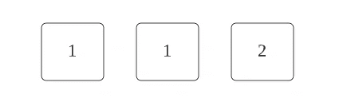
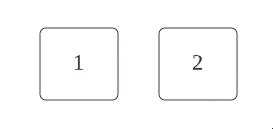
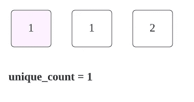
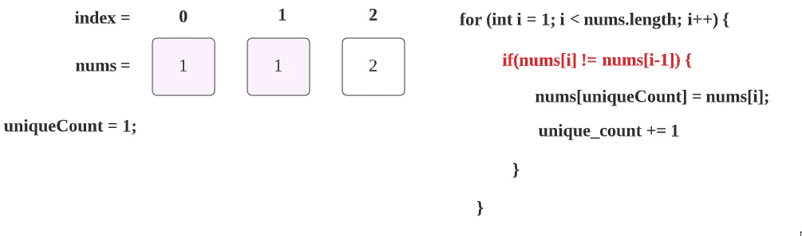
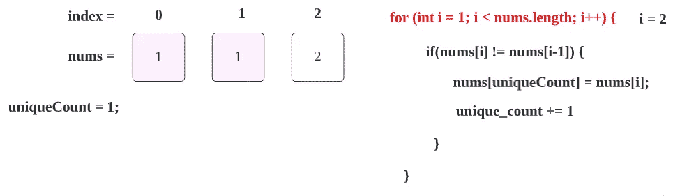
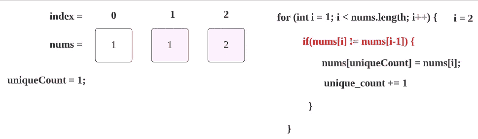
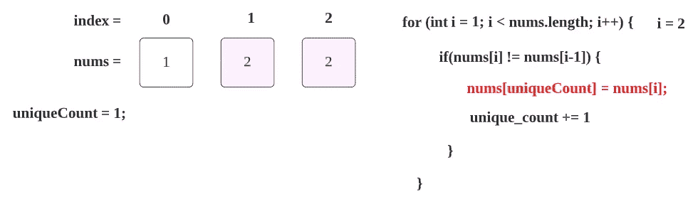
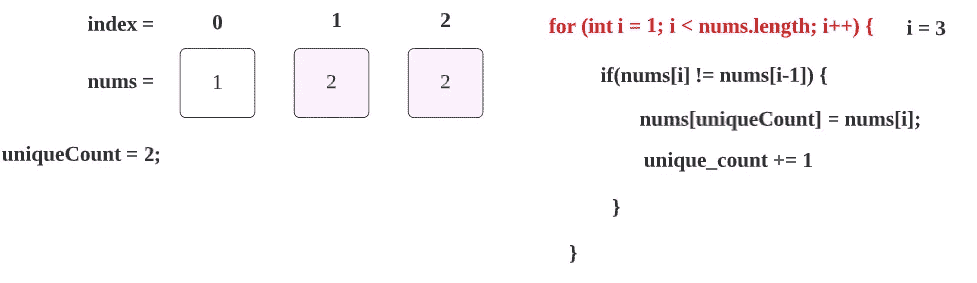
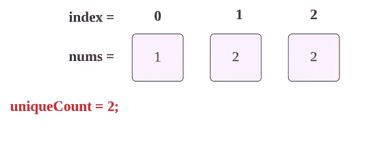

# LeetCode 26。从已排序的数组中删除重复项(用图像获得解决方案)

> 原文：<https://blog.devgenius.io/leetcode-26-remove-duplicates-from-sorted-array-73ce2ca9d603?source=collection_archive---------0----------------------->

链接:→[https://leet code . com/problems/remove-duplicates-from-sorted-array/](https://leetcode.com/problems/remove-duplicates-from-sorted-array/)

# **问题:→**

给定一个按**非降序**排序的整数数组`nums`，就地 移除重复的 [**，使得每个唯一元素只出现**一次**。要素的**相对顺序**应与**保持一致**。**](https://en.wikipedia.org/wiki/In-place_algorithm)

因为在某些语言中不可能改变数组的长度，所以您必须将结果放入数组`nums`的**第一部分**。更正式的说法是，如果删除重复项后还有`k`元素，那么`nums`的第一个`k`元素应该保存最终结果。除了第一个`k`元素之外，你留下什么并不重要。

将最终结果放入 `nums`的第一个 `k` *槽后，返回`k` *。**

不要**而不要**为另一个数组分配额外的空间。你必须用 O(1)个额外内存通过**就地修改输入数组**[](https://en.wikipedia.org/wiki/In-place_algorithm)**来做到这一点。**

****自定义判断:****

**法官将使用以下代码测试您的解决方案:**

```
int[] nums = [...]; // Input array
int[] expectedNums = [...]; // The expected answer with correct lengthint k = removeDuplicates(nums); // Calls your implementationassert k == expectedNums.length;
for (int i = 0; i < k; i++) {
    assert nums[i] == expectedNums[i];
}
```

**如果所有断言都通过，那么您的解决方案将被**接受**。**

****例 1:****

```
**Input:** nums = [1,1,2]
**Output:** 2, nums = [1,2,_]
**Explanation:** Your function should return k = 2, with the first two elements of nums being 1 and 2 respectively.
It does not matter what you leave beyond the returned k (hence they are underscores).
```

****例 2:****

```
**Input:** nums = [0,0,1,1,1,2,2,3,3,4]
**Output:** 5, nums = [0,1,2,3,4,_,_,_,_,_]
**Explanation:** Your function should return k = 5, with the first five elements of nums being 0, 1, 2, 3, and 4 respectively.
It does not matter what you leave beyond the returned k (hence they are underscores).
```

****约束:****

*   **`1 <= nums.length <= 3 * 104`**
*   **`-100 <= nums[i] <= 100`**
*   **`nums`按**非递减**顺序排序。**

# ****解决方案:→****

**这个问题可以通过使用额外的阵列很容易地解决，但是在问题中你可以看到它明确地提到**而不是**为另一个阵列分配额外的空间。**

*   **所以我们只需要在给定的数组中进行运算。**
*   **这里数组将总是按升序排序。**

**假设，我们给了下面一个 **nums** 数组。**

****

**这里唯一元素的数量是 **2** ，所以输出将是 **2** 。**

****

**您可以看到，第一个数字将始终被视为唯一的数字，因此，我们需要开始与第二个数字进行比较，第二个数字在这里也是“1”。**

****

1.  **现在我们开始遍历给定的数组，因为我们已经将第一个元素计数为 **uniqueCount = 1** ，我们将从第二个元素开始读取数组，因此起始索引位置将为 **1** ，如下所示**

****

**现在 i = 1，所以我们将第一个**索引**num[1]的值= 1 与其前一个索引**零**索引 **num[0]的值= 1 进行比较。****

****

**因为两个值相同，所以我们的 if 条件将失败，现在我们继续前进。 **i = 2****

****

**现在 i = 2，所以我们比较第二个索引**第二个索引 **num[2]的值= 2** 和它的前一个索引**第一个索引**第二个索引 **num[1]的值= 1。******

****

**这里，if 条件将为**真。**现在我们正在向 if 条件内部移动。**

**nums[1] = nums[2] → num[1]值将被 num[2]覆盖。**

****

**现在，我们已经找到了另一个 uniqueCount，所以我们将值更新+1。**

****

**现在，我们的下一次迭代， **i** 将是 3，但是给定数组的长度也是 3，所以我们的 for 循环条件将变为 false，**

****

**我们可以返回结果为 2，这是真的，你可以看到，在我们给定的数组中只有两个，唯一的元素和数组，我们可以得到更新。**

****

## ****代码(Java):****

## ****代码(Python):****

# **时间复杂度**

**我们只扫描一次数组，因此时间复杂度是 O(n) 。**

# **空间复杂性**

**由于我们没有使用任何额外的数组，所以空间复杂度将是 O(1)***。*****

**感谢你阅读这篇文章，❤**

**如果我做错了什么？让我在评论中。我很想进步。**

**拍手声👏如果这篇文章对你有帮助。**