# LeetCode 27。移除元素(用图像获取解决方案)

> 原文：<https://blog.devgenius.io/leetcode-27-remove-element-468238e47f72?source=collection_archive---------3----------------------->

链接:→[https://leetcode.com/problems/remove-element/](https://leetcode.com/problems/remove-element/)

# 问题:→

给定一个整数数组`nums`和一个整数`val`，就地删除`nums` [中所有出现的`val`。元素的相对顺序可以改变。](https://en.wikipedia.org/wiki/In-place_algorithm)

因为在某些语言中不可能改变数组的长度，所以你必须将结果放在数组`nums`的**第一部分**中。更正式的说法是，如果删除重复项后还有`k`个元素，那么`nums`的第一个`k`个元素应该保存最终结果。除了第一个`k`元素之外，您留下什么并不重要。

将最终结果放入 `nums`的第一个 `k` *槽后，返回`k` *。**

不要为另一个数组分配额外的空间。你必须用 O(1)个额外的内存通过**就地修改输入数组**[](https://en.wikipedia.org/wiki/In-place_algorithm)**来做到这一点。**

****自定义判断:****

**法官将使用以下代码测试您的解决方案:**

```
int[] nums = [...]; // Input array
int val = ...; // Value to remove
int[] expectedNums = [...]; // The expected answer with correct length.
                            // It is sorted with no values equaling val.int k = removeElement(nums, val); // Calls your implementationassert k == expectedNums.length;
sort(nums, 0, k); // Sort the first k elements of nums
for (int i = 0; i < actualLength; i++) {
    assert nums[i] == expectedNums[i];
}
```

**如果所有断言都通过，那么您的解决方案将被**接受**。**

****例 1:****

```
**Input:** nums = [3,2,2,3], val = 3
**Output:** 2, nums = [2,2,_,_]
**Explanation:** Your function should return k = 2, with the first two elements of nums being 2.
It does not matter what you leave beyond the returned k (hence they are underscores).
```

****例二:****

```
**Input:** nums = [0,1,2,2,3,0,4,2], val = 2
**Output:** 5, nums = [0,1,4,0,3,_,_,_]
**Explanation:** Your function should return k = 5, with the first five elements of nums containing 0, 0, 1, 3, and 4.
Note that the five elements can be returned in any order.
It does not matter what you leave beyond the returned k (hence they are underscores).
```

****约束:****

*   **`0 <= nums.length <= 100`**
*   **`0 <= nums[i] <= 50`**
*   **`0 <= val <= 100`**

# **解决方案:→**

**这与[从排序后的数组](https://medium.com/dev-genius/leetcode-26-remove-duplicates-from-sorted-array-73ce2ca9d603)中移除重复项有些类似。**

**这个问题可以通过使用额外的数组很容易地解决，但是在问题中你可以看到它清楚地提到了**而不是**为另一个数组分配额外的空间。**

*   **所以我们只需要在给定的数组中进行运算。**

**让我们用一个例子来说明解决方案:**

**假设，我们给了下面一个 **nums** 数组和 **val** 。**

**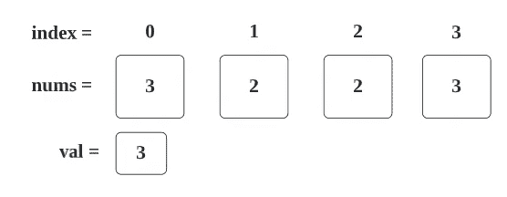**

**现在我们必须从 **nums** 中删除所有包含值: **3** 的元素。**

1.  **我们开始遍历给定的数组，如果元素包含的值与给定的**值**相同，那么我们跳过它。**

**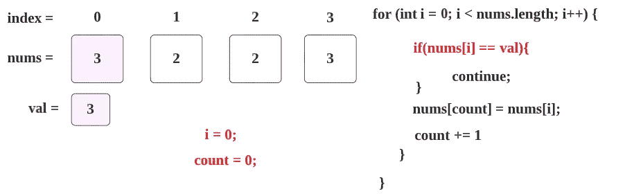**

**2.这里， **nums[0] → 3** 和 **val → 3** ，两个值匹配，所以我们跳过以下步骤。**

**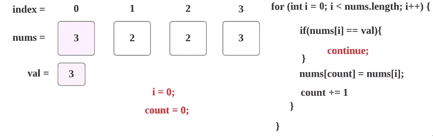**

**3.现在我们继续讨论 **i = 1** 的情况，这里， **nums[1] → 2** 和 **val → 3** ，两个值不匹配。**

****

**4.所以我们将用 **num 的第一个**索引值(即 **2** )替换 **num 的第 0 个**索引值(即 count → 0)值(即 **3** ),结果如下。**

**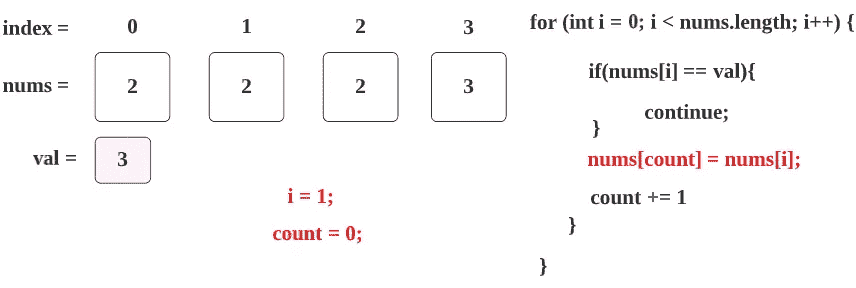**

**5.现在我们已经替换了 value，所以我们将计数变量增加 **1。****

**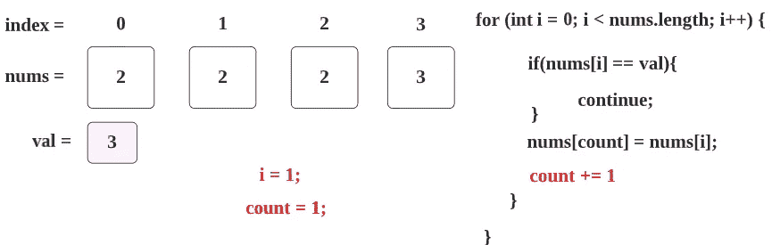**

**6.现在，下一个 for 循环， **i** 将增加 **1** ，我们重复步骤 1。**

**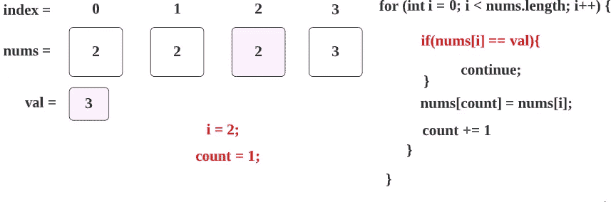**

**7.作为第 3 步，我们继续进行 **i = 2** 的情况，在这里， **nums[2] → 2** 和 **val → 3** ，两个值不匹配。**

**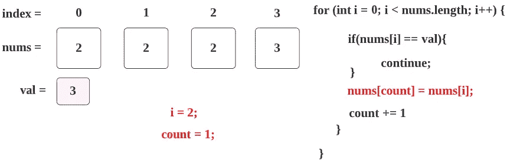**

**8.作为第 4 步和第 5 步，我们将用 **num 的第 3 个**索引值(也是 **2)** 替换 **num 的第 1 个**索引值(作为**计数→ 1** )值(为 2)，然后我们用 **1、**增加**计数**的值，结果如下。**

**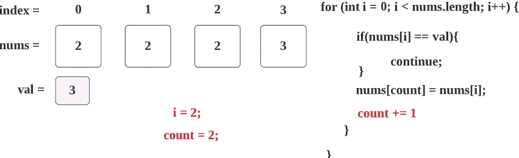**

**9.作为步骤 6，对于下一个 for 循环， **i** 将增加 **1** ，我们重复步骤 1。**

**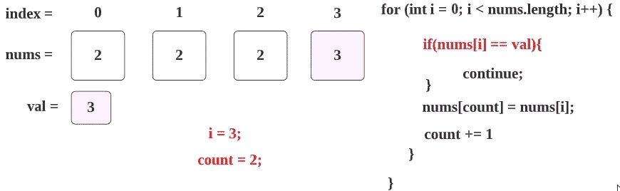**

**10.作为步骤 2，在这里， **nums[3] → 3** 和 **val → 3** ，两个值匹配，所以我们跳过以下步骤。**

**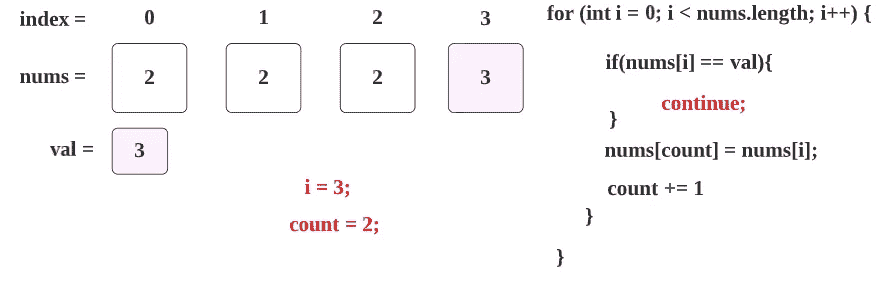**

**11.现在 **i** 将为 4，对于循环条件**(I<nums . length)**→**(4<4)**将失败，结果值**计数** → 2 和**数组**将如下所示**

**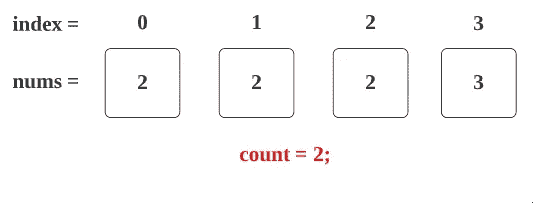**

**12.这里我们将返回 **count** 表示 **2** 作为答案。**

**通过返回 **2** means，结果**数组的前 2 个元素**将被计数。**

**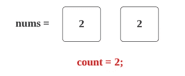**

**所以，这里你可以看到我们得到了想要的结果，在这个数组中没有 val → 3。**

## ****代码(Java): →****

## **代码(Python): →**

# **时间复杂度**

**我们扫描数组一次，因此时间复杂度为 O(n) 。**

# **空间复杂性**

**由于我们没有使用任何额外的数组，空间复杂度将是 ***O(1)*** 。**

**感谢你阅读这篇文章，❤**

**如果我做错了什么？让我在评论中。我很想进步。**

**拍手声👏如果这篇文章对你有帮助。**