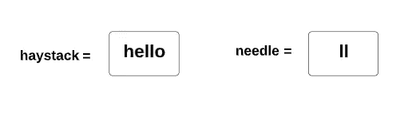
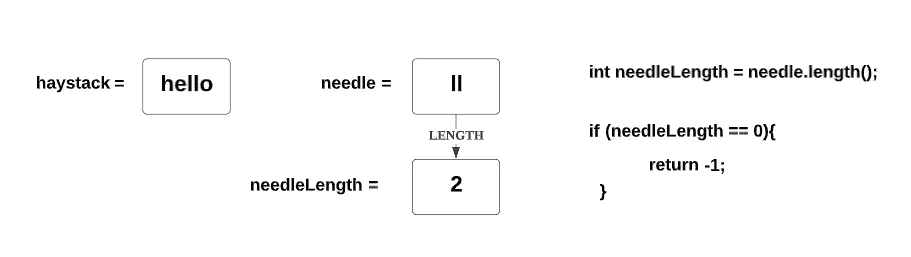
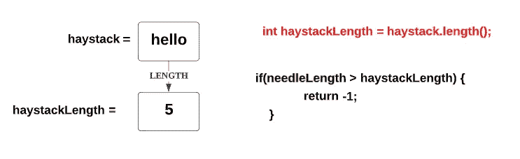
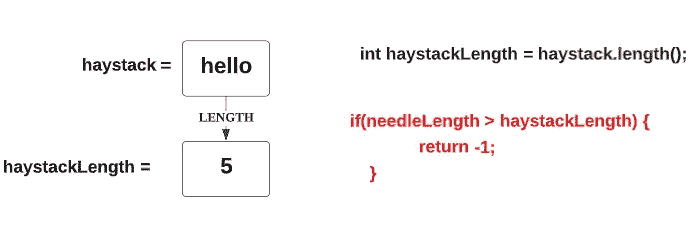
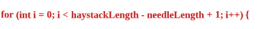
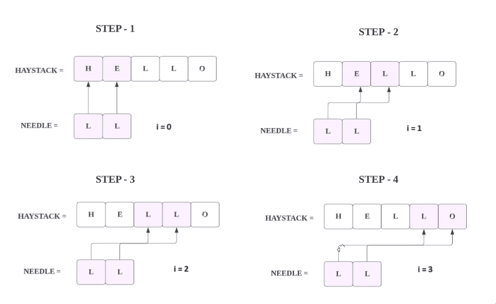
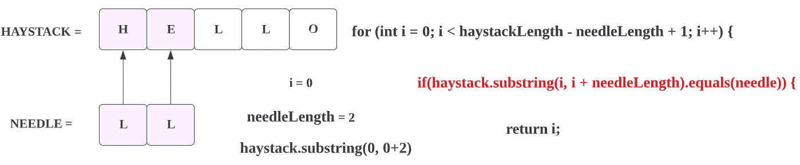
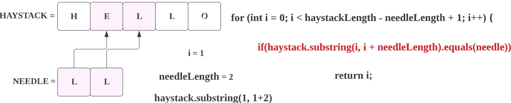
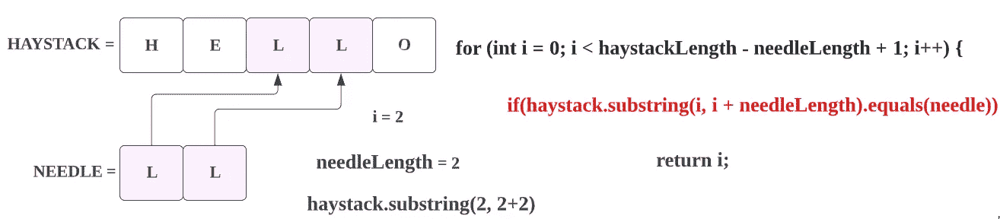

# LeetCode: 28。实施 strStr()(使用图像的解决方案)

> 原文：<https://blog.devgenius.io/leetcode-28-implement-strstr-solution-with-images-7066d68c2262?source=collection_archive---------2----------------------->

链接:→https://leetcode.com/problems/implement-strstr/

# **问题:→**

执行[strtr()](http://www.cplusplus.com/reference/cstring/strstr/)。

给定两个字符串`needle`和`haystack`，返回第一次出现的`needle`在`haystack`中的索引，如果`needle`不是`haystack`的一部分，则返回`-1`。

**澄清:**

当`needle`为空字符串时，我们应该返回什么？这是面试时应该问的一个好问题。

对于这个问题，当`needle`为空字符串时，我们将返回 0。这与 C 的[strtr()](http://www.cplusplus.com/reference/cstring/strstr/)和 Java 的 [indexOf()](https://docs.oracle.com/javase/7/docs/api/java/lang/String.html#indexOf(java.lang.String)) 一致。

**实施例 1:**

```
**Input:** haystack = "hello", needle = "ll"
**Output:** 2
```

**实施例 2:**

```
**Input:** haystack = "aaaaa", needle = "bba"
**Output:** -1
```

**约束:**

*   `1 <= haystack.length, needle.length <= 104`
*   `haystack`和`needle`仅由小写英语字符组成。

# **溶液:→**

这里，我们给了两根绳子一根是**草堆**另一根是**针。**



按照给定的指令，我们先检查**针**是否空了，如果**针**空了，我们再返回 **-1** 。我们通过取空字符串的长度来检查它，如果长度是 **0** 就表示它是空字符串。



与**针相同**我们需要得到**草堆**的长度。



**草堆**取长的原因是为了检查**针**的绳子是否比**草堆大，**表示整根**针**在**草堆中找不到，**因为**针**比**草堆**更有个性，如果是这样的话我们可以简单的退回 **-1** ，



现在，我们有了 for 循环，这个循环将帮助我们检查指针是否在干草堆中，如果是，那么返回它的索引。

在 for 循环中，我们将放置如下条件:



这里我将从零开始，一直到**haystackLength-needle length+1，**我们这样做的原因是因为我们正在检查**干草堆中的整个**针**串。**如下图所示，



所以，只要 **i = 3，**我们就到达了**干草堆**串的末端。

现在，我们的 for 循环从零开始，用 **if 条件**我们正在检查，**针**值是否与**干草堆**的前两个字符匹配？

答案是否定的。因此， **IF** 条件将变为 **false** 。



现在， **I** 将变为 1，我们再次检查**针**值是否与**草堆**的**第二**和**第三**字符匹配？

答案是否定的。因此， **IF** 条件将变为 **false** 。



现在， **I** 将变为 2，我们再次检查**针**值是否与**草堆**的**第三**和**第四**字符匹配？

答案是**是的**。因此， **IF** 条件将变为 **true** 。



随着匹配我们正在返回， **i，**这将是我们的第一个匹配**索引。**

这里的**我**会是 **2。**

## **代码(Java): →**

## **代码(Python) : →**

# 时间复杂度

我们只扫描一次数组，因此时间复杂度是 O(n) 。

# 空间复杂性

由于我们没有使用任何额外的数组，所以空间复杂度将是 O(1)***。***

感谢你阅读这篇文章，❤

如果我做错了什么？让我在评论中。我很想进步。

拍手声👏如果这篇文章对你有帮助。