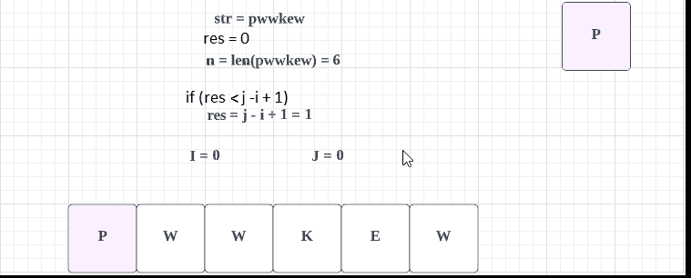
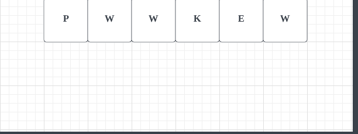

# LeetCode: 3 个不含重复字符的最长子字符串(用图像获得解决方案)

> 原文：<https://blog.devgenius.io/leetcode-3-longest-substring-without-repeating-characters-ab80b5d9902f?source=collection_archive---------3----------------------->

链接:→[https://leet code . com/problems/longest-substring-without-repeating-characters/](https://leetcode.com/problems/longest-substring-without-repeating-characters/)


照片由 [Max Duzij](https://unsplash.com/@max_duz?utm_source=medium&utm_medium=referral) 在 [Unsplash](https://unsplash.com?utm_source=medium&utm_medium=referral) 上拍摄

# **问题:**

给定一个字符串`s`，找出不含重复字符的**最长子串**的长度。

**例 1:**

```
**Input:** s = "abcabcbb"
**Output:** 3
**Explanation:** The answer is "abc", with the length of 3.
```

**例 2:**

```
**Input:** s = "bbbbb"
**Output:** 1
**Explanation:** The answer is "b", with the length of 1.
```

**例 3:**

```
**Input:** s = "pwwkew"
**Output:** 3
**Explanation:** The answer is "wke", with the length of 3.
Notice that the answer must be a substring, "pwke" is a subsequence and not a substring.
```

**约束:**

*   `0 <= s.length <= 5 * 104`
*   `s`由英文字母、数字、符号和空格组成。

# **解决方案:**

可以有不同的方法，让我们通过第一个简单的解决方案来理解，

**方法 1:** 我们可以逐个考虑所有子串，检查每个子串是否包含所有唯一字符。将有 n*(n+1)/2 个子串。一个子串是否包含所有唯一的字符，可以通过从左到右扫描它并保留一个访问过的字符的映射，在线性时间内进行检查。

这里我们使用两个 for 循环并检查每个字符。

你可以在下图中看到这种方法。



这里，

*   **str** 是给定的字符串值。
*   **n** 是字符串的总长度
*   **i & j** 用于循环
*   **res** 是最大值
*   这里如果找到任何匹配的字符，那么我们就**打破内部循环。**

让我们通过代码来理解:

**代码(Java):**

**代码(Python):**

***时间复杂度:*** O(n)由于我们正在处理 **n(两个 for 循环)**最大长度为 **n** 的子串。
***空间复杂度:*** O(1)

**方法二:**

使用该解决方案，可以使用窗口滑动技术在线性时间内解决该问题。每当我们看到重复，我们删除窗口，直到重复的字符串。

让我们使用下图来理解



这里，

*   **c** 是第一个字符串的字符数组
*   **测试**是第二串
*   **maxLength** 是测试的总长度
*   test = test + String.valueOf(c)

在上图中，你可以看到第一个数组是给定的字符串值。**第二个字符串**我们从第一个数组中一个接一个地添加字符并计算它的 **max_length** 。

在存储到新数组之前，我们检查值是否已经存在，如果是，那么我们将删除这些字符串。

**代码(Java) :**

```
class Solution {
    public int lengthOfLongestSubstring(String str) {
        String test = "";

        // Result
        int maxLength = -1;

        // Return zero if string is empty
        if (str.isEmpty()) {
            return 0;
        }
        // Return one if string length is one
        else if (str.length() == 1) {
            return 1;
        }
        for (char c : str.toCharArray()) {
            String current = String.valueOf(c);

            // If string already contains the character
            // Then substring after repeating character
            if (test.contains(current)) {
                test = test.substring(test.indexOf(current)
                                      + 1);
            }
            test = test + String.valueOf(c);
            maxLength = Math.max(test.length(), maxLength);
        }

        return maxLength;
    }
}
```

***代码(Python):***

```
class Solution:
    def lengthOfLongestSubstring(self, s: str) -> int:
        test = ""
        # Result
        max_length = 0

        # Return zero or 1 if string is empty or only 1 length
        if len(s) == 0 or len(s) == 1:
            return len(s)

        for c in s:
            # If string already contains the character
            # Then substring after repeating character
            if c in test:
                test = test[test.index(c)+1:]
            test = test + c
            if max_length < len(test):
                max_length = len(test)
        return max_length
```

***时间复杂度:***O(n)**【One loops】**因为我们只要看到有重复就滑动窗口。
***空间复杂度:***O①

感谢你阅读这篇文章，❤

如果我做错了什么？让我在评论中。我很想进步。

拍手声👏如果这篇文章对你有帮助。