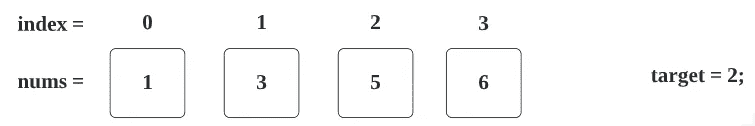

# LeetCode 35:搜索插入位置(通过图像理解)

> 原文：<https://blog.devgenius.io/leetcode-35-search-insert-position-3d5c77eebe1d?source=collection_archive---------0----------------------->

链接→[https://leetcode.com/problems/search-insert-position/](https://leetcode.com/problems/search-insert-position/)

## **问题:→**

给定一个不同整数的排序数组和一个目标值，如果找到目标，则返回索引。如果不是，则返回索引，如果它是按顺序插入的话。

你必须写一个运行时复杂度为`O(log n)`的算法。

**例 1:**

```
**Input:** nums = [1,3,5,6], target = 5
**Output:** 2
```

**例 2:**

```
**Input:** nums = [1,3,5,6], target = 2
**Output:** 1
```

**例 3:**

```
**Input:** nums = [1,3,5,6], target = 7
**Output:** 4
```

**约束:**

*   `1 <= nums.length <= 104`
*   `-104 <= nums[i] <= 104`
*   `nums`包含按**升序**排序的**不同的**值。
*   `-104 <= target <= 104`

## 解决方案:→

这里我们可以通过遍历整个数组来解决这个问题，但是时间复杂度将是 O(n)。这里明确提到必须写一个`O(log n)`运行时复杂度的算法。

> o(log n) →二分搜索法→各个击破

**二分搜索法:→** 在这个例子中，我们将在一个排序的数字数组中找到想要的数字，我们划分(减少)数字数组(搜索空间)，通过递归地寻找我们目标的中间点并分裂直到我们找到我们目标的基本情况条件来解决子问题。

现在，让我们通过例子来理解它:

假设，我们已经给出了下面的数组中的 **nums** 和 **target。**



在上述情况下，我们可以确定我们需要将目标值填充到第一个索引。

所以，最终的数组应该是这样的(想象一下)，


1.  这里先将**开始**和**结束**设置为 **0** 和 **N — 1** ，其中**开始**和**结束**变量分别表示搜索空间的开始和结束边界。


2.现在，在下一步中，我们将继续 while 循环，它将帮助我们遍历一个数组。


3.这里 mid 我们将得到的是 1(mid = >(0+3)/2 = > 1.5 = >(int)1.5 = >**1。**


4.第一个 if 条件将失败，因为 nums[1] => **1！= 2.**


在进入下一步之前，我只是解释一下**开始**和**结束**的位置。


现在，用第二个**如果**条件:

(2 > nums[1]) => 2 > 3 => **假**


现在对于最后一个 else 条件， **end** 值将被改变

end = mid-1 = > 1–1 = > 0


现在，我们将进行 while 循环的下一次迭代并检查条件

开始≤结束=> 0≤0 => **真**


因此，现在我们将进一步检查**中间**值。

**中旬** = (0 + 0)/2 = **0**


(nums[mid]= = target)= > nums[0]= = 2 = > 1 = = 2 = >**FALSE**


**目标**>nums[mid]=>2>num[0]=>2>1 =>**真**


**开始**= mid+1 =>0+1 =>**1**


开始≤结束=> 1≤0 => **假**


最后，我们将简单地返回 **end + 1 = > 0 + 1 = > 1** (这将是插入位置(索引))


您可以用下图来验证，即**目标值**即 **2** ，应该放在第一个索引中。


## 代码:(Java): →

## 代码:(Python) →

# 时间复杂度

我们使用二分搜索法遍历一个数组，所以时间复杂度将是 O(log N) 。

# 空间复杂性

由于我们没有使用任何额外的数组，空间复杂度将是 O(1)***。***

感谢你阅读这篇文章，❤

如果我做错了什么？让我在评论中。我很想进步。

拍手声👏如果这篇文章对你有帮助。