# leet code 4:O(log-n)时间复杂度的两个排序数组的中值

> 原文：<https://blog.devgenius.io/leetcode-4-hard-median-of-two-sorted-arrays-cce292b4f4e?source=collection_archive---------5----------------------->

给定两个大小分别为 m 和 n 的排序数组 nums1 和 nums2，返回两个排序数组的中间值。

总的运行时间复杂度应该是 O(log (m+n))。

**例 1:**

输入:nums1 = [1，3]，nums2 = [2]
输出:2.00000
说明:合并数组= [1，2，3]，中位数为 2。

**例二:**

输入:nums1 = [1，2]，nums2 = [3，4]
输出:2.50000
说明:合并数组= [1，2，3，4]，中位数为(2 + 3) / 2 = 2.5。

**约束:**

nums 1 . length = = m
nums 2 . length = = n
0<= m<= 1000
0<= n<= 1000
1<= m+n<= 2000
-106<= nums 1[I]，nums2[i] < = 106

## 方法

整个逻辑都是围绕分区展开的。我们将对这两个数组进行分区，直到我们得到一个条件

分区 1 左半部分的所有元素<= right half of partition 2 and
分区 2 左半部分的所有元素< =分区 1 右半部分

```
def check_condition(LH1,LH2,RH1,RH2):
    return (LH1 <= RH2)&(LH2<=RH1)
```

现在，如果不满足上述条件，我们将移动分区。

如果 1 的左半部分大于 2 的右半部分。我们将把分区 1 向左移动，分区 2 向右移动。否则，我们将把分区 1 移到右边，分区 1 移到左边。

让我们看看这个例子

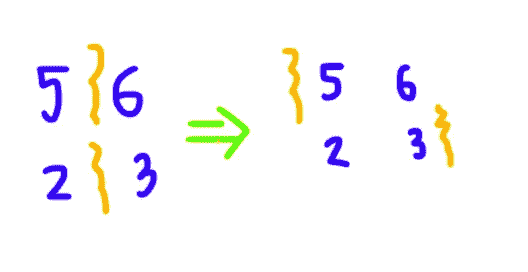

这个结果是

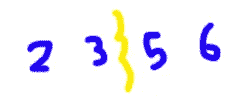

中位数变成了(3+5)/2 = 4

现在，让我们看另一个例子:

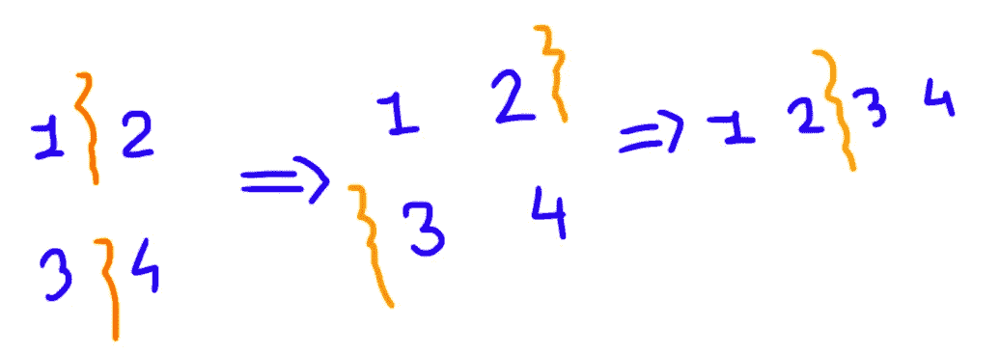

这里，中位数将变成(2+3)/2 = 2.5

## 如何移动分区

最初，如果你看到当我们合并两个分区时，它等于合并数组的一半长度。
因此，
partition 1+partition 2 =(len(num S1)+len(num S2))/2

所以，如果我们知道其中一个分区，我们可以很容易地找到第二个分区。此外，当我们做更新时，我们把 LH 放在分区和更新。因此，这方面的代码将是

```
def obtain_partition(mid):
    LH1 = mid

    LH2 = int(len(nums1+nums2)*0.5) - LH1 -1

    if len(nums1+nums2)%2==0:
        LH2 -= 1
    RH1 = LH1+1
    RH2 = LH2+1

    print("Partition",LH1, LH2, RH1, RH2)
    return LH1, LH2, RH1, RH2
```

它会看起来像这样，然后我们做移动

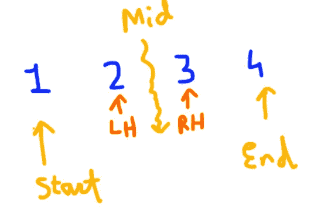

## 让我们结合这两种情况进行模拟

nums1 = [1，3，4，6，8]
nums2 = [2，4，5]

首先，我们将进行一次交换。因为在较小长度的阵列上应用二分搜索法成本较低

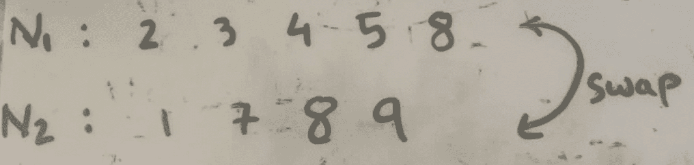

此后，进行初始分区

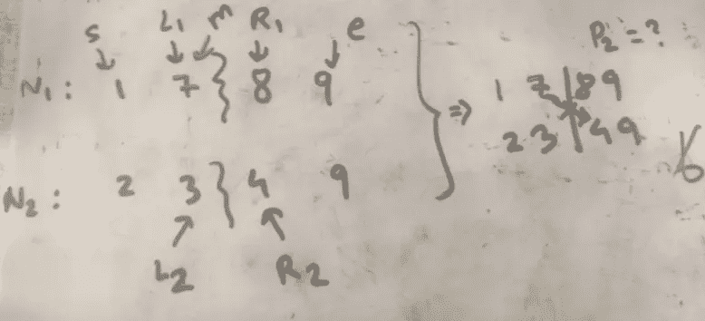

此后，根据条件，我们改变指针，这样我们得到

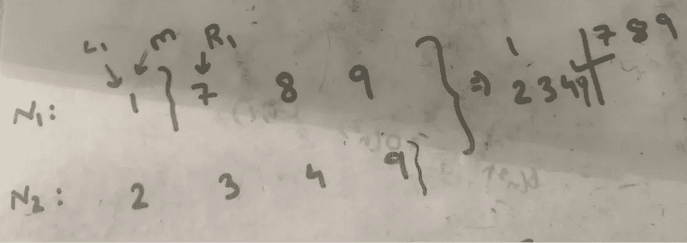

中位数将被计算为两个分区的左半部分的最大值和两个分区的右半部分的最小值

中位数= (9+1)/2 = 5

```
if len(nums1)>len(nums2):
    nums1,nums2 = nums2,nums1

start = 0
end = min(len(nums1),len(nums2))-1mid = start - int((start-end)*0.5)
LH1, LH2, RH1, RH2 = obtain_partition(mid)while LH1 >= 0 and RH1<=len(nums1)-1:
    if (nums1[LH1]<=nums2[RH2])&(nums2[LH2]<=nums1[RH1]):
        if len(nums1+nums2)%2 != 0:
            return(max(nums1[LH1], nums2[LH2]))
        else:
            return((max(nums1[LH1],nums2[LH2])+min(nums1[RH1],nums2[RH2]))*0.5)
        break
    elif nums1[LH1]>=nums2[RH2]:
        end = mid-1
    else:
        start = mid+1
    mid = (start+end)//2
    LH1, LH2, RH1, RH2 = obtain_partition(mid)
```

现在，有一种情况，我们的 nums1 长度小于等于 1。
如果是 0 那么直接 we。计算 nums2 的中值。
当它。是 1 那么我们需要。看到三个条件

1.  如果 nums1 中的元素值等于 nums2 的中值，则没有问题
2.  如果元素值。小于 nums2 的中值，那么我们需要找到前一个。元素和下一个元素
3.  如果元素值大于 num2 的中值。那我们需要。求下一个元素和它的下一个元素的中间值

此外，如果。长度是奇数，那么我们就简单地做 n-1 次。元素等于第 n 个元素并执行运算。

的。这方面的例子。是。作为。遵照

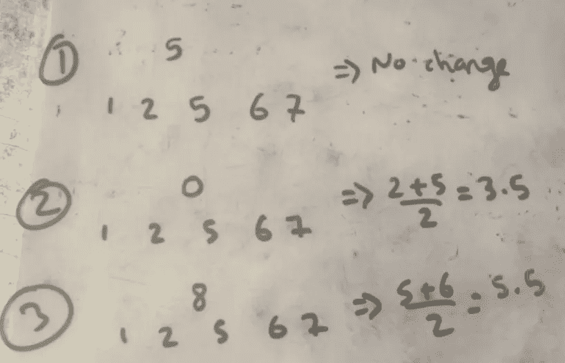

```
if len(nums1)<=1:
    median_index = (len(nums2)-1)//2
    median_ = (nums2[median_index]+nums2[median_index+1])*0.5 if len(nums2)%2==0 else nums2[median_index]
    x = 0 if len(nums1)==0 else nums1[0]
    if x==median_ or len(nums1)==0:
        print(median_)
    elif x<=median_:
        if len(nums2)==1:
            print((nums2[0]+nums1[0])*0.5)
        elif len(nums2)%2==0:
            nums2[median_index-1]=nums2[median_index]
        return((max(nums2[median_index-1],nums1[0])+nums2[median_index])*0.5)
    else:
        if len(nums2)%2=0:
            nums2[median_index]=nums2[median_index+1]
        return((nums2[median_index]+nums2[median_index+1])*0.5)
```

只是最后一个例外。处理需要执行的是，当分区退出时。边界见示例

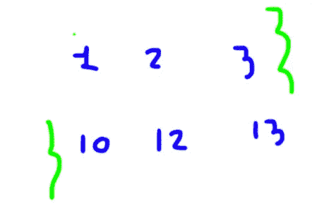

这种情况下。我们将 max(left)+min(right)/2 中的值更改为 sys.max 和-sys.min。其代码如下

```
if len(nums1+nums2)%2==0:
    x1 = -sys.maxsize if LH1==-1 else nums1[LH1]
    x2 = -sys.maxsize if LH2==-1 else nums2[LH2]
    y1 = sys.maxsize if RH1==len(nums1) else nums1[RH1]
    y2 = sys.maxsize if RH2==len(nums2) else nums2[RH2]

    print((max(x1,x2)+min(y1,y2))*0.5)

else:
    if len(nums1)==RH1:
        print(max(nums2[LH2],nums1[LH1]))
    else:
        print(nums2[LH2])
```

因此，获得两个排序数组的中间值的整个程序将如下所示:

[](https://leetcode.com/submissions/detail/791189946/) [## 帐户登录- LeetCode

### 提高你的编码技能，迅速找到工作。这是扩展你的知识和做好准备的最好地方…

leetcode.com](https://leetcode.com/submissions/detail/791189946/) 

```
import sys
class Solution(object):
    def findMedianSortedArrays(self, nums1, nums2):
        """
        :type nums1: List[int]
        :type nums2: List[int]
        :rtype: float
        """
        if len(nums1)>len(nums2):
            nums1,nums2 = nums2,nums1

        start = 0
        end = min(len(nums1),len(nums2))-1

        def obtain_partition(mid):
            LH1 = mid

            LH2 = int(len(nums1+nums2)*0.5) - LH1 -1

            if len(nums1+nums2)%2==0:
                LH2 -= 1
            RH1 = LH1+1
            RH2 = LH2+1
            return LH1, LH2, RH1, RH2

        mid = start - int((start-end)*0.5)
        LH1, LH2, RH1, RH2 = obtain_partition(mid)

        while LH1 >= 0 and RH1<=len(nums1)-1:
            if (nums1[LH1]<=nums2[RH2])&(nums2[LH2]<=nums1[RH1]):
                if len(nums1+nums2)%2 != 0:
                    return(max(nums1[LH1], nums2[LH2]))
                else:
                    return((max(nums1[LH1],nums2[LH2])+min(nums1[RH1],nums2[RH2]))*0.5)
                break
            elif nums1[LH1]>=nums2[RH2]:
                end = mid-1
            else:
                start = mid+1
            mid = (start+end)//2
            LH1, LH2, RH1, RH2 = obtain_partition(mid)

        if len(nums1)<=1:
            median_index = (len(nums2)-1)//2
            median_ = (nums2[median_index]+nums2[median_index+1])*0.5 if len(nums2)%2==0 else nums2[median_index]
            x = 0 if len(nums1)==0 else nums1[0]
            if len(nums2)==1 and len(nums1)==1:
                    return((nums2[0]+nums1[0])*0.5)
            if x==median_ or len(nums1)==0:
                return(median_)
            elif x<=median_:
                if len(nums2)%2==0:
                    nums2[median_index-1]=nums2[median_index]
                return((max(nums2[median_index-1],nums1[0])+nums2[median_index])*0.5)
            else:
                if len(nums2)%2==0:
                    nums2[median_index]=nums2[median_index+1]
                return((nums2[median_index]+min(nums2[median_index+1],nums1[0]))*0.5)   

        elif len(nums1+nums2)%2==0:
            x1 = sys.maxsize*-1 if LH1==-1 else nums1[LH1]
            x2 = sys.maxsize*-1 if LH2==-1 else nums2[LH2]
            y1 = sys.maxsize if RH1==len(nums1) else nums1[RH1]
            y2 = sys.maxsize if RH2==len(nums2) else nums2[RH2]
            return((max(x1,x2)+min(y1,y2))*0.5)
        else:
            if len(nums1)==RH1:
                return(max(nums2[LH2],nums1[LH1]))
            else:
                return(nums2[LH2])
```

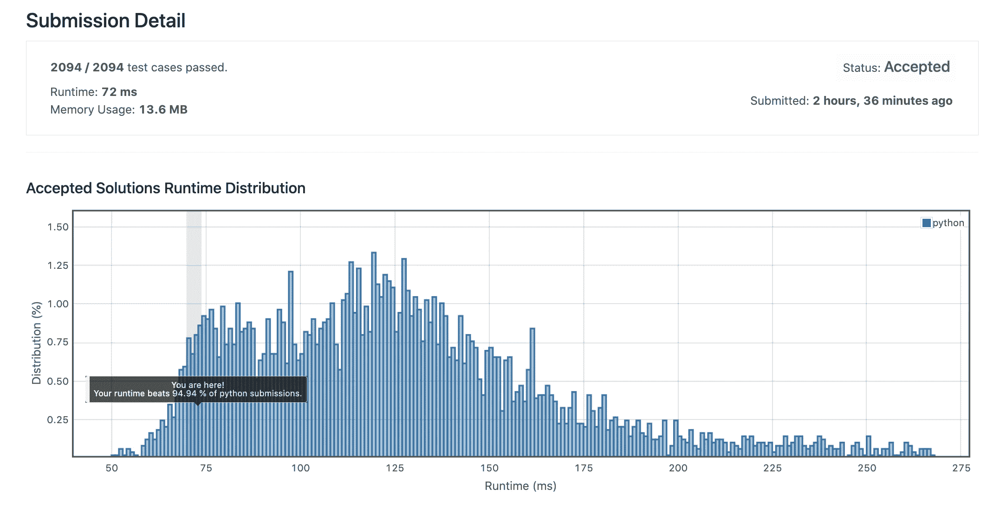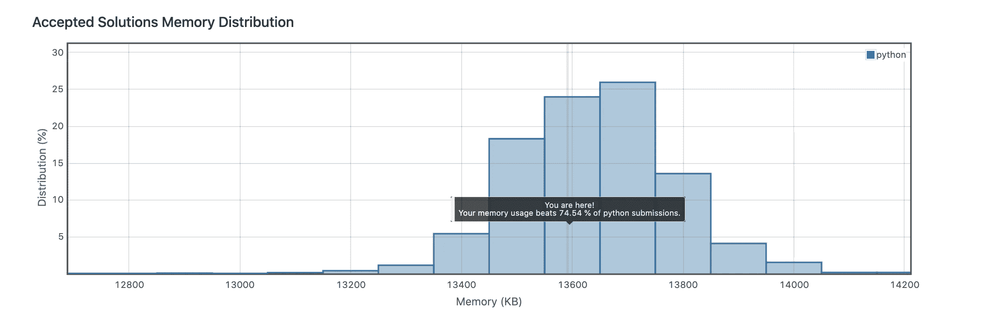

感谢您阅读我的文章。DMs 于[https://linktr.ee/prituldave](https://linktr.ee/prituldave)开放，欢迎任何查询！！！