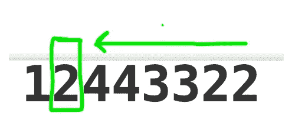

# LeetCode 556。下一个更大的元素 III

> 原文：<https://blog.devgenius.io/leetcode-556-next-greater-element-iii-37916a42510c?source=collection_archive---------10----------------------->

## 问题陈述

给定一个正整数 n，找出整数 n 中位数完全相同且大于 n 的最小整数，如果不存在这样的正整数，返回-1。

请注意，返回的整数应该适合 32 位整数，如果有一个有效答案，但它不适合 32 位整数，则返回-1。

**例 1:**

```
Input: n = 12
Output: 21
```

**例二:**

```
Input: n = 21
Output: -1
```

## 处理这个问题

起初，这个问题对我来说很难，不知道如何开始。

**观察 1:**

首先，如果你看到返回的整数必须是 32 位的。因此该值必须在[0，2147483648]的范围内

**观察 2:**

如果我想找到下一个更大的数字，那么所有的数字都必须遵循从数字末尾开始的递增顺序。

但是，这里输入的是数字，现在如何迭代数字呢？所以我认为将要使用的数据类型必须是字符串数据类型。

因此，我们按照递增的顺序进行，如果我们发现一个元素没有遵循这个顺序，我们将获取这个元素。

我们这样做是因为我们想找到下一个更大的元素。如果所有数字都像 4321 一样按升序排列，那么我们就找不到下一个由相同数字组成的更大的数字。

让我们考虑下面的例子，看看



所以在这里直到 4，所有的都是按照递增的顺序，但是当我们得到 2 的时候顺序被打破了，因为 2 <4 and not following the sequence a> b>c> … >z。

所以，我们将去掉“2 ”,现在的问题是找到下一个元素，用谁来替换这个“2”。答案将是下一个比“2”更大的元素，即 3。

为了获得下一个更大的元素，我们将利用哈希表。所以，3 会过来，2 会弹出。


现在，问题是把“2”放在哪里。关于这一点我想了很多，我们可以把它放在最后，因为所有的顺序都是递增的，或者我们可以和 3 交换，或者放在“3”旁边。但是没有一个解决方案会带来答案。

**观察结果 3:**

所以，在想了很多之后，我想出了一个模式，下一个元素必须是有序的，并且是升序排列的。


因此，所有的元素，包括我们存储在 temp 中的元素，都必须被排序。所以对元素排序后，我们得到的答案是


这是下一个大于 12443322 的元素

**实现如下**

```
class Solution(object):
    def nextGreaterElement(self, n):
        """
        :type n: int
        :rtype: int
        """
        MAX = 2147483648
        if n>MAX:
            return -1
        str_n = list(str(n))

        hash_table = {}

        max_flag = -1

        p1 = len(str_n)-1

        def get_next_bigger(hash_table, value, max_value):
            for v in range(value+1, max_value+1):
                if v in hash_table:
                    return hash_table[v]
                else:
                    continue
            print("Value not found in table debug")
            return -1

        while p1 >= 0:

            value = int(str_n[p1])

            hash_table[value] = p1

            if value >= max_flag:
                max_flag = value
                p1 -= 1
            elif value < max_flag:
                p2 = get_next_bigger(hash_table, value, max_flag)

                str_n[p2], str_n[p1] = str_n[p1], str_n[p2] ##core logic 1
                str_prefix = str_n[0:p1+1]  
                str_suffix = sorted(str_n[p1+1::])  ##Core logic 2
                n = int("".join(str_prefix+str_suffix))
                if n>=MAX:
                    print(n)
                    return -1
                return n

        return -1
```


建议的解决方案比所有解决方案快 76%。

## 结论

总之，问题是三步走的方法，

(1)找到不遵循递增顺序模式的元素。
(2)使用哈希表将该元素替换为下一个更大的元素。
(3)对剩余的数组进行排序，所有的元素都会出现在正确的位置。

## 分析复杂性

找到第一个坏元素所花费的时间是 O(n ),排序将花费 O(n log n)。因此总的时间复杂度是 O(n + nlog n)。为什么加法？因为我们不是每次都执行排序，而是在找到坏元素后才执行排序。

空间复杂度是 O(10 ),其中在最坏的情况下，散列表将包含从 0 到 9 的 10 个数字。

谢谢大家！