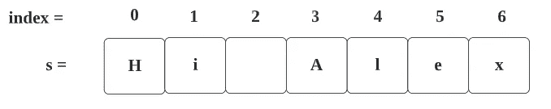
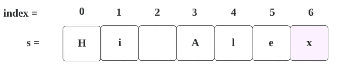
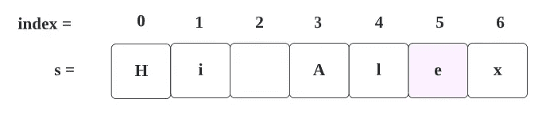
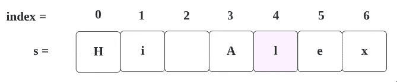
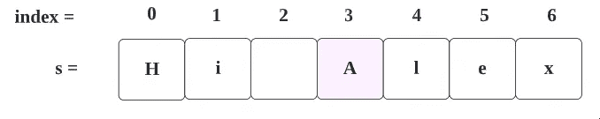
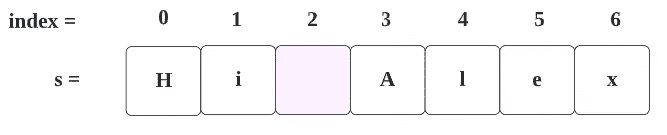

# LeetCode 58。最后一个单词的长度(通过图像理解)

> 原文：<https://blog.devgenius.io/leetcode-58-length-of-last-word-c689a1bf65f7?source=collection_archive---------1----------------------->

链接:→[https://leetcode.com/problems/length-of-last-word/](https://leetcode.com/problems/length-of-last-word/)

# 问题:→

给定一个由单词和空格组成的字符串`s`，返回****字符串中最后一个*** *单词的长度。**

*一个**字**是仅由非空格字符组成的最大子串。*

***例 1:***

```
***Input:** s = "Hello World"
**Output:** 5
**Explanation:** The last word is "World" with length 5.*
```

***例 2:***

```
***Input:** s = "   fly me   to   the moon  "
**Output:** 4
**Explanation:** The last word is "moon" with length 4.*
```

***例三:***

```
***Input:** s = "luffy is still joyboy"
**Output:** 6
**Explanation:** The last word is "joyboy" with length 6.*
```

***约束:***

*   *`1 <= s.length <= 104`*
*   *`s`仅由英文字母和空格组成`' '`。*
*   *在`s`中至少会有一个词。*

# *解决方案:→*

*在这里，我们可以通过以下步骤找到解决方案:*

1.  *修剪字符串前后的空格。*

```
*" Hi Alex   "
**Triming -->** "Hi Alex"*
```

*2.开始从右向左读取整个字符串，并在每次迭代中增加计数值。阅读它，直到你有空间，直到*

*像下面这样，*

*字符串是“嗨，亚历克斯”*

**

*从右向左开始阅读。*

***计数= 1***

**

***计数= 2***

**

***计数= 3***

**

***计数= 4***

**

*这里，在下一次迭代中，我们发现了一个空格，所以这里我们不会递增 **count** 变量，我们将只返回 **count 的**值。*

**

*这里我们会得到**计数** = **4** ，这将是我们的解。*

## ***代码(Java): →***

## *代码(Python): →*

# *时间复杂度*

*我们遍历整个数组(从右到左)直到找到空间，所以时间复杂度是 **O(n)** 。*

# *空间复杂性*

*由于我们没有使用任何额外的数组，空间复杂度将是 O(1)***。****

*感谢你阅读这篇文章，❤*

*如果我做错了什么？让我在评论中。我很想进步。*

*拍手声👏如果这篇文章对你有帮助。*