# LeetCode 66。加一(用图像获得解决方案)

> 原文：<https://blog.devgenius.io/leetcode-66-plus-one-307c9343ee00?source=collection_archive---------0----------------------->

链接:→[https://leetcode.com/problems/plus-one/](https://leetcode.com/problems/plus-one/)

# 问题:→

给你一个用整数数组`digits`表示的**大整数**，其中每个`digits[i]`都是整数的`ith`位。数字按从左到右的顺序从最高有效位到最低有效位排序。大整数不包含任何前导`0`

将大整数加 1，并返回*结果数字数组*。

**例 1:**

```
**Input:** digits = [1,2,3]
**Output:** [1,2,4]
**Explanation:** The array represents the integer 123.
Incrementing by one gives 123 + 1 = 124.
Thus, the result should be [1,2,4].
```

**例 2:**

```
**Input:** digits = [4,3,2,1]
**Output:** [4,3,2,2]
**Explanation:** The array represents the integer 4321.
Incrementing by one gives 4321 + 1 = 4322.
Thus, the result should be [4,3,2,2].
```

**例 3:**

```
**Input:** digits = [9]
**Output:** [1,0]
**Explanation:** The array represents the integer 9.
Incrementing by one gives 9 + 1 = 10.
Thus, the result should be [1,0].
```

**约束:**

*   `1 <= digits.length <= 100`
*   `0 <= digits[i] <= 9`
*   `digits`不包含任何前导`0`

# 解决方案:→

这是一个有点棘手的问题。接口要求返回 **int[]** ，但是你不确定返回数组的长度是多少。给定输入数组， **int[]** digits，可能是 **digits.length** 或 **digits.length + 1** 。

为了得到这个解决方案，让我们一步一步来。

1.  首先，让我们看看在什么情况下我们将需要**位数。长度+ 1。**

这里，通过检查不同的值，我们可以看到，如果**所有的数字都是 9** ，在这种情况下，我们只需要**个数字。长度+ 1**

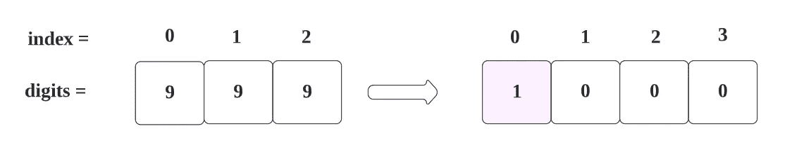

如果是除 9 以外的任何数字值，那么我们不需要使用大小为 **digits.length + 1 的数组。**

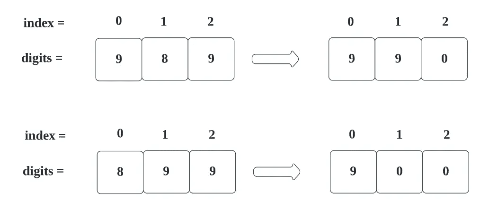

对于上述情况，我们可以使用以下逻辑:

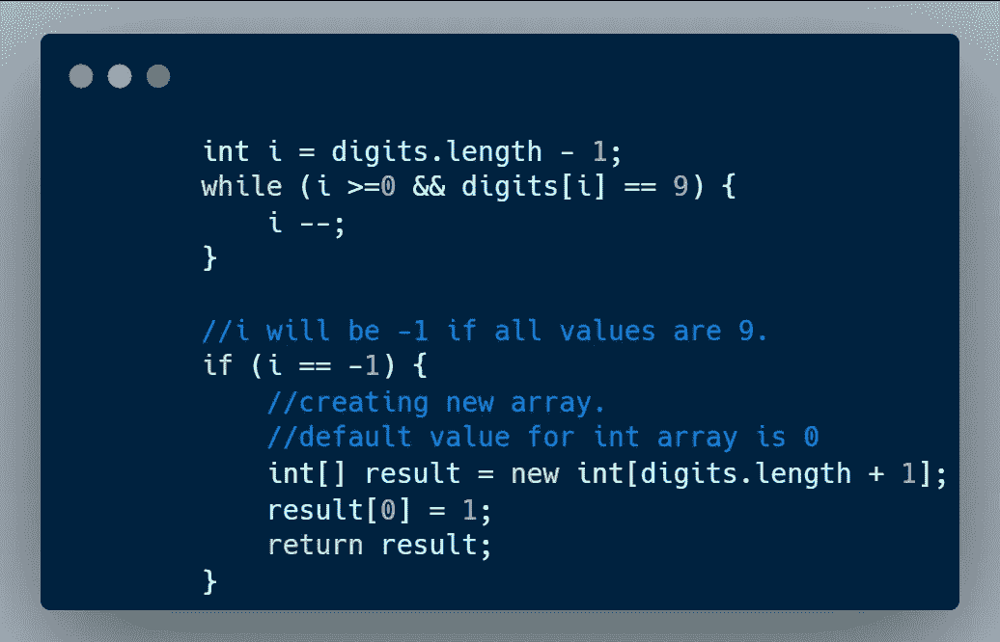

这里，我们从右向左移动，好像我们找到最后一个元素的值 **9** ，那么它将是 **0** as 9+1 = 10。

因此，按照上述逻辑，如果所有值都是 9 ，将得到以下结果**。**

1.  将创建总位数为 T44 的新数组。长度+1 大小。

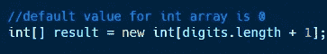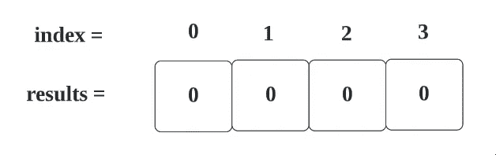

2.我们将为第一个索引赋值 1。

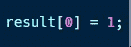

所以，结果会是，


现在，转到数组大小不增加的其他情况。

对于 ex 来说，

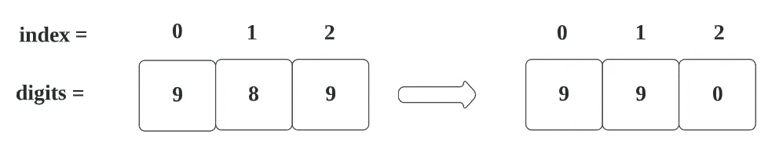

同样在这种情况下，我们需要通过检查 **9** 的第一个条件。

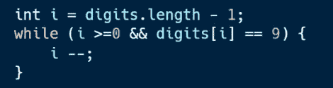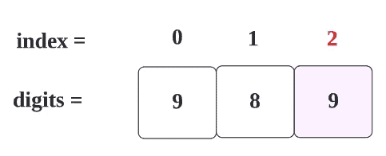

对于**第一次**迭代， **i** 将为 **2，**条件为真。


对于**第二次**迭代， **i** 将为 1 **，**条件为假。


请注意， **i** 现在是 **1** 。

现在，我们正在创建一个具有相同位数的新数组。(我们正在创建新的数组，以防止不必要的计算。

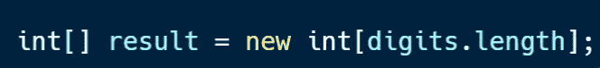

也就是说，

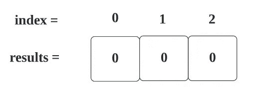

现在，我们将索引 I 的值加 1。

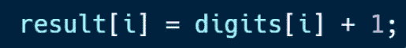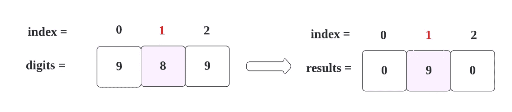

现在，我们按原样存储其他值。

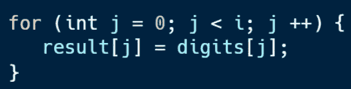

如下图所示

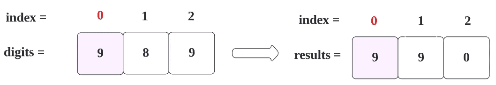

现在，我们得到了想要的结果，

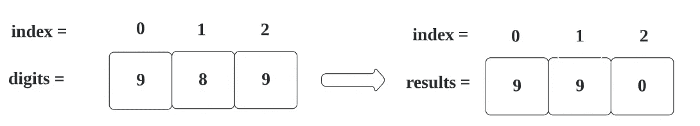

让我们看看完整的代码

# 代码(Java): →

# 代码(Python): →

# 时间复杂度

我们遍历整个数组(从右到左)直到找到空间，所以时间复杂度将是 **O(n)** 。

# 空间复杂性

由于我们使用了一个多+1 空间的额外数组，空间复杂度将为 ***O(n+1)*** 。

感谢你阅读这篇文章，❤

如果我做错了什么？让我在评论中。我很想进步。

拍手声👏如果这篇文章对你有帮助。