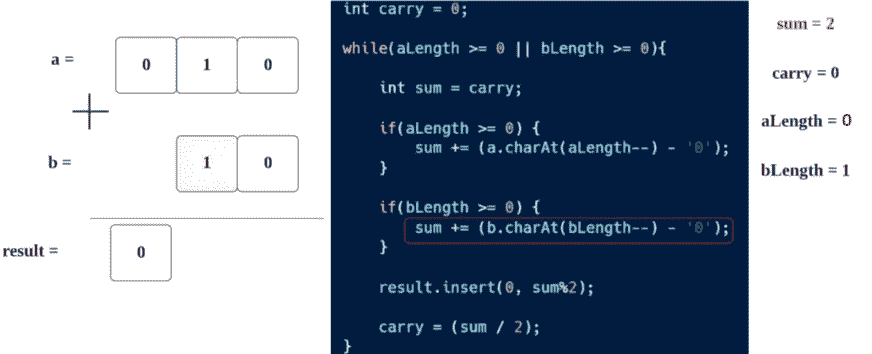

# LeetCode 67。添加二进制文件(用图像获得解决方案)

> 原文：<https://blog.devgenius.io/leetcode-67-add-binary-get-solution-with-images-c1f7a8cd535b?source=collection_archive---------3----------------------->

链接→[https://leetcode.com/problems/add-binary/](https://leetcode.com/problems/add-binary/)


亚历山大·辛恩在 [Unsplash](https://unsplash.com?utm_source=medium&utm_medium=referral) 上拍摄的照片

# 问题:→

给定两个二进制字符串`a`和`b`，将它们的和作为二进制字符串返回*。*

**例 1:**

```
**Input:** a = "11", b = "1"
**Output:** "100"
```

**例 2:**

```
**Input:** a = "1010", b = "1011"
**Output:** "10101"
```

**约束:**

*   `1 <= a.length, b.length <= 104`
*   `a`和`b`仅由`'0'`或`'1'`字符组成。
*   除了零本身，每个字符串不包含前导零。

# 解决方案:→

让我们先了解一下，二进制加法是如何工作的

当你记住以下技巧或规则时，二进制加法比十进制加法容易得多。使用这些规则，任何二进制数都可以很容易地相加。二进制加法的四个规则是:

*   0 + 0 = 0
*   0 + 1 = 1
*   1 + 0 = 1
*   1 + 1 =10

让我们看一个例子，


在二进制加法中，我们将从右向左遍历

所以，根据规定，

**→ 0 + 0 等于 0**


→ **0 + 1 变成 1**


→ **1 + 1 变成 10** ，这里没有留下任何二进制元素，否则 1 会变成进位。


在了解了二进制加法的工作原理后，让我们来了解二进制加法在编程中是如何实现的。

对于 ex，我们给出了两个字符串，a = "010 "，b = "110 "


这里，我们将开始从右到左阅读每个字符，因为二进制加法是从右到左工作的。

在这里，我们还应该注意到，a 和 b 的长度可能是不同的，所以我们需要根据最大长度进行遍历，并且如果任何字符串的位置变为-1(当我们从右向左遍历时)，我们将放置条件，然后我们将不对该字符串进行任何操作，以防止错误。


所以，我们的前两行代码，


现在，我们将进入下一步，进行第一次迭代。


我们先来了解一下，


在这里，由于我们在做数学运算，java 会自动将 char 转换成 Int。

Char '0' → 48(整数)

Char '1' → 49(整数)

> 因此，在这里，它将是' 0 '—' 0 ' = > 48–48 = > 0


这里根据**后缀(++或— )** 运算符，先进行运算，然后将值减 1。

所以，这里会先执行 **a.charAt(2)** ，然后进行递减，所以，在成功执行 **a.charAt(2)** 、 **aLength 的**值**将**减少了 **1、**

现在，和**前面的**步骤一样，我们用 **b** 来计算。

> 因此，在这里，它将是，sum = > ' 0 '—' 0 ' = > 48–48 = > 0


现在，下一步，**结果**是 StringBuilder，我们将值追加到结果的第**0 个位置** →

> 结果的第**0 位** →总和% 2 = > 0 % 2 = > 0


> 下一步，**进位**将为(**sum/2**)=>**0/2**=>**0。**


现在，下一次迭代，

> **总和=进位= 0**


Char '1' → 49(整数)

因此，在这里，它将是 sum => sum + '1' — '0 '

= > sum+49–48 = > sum+1，

所以，

> **sum = 0 + 1 = > 1**


现在，对于 **b** ，

Char '1' → 49(整数)

所以，在这里，它将是 sum = sum + ('1' — '0 ')

= > sum+49–48 = > sum+1，

所以，

> **总和= 1+ 1 = > 1**

这里，**长度**值也将从**减去**1。



此外，bLength 将减少 1。

> 现在，我们将值插入到**结果的第 0 个**位置。


> 现在，**进位= 2 / 2 →进位= 1**


> 进位= 1，因此 sum =进位→ **sum = 1**


这里，Char '0' → 48(Int)

因此，在这里，它将是' 0 '—' 0 ' = > 48–48 = > 0，

所以，

> **sum = sum+(0+0)=>1+0 =>1**


现在，对于 **b** ，

其值为 **-1，**所以条件不成立，强度值将减 1。

> 长度=(长度-1)=(0–1)=-1


现在，我们将值插入到**结果的第 0 个**位置。

> 总和%2 => 1%2 => 1


现在开始进位:

> 进位=(总和/ 2) => 1/2 => 0


现在，我们将退出**而**循环，因为它的条件变成**失败**


在 while 循环之后，我们只需要一个条件来执行**进位。**

现在我们得到了**进位= 0** ，但是如果我们得到了**进位= 1** ，那么我们再次需要将它追加到**结果**。


假设，如果我拿**另一个例子**，在最后的**进位**将是 1。

像下面这样，我需要在结果后面加上 1


现在，让我们检查整个源代码。

# 代码(Java): →

# 代码(Python): →

# 时间复杂度

我们遍历整个数组(从右到左)直到找到空间，所以时间复杂度是 **O(n)** 。

# 空间复杂性

由于我们使用了一个额外的数组来返回结果，所以空间复杂度将是 ***O(n)*** 。

感谢你阅读这篇文章，❤

如果我做错了什么？让我在评论中。我很想进步。

拍手声👏如果这篇文章对你有帮助。